[TOC]

郑重说明本资料来源于https://www.bilibili.com/video/BV18E411x7eT

# 1.微服务架构零基础理论入门（小白必看）

## 1.1零基础小白，2020.1春节期间预习过第一季的，理解微服务概念的可以不看

## 1.2理论介绍见<<微服务架构2020.pptx>>

## 1.3回顾2018年第一季SpringCloud版本

别再用了

# 2.从2.2.x和H版开始说起

## 2.1本次的SpringCloud第二季分为上半场和下半场

**上篇**：SpringBoot2.X版和SpringCloud H版

**下篇**：SpringCloud Alibaba

**大纲**

## 2.2Springboot版本选择

**git源码地址：**
  https://github.com/spring-projects/spring-boot/releases/


**SpringBoot2.0新特性：**
  https://github.com/spring-projects/spring-boot/wiki/Spring-Boot-2.0-Release-Notes


**通过上面官网发现，Boot官方强烈建议你升级到2.X以上版本**

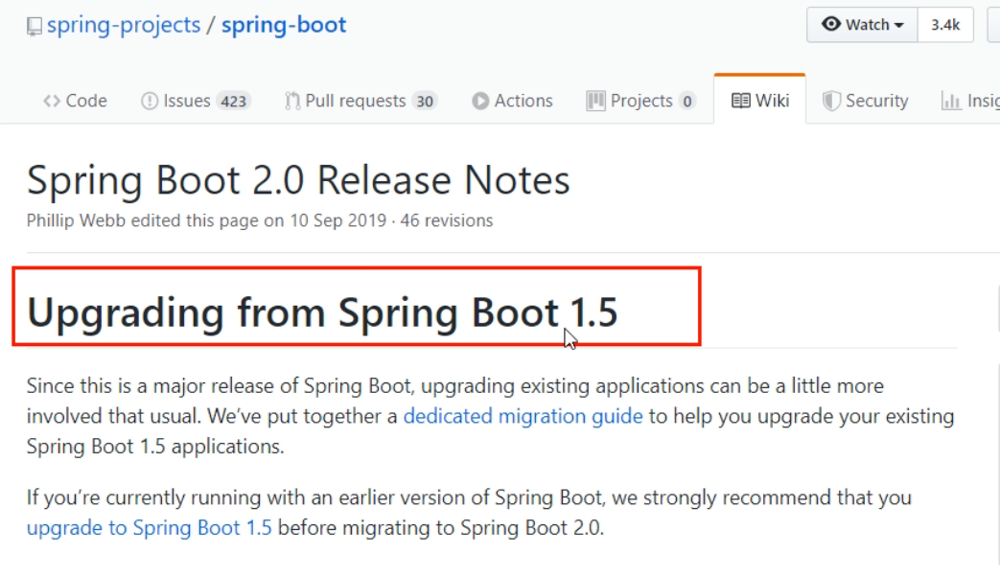

**官网看Boot版本** 
   springboot(截至2019.10.26)

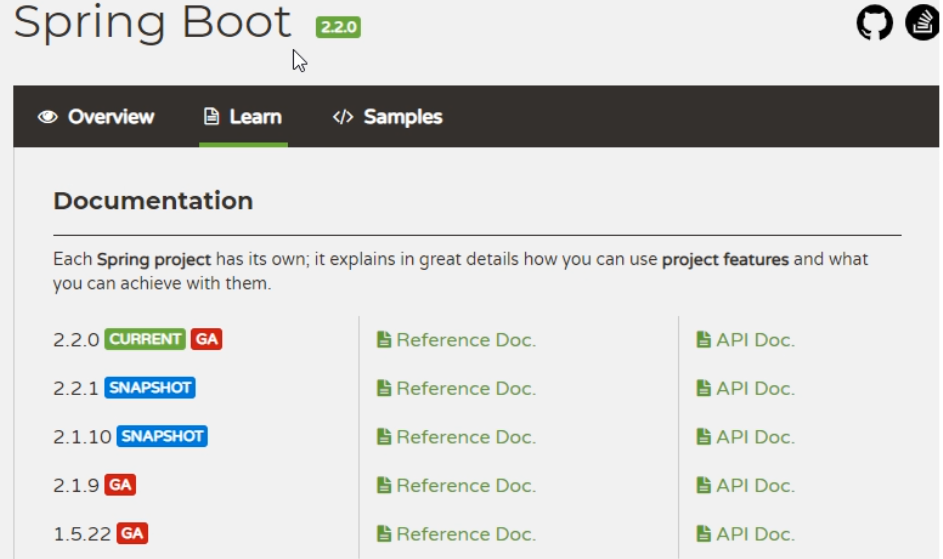

  springboot(截至2020.2.15)


## 2.3SpringCloud版本选择

git源码地址
  https://github.com/spring-projects/spring-cloud/wiki

官网：
  https://spring.io/projects/spring-cloud

### 官网看Cloud版本 

  **Cloud命名规则**

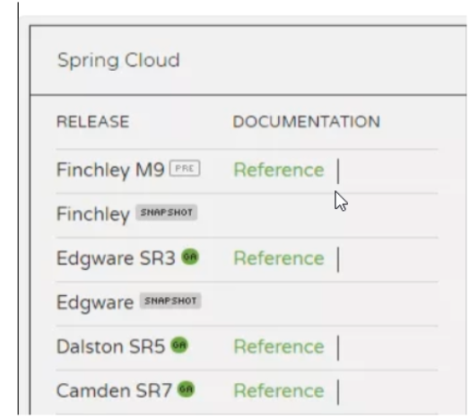


**SpringCloud的多版本**

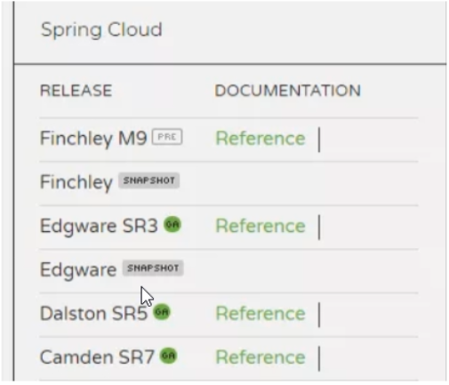

###   **springcloud(截至2019.10.26)**

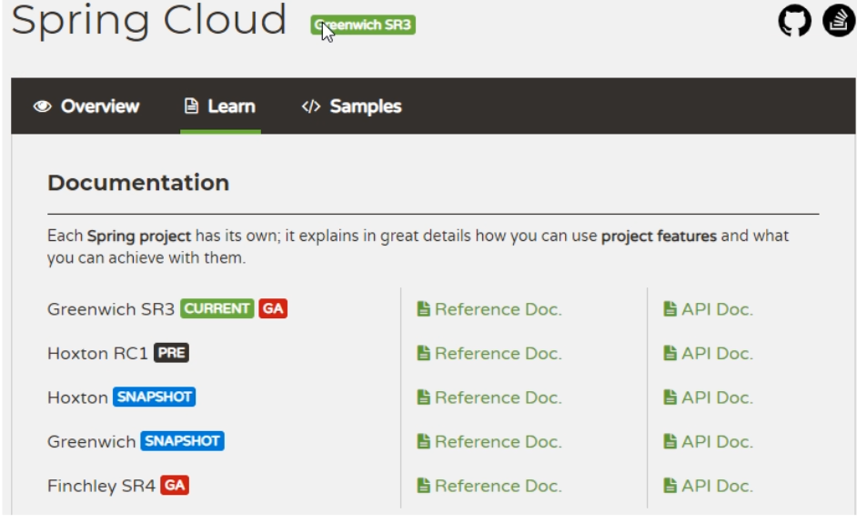

###   **springboot(截至2020.2.15)**


## 2.4SpringCloud和Springboot之间的依赖关系如何看

https://spring.io/projects/spring-cloud#overview


依赖

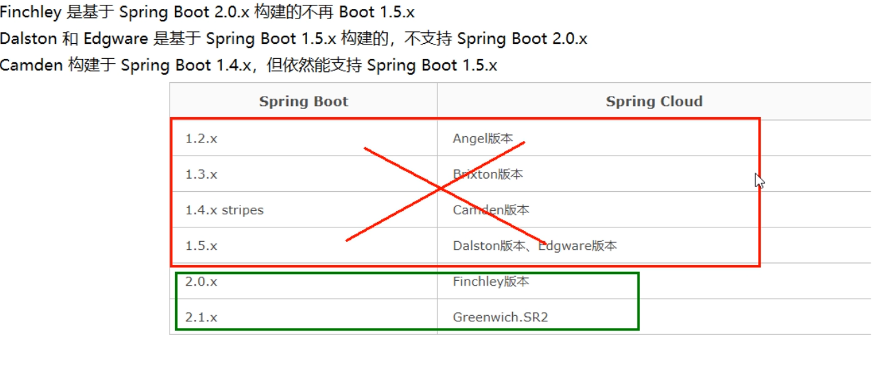

更详细的版本对应查看方法

https://start.spring.io/actuator/info

结果


查看json串返回结果


## 2.5SpringCloud第二季定稿版（截止2020.2.15）

**cloud**:Hoxton.SR1
**boot**：2.2.2.RELEASE
**cloud Alibaba**:2.1.0.RELEASE
**java**:JAVA8
**maven**:3.5及以上
**mysql**:5.7及以上
**不许捣蛋，上述全部版本必须和阳哥一致**
**题外话**

- **boot版已经到2.2.4为最新，为什么选2.2.2？**
    **只用boot，直接用最新**


**同时用boot和cloud，需要照顾cloud，由cloud决定boot版本 结果**


**SpringCloud和SpringBoot版本对应关系**


-  **2.X版本常用的组件pom**

  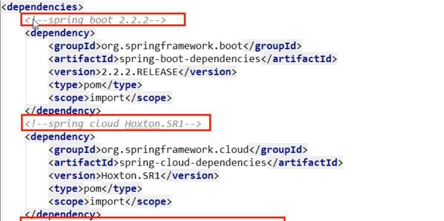


# 3.关于Cloud各种组件的停更/升级/替换

##   3.1由停更引发的“升级惨案”

​    **停更不停用**
​      被动修复bugs
​      不再接受合并请求
​      不再发布新版本
​    **补充，哈哈**
​      停课不停学
​    **明细条目**
​      以前

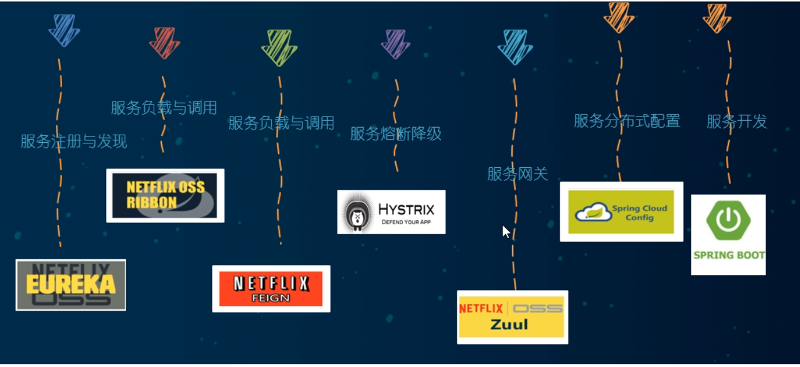

​      now2020


##  3.2 参考资料见官网

​    Spring Cloud
​      https://cloud.spring.io/spring-cloud-static/Hoxton.SR1/reference/htmlsingle/
​      Spring Cloud中文文档
​        https://www.bookstack.cn/read/spring-cloud-docs/docs-index.md
​    Spring Boot
​      https://docs.spring.io/spring-boot/docs/2.2.2.RELEASE/reference/htmlsingle/

# 4.微服务架构编码构建

##   4.1约定 > 配置 > 编码

##   4.2IDEA新建project工作空间

- 微服务cloud整体聚合父工程Project

  **父工程步骤:**
    1.New Project

  

    2.聚合总工程名字

  

    3.Maven选版本

  

    4.工程名字

  

    5.字符编码

  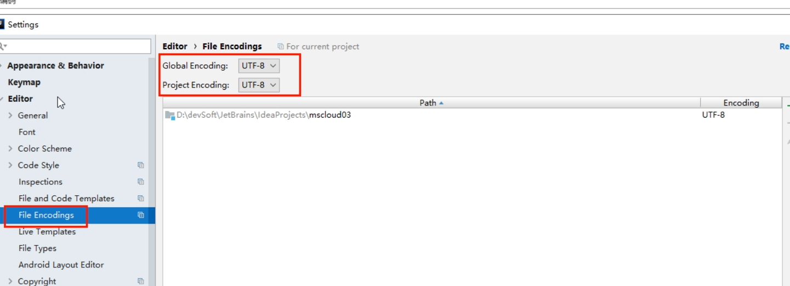

  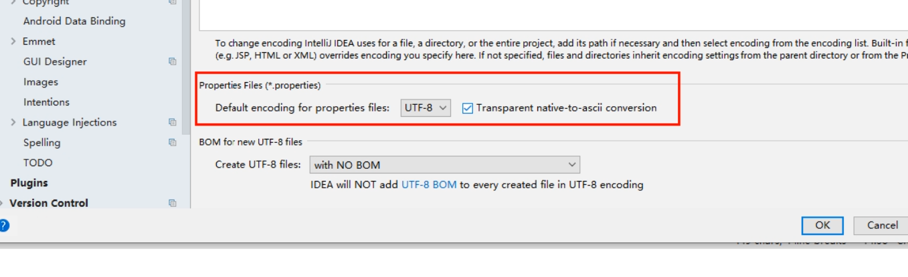

    6.注解生效激活

  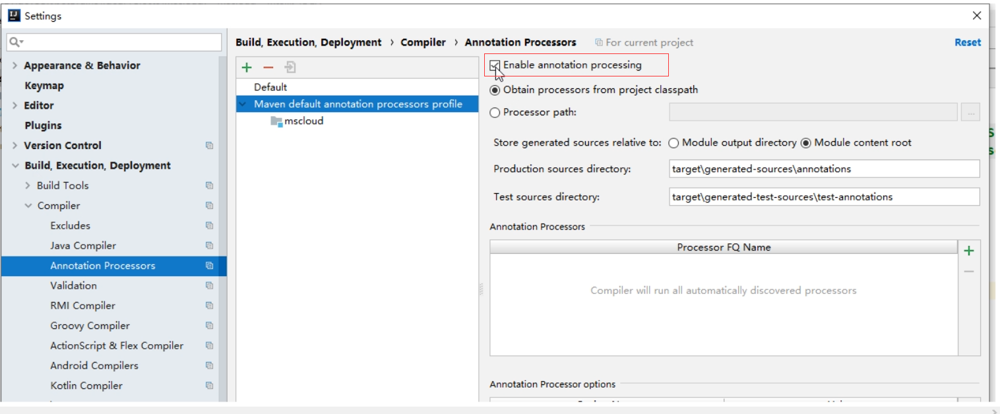

    7.java编译版本选8

  

    8.File Type过滤

  

  *.hprof;*.idea;*.iml;*.pyc;*.pyo;*.rbc;*.yarb;*~;.DS_Store;.git;.hg;.svn;CVS;__pycache__;_svn;vssver.scc;vssver2.scc;

  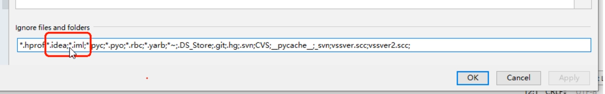

- 父工程POM

  ```xml
  <?xml version="1.0" encoding="UTF-8"?>
  <project xmlns="http://maven.apache.org/POM/4.0.0" xmlns:xsi="http://www.w3.org/2001/XMLSchema-instance"
           xsi:schemaLocation="http://maven.apache.org/POM/4.0.0 https://maven.apache.org/xsd/maven-4.0.0.xsd">
  
    <modelVersion>4.0.0</modelVersion>
  
    <groupId>com.atguigu.springcloud</groupId>
    <artifactId>cloud2020</artifactId>
    <version>1.0-SNAPSHOT</version>
    <packaging>pom</packaging>
    <!-- 统一管理jar包版本 -->
    <properties>
      <project.build.sourceEncoding>UTF-8</project.build.sourceEncoding>
      <maven.compiler.source>1.8</maven.compiler.source>
      <maven.compiler.target>1.8</maven.compiler.target>
      <junit.version>4.12</junit.version>
      <log4j.version>1.2.17</log4j.version>
      <lombok.version>1.16.18</lombok.version>
      <mysql.version>5.1.47</mysql.version>
      <druid.version>1.1.16</druid.version>
      <mybatis.spring.boot.version>1.3.0</mybatis.spring.boot.version>
    </properties>
  
    <!-- 子模块继承之后，提供作用：锁定版本+子modlue不用写groupId和version  -->
    <dependencyManagement>
      <dependencies>
        <!--spring boot 2.2.2-->
        <dependency>
          <groupId>org.springframework.boot</groupId>
          <artifactId>spring-boot-dependencies</artifactId>
          <version>2.2.2.RELEASE</version>
          <type>pom</type>
          <scope>import</scope>
        </dependency>
        <!--spring cloud Hoxton.SR1-->
        <dependency>
          <groupId>org.springframework.cloud</groupId>
          <artifactId>spring-cloud-dependencies</artifactId>
          <version>Hoxton.SR1</version>
          <type>pom</type>
          <scope>import</scope>
        </dependency>
        <!--spring cloud alibaba 2.1.0.RELEASE-->
        <dependency>
          <groupId>com.alibaba.cloud</groupId>
          <artifactId>spring-cloud-alibaba-dependencies</artifactId>
          <version>2.1.0.RELEASE</version>
          <type>pom</type>
          <scope>import</scope>
        </dependency>
  
        <dependency>
          <groupId>mysql</groupId>
          <artifactId>mysql-connector-java</artifactId>
          <version>${mysql.version}</version>
        </dependency>
        <dependency>
          <groupId>com.alibaba</groupId>
          <artifactId>druid</artifactId>
          <version>${druid.version}</version>
        </dependency>
        <dependency>
          <groupId>org.mybatis.spring.boot</groupId>
          <artifactId>mybatis-spring-boot-starter</artifactId>
          <version>${mybatis.spring.boot.version}</version>
        </dependency>
        <dependency>
          <groupId>junit</groupId>
          <artifactId>junit</artifactId>
          <version>${junit.version}</version>
        </dependency>
        <dependency>
          <groupId>log4j</groupId>
          <artifactId>log4j</artifactId>
          <version>${log4j.version}</version>
        </dependency>
        <dependency>
          <groupId>org.projectlombok</groupId>
          <artifactId>lombok</artifactId>
          <version>${lombok.version}</version>
          <optional>true</optional>
        </dependency>
      </dependencies>
    </dependencyManagement>
  
    <build>
      <plugins>
        <plugin>
          <groupId>org.springframework.boot</groupId>
          <artifactId>spring-boot-maven-plugin</artifactId>
          <configuration>
            <fork>true</fork>
            <addResources>true</addResources>
          </configuration>
        </plugin>
      </plugins>
    </build>
  </project>
  ```

- 解决maven下载不了jar的问题请复制这个链接到浏览器自行解决：

  在网上拷贝的所有阿里云镜像比如：

  ```xml
  <mirror>
      <id>nexus-aliyun</id>
      <mirrorOf>central</mirrorOf>
      <name>Nexus aliyun</name>
      <url>http://maven.aliyun.com/nexus/content/groups/public</url>
  </mirror>
  ```

  **都不能**解决我的问题，我的包里面一直出现.lastUpdated文件，后来我查看官网之后发现：**阿里不再支持http下载**，只支持**https**。

  因此，先将maven镜像配置如下：

  ```
  <mirror>
  	<id>aliyunmaven</id>
      <mirrorOf>*</mirrorOf>
      <name>阿里云公共仓库</name>
      <url>https://maven.aliyun.com/repository/public</url>
  </mirror>
  ```

  然后我还出现了一个问题，由于使用了HTTPS，存在着SSL证书验证的问题，因此我在IDEA中添加了一行配置：

  

  配置如下：

  ```
  -Dmaven.wagon.http.ssl.insecure=true -Dmaven.wagon.http.ssl.allowall=true
  ```

  该配置用于忽略ssl证书的验证，然后我的maven终于可以丝滑下载了。

- Maven工程落地细节复习

  Maven中的dependencyManagement和dependencies

  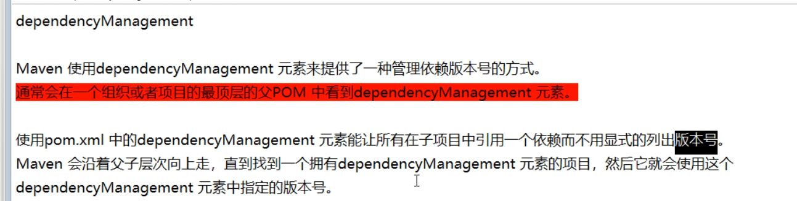

  

  maven中跳过单元测试

- 父工程创建完成执行mvn:install将父工程发布到仓库方便子工程继承

##   4.3Rest微服务工程构建

### 4.3.1构建步骤

#### 4.3.1.1.cloud-provider-payment8001微服务提供者支付Module模块

- 建cloud-provider-payment8001

  创建完成后请回到父工程查看pom文件变化

- 改POM文件

  ```xml
  <?xml version="1.0" encoding="UTF-8"?>
  <project xmlns="http://maven.apache.org/POM/4.0.0"
           xmlns:xsi="http://www.w3.org/2001/XMLSchema-instance"
           xsi:schemaLocation="http://maven.apache.org/POM/4.0.0 http://maven.apache.org/xsd/maven-4.0.0.xsd">
      <parent>
          <artifactId>cloud2020</artifactId>
          <groupId>com.xiyue.cloud</groupId>
          <version>1.0-SNAPSHOT</version>
      </parent>
      <modelVersion>4.0.0</modelVersion>
      <artifactId>cloud-provider-payment8001</artifactId>
      <dependencies>
          <!-- https://mvnrepository.com/artifact/org.springframework.boot/spring-boot-starter-web -->
          <dependency>
              <groupId>org.springframework.boot</groupId>
              <artifactId>spring-boot-starter-web</artifactId>
          </dependency>
          <!-- https://mvnrepository.com/artifact/org.springframework.boot/spring-boot-starter-web -->
          <dependency>
              <groupId>org.springframework.boot</groupId>
              <artifactId>spring-boot-starter-actuator</artifactId>
          </dependency>
          <!-- https://mvnrepository.com/artifact/org.springframework.boot/spring-boot-starter-web -->
          <dependency>
              <groupId>org.mybatis.spring.boot</groupId>
              <artifactId>mybatis-spring-boot-starter</artifactId>
          </dependency>
          <!-- https://mvnrepository.com/artifact/com.alibaba/druid -->
          <dependency>
              <groupId>com.alibaba</groupId>
              <artifactId>druid-spring-boot-starter</artifactId>
              <version>1.1.10</version>
          </dependency>
          <!-- https://mvnrepository.com/artifact/mysql/mysql-connector-java -->
          <dependency>
              <groupId>mysql</groupId>
              <artifactId>mysql-connector-java</artifactId>
          </dependency>
          <!-- https://mvnrepository.com/artifact/org.springframework.boot/spring-boot-starter-jdbc -->
          <dependency>
              <groupId>org.springframework.boot</groupId>
              <artifactId>spring-boot-starter-jdbc</artifactId>
          </dependency>
          <!-- https://mvnrepository.com/artifact/org.springframework.boot/spring-boot-devtools -->
          <dependency>
              <groupId>org.springframework.boot</groupId>
              <artifactId>spring-boot-devtools</artifactId>
             <scope>runtime</scope>
              <optional>true</optional>
          </dependency>
          <!-- https://mvnrepository.com/artifact/org.projectlombok/lombok -->
          <dependency>
              <groupId>org.projectlombok</groupId>
              <artifactId>lombok</artifactId>
              <optional>true</optional>
          </dependency>
          <!-- https://mvnrepository.com/artifact/org.springframework.boot/spring-boot-starter-test -->
          <dependency>
              <groupId>org.springframework.boot</groupId>
              <artifactId>spring-boot-starter-test</artifactId>
              <scope>test</scope>
          </dependency>
      </dependencies>
  </project>
  ```

  

- 写YML

  ```yaml
  server:
    port: 8001
  
  spring:
    application:
      name: cloud-payment-service
    datasource:
      type: com.alibaba.druid.pool.DruidDataSource
      driver-class-name: org.gjt.mm.mysql.Driver
      url: jdbc:mysql://localhost:3306/db2019?useUnicode=true&characterEncoding=utf-8&useSSL=false
      username: root
      password: 123456
  
  mybatis:
    mapperLocations: classpath:mapper/*.xml
    type-aliases-package: com.xiyue.cloud.entities
  ```

  

- 主启动

  ```java
  package com.xiyue.cloud;
  
  import org.springframework.boot.SpringApplication;
  import org.springframework.boot.autoconfigure.SpringBootApplication;
  
  @SpringBootApplication
  public class PaymentMain8001 {
  
      public static void main(String[] args) {
          SpringApplication.run(PaymentMain8001.class,args);
      }
  }
  
  ```

  

- 业务类

  1.建表SQL

  ```sql
  CREATE TABLE payment (
   id BIGINT(20) NOT NULL AUTO_INCREMENT COMMENT '主键',
   'serial' VARCHAR(200) DEFAULT null,
   PRIMARY KEY(id)
  ) ENGINE=INNODB AUTO_INCREMENT=1 DEFAULT CHARSET=utf8
  ```

  2.entitles

  主实体Payment

  ```java
  package com.xiyue.cloud.entities;
  
  import lombok.AllArgsConstructor;
  import lombok.Data;
  import lombok.NoArgsConstructor;
  
  import java.io.Serializable;
  
  @Data
  @AllArgsConstructor
  @NoArgsConstructor
  public class Payment implements Serializable {
      private Long id;
      private String serial;
  }
  ```

  Json封装体CommonResult

  ```java
  package com.xiyue.cloud.entities;
  
  import lombok.AllArgsConstructor;
  import lombok.Data;
  import lombok.NoArgsConstructor;
  @Data
  @AllArgsConstructor
  @NoArgsConstructor
  public class CommonResult <T>{
      private Integer code;
      private String message;
      private T data;
      public CommonResult(Integer code,String message){
          this(code,message,null);
      }
  }
  ```

  3.dao

  接口PaymentDao

  ```java
  package com.xiyue.cloud.dao;
  
  import com.xiyue.cloud.entities.Payment;
  import org.apache.ibatis.annotations.Mapper;
  import org.apache.ibatis.annotations.Param;
  
  @Mapper
  public interface PaymentDao{
  
      public int create(Payment payment); //写
  
      public Payment getPaymentById(@Param("id") Long id);  //读取
  }
  
  ```

  mybatis的映射文件PaymentMapper.xml

  ​	路径

  ​		src\main\resources\mapper\PaymentMapper.xml
  ​	文件头	

  ```xml
  <?xml version="1.0" encoding="UTF-8"?>
  <!DOCTYPE mapper PUBLIC "-//mybatis.org//DTD Mapper 3.0//EN" "http://mybatis.org/dtd/mybatis-3-mapper.dtd">
  <mapper namespace="com.xiyue.cloud.dao.PaymentDao">
  </mapper>
  ```

  ​	PaymentMapper.xml

  ```xml
  <?xml version="1.0" encoding="UTF-8"?>
  <!DOCTYPE mapper PUBLIC "-//mybatis.org//DTD Mapper 3.0//EN" "http://mybatis.org/dtd/mybatis-3-mapper.dtd">
  
  <mapper namespace="com.xiyue.cloud.dao.PaymentDao">
      <insert id="create" parameterType="Payment" useGeneratedKeys="true" keyProperty="id">
              insert into payment(serial) values(${serial});
      </insert>
      <resultMap id="BaseResultMap" type="com.atguigu.springcloud.entities.Payment">
          <id column="id" property="id" jdbcType="BIGINT"></id>
          <id column="serial" property="serial" jdbcType="VARCHAR"></id>
      </resultMap>
      <select id="getPaymentById"  parameterType="Long" resultMap="BaseResultMap">
              select * from payment where id=#{id}
      </select>
  </mapper>
  ```

  4.service

  ​	接口PaymentService

  ```java
  package com.xiyue.cloud.service;
  
  import com.atguigu.springcloud.entities.Payment;
  import org.apache.ibatis.annotations.Param;
  
  public interface PaymentService {
  
      public int create(Payment payment); //写
  
      public Payment getPaymentById(@Param("id") Long id);  //读取
  }
  ```

  ​	实现类

  ```java
  package com.xiyue.cloud.service.impl;
  
  import com.xiyue.cloud.dao.PaymentDao;
  import com.xiyue.cloud.entities.Payment;
  import com.xiyue.cloud.service.PaymentService;
  import org.apache.ibatis.annotations.Param;
  import org.springframework.stereotype.Service;
  import javax.annotation.Resource;
  
  @Service
  public class PaymentServiceImpl implements PaymentService {
  
      @Resource
      private PaymentDao paymentDao;
  
      public int create(Payment payment){
          return paymentDao.create(payment);
      }
  
      public Payment getPaymentById( Long id){
          return paymentDao.getPaymentById(id);
      }
  }
  ```

  5.controller

  ```java
  package com.xiyue.cloud.controller;
  
  import com.xiyue.cloud.entities.CommonResult;
  import com.xiyue.cloud.entities.Payment;
  import com.xiyue.cloud.service.PaymentService;
  import lombok.extern.slf4j.Slf4j;
  import org.springframework.web.bind.annotation.GetMapping;
  import org.springframework.web.bind.annotation.PathVariable;
  import org.springframework.web.bind.annotation.PostMapping;
  import org.springframework.web.bind.annotation.RestController;
  
  import javax.annotation.Resource;
  
  @RestController
  @Slf4j
  public class PaymentController {
  
      @Resource
      private PaymentService paymentService;
  
      @PostMapping(value = "/payment/create")
      public CommonResult create(Payment payment){
          int result = paymentService.create(payment);
          log.info("*****插入结果："+result);
          if (result>0){  //成功
              return new CommonResult(200,"插入数据库成功",result);
          }else {
              return new CommonResult(444,"插入数据库失败",null);
          }
      }
  
      @GetMapping(value = "/payment/get/{id}")
      public CommonResult getPaymentById(@PathVariable("id") Long id){
          Payment payment = paymentService.getPaymentById(id);
          log.info("*****查询结果："+payment);
          if (payment!=null){  //说明有数据，能查询成功
              return new CommonResult(200,"查询成功",payment);
          }else {
              return new CommonResult(444,"没有对应记录，查询ID："+id,null);
          }
      }
  }
  
  ```

  

- 测试

  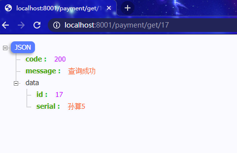

  **http://localhost:8001/payment/get/1**
  **postman模拟post**

  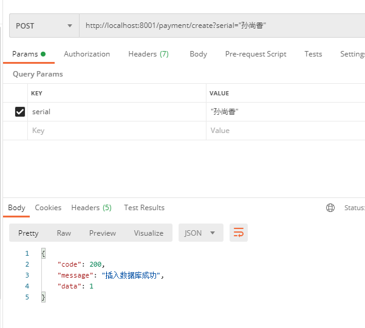

  **运行**

  通过修改idea的workpace.xml的方式来快速打开Run DashBoard窗口

  开启Run DashBoard

  

  填入以下内容：

  ```xml
  <option name="configurationTypes">
        <set>
          <option value="SpringBootApplicationConfigurationType" />
        </set>
  </option>
  ```

  部分同学可能由于idea版本不同，需要关闭重启

- 小总结

  1.建module
  2.改POM
  3.写YML
  4.主启动
  5.业务类

#### <u>4.3.1.2.热部署Devtools</u>

- Adding devtools to your project

  ```xml
  <!-- https://mvnrepository.com/artifact/org.springframework.boot/spring-boot-devtools -->
  <dependency>
      <groupId>org.springframework.boot</groupId>
      <artifactId>spring-boot-devtools</artifactId>
     <scope>runtime</scope>
      <optional>true</optional>
  </dependency>
  ```

- Adding plugin to your pom.xml

  ```xml
  <!-- 一段配置黏贴到父工程当中的pom里 -->
  <build>
    <plugins>
      <plugin>
        <groupId>org.springframework.boot</groupId>
        <artifactId>spring-boot-maven-plugin</artifactId>
        <configuration>
          <fork>true</fork>
          <addResources>true</addResources>
        </configuration>
      </plugin>
    </plugins>
  </build>
  ```

  

- Enabling automatic build 


- Update the value of

  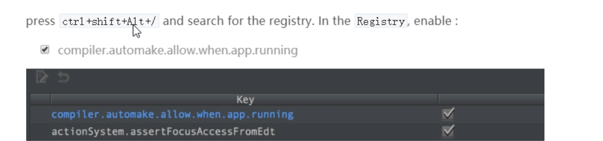

  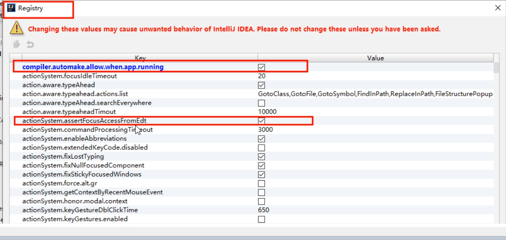

- 重启IDEA

#### 4.3.1.3.cloud-consumer-order80微服务消费者订单Module模块

- 新建cloud-consumer-order80

  注意项目名称与上面图片可能不一致需要保持一致哦

  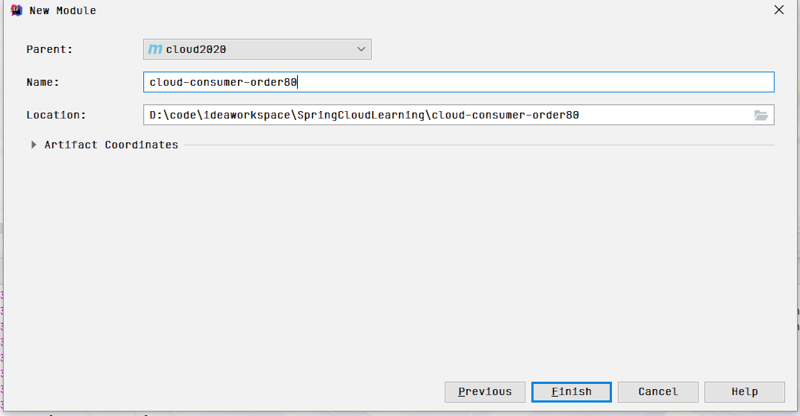

- 改POM

  ```xml
  <?xml version="1.0" encoding="UTF-8"?>
  <project xmlns="http://maven.apache.org/POM/4.0.0"
           xmlns:xsi="http://www.w3.org/2001/XMLSchema-instance"
           xsi:schemaLocation="http://maven.apache.org/POM/4.0.0 http://maven.apache.org/xsd/maven-4.0.0.xsd">
      <parent>
          <artifactId>cloud2020</artifactId>
          <groupId>com.xiyue.cloud</groupId>
          <version>1.0-SNAPSHOT</version>
      </parent>
      <modelVersion>4.0.0</modelVersion>
  
      <artifactId>cloud-consumer-order80</artifactId>
      <dependencies>
          <!-- https://mvnrepository.com/artifact/org.springframework.boot/spring-boot-starter-web -->
          <dependency>
              <groupId>org.springframework.boot</groupId>
              <artifactId>spring-boot-starter-web</artifactId>
          </dependency>
  
          <!-- https://mvnrepository.com/artifact/org.springframework.boot/spring-boot-starter-web  -->
          <dependency>
              <groupId>org.springframework.boot</groupId>
              <artifactId>spring-boot-starter-actuator</artifactId>
          </dependency>
  
          <!-- https://mvnrepository.com/artifact/org.springframework.boot/spring-boot-devtools -->
          <dependency>
              <groupId>org.springframework.boot</groupId>
              <artifactId>spring-boot-devtools</artifactId>
              <scope>runtime</scope>
              <optional>true</optional>
          </dependency>
  
          <!-- https://mvnrepository.com/artifact/org.projectlombok/lombok -->
          <dependency>
              <groupId>org.projectlombok</groupId>
              <artifactId>lombok</artifactId>
              <optional>true</optional>
          </dependency>
  
          <!-- https://mvnrepository.com/artifact/org.springframework.boot/spring-boot-starter-test -->
          <dependency>
              <groupId>org.springframework.boot</groupId>
              <artifactId>spring-boot-starter-test</artifactId>
              <scope>test</scope>
          </dependency>
      </dependencies>
  </project>
  ```

- 写YML

  ```yml
  server:
    port: 80
  ```

- 主启动

  ```java
  package com.xiyue.cloud;
  
  import org.springframework.boot.SpringApplication;
  import org.springframework.boot.autoconfigure.SpringBootApplication;
  
  @SpringBootApplication
  public class OrderMain80 {
      public static void main(String[] args) {
          SpringApplication.run(OrderMain80.class,args);
      }
  }
  ```

- 业务类

  创建entities(将cloud-provider-payment8001工程下的entities包下的两个实体类复制过来)

  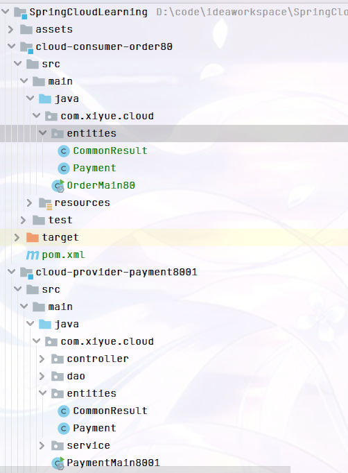

  首说RestTemplate

  > 是什么
  >
  > 
  >
  > 官网及使用
  >
  > **官网地址：**
  > https://docs.spring.io/spring-framework/docs/5.2.2.RELEASE/javadoc-api/org/springframework/web/client/RestTemplate.html
  >
  > 

  config配置类（ApplicationContextConfig）

  ```java
  package com.xiyue.cloud.config;
  
  import org.springframework.context.annotation.Bean;
  import org.springframework.context.annotation.Configuration;
  import org.springframework.web.client.RestTemplate;
  
  @Configuration
  public class ApplicationContextConfig {
  
      @Bean
      public RestTemplate getRestTemplate(){
          return new RestTemplate();
      }
  
  }
  ```

  创建controller

  ```java
  package com.xiyue.cloud.controller;
  
  import com.xiyue.cloud.entities.CommonResult;
  import com.xiyue.cloud.entities.Payment;
  import lombok.extern.slf4j.Slf4j;
  import org.springframework.web.bind.annotation.GetMapping;
  import org.springframework.web.bind.annotation.PathVariable;
  import org.springframework.web.bind.annotation.RestController;
  import org.springframework.web.client.RestTemplate;
  
  import javax.annotation.Resource;
  
  @RestController
  @Slf4j
  public class OrderController {
  
      public static final String PAYMENT_URL = "http://localhost:8001";
  
      @Resource
      private RestTemplate restTemplate;
  
      @GetMapping("/consumer/payment/create")
      public CommonResult<Payment>   create(Payment payment){
          return restTemplate.postForObject(PAYMENT_URL+"/payment/create",payment,CommonResult.class);  //写操作
      }
  
      @GetMapping("/consumer/payment/get/{id}")
      public CommonResult<Payment> getPayment(@PathVariable("id") Long id){
          return restTemplate.getForObject(PAYMENT_URL+"/payment/get/"+id,CommonResult.class);
      }
  }
  ```

  

- 测试

  > 先启动cloud-provider-payment8001
  > 再启动cloud-consumer-order80
  > http://localhost/consumer/payment/get/1
  >
  > 不要忘记@RequestBody注解
  >
  > 

#### 4.3.1.4.工程重构

> 观察问题
>
> 
>
>   系统中有重复部分，重构
> 新建 cloud-api-commons
>
> 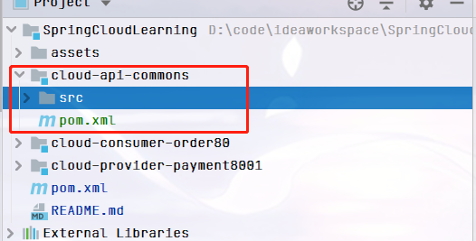
>
> POM
>
> ```xml
> <?xml version="1.0" encoding="UTF-8"?>
> <project xmlns="http://maven.apache.org/POM/4.0.0"
>          xmlns:xsi="http://www.w3.org/2001/XMLSchema-instance"
>          xsi:schemaLocation="http://maven.apache.org/POM/4.0.0 http://maven.apache.org/xsd/maven-4.0.0.xsd">
>     <parent>
>         <artifactId>cloud2020</artifactId>
>         <groupId>com.xiyue.cloud</groupId>
>         <version>1.0-SNAPSHOT</version>
>     </parent>
>     <modelVersion>4.0.0</modelVersion>
> 
>     <artifactId>cloud-api-commons</artifactId>
>     <dependencies>
>         <!-- https://mvnrepository.com/artifact/org.springframework.boot/spring-boot-devtools -->
>         <dependency>
>             <groupId>org.springframework.boot</groupId>
>             <artifactId>spring-boot-devtools</artifactId>
>             <scope>runtime</scope>
>             <optional>true</optional>
>         </dependency>
> 
>         <dependency>
>             <groupId>org.projectlombok</groupId>
>             <artifactId>lombok</artifactId>
>             <optional>true</optional>
>         </dependency>
> 
>         <!-- https://mvnrepository.com/artifact/cn.hutool/hutool-all -->
>         <dependency>
>             <groupId>cn.hutool</groupId>
>             <artifactId>hutool-all</artifactId>
>             <version>5.1.0</version>
>         </dependency>
>     </dependencies>
> </project>
> ```
>
> entities
>
> -  Payment实体
> - CommonResult通用封装类
>
> maven命令clean install
>
> 订单80和支付8001分别改造
>
> > 删除各自的原先有过的entities文件夹
> > 各自黏贴POM内容
> >
> > ```xml
> > <dependency>
> >     <groupId>com.atguigu.springcloud</groupId>
> >     <artifactId>cloud-api-commons</artifactId>
> >     <version>${project.version}</version>
> > </dependency>
> > ```
> >
> > > 80
> > > 8001


### 4.3.2目前工程样图

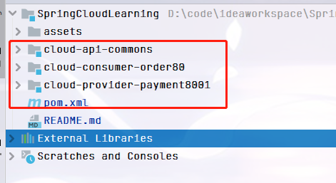

# 5.Eureka服务注册与发现

## 5.1Eureka基础知识

### 5.1.1什么是服务治理


### 5.1.2什么是服务注册


### 5.1.3Eureka两组件

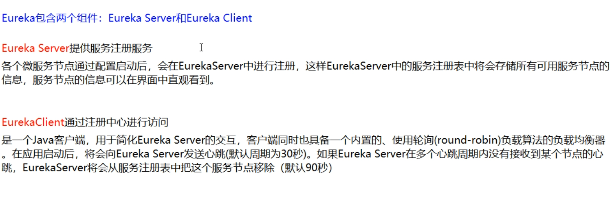

## 5.2单机Eureka构建步骤

### 5.2.1IDEA生成eurekaServer端服务注册中心类似物业公司

> - 建Module
>
>   cloud-eureka-server7001
>
> - 改POM
>
>   ```xml
>   <?xml version="1.0" encoding="UTF-8"?>
>   <project xmlns="http://maven.apache.org/POM/4.0.0"
>            xmlns:xsi="http://www.w3.org/2001/XMLSchema-instance"
>            xsi:schemaLocation="http://maven.apache.org/POM/4.0.0 http://maven.apache.org/xsd/maven-4.0.0.xsd">
>       <parent>
>           <artifactId>cloud2020</artifactId>
>           <groupId>com.xiyue.cloud</groupId>
>           <version>1.0-SNAPSHOT</version>
>       </parent>
>       <modelVersion>4.0.0</modelVersion>
>   
>       <artifactId>cloud-eureka-server7001</artifactId>
>       <dependencies>
>           <!-- https://mvnrepository.com/artifact/org.springframework.cloud/spring-cloud-starter-eureka-server -->
>           <dependency>
>               <groupId>org.springframework.cloud</groupId>
>               <artifactId>spring-cloud-starter-netflix-eureka-server</artifactId>
>           </dependency>
>   
>           <dependency>
>               <groupId>com.xiyue.cloud</groupId>
>               <artifactId>cloud-api-commons</artifactId>
>               <version>${project.version}</version>
>           </dependency>
>   
>           <!-- https://mvnrepository.com/artifact/org.springframework.boot/spring-boot-starter-web -->
>           <dependency>
>               <groupId>org.springframework.boot</groupId>
>               <artifactId>spring-boot-starter-web</artifactId>
>           </dependency>
>   
>           <!-- https://mvnrepository.com/artifact/org.springframework.boot/spring-boot-starter-web  -->
>           <dependency>
>               <groupId>org.springframework.boot</groupId>
>               <artifactId>spring-boot-starter-actuator</artifactId>
>           </dependency>
>   
>           <!-- https://mvnrepository.com/artifact/org.springframework.boot/spring-boot-devtools -->
>           <dependency>
>               <groupId>org.springframework.boot</groupId>
>               <artifactId>spring-boot-devtools</artifactId>
>               <scope>runtime</scope>
>               <optional>true</optional>
>           </dependency>
>   
>           <!-- https://mvnrepository.com/artifact/org.projectlombok/lombok -->
>           <dependency>
>               <groupId>org.projectlombok</groupId>
>               <artifactId>lombok</artifactId>
>           </dependency>
>   
>           <!-- https://mvnrepository.com/artifact/org.springframework.boot/spring-boot-starter-test -->
>           <dependency>
>               <groupId>org.springframework.boot</groupId>
>               <artifactId>spring-boot-starter-test</artifactId>
>               <scope>test</scope>
>           </dependency>
>           <dependency>
>               <groupId>junit</groupId>
>               <artifactId>junit</artifactId>
>           </dependency>
>       </dependencies>
>   </project>
>   ```
>
>   1.X和2.X的对比说明
>
>   
>
> - 写YML
>
>   application.yml
>
>   ```yml
>   server:
>     port: 7001
>   
>   eureka:
>     instance:
>       hostname: localhost  #eureka服务端的实例名字
>     client:
>       register-with-eureka: false    #表识不向注册中心注册自己
>       fetch-registry: false   #表示自己就是注册中心，职责是维护服务实例，并不需要去检索服务
>      service-url:
>       defaultZone: http://${eureka.instance.hostname}:${server.port}/eureka/    #设置与eureka server交互的地址查询服务和注册服务都需要依赖这个地址
>   
>   ```
>
> - 主启动
>
>   ```java
>   package com.xiyue.cloud;
>   
>   import org.springframework.boot.SpringApplication;
>   import org.springframework.boot.autoconfigure.SpringBootApplication;
>   import org.springframework.cloud.netflix.eureka.server.EnableEurekaServer;
>   
>   @EnableEurekaServer
>   @SpringBootApplication
>   public class EurekaMain7001 {
>       public static void main(String[] args) {
>           SpringApplication.run(EurekaMain7001.class,args);
>       }
>   }
>   ```
>
>   @EnableEurekaServer
>
> - 测试
>
>   http://localhost:7001/
>   结果页面
>
>   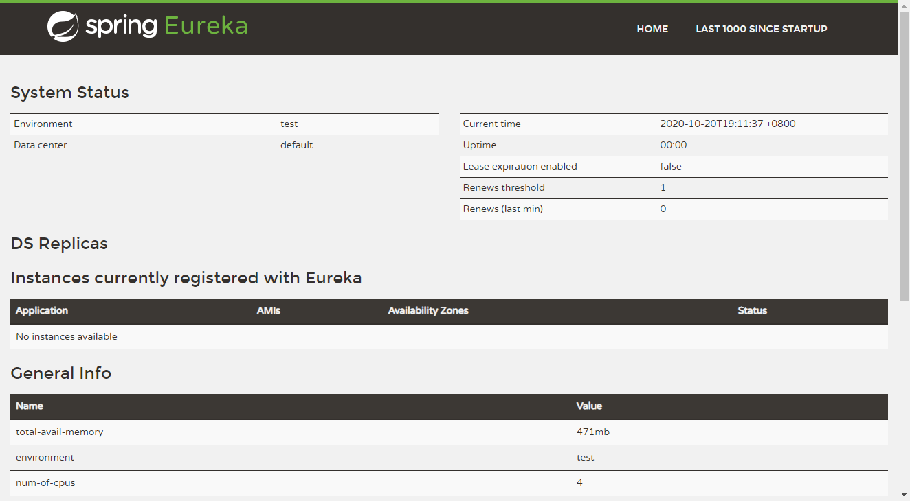

### 5.2.2EurekaClient端cloud-provider-payment8001将注册进EurekaServer成为服务提供者provider，类似尚硅谷学校对外提供授课服务

> - cloud-provider-payment8001
>
> - 改POM
>
> ```xml
>  <!-- https://mvnrepository.com/artifact/org.springframework.cloud/spring-cloud-starter-eureka-server -->
> <dependency>
>     <groupId>org.springframework.cloud</groupId>
>     <artifactId>spring-cloud-starter-netflix-eureka-client</artifactId>
> </dependency>
> ```
>
> 1.X和2.X的对比说明
>
> 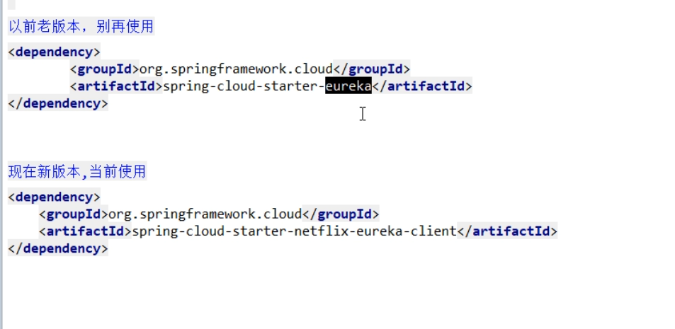
>
> - 写YML
>
> ```yml
> eureka:
>   client:
>     register-with-eureka: true
>     fetchRegistry: true
>     service-url:
>       defaultZone: http://localhost:7001/eureka
> ```
>
> - 主启动
>
>   ```java
>   package com.xiyue.cloud;
>   
>   import org.springframework.boot.SpringApplication;
>   import org.springframework.boot.autoconfigure.SpringBootApplication;
>   import org.springframework.cloud.netflix.eureka.EnableEurekaClient;
>   
>   @SpringBootApplication
>   @EnableEurekaClient
>   public class PaymentMain8001 {
>   
>       public static void main(String[] args) {
>           SpringApplication.run(PaymentMain8001.class,args);
>       }
>   }
>   
>   ```
>
>   @EnableEurekaClient
>
> - 测试
>
>   > 先要启动EurekaServer
>   > http://localhost:7001/
>   >
>   > 
>   >
>   > 微服务注册名配置说明
>   >
>   > 
>
> - 自我保护机制
>
>   

### 5.2.3EurekaClient端cloud-consumer-order80将注册进EurekaServer成为服务消费者consumer,类似来尚硅谷上课消费的各位同学

> - cloud-consumer-order80
>
> - POM
>
> ```xml
>  <!-- https://mvnrepository.com/artifact/org.springframework.cloud/spring-cloud-starter-eureka-server -->
> <dependency>
>     <groupId>org.springframework.cloud</groupId>
>     <artifactId>spring-cloud-starter-netflix-eureka-client</artifactId>
> </dependency>
> ```
>
> - 写YML（application.yml）
>
> ```yml
> server:
>   port: 80
> 
> spring:
>   application:
>     name: cloud-order-service
> 
> eureka:
>   client:
>     register-with-eureka: true
>     fetchRegistry: true
>     service-url:
>       defaultZone: http://localhost:7001/eureka
> ```
>
> - 主启动
>
>   ```java
>   package com.xiyue.cloud;
>   
>   import org.springframework.boot.SpringApplication;
>   import org.springframework.boot.autoconfigure.SpringBootApplication;
>   import org.springframework.cloud.netflix.eureka.EnableEurekaClient;
>   
>   @EnableEurekaClient
>   @SpringBootApplication
>   public class OrderMain80 {
>       public static void main(String[] args) {
>           SpringApplication.run(OrderMain80.class,args);
>       }
>   }
>   ```
>
> @EnableEurekaClient
>
> - 测试
>
> > 先要启动EurekaServer，7001服务
> > 再要启动服务提供者provider，8001服务
> > eureka服务器
> >
> > 
> >
> > http://localhost/consumer/payment/get/1

### 5.2.4bug


## 5.3集群Eureka构建步骤

### 5.3.1Eureka集群原理说明


### 5.3.2EurekaServer集群环境构建步骤

> - 参考cloud-eureka-server7001
>
> - 新建cloud-eureka-server7002
>
> - 改POM
>
> - 修改映射配置
>
>   找到C:\Windows\System32\driver\etc路径下的hosts文件
>
>   
>
>   修改映射配置添加进hosts文件
>
>   > 127.0.0.1 eureka7001.com
>   >
>   > 127.0.0.1 eureka7002.com
>
> - 写YML（以前单机）
>
>   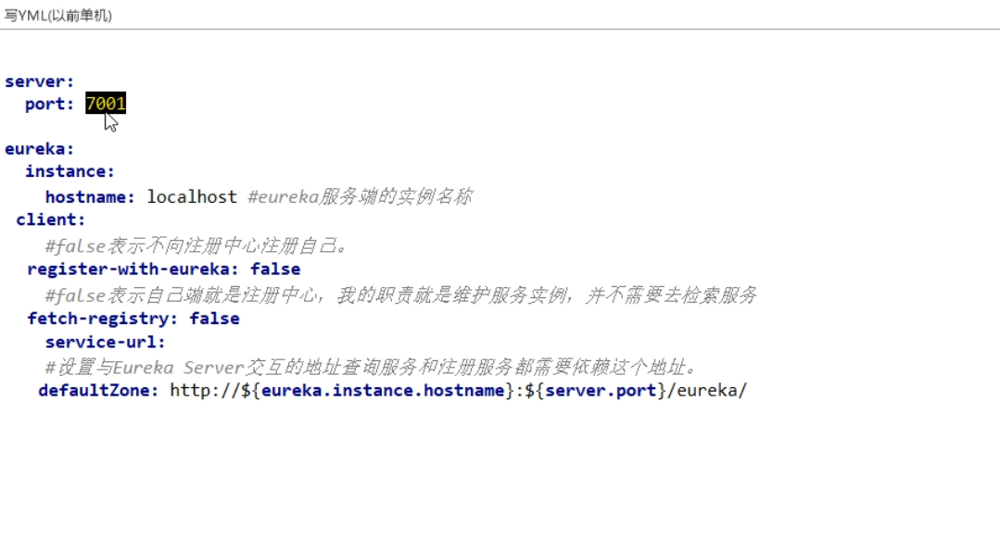
>
>   > 7001
>   >
>   > ```yml
>   > server:
>   >   port: 7001
>   > 
>   > eureka:
>   >   instance:
>   >     hostname: eureka7001.com    #eureka服务端的实例名字
>   >   client:
>   >     register-with-eureka: false    #表识不向注册中心注册自己
>   >     fetch-registry: false   #表示自己就是注册中心，职责是维护服务实例，并不需要去检索服务
>   >     service-url:
>   >       defaultZone: http://eureka7002.com:7002/eureka/    #设置与eureka server交互的地址查询服务和注册服务都需要依赖这个地址
>   >  
>   > ```
>   >
>   > 7002
>   >
>   > ```yml
>   > server:
>   >   port: 7002
>   > 
>   > eureka:
>   >   instance:
>   >     hostname: eureka7002.com #eureka服务端的实例名字
>   >   client:
>   >     register-with-eureka: false    #表识不向注册中心注册自己
>   >     fetch-registry: false   #表示自己就是注册中心，职责是维护服务实例，并不需要去检索服务
>   >     service-url:
>   >       defaultZone: http://eureka7001.com:7001/eureka/     #设置与eureka server交互的地址查询服务和注册服务都需要依赖这个地址
>   >  
>   > ```
>   >
>   > 
>
> - 主启动(复制cloud-eureka-server7001的主启动类到7002即可)

### 5.3.3将支付服务8001微服务发布到上面2台Eureka集群配置中

```yml
service-url:
  defaultZone: http://eureka7001.com:7001/eureka,http://eureka7002.com:7002/eureka  #集群版
```

### 5.3.4将订单服务80微服务发布到上面2台Eureka集群配置

```yml
service-url:
  defaultZone: http://eureka7001.com:7001/eureka,http://eureka7002.com:7002/eureka  #集群版
```

### 5.3.5测试01

> 先要启动EurekaServer，7001/7002服务
>
> 再要启动服务提供者provider，8001服务
>
> 再要启动消费者，80
>
> http://localhost/consumer/payment/get/1

### 5.3.6支付服务提供者8001集群环境构建

- 参考cloud-provider-payment8001
- 新建cloud-provider-payment8002
- 改POM

- 写YML

  

>   7001
>
> ```yml
> server:
>   port: 7001
> 
> eureka:
>   instance:
>     hostname: eureka7001.com    #eureka服务端的实例名字
>   client:
>     register-with-eureka: false    #表识不向注册中心注册自己
>     fetch-registry: false   #表示自己就是注册中心，职责是维护服务实例，并不需要去检索服务
>     service-url:
>       defaultZone: http://eureka7002.com:7002/eureka/    #设置与eureka server交互的地址查询服务和注册服务都需要依赖这个地址
> ```
>
>   7002
>
> ```yml
> server:
>   port: 7002
> 
> eureka:
>   instance:
>     hostname: eureka7002.com #eureka服务端的实例名字
>   client:
>     register-with-eureka: false    #表识不向注册中心注册自己
>     fetch-registry: false   #表示自己就是注册中心，职责是维护服务实例，并不需要去检索服务
>     service-url:
>       defaultZone: http://eureka7001.com:7001/eureka/     #设置与eureka server交互的地址查询服务和注册服务都需要依赖这个地址
> ```

- 主启动类

>   找到C:\Windows\System32\drivers\etc路径下的hosts文件
>
> 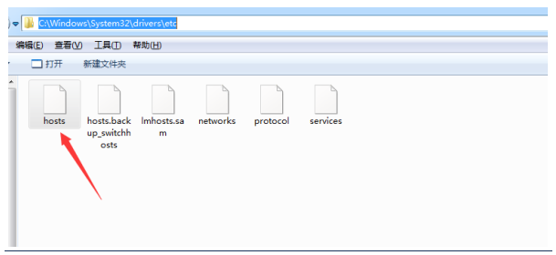
>
>   修改映射配置添加进hosts文件
>
> > 127.0.0.1  eureka7001.com
> >  127.0.0.1  eureka7002.com

- 修改8001/8002的Controller

>   8001
>
> 
>
>   8002
>
> 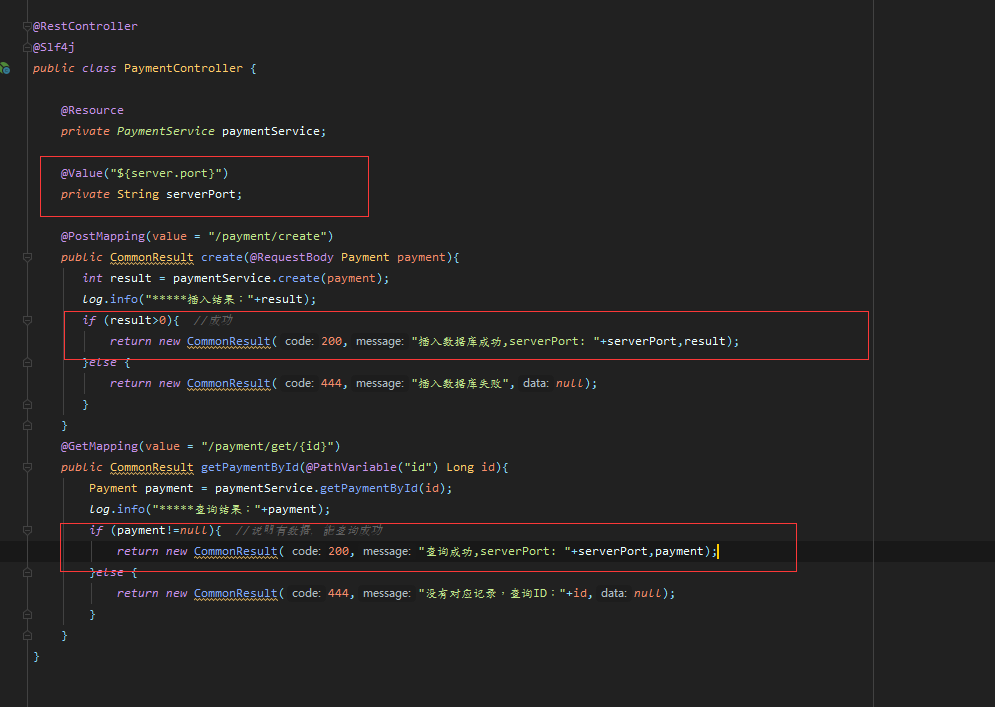

### 5.3.7负载均衡

### 5.3.8测试02

## 5.4actuator微服务信息完善

## 5.5服务发现Discovery

## 5.6Eureka自我保护