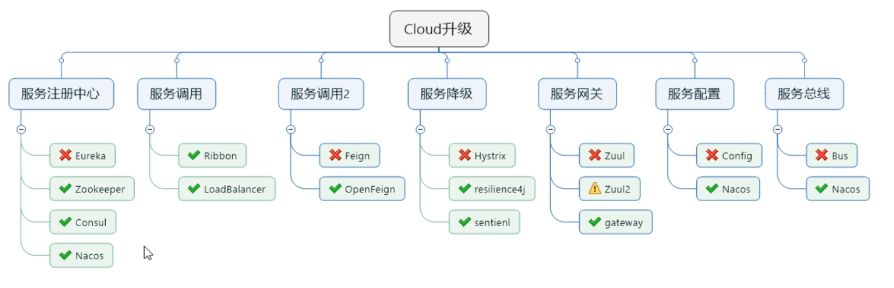
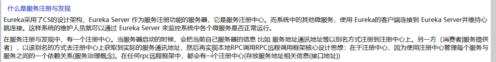
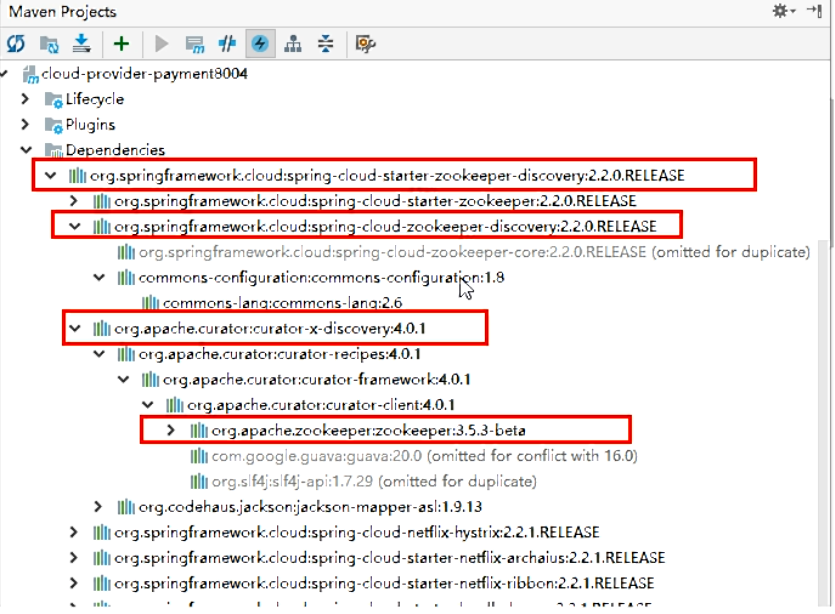
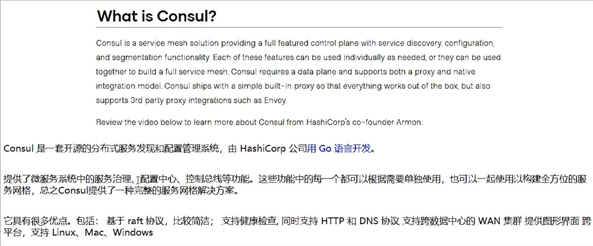
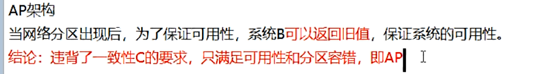
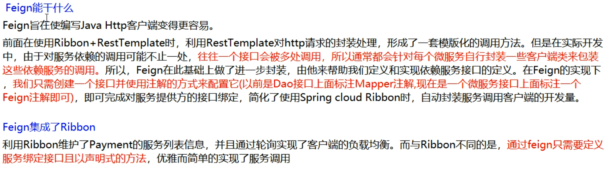
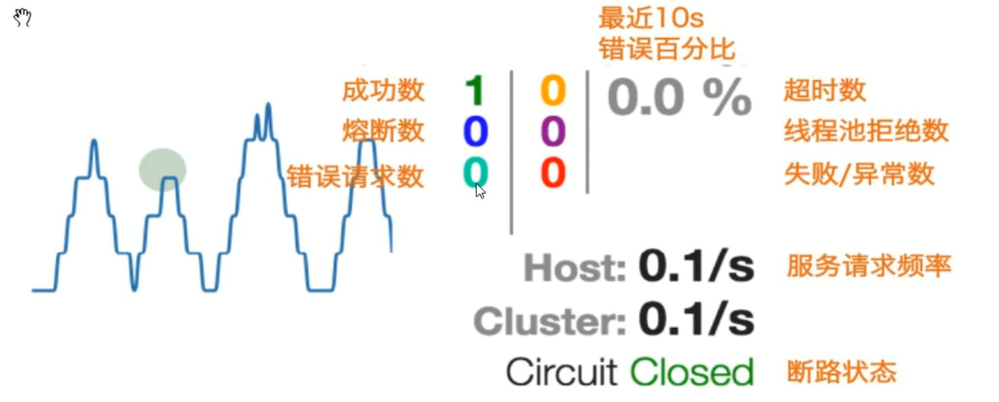
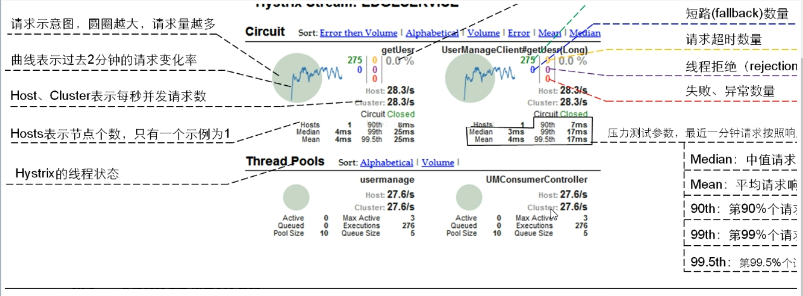
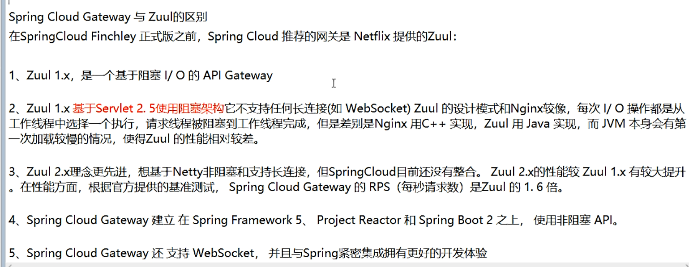

[TOC]

郑重说明本资料来源于https://www.bilibili.com/video/BV18E411x7eT

# 1.微服务架构零基础理论入门（小白必看）

## 1.1零基础小白，2020.1春节期间预习过第一季的，理解微服务概念的可以不看

## 1.2理论介绍见<<微服务架构2020.pptx>>

## 1.3回顾2018年第一季SpringCloud版本

别再用了

# 2.从2.2.x和H版开始说起

## 2.1本次的SpringCloud第二季分为上半场和下半场

**上篇**：SpringBoot2.X版和SpringCloud H版

**下篇**：SpringCloud Alibaba

**大纲**

## 2.2Springboot版本选择

**git源码地址：**
  https://github.com/spring-projects/spring-boot/releases/


**SpringBoot2.0新特性：**
  https://github.com/spring-projects/spring-boot/wiki/Spring-Boot-2.0-Release-Notes


**通过上面官网发现，Boot官方强烈建议你升级到2.X以上版本**


**官网看Boot版本** 
   springboot(截至2019.10.26)


  springboot(截至2020.2.15)


## 2.3SpringCloud版本选择

git源码地址
  https://github.com/spring-projects/spring-cloud/wiki

官网：
  https://spring.io/projects/spring-cloud

### 官网看Cloud版本 

  **Cloud命名规则**


**SpringCloud的多版本**


###   **springcloud(截至2019.10.26)**


###   **springboot(截至2020.2.15)**


## 2.4SpringCloud和Springboot之间的依赖关系如何看

https://spring.io/projects/spring-cloud#overview


依赖


更详细的版本对应查看方法

https://start.spring.io/actuator/info

结果


查看json串返回结果


## 2.5SpringCloud第二季定稿版（截止2020.2.15）

**cloud**:Hoxton.SR1
**boot**：2.2.2.RELEASE
**cloud Alibaba**:2.1.0.RELEASE
**java**:JAVA8
**maven**:3.5及以上
**mysql**:5.7及以上
**不许捣蛋，上述全部版本必须和阳哥一致**
**题外话**

- **boot版已经到2.2.4为最新，为什么选2.2.2？**
    **只用boot，直接用最新**


**同时用boot和cloud，需要照顾cloud，由cloud决定boot版本 结果**


**SpringCloud和SpringBoot版本对应关系**


-  **2.X版本常用的组件pom**

  


# 3.关于Cloud各种组件的停更/升级/替换

##   3.1由停更引发的“升级惨案”

​    **停更不停用**
​      被动修复bugs
​      不再接受合并请求
​      不再发布新版本
​    **补充，哈哈**
​      停课不停学
​    **明细条目**
​      以前


​      now2020



##  3.2 参考资料见官网

​    Spring Cloud
​      https://cloud.spring.io/spring-cloud-static/Hoxton.SR1/reference/htmlsingle/
​      Spring Cloud中文文档
​        https://www.bookstack.cn/read/spring-cloud-docs/docs-index.md
​    Spring Boot
​      https://docs.spring.io/spring-boot/docs/2.2.2.RELEASE/reference/htmlsingle/

# 4.微服务架构编码构建

##   4.1约定 > 配置 > 编码

##   4.2IDEA新建project工作空间

- 微服务cloud整体聚合父工程Project

  **父工程步骤:**
    1.New Project

  

    2.聚合总工程名字

  

    3.Maven选版本

  

    4.工程名字

  

    5.字符编码

  

  

    6.注解生效激活

  

    7.java编译版本选8

  

    8.File Type过滤

  

  *.hprof;*.idea;*.iml;*.pyc;*.pyo;*.rbc;*.yarb;*~;.DS_Store;.git;.hg;.svn;CVS;__pycache__;_svn;vssver.scc;vssver2.scc;

  

- 父工程POM

  ```xml
  <?xml version="1.0" encoding="UTF-8"?>
  <project xmlns="http://maven.apache.org/POM/4.0.0" xmlns:xsi="http://www.w3.org/2001/XMLSchema-instance"
           xsi:schemaLocation="http://maven.apache.org/POM/4.0.0 https://maven.apache.org/xsd/maven-4.0.0.xsd">
  
    <modelVersion>4.0.0</modelVersion>
  
    <groupId>com.atguigu.springcloud</groupId>
    <artifactId>cloud2020</artifactId>
    <version>1.0-SNAPSHOT</version>
    <packaging>pom</packaging>
    <!-- 统一管理jar包版本 -->
    <properties>
      <project.build.sourceEncoding>UTF-8</project.build.sourceEncoding>
      <maven.compiler.source>1.8</maven.compiler.source>
      <maven.compiler.target>1.8</maven.compiler.target>
      <junit.version>4.12</junit.version>
      <log4j.version>1.2.17</log4j.version>
      <lombok.version>1.16.18</lombok.version>
      <mysql.version>5.1.47</mysql.version>
      <druid.version>1.1.16</druid.version>
      <mybatis.spring.boot.version>1.3.0</mybatis.spring.boot.version>
    </properties>
  
    <!-- 子模块继承之后，提供作用：锁定版本+子modlue不用写groupId和version  -->
    <dependencyManagement>
      <dependencies>
        <!--spring boot 2.2.2-->
        <dependency>
          <groupId>org.springframework.boot</groupId>
          <artifactId>spring-boot-dependencies</artifactId>
          <version>2.2.2.RELEASE</version>
          <type>pom</type>
          <scope>import</scope>
        </dependency>
        <!--spring cloud Hoxton.SR1-->
        <dependency>
          <groupId>org.springframework.cloud</groupId>
          <artifactId>spring-cloud-dependencies</artifactId>
          <version>Hoxton.SR1</version>
          <type>pom</type>
          <scope>import</scope>
        </dependency>
        <!--spring cloud alibaba 2.1.0.RELEASE-->
        <dependency>
          <groupId>com.alibaba.cloud</groupId>
          <artifactId>spring-cloud-alibaba-dependencies</artifactId>
          <version>2.1.0.RELEASE</version>
          <type>pom</type>
          <scope>import</scope>
        </dependency>
  
        <dependency>
          <groupId>mysql</groupId>
          <artifactId>mysql-connector-java</artifactId>
          <version>${mysql.version}</version>
        </dependency>
        <dependency>
          <groupId>com.alibaba</groupId>
          <artifactId>druid</artifactId>
          <version>${druid.version}</version>
        </dependency>
        <dependency>
          <groupId>org.mybatis.spring.boot</groupId>
          <artifactId>mybatis-spring-boot-starter</artifactId>
          <version>${mybatis.spring.boot.version}</version>
        </dependency>
        <dependency>
          <groupId>junit</groupId>
          <artifactId>junit</artifactId>
          <version>${junit.version}</version>
        </dependency>
        <dependency>
          <groupId>log4j</groupId>
          <artifactId>log4j</artifactId>
          <version>${log4j.version}</version>
        </dependency>
        <dependency>
          <groupId>org.projectlombok</groupId>
          <artifactId>lombok</artifactId>
          <version>${lombok.version}</version>
          <optional>true</optional>
        </dependency>
      </dependencies>
    </dependencyManagement>
  
    <build>
      <plugins>
        <plugin>
          <groupId>org.springframework.boot</groupId>
          <artifactId>spring-boot-maven-plugin</artifactId>
          <configuration>
            <fork>true</fork>
            <addResources>true</addResources>
          </configuration>
        </plugin>
      </plugins>
    </build>
  </project>
  ```

- 解决maven下载不了jar的问题请复制这个链接到浏览器自行解决：

  在网上拷贝的所有阿里云镜像比如：

  ```xml
  <mirror>
      <id>nexus-aliyun</id>
      <mirrorOf>central</mirrorOf>
      <name>Nexus aliyun</name>
      <url>http://maven.aliyun.com/nexus/content/groups/public</url>
  </mirror>
  ```

  **都不能**解决我的问题，我的包里面一直出现.lastUpdated文件，后来我查看官网之后发现：**阿里不再支持http下载**，只支持**https**。

  因此，先将maven镜像配置如下：

  ```
  <mirror>
  	<id>aliyunmaven</id>
      <mirrorOf>*</mirrorOf>
      <name>阿里云公共仓库</name>
      <url>https://maven.aliyun.com/repository/public</url>
  </mirror>
  ```

  然后我还出现了一个问题，由于使用了HTTPS，存在着SSL证书验证的问题，因此我在IDEA中添加了一行配置：

  

  配置如下：

  ```
  -Dmaven.wagon.http.ssl.insecure=true -Dmaven.wagon.http.ssl.allowall=true
  ```

  该配置用于忽略ssl证书的验证，然后我的maven终于可以丝滑下载了。

- Maven工程落地细节复习

  Maven中的dependencyManagement和dependencies

  

  

  maven中跳过单元测试

- 父工程创建完成执行mvn:install将父工程发布到仓库方便子工程继承

##   4.3Rest微服务工程构建

### 4.3.1构建步骤

#### 4.3.1.1.cloud-provider-payment8001微服务提供者支付Module模块

- 建cloud-provider-payment8001

  创建完成后请回到父工程查看pom文件变化

- 改POM文件

  ```xml
  <?xml version="1.0" encoding="UTF-8"?>
  <project xmlns="http://maven.apache.org/POM/4.0.0"
           xmlns:xsi="http://www.w3.org/2001/XMLSchema-instance"
           xsi:schemaLocation="http://maven.apache.org/POM/4.0.0 http://maven.apache.org/xsd/maven-4.0.0.xsd">
      <parent>
          <artifactId>cloud2020</artifactId>
          <groupId>com.xiyue.cloud</groupId>
          <version>1.0-SNAPSHOT</version>
      </parent>
      <modelVersion>4.0.0</modelVersion>
      <artifactId>cloud-provider-payment8001</artifactId>
      <dependencies>
          <!-- https://mvnrepository.com/artifact/org.springframework.boot/spring-boot-starter-web -->
          <dependency>
              <groupId>org.springframework.boot</groupId>
              <artifactId>spring-boot-starter-web</artifactId>
          </dependency>
          <!-- https://mvnrepository.com/artifact/org.springframework.boot/spring-boot-starter-web -->
          <dependency>
              <groupId>org.springframework.boot</groupId>
              <artifactId>spring-boot-starter-actuator</artifactId>
          </dependency>
          <!-- https://mvnrepository.com/artifact/org.springframework.boot/spring-boot-starter-web -->
          <dependency>
              <groupId>org.mybatis.spring.boot</groupId>
              <artifactId>mybatis-spring-boot-starter</artifactId>
          </dependency>
          <!-- https://mvnrepository.com/artifact/com.alibaba/druid -->
          <dependency>
              <groupId>com.alibaba</groupId>
              <artifactId>druid-spring-boot-starter</artifactId>
              <version>1.1.10</version>
          </dependency>
          <!-- https://mvnrepository.com/artifact/mysql/mysql-connector-java -->
          <dependency>
              <groupId>mysql</groupId>
              <artifactId>mysql-connector-java</artifactId>
          </dependency>
          <!-- https://mvnrepository.com/artifact/org.springframework.boot/spring-boot-starter-jdbc -->
          <dependency>
              <groupId>org.springframework.boot</groupId>
              <artifactId>spring-boot-starter-jdbc</artifactId>
          </dependency>
          <!-- https://mvnrepository.com/artifact/org.springframework.boot/spring-boot-devtools -->
          <dependency>
              <groupId>org.springframework.boot</groupId>
              <artifactId>spring-boot-devtools</artifactId>
             <scope>runtime</scope>
              <optional>true</optional>
          </dependency>
          <!-- https://mvnrepository.com/artifact/org.projectlombok/lombok -->
          <dependency>
              <groupId>org.projectlombok</groupId>
              <artifactId>lombok</artifactId>
              <optional>true</optional>
          </dependency>
          <!-- https://mvnrepository.com/artifact/org.springframework.boot/spring-boot-starter-test -->
          <dependency>
              <groupId>org.springframework.boot</groupId>
              <artifactId>spring-boot-starter-test</artifactId>
              <scope>test</scope>
          </dependency>
      </dependencies>
  </project>
  ```

  

- 写YML

  ```yaml
  server:
    port: 8001
  
  spring:
    application:
      name: cloud-payment-service
    datasource:
      type: com.alibaba.druid.pool.DruidDataSource
      driver-class-name: org.gjt.mm.mysql.Driver
      url: jdbc:mysql://localhost:3306/db2019?useUnicode=true&characterEncoding=utf-8&useSSL=false
      username: root
      password: 123456
  
  mybatis:
    mapperLocations: classpath:mapper/*.xml
    type-aliases-package: com.xiyue.cloud.entities
  ```

  

- 主启动

  ```java
  package com.xiyue.cloud;
  
  import org.springframework.boot.SpringApplication;
  import org.springframework.boot.autoconfigure.SpringBootApplication;
  
  @SpringBootApplication
  public class PaymentMain8001 {
  
      public static void main(String[] args) {
          SpringApplication.run(PaymentMain8001.class,args);
      }
  }
  
  ```

  

- 业务类

  1.建表SQL

  ```sql
  CREATE TABLE payment (
   id BIGINT(20) NOT NULL AUTO_INCREMENT COMMENT '主键',
   'serial' VARCHAR(200) DEFAULT null,
   PRIMARY KEY(id)
  ) ENGINE=INNODB AUTO_INCREMENT=1 DEFAULT CHARSET=utf8
  ```

  2.entitles

  主实体Payment

  ```java
  package com.xiyue.cloud.entities;
  
  import lombok.AllArgsConstructor;
  import lombok.Data;
  import lombok.NoArgsConstructor;
  
  import java.io.Serializable;
  
  @Data
  @AllArgsConstructor
  @NoArgsConstructor
  public class Payment implements Serializable {
      private Long id;
      private String serial;
  }
  ```

  Json封装体CommonResult

  ```java
  package com.xiyue.cloud.entities;
  
  import lombok.AllArgsConstructor;
  import lombok.Data;
  import lombok.NoArgsConstructor;
  @Data
  @AllArgsConstructor
  @NoArgsConstructor
  public class CommonResult <T>{
      private Integer code;
      private String message;
      private T data;
      public CommonResult(Integer code,String message){
          this(code,message,null);
      }
  }
  ```

  3.dao

  接口PaymentDao

  ```java
  package com.xiyue.cloud.dao;
  
  import com.xiyue.cloud.entities.Payment;
  import org.apache.ibatis.annotations.Mapper;
  import org.apache.ibatis.annotations.Param;
  
  @Mapper
  public interface PaymentDao{
  
      public int create(Payment payment); //写
  
      public Payment getPaymentById(@Param("id") Long id);  //读取
  }
  
  ```

  mybatis的映射文件PaymentMapper.xml

  ​	路径

  ​		src\main\resources\mapper\PaymentMapper.xml
  ​	文件头	

  ```xml
  <?xml version="1.0" encoding="UTF-8"?>
  <!DOCTYPE mapper PUBLIC "-//mybatis.org//DTD Mapper 3.0//EN" "http://mybatis.org/dtd/mybatis-3-mapper.dtd">
  <mapper namespace="com.xiyue.cloud.dao.PaymentDao">
  </mapper>
  ```

  ​	PaymentMapper.xml

  ```xml
  <?xml version="1.0" encoding="UTF-8"?>
  <!DOCTYPE mapper PUBLIC "-//mybatis.org//DTD Mapper 3.0//EN" "http://mybatis.org/dtd/mybatis-3-mapper.dtd">
  
  <mapper namespace="com.xiyue.cloud.dao.PaymentDao">
      <insert id="create" parameterType="Payment" useGeneratedKeys="true" keyProperty="id">
              insert into payment(serial) values(${serial});
      </insert>
      <resultMap id="BaseResultMap" type="com.atguigu.springcloud.entities.Payment">
          <id column="id" property="id" jdbcType="BIGINT"></id>
          <id column="serial" property="serial" jdbcType="VARCHAR"></id>
      </resultMap>
      <select id="getPaymentById"  parameterType="Long" resultMap="BaseResultMap">
              select * from payment where id=#{id}
      </select>
  </mapper>
  ```

  4.service

  ​	接口PaymentService

  ```java
  package com.xiyue.cloud.service;
  
  import com.atguigu.springcloud.entities.Payment;
  import org.apache.ibatis.annotations.Param;
  
  public interface PaymentService {
  
      public int create(Payment payment); //写
  
      public Payment getPaymentById(@Param("id") Long id);  //读取
  }
  ```

  ​	实现类

  ```java
  package com.xiyue.cloud.service.impl;
  
  import com.xiyue.cloud.dao.PaymentDao;
  import com.xiyue.cloud.entities.Payment;
  import com.xiyue.cloud.service.PaymentService;
  import org.apache.ibatis.annotations.Param;
  import org.springframework.stereotype.Service;
  import javax.annotation.Resource;
  
  @Service
  public class PaymentServiceImpl implements PaymentService {
  
      @Resource
      private PaymentDao paymentDao;
  
      public int create(Payment payment){
          return paymentDao.create(payment);
      }
  
      public Payment getPaymentById( Long id){
          return paymentDao.getPaymentById(id);
      }
  }
  ```

  5.controller

  ```java
  package com.xiyue.cloud.controller;
  
  import com.xiyue.cloud.entities.CommonResult;
  import com.xiyue.cloud.entities.Payment;
  import com.xiyue.cloud.service.PaymentService;
  import lombok.extern.slf4j.Slf4j;
  import org.springframework.web.bind.annotation.GetMapping;
  import org.springframework.web.bind.annotation.PathVariable;
  import org.springframework.web.bind.annotation.PostMapping;
  import org.springframework.web.bind.annotation.RestController;
  
  import javax.annotation.Resource;
  
  @RestController
  @Slf4j
  public class PaymentController {
  
      @Resource
      private PaymentService paymentService;
  
      @PostMapping(value = "/payment/create")
      public CommonResult create(Payment payment){
          int result = paymentService.create(payment);
          log.info("*****插入结果："+result);
          if (result>0){  //成功
              return new CommonResult(200,"插入数据库成功",result);
          }else {
              return new CommonResult(444,"插入数据库失败",null);
          }
      }
  
      @GetMapping(value = "/payment/get/{id}")
      public CommonResult getPaymentById(@PathVariable("id") Long id){
          Payment payment = paymentService.getPaymentById(id);
          log.info("*****查询结果："+payment);
          if (payment!=null){  //说明有数据，能查询成功
              return new CommonResult(200,"查询成功",payment);
          }else {
              return new CommonResult(444,"没有对应记录，查询ID："+id,null);
          }
      }
  }
  
  ```

  

- 测试

  

  **http://localhost:8001/payment/get/1**
  **postman模拟post**

  

  **运行**

  通过修改idea的workpace.xml的方式来快速打开Run DashBoard窗口

  开启Run DashBoard

  

  填入以下内容：

  ```xml
  <option name="configurationTypes">
        <set>
          <option value="SpringBootApplicationConfigurationType" />
        </set>
  </option>
  ```

  部分同学可能由于idea版本不同，需要关闭重启

- 小总结

  1.建module
  2.改POM
  3.写YML
  4.主启动
  5.业务类

#### <u>4.3.1.2.热部署Devtools</u>

- Adding devtools to your project

  ```xml
  <!-- https://mvnrepository.com/artifact/org.springframework.boot/spring-boot-devtools -->
  <dependency>
      <groupId>org.springframework.boot</groupId>
      <artifactId>spring-boot-devtools</artifactId>
     <scope>runtime</scope>
      <optional>true</optional>
  </dependency>
  ```

- Adding plugin to your pom.xml

  ```xml
  <!-- 一段配置黏贴到父工程当中的pom里 -->
  <build>
    <plugins>
      <plugin>
        <groupId>org.springframework.boot</groupId>
        <artifactId>spring-boot-maven-plugin</artifactId>
        <configuration>
          <fork>true</fork>
          <addResources>true</addResources>
        </configuration>
      </plugin>
    </plugins>
  </build>
  ```

  

- Enabling automatic build 


- Update the value of

  

  

- 重启IDEA

#### 4.3.1.3.cloud-consumer-order80微服务消费者订单Module模块

- 新建cloud-consumer-order80

  注意项目名称与上面图片可能不一致需要保持一致哦

  

- 改POM

  ```xml
  <?xml version="1.0" encoding="UTF-8"?>
  <project xmlns="http://maven.apache.org/POM/4.0.0"
           xmlns:xsi="http://www.w3.org/2001/XMLSchema-instance"
           xsi:schemaLocation="http://maven.apache.org/POM/4.0.0 http://maven.apache.org/xsd/maven-4.0.0.xsd">
      <parent>
          <artifactId>cloud2020</artifactId>
          <groupId>com.xiyue.cloud</groupId>
          <version>1.0-SNAPSHOT</version>
      </parent>
      <modelVersion>4.0.0</modelVersion>
  
      <artifactId>cloud-consumer-order80</artifactId>
      <dependencies>
          <!-- https://mvnrepository.com/artifact/org.springframework.boot/spring-boot-starter-web -->
          <dependency>
              <groupId>org.springframework.boot</groupId>
              <artifactId>spring-boot-starter-web</artifactId>
          </dependency>
  
          <!-- https://mvnrepository.com/artifact/org.springframework.boot/spring-boot-starter-web  -->
          <dependency>
              <groupId>org.springframework.boot</groupId>
              <artifactId>spring-boot-starter-actuator</artifactId>
          </dependency>
  
          <!-- https://mvnrepository.com/artifact/org.springframework.boot/spring-boot-devtools -->
          <dependency>
              <groupId>org.springframework.boot</groupId>
              <artifactId>spring-boot-devtools</artifactId>
              <scope>runtime</scope>
              <optional>true</optional>
          </dependency>
  
          <!-- https://mvnrepository.com/artifact/org.projectlombok/lombok -->
          <dependency>
              <groupId>org.projectlombok</groupId>
              <artifactId>lombok</artifactId>
              <optional>true</optional>
          </dependency>
  
          <!-- https://mvnrepository.com/artifact/org.springframework.boot/spring-boot-starter-test -->
          <dependency>
              <groupId>org.springframework.boot</groupId>
              <artifactId>spring-boot-starter-test</artifactId>
              <scope>test</scope>
          </dependency>
      </dependencies>
  </project>
  ```

- 写YML

  ```yml
  server:
    port: 80
  ```

- 主启动

  ```java
  package com.xiyue.cloud;
  
  import org.springframework.boot.SpringApplication;
  import org.springframework.boot.autoconfigure.SpringBootApplication;
  
  @SpringBootApplication
  public class OrderMain80 {
      public static void main(String[] args) {
          SpringApplication.run(OrderMain80.class,args);
      }
  }
  ```

- 业务类

  创建entities(将cloud-provider-payment8001工程下的entities包下的两个实体类复制过来)

  

  首说RestTemplate

  > 是什么
  >
  > 
  >
  > 官网及使用
  >
  > **官网地址：**
  > https://docs.spring.io/spring-framework/docs/5.2.2.RELEASE/javadoc-api/org/springframework/web/client/RestTemplate.html
  >
  > 

  config配置类（ApplicationContextConfig）

  ```java
  package com.xiyue.cloud.config;
  
  import org.springframework.context.annotation.Bean;
  import org.springframework.context.annotation.Configuration;
  import org.springframework.web.client.RestTemplate;
  
  @Configuration
  public class ApplicationContextConfig {
  
      @Bean
      public RestTemplate getRestTemplate(){
          return new RestTemplate();
      }
  
  }
  ```

  创建controller

  ```java
  package com.xiyue.cloud.controller;
  
  import com.xiyue.cloud.entities.CommonResult;
  import com.xiyue.cloud.entities.Payment;
  import lombok.extern.slf4j.Slf4j;
  import org.springframework.web.bind.annotation.GetMapping;
  import org.springframework.web.bind.annotation.PathVariable;
  import org.springframework.web.bind.annotation.RestController;
  import org.springframework.web.client.RestTemplate;
  
  import javax.annotation.Resource;
  
  @RestController
  @Slf4j
  public class OrderController {
  
      public static final String PAYMENT_URL = "http://localhost:8001";
  
      @Resource
      private RestTemplate restTemplate;
  
      @GetMapping("/consumer/payment/create")
      public CommonResult<Payment>   create(Payment payment){
          return restTemplate.postForObject(PAYMENT_URL+"/payment/create",payment,CommonResult.class);  //写操作
      }
  
      @GetMapping("/consumer/payment/get/{id}")
      public CommonResult<Payment> getPayment(@PathVariable("id") Long id){
          return restTemplate.getForObject(PAYMENT_URL+"/payment/get/"+id,CommonResult.class);
      }
  }
  ```

  

- 测试

  > 先启动cloud-provider-payment8001
  > 再启动cloud-consumer-order80
  > http://localhost/consumer/payment/get/1
  >
  > 不要忘记@RequestBody注解
  >
  > 

#### 4.3.1.4.工程重构

> 观察问题
>
> 
>
>   系统中有重复部分，重构
> 新建 cloud-api-commons
>
> 
>
> POM
>
> ```xml
> <?xml version="1.0" encoding="UTF-8"?>
> <project xmlns="http://maven.apache.org/POM/4.0.0"
>          xmlns:xsi="http://www.w3.org/2001/XMLSchema-instance"
>          xsi:schemaLocation="http://maven.apache.org/POM/4.0.0 http://maven.apache.org/xsd/maven-4.0.0.xsd">
>     <parent>
>         <artifactId>cloud2020</artifactId>
>         <groupId>com.xiyue.cloud</groupId>
>         <version>1.0-SNAPSHOT</version>
>     </parent>
>     <modelVersion>4.0.0</modelVersion>
> 
>     <artifactId>cloud-api-commons</artifactId>
>     <dependencies>
>         <!-- https://mvnrepository.com/artifact/org.springframework.boot/spring-boot-devtools -->
>         <dependency>
>             <groupId>org.springframework.boot</groupId>
>             <artifactId>spring-boot-devtools</artifactId>
>             <scope>runtime</scope>
>             <optional>true</optional>
>         </dependency>
> 
>         <dependency>
>             <groupId>org.projectlombok</groupId>
>             <artifactId>lombok</artifactId>
>             <optional>true</optional>
>         </dependency>
> 
>         <!-- https://mvnrepository.com/artifact/cn.hutool/hutool-all -->
>         <dependency>
>             <groupId>cn.hutool</groupId>
>             <artifactId>hutool-all</artifactId>
>             <version>5.1.0</version>
>         </dependency>
>     </dependencies>
> </project>
> ```
>
> entities
>
> -  Payment实体
> - CommonResult通用封装类
>
> maven命令clean install
>
> 订单80和支付8001分别改造
>
> > 删除各自的原先有过的entities文件夹
> > 各自黏贴POM内容
> >
> > ```xml
> > <dependency>
> >     <groupId>com.atguigu.springcloud</groupId>
> >     <artifactId>cloud-api-commons</artifactId>
> >     <version>${project.version}</version>
> > </dependency>
> > ```
> >
> > > 80
> > > 8001


### 4.3.2目前工程样图


# 5.Eureka服务注册与发现

## 5.1Eureka基础知识

### 5.1.1什么是服务治理


### 5.1.2什么是服务注册




### 5.1.3Eureka两组件


## 5.2单机Eureka构建步骤

### 5.2.1IDEA生成eurekaServer端服务注册中心类似物业公司

> - 建Module
>
>   cloud-eureka-server7001
>
> - 改POM
>
>   ```xml
>   <?xml version="1.0" encoding="UTF-8"?>
>   <project xmlns="http://maven.apache.org/POM/4.0.0"
>            xmlns:xsi="http://www.w3.org/2001/XMLSchema-instance"
>            xsi:schemaLocation="http://maven.apache.org/POM/4.0.0 http://maven.apache.org/xsd/maven-4.0.0.xsd">
>       <parent>
>           <artifactId>cloud2020</artifactId>
>           <groupId>com.xiyue.cloud</groupId>
>           <version>1.0-SNAPSHOT</version>
>       </parent>
>       <modelVersion>4.0.0</modelVersion>
>   
>       <artifactId>cloud-eureka-server7001</artifactId>
>       <dependencies>
>           <!-- https://mvnrepository.com/artifact/org.springframework.cloud/spring-cloud-starter-eureka-server -->
>           <dependency>
>               <groupId>org.springframework.cloud</groupId>
>               <artifactId>spring-cloud-starter-netflix-eureka-server</artifactId>
>           </dependency>
>   
>           <dependency>
>               <groupId>com.xiyue.cloud</groupId>
>               <artifactId>cloud-api-commons</artifactId>
>               <version>${project.version}</version>
>           </dependency>
>   
>           <!-- https://mvnrepository.com/artifact/org.springframework.boot/spring-boot-starter-web -->
>           <dependency>
>               <groupId>org.springframework.boot</groupId>
>               <artifactId>spring-boot-starter-web</artifactId>
>           </dependency>
>   
>           <!-- https://mvnrepository.com/artifact/org.springframework.boot/spring-boot-starter-web  -->
>           <dependency>
>               <groupId>org.springframework.boot</groupId>
>               <artifactId>spring-boot-starter-actuator</artifactId>
>           </dependency>
>   
>           <!-- https://mvnrepository.com/artifact/org.springframework.boot/spring-boot-devtools -->
>           <dependency>
>               <groupId>org.springframework.boot</groupId>
>               <artifactId>spring-boot-devtools</artifactId>
>               <scope>runtime</scope>
>               <optional>true</optional>
>           </dependency>
>   
>           <!-- https://mvnrepository.com/artifact/org.projectlombok/lombok -->
>           <dependency>
>               <groupId>org.projectlombok</groupId>
>               <artifactId>lombok</artifactId>
>           </dependency>
>   
>           <!-- https://mvnrepository.com/artifact/org.springframework.boot/spring-boot-starter-test -->
>           <dependency>
>               <groupId>org.springframework.boot</groupId>
>               <artifactId>spring-boot-starter-test</artifactId>
>               <scope>test</scope>
>           </dependency>
>           <dependency>
>               <groupId>junit</groupId>
>               <artifactId>junit</artifactId>
>           </dependency>
>       </dependencies>
>   </project>
>   ```
>
>   1.X和2.X的对比说明
>
>   
>
> - 写YML
>
>   application.yml
>
>   ```yml
>   server:
>     port: 7001
>   
>   eureka:
>     instance:
>       hostname: localhost  #eureka服务端的实例名字
>     client:
>       register-with-eureka: false    #表识不向注册中心注册自己
>       fetch-registry: false   #表示自己就是注册中心，职责是维护服务实例，并不需要去检索服务
>      service-url:
>       defaultZone: http://${eureka.instance.hostname}:${server.port}/eureka/    #设置与eureka server交互的地址查询服务和注册服务都需要依赖这个地址
>   
>   ```
>
> - 主启动
>
>   ```java
>   package com.xiyue.cloud;
>   
>   import org.springframework.boot.SpringApplication;
>   import org.springframework.boot.autoconfigure.SpringBootApplication;
>   import org.springframework.cloud.netflix.eureka.server.EnableEurekaServer;
>   
>   @EnableEurekaServer
>   @SpringBootApplication
>   public class EurekaMain7001 {
>       public static void main(String[] args) {
>           SpringApplication.run(EurekaMain7001.class,args);
>       }
>   }
>   ```
>
>   @EnableEurekaServer
>
> - 测试
>
>   http://localhost:7001/
>   结果页面
>
>   

### 5.2.2EurekaClient端cloud-provider-payment8001将注册进EurekaServer成为服务提供者provider，类似尚硅谷学校对外提供授课服务

> - cloud-provider-payment8001
>
> - 改POM
>
> ```xml
>  <!-- https://mvnrepository.com/artifact/org.springframework.cloud/spring-cloud-starter-eureka-server -->
> <dependency>
>     <groupId>org.springframework.cloud</groupId>
>     <artifactId>spring-cloud-starter-netflix-eureka-client</artifactId>
> </dependency>
> ```
>
> 1.X和2.X的对比说明
>
> 
>
> - 写YML
>
> ```yml
> eureka:
>   client:
>     register-with-eureka: true
>     fetchRegistry: true
>     service-url:
>       defaultZone: http://localhost:7001/eureka
> ```
>
> - 主启动
>
>   ```java
>   package com.xiyue.cloud;
>   
>   import org.springframework.boot.SpringApplication;
>   import org.springframework.boot.autoconfigure.SpringBootApplication;
>   import org.springframework.cloud.netflix.eureka.EnableEurekaClient;
>   
>   @SpringBootApplication
>   @EnableEurekaClient
>   public class PaymentMain8001 {
>   
>       public static void main(String[] args) {
>           SpringApplication.run(PaymentMain8001.class,args);
>       }
>   }
>   
>   ```
>
>   @EnableEurekaClient
>
> - 测试
>
>   > 先要启动EurekaServer
>   > http://localhost:7001/
>   >
>   > 
>   >
>   > 微服务注册名配置说明
>   >
>   > 
>
> - 自我保护机制
>
>   

### 5.2.3EurekaClient端cloud-consumer-order80将注册进EurekaServer成为服务消费者consumer,类似来尚硅谷上课消费的各位同学

> - cloud-consumer-order80
>
> - POM
>
> ```xml
>  <!-- https://mvnrepository.com/artifact/org.springframework.cloud/spring-cloud-starter-eureka-server -->
> <dependency>
>     <groupId>org.springframework.cloud</groupId>
>     <artifactId>spring-cloud-starter-netflix-eureka-client</artifactId>
> </dependency>
> ```
>
> - 写YML（application.yml）
>
> ```yml
> server:
>   port: 80
> 
> spring:
>   application:
>     name: cloud-order-service
> 
> eureka:
>   client:
>     register-with-eureka: true
>     fetchRegistry: true
>     service-url:
>       defaultZone: http://localhost:7001/eureka
> ```
>
> - 主启动
>
>   ```java
>   package com.xiyue.cloud;
>   
>   import org.springframework.boot.SpringApplication;
>   import org.springframework.boot.autoconfigure.SpringBootApplication;
>   import org.springframework.cloud.netflix.eureka.EnableEurekaClient;
>   
>   @EnableEurekaClient
>   @SpringBootApplication
>   public class OrderMain80 {
>       public static void main(String[] args) {
>           SpringApplication.run(OrderMain80.class,args);
>       }
>   }
>   ```
>
> @EnableEurekaClient
>
> - 测试
>
> > 先要启动EurekaServer，7001服务
> > 再要启动服务提供者provider，8001服务
> > eureka服务器
> >
> > 
> >
> > http://localhost/consumer/payment/get/1

### 5.2.4bug


## 5.3集群Eureka构建步骤

### 5.3.1Eureka集群原理说明


### 5.3.2EurekaServer集群环境构建步骤

> - 参考cloud-eureka-server7001
>
> - 新建cloud-eureka-server7002
>
> - 改POM
>
> - 修改映射配置
>
>   找到C:\Windows\System32\driver\etc路径下的hosts文件
>
>   
>
>   修改映射配置添加进hosts文件
>
>   > 127.0.0.1 eureka7001.com
>   >
>   > 127.0.0.1 eureka7002.com
>
> - 写YML（以前单机）
>
>   
>
>   > 7001
>   >
>   > ```yml
>   > server:
>   >   port: 7001
>   > 
>   > eureka:
>   >   instance:
>   >     hostname: eureka7001.com    #eureka服务端的实例名字
>   >   client:
>   >     register-with-eureka: false    #表识不向注册中心注册自己
>   >     fetch-registry: false   #表示自己就是注册中心，职责是维护服务实例，并不需要去检索服务
>   >     service-url:
>   >       defaultZone: http://eureka7002.com:7002/eureka/    #设置与eureka server交互的地址查询服务和注册服务都需要依赖这个地址
>   >  
>   > ```
>   >
>   > 7002
>   >
>   > ```yml
>   > server:
>   >   port: 7002
>   > 
>   > eureka:
>   >   instance:
>   >     hostname: eureka7002.com #eureka服务端的实例名字
>   >   client:
>   >     register-with-eureka: false    #表识不向注册中心注册自己
>   >     fetch-registry: false   #表示自己就是注册中心，职责是维护服务实例，并不需要去检索服务
>   >     service-url:
>   >       defaultZone: http://eureka7001.com:7001/eureka/     #设置与eureka server交互的地址查询服务和注册服务都需要依赖这个地址
>   >  
>   > ```
>   >
>   > 
>
> - 主启动(复制cloud-eureka-server7001的主启动类到7002即可)

### 5.3.3将支付服务8001微服务发布到上面2台Eureka集群配置中

```yml
service-url:
  defaultZone: http://eureka7001.com:7001/eureka,http://eureka7002.com:7002/eureka  #集群版
```

### 5.3.4将订单服务80微服务发布到上面2台Eureka集群配置

```yml
service-url:
  defaultZone: http://eureka7001.com:7001/eureka,http://eureka7002.com:7002/eureka  #集群版
```

### 5.3.5测试01

> 先要启动EurekaServer，7001/7002服务
>
> 再要启动服务提供者provider，8001服务
>
> 再要启动消费者，80
>
> http://localhost/consumer/payment/get/1

### 5.3.6支付服务提供者8001集群环境构建

- 参考cloud-provider-payment8001
- 新建cloud-provider-payment8002
- 改POM

- 写YML

  

>   7001
>
> ```yml
> server:
>   port: 7001
> 
> eureka:
>   instance:
>     hostname: eureka7001.com    #eureka服务端的实例名字
>   client:
>     register-with-eureka: false    #表识不向注册中心注册自己
>     fetch-registry: false   #表示自己就是注册中心，职责是维护服务实例，并不需要去检索服务
>     service-url:
>       defaultZone: http://eureka7002.com:7002/eureka/    #设置与eureka server交互的地址查询服务和注册服务都需要依赖这个地址
> ```
>
>   7002
>
> ```yml
> server:
>   port: 7002
> 
> eureka:
>   instance:
>     hostname: eureka7002.com #eureka服务端的实例名字
>   client:
>     register-with-eureka: false    #表识不向注册中心注册自己
>     fetch-registry: false   #表示自己就是注册中心，职责是维护服务实例，并不需要去检索服务
>     service-url:
>       defaultZone: http://eureka7001.com:7001/eureka/     #设置与eureka server交互的地址查询服务和注册服务都需要依赖这个地址
> ```

- 主启动类

>   找到C:\Windows\System32\drivers\etc路径下的hosts文件
>
> 
>
>   修改映射配置添加进hosts文件
>
> > 127.0.0.1  eureka7001.com
> >  127.0.0.1  eureka7002.com

- 修改8001/8002的Controller

>   8001
>
> 
>
>   8002
>
> 

### 5.3.7负载均衡

- bug

>   订单服务访问地址不能写死
>
> ```java
> //改为这个：
> //public static final String PAYMENT_URL = "http://CLOUD-PAYMENT-SERVICE";
> ```

- 使用@LoadBalanced注解赋予RestTemplate负载均衡的能力

  

- ApplicationContextBean

>   提前说一下Ribbon的负载均衡功能


### 5.3.8测试02

- 先要启动EurekaServer，7001/7002服务
- 再要启动服务提供者provider，8001/8002服务
- http://localhost/consumer/payment/get/1
- 结果

>   负载均衡效果达到
>
>   8001/8002端口交替出现

- Ribbon和Eureka整合后Consumer可以直接调用服务而不用再关心地址和端口号，且该服务还有负载功能了

  

## 5.4actuator微服务信息完善

- 主机名称：服务名称修改

>   当前问题
>   修改cloud-provider-payment8001
>     YML
>       修改部分
>
> ```yml
> instance:
>     instance-id: payment8001
> ```
>
> ​      完整部分
>   修改之后

- 访问信息有ip信息提示

>   当前问题
>     没有ip提示
>   修改cloud-provider-payment8001
>     YML
>       修改部分
>
> ```yml
> prefer-ip-address: true
> ```
>
> ​      完整内容
>
> ```yml
> eureka:
>   client:
>     register-with-eureka: true
>     fetchRegistry: true
>     service-url:
>       defaultZone: http://eureka7001.com:7001/eureka,http://eureka7002.com:7002/eureka  #集群版
>   instance:
>     instance-id: payment8001
>     prefer-ip-address: true
> ```
>
>   修改之后

## 5.5服务发现Discovery

- 对于注册进eureka里面的微服务，可以通过服务发现来获得该服务的信息

- 修改cloud-provider-payment8001的Controller

  ```java
  @Resource
  private DiscoveryClient discoveryClient;
   
  @GetMapping(value = "/payment/discovery")
  public Object discovery(){
      List<String> services = discoveryClient.getServices();
      for (String element : services) {
          log.info("***** element:"+element);
      }
      List<ServiceInstance> instances = discoveryClient.getInstances("CLOUD-PAYMENT-SERVICE");
      for (ServiceInstance instance : instances) {
          log.info(instance.getServiceId()+"\t"+instance.getHost()+"\t"+instance.getPort()+"\t"+instance.getUri());
      }
      return this.discoveryClient;
  }
  ```

  

- 8001主启动类

  @EnableDiscoveryClient


- 自测

  先要启动EurekaServer，7001/7002服务

  再启动8001主启动类，需要稍等一会

  http://localhost:8001/payment/discovery

## 5.6Eureka自我保护

-   故障现象

  

-   导致原因

  

  


1. 一句话：某时刻某一个微服务不可用了，Eureka不会立刻清理，依旧会对该微服务的信息进行保存
2. 属于CAP里面的AP分支

-   怎么禁止自我保护（一般生产环境中不会禁止自我保护）

1.  注册中心eureakeServer端7001

   出厂默认，自我保护机制是开启的**eureka.server.enable-self-preservation = true**

   使用**eureka.server.enable-self-preservation = false**可以禁用自我保护模式

   ```yml
   server:
     enable-self-preservation: false
     eviction-interval-timer-in-ms: 2000
   ```

   关闭效果

   在eurekaServer端7001处设置关闭自我保护机制

2. 生产者客户端eureakeClient端8001

​      **默认:**

​        eureka.instance.lease-renewal-interval-in-seconds=30 单位为秒（默认是30秒）
​        eureka.instance.lease-expiration-duration-in-seconds=90单位为秒（默认是90秒）
​      配置

```yml
instance:
    lease-renewal-interval-in-seconds:  1
    lease-expiration-duration-in-seconds:  2
```

​    

  **测试**
        7001和8001都配置完成

​        先启动7001再启动8001

​        先关闭8001

​          马上被删除了

# 6.Zookeeper服务注册与发现

## 6.1Eureka停止更新了你怎么办 

https://github.com/Netflix/eureka/wiki

## 6.2SpringCloud整合Zookeeper代替Eureka

###     6.2.1注册中心Zookeeper

> zookeeper是一个分布式协调工具，可以实现注册中心功能
>
> 关闭Linux服务器防火墙后启动zookeeper服务器
>
> zookeeper服务器取代Eureka服务器，zk作为服务注册中心

###     6.2.2服务提供者

> 新建cloud-provider-payment8004
>
> POM
>
> ```xml
> <?xml version="1.0" encoding="UTF-8"?>
> <project xmlns="http://maven.apache.org/POM/4.0.0"
>          xmlns:xsi="http://www.w3.org/2001/XMLSchema-instance"
>          xsi:schemaLocation="http://maven.apache.org/POM/4.0.0 http://maven.apache.org/xsd/maven-4.0.0.xsd">
>     <parent>
>         <artifactId>cloud2020</artifactId>
>         <groupId>com.xiyue.cloud</groupId>
>         <version>1.0-SNAPSHOT</version>
>     </parent>
>     <modelVersion>4.0.0</modelVersion>
> 
>     <artifactId>cloud-provider-payment8004</artifactId>
>     <dependencies>
>         <dependency>
>             <groupId>com.xiyue.cloud</groupId>
>             <artifactId>cloud-api-commons</artifactId>
>             <version>${project.version}</version>
>         </dependency>
>         <!-- https://mvnrepository.com/artifact/org.springframework.boot/spring-boot-starter-web -->
>         <dependency>
>             <groupId>org.springframework.boot</groupId>
>             <artifactId>spring-boot-starter-web</artifactId>
>         </dependency>
>         <!-- https://mvnrepository.com/artifact/org.springframework.boot/spring-boot-starter-web -->
>         <dependency>
>             <groupId>org.springframework.boot</groupId>
>             <artifactId>spring-boot-starter-actuator</artifactId>
>         </dependency>
>         <!-- https://mvnrepository.com/artifact/org.springframework.cloud/spring-cloud-starter-zookeeper-discovery -->
>         <dependency>
>             <groupId>org.springframework.cloud</groupId>
>             <artifactId>spring-cloud-starter-zookeeper-discovery</artifactId>
>         </dependency>
>         <!-- https://mvnrepository.com/artifact/org.springframework.boot/spring-boot-devtools -->
>         <dependency>
>             <groupId>org.springframework.boot</groupId>
>             <artifactId>spring-boot-devtools</artifactId>
>             <scope>runtime</scope>
>             <optional>true</optional>
>         </dependency>
>         <!-- https://mvnrepository.com/artifact/org.projectlombok/lombok -->
>         <dependency>
>             <groupId>org.projectlombok</groupId>
>             <artifactId>lombok</artifactId>
>             <optional>true</optional>
>         </dependency>
>         <!-- https://mvnrepository.com/artifact/org.springframework.boot/spring-boot-starter-test -->
>         <dependency>
>             <groupId>org.springframework.boot</groupId>
>             <artifactId>spring-boot-starter-test</artifactId>
>             <scope>test</scope>
>         </dependency>
>     </dependencies>
> </project>
> ```
>
> ​      YML
>
> ```yml
> server:
>   port: 8004
> spring:
>   application:
>     name: cloud-provider-payment
>   cloud:
>     zookeeper:
>       connect-string: 127.0.0.1:2181
> ```
>
> ​      主启动类
>
> ```java
> package com.xiyue.cloud;
> 
> import org.springframework.boot.SpringApplication;
> import org.springframework.boot.autoconfigure.SpringBootApplication;
> import org.springframework.cloud.client.discovery.EnableDiscoveryClient;
> 
> @SpringBootApplication
> @EnableDiscoveryClient
> public class PaymentMain8004 {
>     public static void main(String[] args) {
>         SpringApplication.run(PaymentMain8004.class,args);
>     }
> }
> 
> ```
>
> ​      Controller
>
> ```java
> package com.xiyue.cloud.controller;
> 
> import lombok.extern.slf4j.Slf4j;
> import org.springframework.beans.factory.annotation.Value;
> import org.springframework.web.bind.annotation.GetMapping;
> import org.springframework.web.bind.annotation.RestController;
> 
> import java.util.UUID;
> 
> @RestController
> @Slf4j
> public class PaymentController {
> 
>     @Value("${server.port}")
>     private String serverPort;
> 
>     @GetMapping(value = "/payment/zk")
>     public String paymentzk(){
>         return "springcloud with zookeeper:"+serverPort+"\t"+ UUID.randomUUID().toString();
>     }
> 
> }
> ```
>
> ​      启动8004注册进zookeeper
>
> > ​        启动后问题
> >
> > 
> >
> > ​        why
> >
> > > ​          解决zookeeper版本jar包冲突问题
> > >
> > > 
> > >
> > > ​          排除zk冲突后的新POM
> > >
> > > ```xml
> > > <!-- https://mvnrepository.com/artifact/org.springframework.cloud/spring-cloud-starter-zookeeper-discovery -->
> > >         <dependency>
> > >             <groupId>org.springframework.cloud</groupId>
> > >             <artifactId>spring-cloud-starter-zookeeper-discovery</artifactId>
> > >             <!--排除zk3.5.3-->
> > >             <exclusions>
> > >                 <exclusion>
> > >                     <groupId>org.apache.zookeeper</groupId>
> > >                     <artifactId>zookeeper</artifactId>
> > >                 </exclusion>
> > >             </exclusions>
> > >         </dependency>
> > >             <!--添加zk 3.4,9版本-->
> > >         <!-- https://mvnrepository.com/artifact/org.apache.zookeeper/zookeeper -->
> > >         <dependency>
> > >             <groupId>org.apache.zookeeper</groupId>
> > >             <artifactId>zookeeper</artifactId>
> > >             <version>3.4.9</version>
> > >         </dependency>
> > > ```
> > >
> > > 
>
> ​      验证测试
>
> 
>
> ​        http://localhost:8004/payment/zk
>
> ​      验证测试2
>
> 
>
> ​        获得json串后用在线工具查看试试
>
> ​      思考
>
> ​        服务节点是临时节点还是持久节点：是临时节点

### 6.2.3服务消费者

> 新建cloud-consumerzk-order80
>
> POM
>
> ```xml
> <?xml version="1.0" encoding="UTF-8"?>
> <project xmlns="http://maven.apache.org/POM/4.0.0"
>          xmlns:xsi="http://www.w3.org/2001/XMLSchema-instance"
>          xsi:schemaLocation="http://maven.apache.org/POM/4.0.0 http://maven.apache.org/xsd/maven-4.0.0.xsd">
>     <parent>
>         <artifactId>cloud2020</artifactId>
>         <groupId>com.xiyue.cloud</groupId>
>         <version>1.0-SNAPSHOT</version>
>     </parent>
>     <modelVersion>4.0.0</modelVersion>
> 
>     <artifactId>cloud-consumerzk-order80</artifactId>
> 
>     <dependencies>
> 
>         <dependency>
>             <groupId>com.xiyue.cloud</groupId>
>             <artifactId>cloud-api-commons</artifactId>
>             <version>${project.version}</version>
>         </dependency>
> 
> 
>         <!-- https://mvnrepository.com/artifact/org.springframework.boot/spring-boot-starter-web -->
>         <dependency>
>             <groupId>org.springframework.boot</groupId>
>             <artifactId>spring-boot-starter-web</artifactId>
>         </dependency>
> 
>         <!-- https://mvnrepository.com/artifact/org.springframework.boot/spring-boot-starter-web -->
>         <dependency>
>             <groupId>org.springframework.boot</groupId>
>             <artifactId>spring-boot-starter-actuator</artifactId>
>         </dependency>
> 
>         <!-- https://mvnrepository.com/artifact/org.springframework.cloud/spring-cloud-starter-zookeeper-discovery -->
>         <dependency>
>             <groupId>org.springframework.cloud</groupId>
>             <artifactId>spring-cloud-starter-zookeeper-discovery</artifactId>
>         </dependency>
> 
>         <!-- https://mvnrepository.com/artifact/org.springframework.boot/spring-boot-devtools -->
>         <dependency>
>             <groupId>org.springframework.boot</groupId>
>             <artifactId>spring-boot-devtools</artifactId>
>             <scope>runtime</scope>
>             <optional>true</optional>
>         </dependency>
> 
>         <!-- https://mvnrepository.com/artifact/org.projectlombok/lombok -->
>         <dependency>
>             <groupId>org.projectlombok</groupId>
>             <artifactId>lombok</artifactId>
>             <optional>true</optional>
>         </dependency>
> 
>         <!-- https://mvnrepository.com/artifact/org.springframework.boot/spring-boot-starter-test -->
>         <dependency>
>             <groupId>org.springframework.boot</groupId>
>             <artifactId>spring-boot-starter-test</artifactId>
>             <scope>test</scope>
>         </dependency>
>     </dependencies>
> </project>
> ```
>
> ​      YML（application.yml）
>
> ```yml
> server:
>   port: 80
> 
> spring:
>   application:
>     name: cloud-consumer-order
>   cloud:
>     zookeeper:
>       connect-string: 127.0.0.1:2181
> ```
>
> ​      主启动
>
> ```java
> package com.xiyue.cloud;
> 
> import org.springframework.boot.SpringApplication;
> import org.springframework.boot.autoconfigure.SpringBootApplication;
> import org.springframework.cloud.client.discovery.EnableDiscoveryClient;
> 
> @SpringBootApplication
> @EnableDiscoveryClient
> public class OrderZKMain80 {
>     public static void main(String[] args) {
>         SpringApplication.run(OrderZKMain80.class,args);
>     }
> }
> ```
>
> ​      业务类
>
> ```java
> package com.xiyue.cloud.controller;
> 
> import lombok.extern.slf4j.Slf4j;
> import org.springframework.beans.factory.annotation.Value;
> import org.springframework.web.bind.annotation.GetMapping;
> import org.springframework.web.bind.annotation.RestController;
> 
> import java.util.UUID;
> 
> @RestController
> @Slf4j
> public class PaymentController {
> 
>     @Value("${server.port}")
>     private String serverPort;
> 
>     @GetMapping(value = "/payment/zk")
>     public String paymentzk(){
>         return "springcloud with zookeeper:"+serverPort+"\t"+ UUID.randomUUID().toString();
>     }
> 
> }
> ```
>
> >  配置Bean
> >
> > ```java
> > package com.xiyue.cloud.config;
> > 
> > import org.springframework.cloud.client.loadbalancer.LoadBalanced;
> > import org.springframework.context.annotation.Bean;
> > import org.springframework.context.annotation.Configuration;
> > import org.springframework.web.client.RestTemplate;
> > 
> > @Configuration
> > public class ApplicationConfig {
> > 
> >     @LoadBalanced
> >     @Bean
> >     public RestTemplate getRestTemplate(){
> >         return new RestTemplate();
> >     }
> > }
> > ```
> >
> > Controller
> >
> > ```java
> > package com.xiyue.cloud.controller;
> > 
> > import lombok.extern.slf4j.Slf4j;
> > import org.springframework.web.bind.annotation.GetMapping;
> > import org.springframework.web.bind.annotation.RestController;
> > import org.springframework.web.client.RestTemplate;
> > 
> > import javax.annotation.Resource;
> > 
> > @RestController
> > @Slf4j
> > public class OrderZKController {
> > 
> >     public static final String INVOME_URL = "http://cloud-provider-payment";
> > 
> >     @Resource
> >     private RestTemplate restTemplate;
> > 
> >     @GetMapping("/consumer/payment/zk")
> >     public String payment (){
> >         String result = restTemplate.getForObject(INVOME_URL+"/payment/zk",String.class);
> >         return result;
> >     }
> > 
> > 
> > }
> > ```
> >
> > 
>
> ​      启动8004注册进zookeeper
>
> >  启动后问题
> >
> > 
> >
> >  why
> >
> > > 解决zookeeper版本jar包冲突问题
> > >
> > > 
> > >
> > >  排出zk冲突后的新POM
> > >
> > >
> > > ```xml
> > > <!-- https://mvnrepository.com/artifact/org.springframework.cloud/spring-cloud-starter-zookeeper-discovery -->
> > >     <dependency>
> > >         <groupId>org.springframework.cloud</groupId>
> > >         <artifactId>spring-cloud-starter-zookeeper-discovery</artifactId>
> > >         <!--排除zk3.5.3-->
> > >         <exclusions>
> > >             <exclusion>
> > >                 <groupId>org.apache.zookeeper</groupId>
> > >                 <artifactId>zookeeper</artifactId>
> > >             </exclusion>
> > >         </exclusions>
> > >     </dependency>
> > >         <!--添加zk 3.4,9版本-->
> > >     <!-- https://mvnrepository.com/artifact/org.apache.zookeeper/zookeeper -->
> > >     <dependency>
> > >         <groupId>org.apache.zookeeper</groupId>
> > >         <artifactId>zookeeper</artifactId>
> > >         <version>3.4.9</version>
> > >     </dependency>
> > > ```
> > >
>
> ​      验证测试
>
> 
>
> ​        http://localhost:8004/payment/zk
>
> ​      访问测试地址
>
> ​        http://localhost/consumer/payment/zk

# 7.Consul服务注册与发现

## 7.1Consul简介

### 7.1.1是什么



https://www.consul.io/intro/index.html

### 7.1.2能干嘛


服务发现:提供HTTP和DNS两种方式

健康监测：支持多种协议、HTTP、TCP、Docker、Shell脚本定制化

KV存储：key、Value的储存方式

多数据中心：Consul支持多数据中心

可视化界面

### 7.1.3去哪下

https://www.consul.io/downloads.html

### 7.1.4怎么玩

https://www.consul.io/downloads.html

## 7.2安装并运行Consul

### 7.2.1官网安装说明

https://learn.hashicorp.com/consul/getting-started/install.html


下载完成后只有一个Consul.exe文件，硬盘路径下双击运行、查看版本信息。

### 7.2.2使用开发模式启动

- consul agent -dev

- 通过以下地址可以访问Consul的首页：http://localhost:8500

- 结果页面

  

## 7.3服务提供者

- 新建Module支付服务provider8006:cloud-providerconsul-payment8006
- POM

```xml
<?xml version="1.0" encoding="UTF-8"?>
<project xmlns="http://maven.apache.org/POM/4.0.0"
         xmlns:xsi="http://www.w3.org/2001/XMLSchema-instance"
         xsi:schemaLocation="http://maven.apache.org/POM/4.0.0 http://maven.apache.org/xsd/maven-4.0.0.xsd">
    <parent>
        <artifactId>cloud2020</artifactId>
        <groupId>com.xiyue.cloud</groupId>
        <version>1.0-SNAPSHOT</version>
    </parent>
    <modelVersion>4.0.0</modelVersion>

    <artifactId>cloud-providerconsul-payment8006</artifactId>

    <dependencies>
        <!-- https://mvnrepository.com/artifact/org.springframework.cloud/spring-cloud-starter-consul-discovery -->
        <dependency>
            <groupId>org.springframework.cloud</groupId>
            <artifactId>spring-cloud-starter-consul-discovery</artifactId>
        </dependency>

        <dependency>
            <groupId>com.xiyue.cloud</groupId>
            <artifactId>cloud-api-commons</artifactId>
            <version>${project.version}</version>
        </dependency>


        <!-- https://mvnrepository.com/artifact/org.springframework.boot/spring-boot-starter-web -->
        <dependency>
            <groupId>org.springframework.boot</groupId>
            <artifactId>spring-boot-starter-web</artifactId>
        </dependency>

        <!-- https://mvnrepository.com/artifact/org.springframework.boot/spring-boot-starter-web -->
        <dependency>
            <groupId>org.springframework.boot</groupId>
            <artifactId>spring-boot-starter-actuator</artifactId>
        </dependency>

        <!-- https://mvnrepository.com/artifact/org.springframework.boot/spring-boot-devtools -->
        <dependency>
            <groupId>org.springframework.boot</groupId>
            <artifactId>spring-boot-devtools</artifactId>
            <scope>runtime</scope>
            <optional>true</optional>
        </dependency>

        <!-- https://mvnrepository.com/artifact/org.projectlombok/lombok -->
        <dependency>
            <groupId>org.projectlombok</groupId>
            <artifactId>lombok</artifactId>
            <optional>true</optional>
        </dependency>

        <!-- https://mvnrepository.com/artifact/org.springframework.boot/spring-boot-starter-test -->
        <dependency>
            <groupId>org.springframework.boot</groupId>
            <artifactId>spring-boot-starter-test</artifactId>
            <scope>test</scope>
        </dependency>
    </dependencies>

</project>
```

- YML(application.yml)

  ```yml
  server:
    port: 8006
  
  
  spring:
    application:
      name: consul-provider-payment
    cloud:
      consul:
        host: localhost
        port: 8500
        discovery:
          service-name: ${spring.application.name}
  ```

- 主启动类

  ```java
  package xom.xiyue.cloud;
  
  import org.springframework.boot.SpringApplication;
  import org.springframework.boot.autoconfigure.SpringBootApplication;
  import org.springframework.cloud.client.discovery.EnableDiscoveryClient;
  
  @SpringBootApplication
  @EnableDiscoveryClient
  public class PaymentMain8006 {
      public static void main(String[] args) {
          SpringApplication.run(PaymentMain8006.class,args);
      }
  }
  
  ```

- 业务类Controller

  ```java
  package xom.xiyue.cloud.controller;
  
  import lombok.extern.slf4j.Slf4j;
  import org.springframework.beans.factory.annotation.Value;
  import org.springframework.web.bind.annotation.GetMapping;
  import org.springframework.web.bind.annotation.RestController;
  
  import java.util.UUID;
  
  @RestController
  @Slf4j
  public class PaymentController {
  
      @Value("${server.port}")
      private String serverPort;
  
      @GetMapping(value = "/payment/consul")
      public String paymentConsul(){
          return "springcloud with consul: "+serverPort+"\t"+ UUID.randomUUID().toString();
      }
  }
  ```

- 验证测试

  http://localhost:8006/payment/consul


## 7.4服务消费者

- 新建Module消费服务order8006: cloud-consumerconsul-order80

- POM

  ```xml
  <?xml version="1.0" encoding="UTF-8"?>
  <project xmlns="http://maven.apache.org/POM/4.0.0"
           xmlns:xsi="http://www.w3.org/2001/XMLSchema-instance"
           xsi:schemaLocation="http://maven.apache.org/POM/4.0.0 http://maven.apache.org/xsd/maven-4.0.0.xsd">
      <parent>
          <artifactId>cloud2020</artifactId>
          <groupId>com.xiyue.cloud</groupId>
          <version>1.0-SNAPSHOT</version>
      </parent>
      <modelVersion>4.0.0</modelVersion>
  
      <artifactId>cloud-consumerconsul-order80</artifactId>
      <dependencies>
          <!-- https://mvnrepository.com/artifact/org.springframework.cloud/spring-cloud-starter-consul-discovery -->
          <dependency>
              <groupId>org.springframework.cloud</groupId>
              <artifactId>spring-cloud-starter-consul-discovery</artifactId>
          </dependency>
  
          <dependency>
              <groupId>com.xiyue.cloud</groupId>
              <artifactId>cloud-api-commons</artifactId>
              <version>${project.version}</version>
          </dependency>
  
  
          <!-- https://mvnrepository.com/artifact/org.springframework.boot/spring-boot-starter-web -->
          <dependency>
              <groupId>org.springframework.boot</groupId>
              <artifactId>spring-boot-starter-web</artifactId>
          </dependency>
  
          <!-- https://mvnrepository.com/artifact/org.springframework.boot/spring-boot-starter-web -->
          <dependency>
              <groupId>org.springframework.boot</groupId>
              <artifactId>spring-boot-starter-actuator</artifactId>
          </dependency>
  
          <!-- https://mvnrepository.com/artifact/org.springframework.boot/spring-boot-devtools -->
          <dependency>
              <groupId>org.springframework.boot</groupId>
              <artifactId>spring-boot-devtools</artifactId>
              <scope>runtime</scope>
              <optional>true</optional>
          </dependency>
  
          <!-- https://mvnrepository.com/artifact/org.projectlombok/lombok -->
          <dependency>
              <groupId>org.projectlombok</groupId>
              <artifactId>lombok</artifactId>
              <optional>true</optional>
          </dependency>
  
          <!-- https://mvnrepository.com/artifact/org.springframework.boot/spring-boot-starter-test -->
          <dependency>
              <groupId>org.springframework.boot</groupId>
              <artifactId>spring-boot-starter-test</artifactId>
              <scope>test</scope>
          </dependency>
      </dependencies>
  </project>
  ```

- YML（application.yml）

  ```yml
  server:
    port: 80
  
  spring:
    application:
      name: consul-consumer-order
    cloud:
      consul:
        host: localhost
        port: 8500
        discovery:
          service-name: ${spring.application.name}
  
  ```

- 主启动类

  ```java
  package com.xiyue.cloud;
  
  import org.springframework.boot.SpringApplication;
  import org.springframework.boot.autoconfigure.SpringBootApplication;
  import org.springframework.cloud.client.discovery.EnableDiscoveryClient;
  
  @SpringBootApplication
  @EnableDiscoveryClient
  public class OrderConsulMain80 {
  
      public static void main(String[] args) {
          SpringApplication.run(OrderConsulMain80.class,args);
      }
  }
  
  ```

- 配置Bean

  ```java
  package com.xiyue.cloud.config;
  
  import org.springframework.cloud.client.loadbalancer.LoadBalanced;
  import org.springframework.context.annotation.Bean;
  import org.springframework.context.annotation.Configuration;
  import org.springframework.web.client.RestTemplate;
  
  @Configuration
  public class ApplicationContextConfig {
  
      @LoadBalanced
      @Bean
      public RestTemplate getRestTemplate(){
          return new RestTemplate();
      }
  
  }
  ```

- Controller

  ```java
  package com.xiyue.cloud.controller;
  
  import lombok.extern.slf4j.Slf4j;
  import org.springframework.web.bind.annotation.GetMapping;
  import org.springframework.web.bind.annotation.RestController;
  import org.springframework.web.client.RestTemplate;
  
  import javax.annotation.Resource;
  
  @RestController
  @Slf4j
  public class OrderConsulController {
  
      public static final String INVOME_URL = "http://consul-provider-payment";
  
      @Resource
      private RestTemplate restTemplate;
  
      @GetMapping("/consumer/payment/consul")
      public String payment (){
          String result = restTemplate.getForObject(INVOME_URL+"/payment/consul",String.class);
          return result;
      }
  }
  ```

- 验证测试

  

- 访问测试地址: http://localhost/consumer/payment/consul

## 7.5三个注册中心异同点

### 7.5.1CAP

-   C:Consistency(强一致性)
-   A:Availability(可用性)
-   P:Partition tolerance(分区容错)
-   CAP理论关注粒度是数据，而不是整体系统设计的策略

### 7.5.2经典CAP图


-   AP(Eureka)

  

 

-  CP(Zookeeper/Consul)

  


# 8.Ribbon负载均衡服务调用

## 8.1概述

- 是什么

  

- 官网资料

  https://github.com/Netflix/ribbon/wiki/Getting-Started
  Ribbon目前也进入维护模式

  

  未来替换方案

  

- 能干嘛

  LB（负载均衡）

  

  >   集中式LB
  >
  > 
  >
  >   进程内LB
  >
  > 

  

  前面我们讲解过了80通过轮询负载访问8001/8002
  一句话:负载均衡+RestTemplate调用

## 8.2Ribbon负载均衡演示

- 架构说明

  

  

  总结：Ribbon其实就是一个软负载均衡的客户端组件，他可以和其他所需请求的客户端结合使用，和eureka结合只是其中的一个实例。

- POM

  

  

- 二说RestTemplate的使用

  - 官网

    https://docs.spring.io/spring-framework/docs/5.2.2.RELEASE/javadoc-api/org/springframework/web/client/RestTemplate.html

    

  - getForObject方法/getForEntity方法

    

  - postForObject/postForEntity

    

  - GET请求方法

  - POST请求方法

## 8.3Ribbon核心组件IRule

### 8.3.1IRule:根据特定算法从服务列表中选取一个要访问的服务


- com.netflix.loadbalancer.RoundRobinRule:轮询
- com.netflix.loadbalancer.RandomRule:随机
- com.netflix.loadbalancer.RetryRule: 先按照RoundRobinRule的策略获取服务，如果获取服务失败则在指定时间内会进行重试
- WeightedResponseTimeRule :对RoundRobinRule的扩展，响应速度越快的实例选择权重越大，越容易被选择
- BestAvailableRule :会先过滤掉由于多次访问故障而处于断路器跳闸状态的服务，然后选择一个并发量最小的服务
- AvailabilityFilteringRule : 先过滤掉故障实例，再选择并发较小的实例
- ZoneAvoidanceRule:  默认规则，复合判断server所在区域的性能和server的可用性选择服务器

### 8.3.2如何替换

- 修改cloud-consumer-order80

- 注意配置细节

  

- 新建package:com.atguigu.myrule

  

- 上面包下新建MySelfRule规则类

  ```java
  package com.xiyue.myrule;
  
  import com.netflix.loadbalancer.IRule;
  import com.netflix.loadbalancer.RandomRule;
  import org.springframework.context.annotation.Bean;
  import org.springframework.context.annotation.Configuration;
  
  @Configuration
  public class MySelfRule {
  
      @Bean
      public IRule myRule(){
          return new RandomRule();//定义为随机
      }
  }
  ```

- 主启动类添加@RibbonClient

  ```java
  package com.xiyue.cloud;
  
  import com.xiyue.myrule.MySelfRule;
  import org.springframework.boot.SpringApplication;
  import org.springframework.boot.autoconfigure.SpringBootApplication;
  import org.springframework.cloud.netflix.eureka.EnableEurekaClient;
  import org.springframework.cloud.netflix.ribbon.RibbonClient;
  
  @EnableEurekaClient
  @SpringBootApplication
  @RibbonClient(name = "CLOUD-PAYMENT-SERVICE",configuration = MySelfRule.class)
  public class OrderMain80 {
      public static void main(String[] args) {
          SpringApplication.run(OrderMain80.class,args);
      }
  }
  ```

  

- 测试:http://localhost/consumer/payment/get/31

## 8.4Ribbon负载均衡算法

- 原理

  

- RoundRobinRule源码

- 手写

  自己试着写一个本地负载均衡器试试

  -  7001/7002集群启动

  -   8001/8002微服务改造: controller

    ```java
    @GetMapping(value = "/payment/lb")
    public String getPaymentLB(){
        return serverPort;
    }
    ```

  -   80订单微服务改造

  ​    1.ApplicationContextBean去掉@LoadBalanced

  

  ​    2.LoadBalancer接口

  ```java
  package com.xiyue.cloud.lb;
  
  import org.springframework.cloud.client.ServiceInstance;
  
  import java.util.List;
  
  public interface LoadBalancer {
      //收集服务器总共有多少台能够提供服务的机器，并放到list里面
      ServiceInstance instances(List<ServiceInstance> serviceInstances);
  }
  ```

  ​    3.MyLB

  ```java
  package com.xiyue.cloud.lb;
  
  import org.springframework.cloud.client.ServiceInstance;
  import org.springframework.stereotype.Component;
  
  import java.util.List;
  import java.util.concurrent.atomic.AtomicInteger;
  
  @Component
  public class MyLB implements LoadBalancer {
      private AtomicInteger atomicInteger = new AtomicInteger(0);
      //坐标
      private final int getAndIncrement(){
          int current;
          int next;
          do {
              current = this.atomicInteger.get();
              next = current >= 2147483647 ? 0 : current + 1;
          }while (!this.atomicInteger.compareAndSet(current,next));  //第一个参数是期望值，第二个参数是修改值是
          System.out.println("*******第几次访问，次数next: "+next);
          return next;
      }
  
      @Override
      public ServiceInstance instances(List<ServiceInstance> serviceInstances) {  //得到机器的列表
          int index = getAndIncrement() % serviceInstances.size(); //得到服务器的下标位置
          return serviceInstances.get(index);
      }
  }
  ```

  ​    4.OrderController

  ```java
  package com.xiyue.cloud.controller;
  
  import com.xiyue.cloud.entities.CommonResult;
  import com.xiyue.cloud.entities.Payment;
  import com.xiyue.cloud.lb.LoadBalancer;
  import lombok.extern.slf4j.Slf4j;
  import org.springframework.cloud.client.ServiceInstance;
  import org.springframework.cloud.client.discovery.DiscoveryClient;
  import org.springframework.http.ResponseEntity;
  import org.springframework.web.bind.annotation.GetMapping;
  import org.springframework.web.bind.annotation.PathVariable;
  import org.springframework.web.bind.annotation.RestController;
  import org.springframework.web.client.RestTemplate;
  
  import javax.annotation.Resource;
  import java.net.URI;
  import java.util.List;
  
  @RestController
  @Slf4j
  public class OrderController {
  
      // public static final String PAYMENT_URL = "http://localhost:8001";
      public static final String PAYMENT_URL = "http://CLOUD-PAYMENT-SERVICE";
  
      @Resource
      private RestTemplate restTemplate;
  
      @Resource
      private LoadBalancer loadBalancer;
  
      @Resource
      private DiscoveryClient discoveryClient;
  
      @GetMapping("/consumer/payment/create")
      public CommonResult<Payment>   create( Payment payment){
          return restTemplate.postForObject(PAYMENT_URL+"/payment/create",payment,CommonResult.class);  //写操作
      }
  
      @GetMapping("/consumer/payment/get/{id}")
      public CommonResult<Payment> getPayment(@PathVariable("id") Long id){
          return restTemplate.getForObject(PAYMENT_URL+"/payment/get/"+id,CommonResult.class);
      }
  
      @GetMapping("/consumer/payment/getForEntity/{id}")
      public CommonResult<Payment> getPayment2(@PathVariable("id") Long id){
          ResponseEntity<CommonResult> entity = restTemplate.getForEntity(PAYMENT_URL+"/payment/get/"+id,CommonResult.class);
          if (entity.getStatusCode().is2xxSuccessful()){
              //  log.info(entity.getStatusCode()+"\t"+entity.getHeaders());
              return entity.getBody();
          }else {
              return new CommonResult<>(444,"操作失败");
          }
      }
  
      @GetMapping(value = "/consumer/payment/lb")
      public String getPaymentLB(){
          List<ServiceInstance> instances = discoveryClient.getInstances("CLOUD-PAYMENT-SERVICE");
          if (instances == null || instances.size() <= 0){
              return null;
          }
          ServiceInstance serviceInstance = loadBalancer.instances(instances);
          URI uri = serviceInstance.getUri();
          return restTemplate.getForObject(uri+"/payment/lb",String.class);
      }
  }
  ```

  ​    5.测试: http://localhost/consumer/payment/lb（8001与8002来回切换）

# 9.OpenFeign服务接口调用

## 9.1概述

- OpenFeign是什么

  

  

  Feign是一个声明式的web服务客户端，让编写web服务客户端变得非常容易，只需创建一个接口并在接口上添加注解即可
  GitHub: https://github.com/spring-cloud/spring-cloud-openfeign

- 能干嘛

  

- Feign和OpenFeign两者区别

  

## 9.2OpenFeign使用步骤

- 接口+注解:微服务调用接口+@FeignClient

- 新建cloud-consumer-feign-order80:Feign在消费端使用

  

- POM

  ```xml
  <?xml version="1.0" encoding="UTF-8"?>
  <project xmlns="http://maven.apache.org/POM/4.0.0"
           xmlns:xsi="http://www.w3.org/2001/XMLSchema-instance"
           xsi:schemaLocation="http://maven.apache.org/POM/4.0.0 http://maven.apache.org/xsd/maven-4.0.0.xsd">
      <parent>
          <artifactId>cloud2020</artifactId>
          <groupId>com.xiyue.cloud</groupId>
          <version>1.0-SNAPSHOT</version>
      </parent>
      <modelVersion>4.0.0</modelVersion>
  
      <artifactId>cloud-consumer-feign-order80</artifactId>
      <!--openfeign-->
      <dependencies>
          <dependency>
              <groupId>com.xiyue.cloud</groupId>
              <artifactId>cloud-api-commons</artifactId>
              <version>${project.version}</version>
          </dependency>
          <dependency>
              <groupId>org.springframework.cloud</groupId>
              <artifactId>spring-cloud-starter-openfeign</artifactId>
          </dependency>
          <dependency>
              <groupId>org.springframework.cloud</groupId>
              <artifactId>spring-cloud-starter-netflix-eureka-client</artifactId>
          </dependency>
          <dependency>
              <groupId>org.springframework.boot</groupId>
              <artifactId>spring-boot-starter-web</artifactId>
          </dependency>
  
          <dependency>
              <groupId>org.springframework.boot</groupId>
              <artifactId>spring-boot-starter-actuator</artifactId>
          </dependency>
  
          <dependency>
              <groupId>org.springframework.boot</groupId>
              <artifactId>spring-boot-devtools</artifactId>
              <scope>runtime</scope>
              <optional>true</optional>
          </dependency>
  
          <dependency>
              <groupId>org.projectlombok</groupId>
              <artifactId>lombok</artifactId>
              <optional>true</optional>
          </dependency>
          <dependency>
              <groupId>org.springframework.boot</groupId>
              <artifactId>spring-boot-starter-test</artifactId>
              <scope>test</scope>
          </dependency>
      </dependencies>
  </project>
  ```

- YML(application.yml)

  ```yml
  server:
    port: 80
  eureka:
    client:
      register-with-eureka: false
      service-url:
        defaultZone: http://eureka7001.com:7001/eureka, http://eureka7002.com:7002/eureka
  ```

- 主启动类( @EnableFeignClients)

  ```java
  package com.xiyue.cloud;
  
  import org.springframework.boot.SpringApplication;
  import org.springframework.boot.autoconfigure.SpringBootApplication;
  import org.springframework.cloud.openfeign.EnableFeignClients;
  
  @SpringBootApplication
  @EnableFeignClients
  public class OrderFegin80 {
  
      public static void main(String[] args) {
          SpringApplication.run(OrderFegin80.class,args);
      }
  }
  ```

- 业务类

  - 业务逻辑接口+@FeignClient配置调用provider服务

  - 新建PaymentFeignService接口并新增注解@FeignClient

    ```java
    package com.xiyue.cloud.service;
    
    import com.xiyue.cloud.entities.CommonResult;
    import org.springframework.cloud.openfeign.FeignClient;
    import org.springframework.stereotype.Component;
    import org.springframework.web.bind.annotation.GetMapping;
    import org.springframework.web.bind.annotation.PathVariable;
    
    @Component
    @FeignClient(value = "CLOUD-PAYMENT-SERVICE")
    public interface PaymentFeignService {
    
        @GetMapping(value = "/payment/get/{id}")
        public CommonResult getPaymentById(@PathVariable("id") Long id);
    }
    
    ```

  - 控制层Controller

    ```java
    package com.xiyue.cloud.controller;
    
    import com.xiyue.cloud.entities.CommonResult;
    import com.xiyue.cloud.entities.Payment;
    import com.xiyue.cloud.service.PaymentFeignService;
    import org.springframework.web.bind.annotation.GetMapping;
    import org.springframework.web.bind.annotation.PathVariable;
    import org.springframework.web.bind.annotation.RestController;
    
    import javax.annotation.Resource;
    
    @RestController
    public class OrderFeignController {
    
        @Resource
        private PaymentFeignService paymentFeignService;
    
        @GetMapping(value = "/consumer/payment/get/{id}")
        public CommonResult<Payment> getPaymentById(@PathVariable("id") Long id){
            return paymentFeignService.getPaymentById(id);
        }
    
    ```

- 测试

  

  - 先启动2个eureka集群7001/7002

  - 再启动2个微服务8001/8002

  - 启动OpenFeign启动

  - http://localhost/consumer/payment/get/31

  - Feign自带负载均衡配置项

- 小总结

  

## 9.3OpenFeign超时控制

- 超时设置，故意设置超时演示出错情况

  - 服务提供方8001故意写暂停程序

    ```java
    @GetMapping(value = "/payment/feign/timeout")
    public String paymentFeignTimeout(){
        try { TimeUnit.SECONDS.sleep(3); }catch (Exception e) {e.printStackTrace();}
        return serverPort;
    }
    ```

  - 服务消费方80添加超时方法PaymentFeignService

    ```java
    @GetMapping(value = "/consumer/payment/feign/timeout")
    public String paymentFeignTimeout(){
       return paymentFeignService.paymentFeignTimeout();
    }
    ```

  - 服务消费方80添加超时方法OrderFeignController

    ```java
    @GetMapping(value = "/consumer/payment/feign/timeout")
    public String paymentFeignTimeout(){
       return paymentFeignService.paymentFeignTimeout();
    }
    ```

  - 测试

    - http://localhost/consumer/payment/feign/timeout

    - 错误页面

      

- OpenFeign默认等待一秒钟，超过后报错

- 是什么

  

  - OpenFeign默认支持Ribbon

    

- YML文件里需要开启OpenFeign客户端超时控制

  ```yml
  ribbon:
    ReadTimeout:  5000
    ConnectTimeout: 5000
  ```

### 9.4OpenFeign日志打印功能

- 日志打印功能

- 是什么

  

- 日志级别

  

- 配置日志bean

  ```java
  package com.xiyue.cloud.config;
  
  import feign.Logger;
  import org.springframework.context.annotation.Bean;
  import org.springframework.context.annotation.Configuration;
  
  @Configuration
  public class FeignConfig {
  
      @Bean
      Logger.Level feignLoggerLevel(){
          return Logger.Level.FULL;
      }
  }
  ```

- YML文件里需要开启日志的Feign客户端

  ```yml
  logging:
    level:
      com.xiyue.cloud.service.PaymentFeignService: debug
  ```

- 后台日志查看

# 10.Hystrix断路器

## 10.1概述

- 分布式系统面临的问题

  

  

  

- 是什么

  

- 能干嘛

  - 服务降级

  - 服务熔断

  - 接近实时的监控

  - 。。。。。

- 官网资料:https://github.com/Netflix/Hystrix/wiki/How-To-Use

- Hystrix官宣，停更进维

  https://github.com/Netflix/Hystrix

  

  -   被动修复bugs

  -   不再接受合并请求

  -   不再发布新版本

## 10.2Hystrix重要概念

- 服务降级

  -   服务器忙，请稍候再试，不让客户端等待并立刻返回一个友好提示，fallback

  -   哪些情况会触发降级

    - ​    程序运行异常

    - ​    超时

    - ​    服务熔断触发服务降级

    - ​    线程池/信号量打满也会导致服务降级

- 服务熔断

  -   类比保险丝达到最大服务访问后，直接拒绝访问，拉闸限电，然后调用服务降级的方法并返回友好提示

  -   就是保险丝：服务的降级->进而熔断->恢复调用链路

- 服务限流:秒杀高并发等操作，严禁一窝蜂的过来拥挤，大家排队，一秒钟N个，有序进行

## 10.3hystrix案例

- 构建

  - 新建cloud-provider-hystrix-payment8001

  - POM

    ```xml
    <?xml version="1.0" encoding="UTF-8"?>
    <project xmlns="http://maven.apache.org/POM/4.0.0"
             xmlns:xsi="http://www.w3.org/2001/XMLSchema-instance"
             xsi:schemaLocation="http://maven.apache.org/POM/4.0.0 http://maven.apache.org/xsd/maven-4.0.0.xsd">
        <parent>
            <artifactId>cloud2020</artifactId>
            <groupId>com.xiyue.cloud</groupId>
            <version>1.0-SNAPSHOT</version>
        </parent>
        <modelVersion>4.0.0</modelVersion>
    
        <artifactId>cloud-provider-hystrix-payment8001</artifactId>
    
        <dependencies>
            <!--新增hystrix-->
            <dependency>
                <groupId>org.springframework.cloud</groupId>
                <artifactId>spring-cloud-starter-netflix-hystrix</artifactId>
            </dependency>
            <dependency>
                <groupId>org.springframework.cloud</groupId>
                <artifactId>spring-cloud-starter-netflix-eureka-client</artifactId>
            </dependency>
            <dependency>
                <groupId>com.xiyue.cloud</groupId>
                <artifactId>cloud-api-commons</artifactId>
                <version>${project.version}</version>
            </dependency>
            <dependency>
                <groupId>org.springframework.boot</groupId>
                <artifactId>spring-boot-starter-web</artifactId>
            </dependency>
            <dependency>
                <groupId>org.springframework.boot</groupId>
                <artifactId>spring-boot-starter-actuator</artifactId>
            </dependency>
            <dependency>
                <groupId>org.springframework.boot</groupId>
                <artifactId>spring-boot-devtools</artifactId>
                <scope>runtime</scope>
                <optional>true</optional>
            </dependency>
    
            <dependency>
                <groupId>org.projectlombok</groupId>
                <artifactId>lombok</artifactId>
                <optional>true</optional>
            </dependency>
            <dependency>
                <groupId>org.springframework.boot</groupId>
                <artifactId>spring-boot-starter-test</artifactId>
                <scope>test</scope>
            </dependency>
        </dependencies>
    
    </project>
    ```

  - YML(application.yml)

    ```yml
    server:
      port: 8001
    
    eureka:
      client:
        register-with-eureka: true    #表识不向注册中心注册自己
        fetch-registry: true   #表示自己就是注册中心，职责是维护服务实例，并不需要去检索服务
        service-url:
          # defaultZone: http://eureka7002.com:7002/eureka/    #设置与eureka server交互的地址查询服务和注册服务都需要依赖这个地址
          defaultZone: http://eureka7001.com:7001/eureka/
    #  server:
    #    enable-self-preservation: false
    spring:
      application:
        name: cloud-provider-hystrix-payment
      #    eviction-interval-timer-in-ms: 2000
    ```

  - 主启动

    ```java
    package com.xiyue.cloud;
    
    import org.springframework.boot.SpringApplication;
    import org.springframework.boot.autoconfigure.SpringBootApplication;
    import org.springframework.cloud.netflix.eureka.EnableEurekaClient;
    
    @SpringBootApplication
    @EnableEurekaClient
    public class PaymentHystrixMain8001 {
        public static void main(String[] args) {
            SpringApplication.run(PaymentHystrixMain8001.class,args);
        }
    }
    ```

  - 业务类

    - service

      ```java
      package com.xiyue.cloud.service;
      
      import org.springframework.stereotype.Service;
      
      import java.util.concurrent.TimeUnit;
      
      @Service
      public class PaymentService {
      
          //成功
          public String paymentInfo_OK(Integer id){
              return "线程池："+Thread.currentThread().getName()+"   paymentInfo_OK,id：  "+id+"\t"+"哈哈哈"  ;
          }
      
          //失败
          public String paymentInfo_TimeOut(Integer id){
              int timeNumber = 3;
              try { TimeUnit.SECONDS.sleep(timeNumber); }catch (Exception e) {e.printStackTrace();}
              return "线程池："+Thread.currentThread().getName()+"   paymentInfo_TimeOut,id：  "+id+"\t"+"呜呜呜"+" 耗时(秒)"+timeNumber;
          }
      
      }
      ```

    - controller

      ```java
      package com.xiyue.cloud.service;
      
      import org.springframework.stereotype.Service;
      
      import java.util.concurrent.TimeUnit;
      
      @Service
      public class PaymentService {
      
          //成功
          public String paymentInfo_OK(Integer id){
              return "线程池："+Thread.currentThread().getName()+"   paymentInfo_OK,id：  "+id+"\t"+"哈哈哈"  ;
          }
      
          //失败
          public String paymentInfo_TimeOut(Integer id){
              int timeNumber = 3;
              try { TimeUnit.SECONDS.sleep(timeNumber); }catch (Exception e) {e.printStackTrace();}
              return "线程池："+Thread.currentThread().getName()+"   paymentInfo_TimeOut,id：  "+id+"\t"+"呜呜呜"+" 耗时(秒)"+timeNumber;
          }
      
      }
      ```

  - 正常测试

    - 启动eureka7001

    - 启动cloud-provider-hystrix-payment8001

    - 访问
        访问:http://localhost:8001/payment/hystrix/ok/31
        每次调用耗费5秒钟:http://localhost:8001/payment/hystrix/timeout/31

    - 上述module均OK:以上述为根基平台，从正确->错误->降级熔断->恢复

- 高并发测试

  - 上述在非高并发情形下，还能勉强满足   but.....

  - Jmeter压测测试

    -   开启Jmeter，来20000个并发压死8001，20000个请求都去访问paymentInfo_TimeOut服务

      

    -   再来一个访问
          http://localhost:8001/payment/hystrix/ok/31
          http://localhost:8001/payment/hystrix/timeout/31

    -   看演示结果
      - 两个都在自己转圈圈
      - 为什么会被卡死(tomcat的默认的工作线程数被打满了，没有多余的线程来分解压力和处理。)

  - Jmeter压测结论
    上面还是服务提供者8001自己测试，假如此时外部的消费者80也来访问，那消费者只能干等，最终导致消费端80不满意，服务端8001直接被拖死

  - 看热闹不嫌弃事大，80新建加入:cloud-consumer-feign-hystrix-order80

    - 新建cloud-consumer-feign-hystrix-order80

    - POM

      ```xml
      <?xml version="1.0" encoding="UTF-8"?>
      <project xmlns="http://maven.apache.org/POM/4.0.0"
               xmlns:xsi="http://www.w3.org/2001/XMLSchema-instance"
               xsi:schemaLocation="http://maven.apache.org/POM/4.0.0 http://maven.apache.org/xsd/maven-4.0.0.xsd">
          <parent>
              <artifactId>cloud2020</artifactId>
              <groupId>com.xiyue.cloud</groupId>
              <version>1.0-SNAPSHOT</version>
          </parent>
          <modelVersion>4.0.0</modelVersion>
      
          <artifactId>cloud-consumer-feign-hystrix-order80</artifactId>
      
          <dependencies>
              <!--新增hystrix-->
              <dependency>
                  <groupId>org.springframework.cloud</groupId>
                  <artifactId>spring-cloud-starter-netflix-hystrix</artifactId>
              </dependency>
              <dependency>
                  <groupId>org.springframework.cloud</groupId>
                  <artifactId>spring-cloud-starter-openfeign</artifactId>
              </dependency>
              <dependency>
                  <groupId>org.springframework.cloud</groupId>
                  <artifactId>spring-cloud-starter-netflix-eureka-client</artifactId>
              </dependency>
              <dependency>
                  <groupId>com.xiyue.cloud</groupId>
                  <artifactId>cloud-api-commons</artifactId>
                  <version>${project.version}</version>
              </dependency>
              <dependency>
                  <groupId>org.springframework.boot</groupId>
                  <artifactId>spring-boot-starter-web</artifactId>
              </dependency>
      
              <dependency>
                  <groupId>org.springframework.boot</groupId>
                  <artifactId>spring-boot-starter-actuator</artifactId>
              </dependency>
      
              <dependency>
                  <groupId>org.springframework.boot</groupId>
                  <artifactId>spring-boot-devtools</artifactId>
                  <scope>runtime</scope>
                  <optional>true</optional>
              </dependency>
      
              <dependency>
                  <groupId>org.projectlombok</groupId>
                  <artifactId>lombok</artifactId>
                  <optional>true</optional>
              </dependency>
              <dependency>
                  <groupId>org.springframework.boot</groupId>
                  <artifactId>spring-boot-starter-test</artifactId>
                  <scope>test</scope>
              </dependency>
          </dependencies>
      </project>
      ```

    - YML(application.yml)

      ```yml
      server:
       port: 80
       
      eureka:
        client:
          register-with-eureka: true    #表识不向注册中心注册自己
          fetch-registry: true   #表示自己就是注册中心，职责是维护服务实例，并不需要去检索服务
          service-url:
            defaultZone: http://eureka7001.com:7001/eureka/
      
      spring:
        application:
          name: cloud-provider-hystrix-order
      ```

    - 主启动

      ```java
      package com.xiyue.cloud;
      
      import org.springframework.boot.SpringApplication;
      import org.springframework.boot.autoconfigure.SpringBootApplication;
      import org.springframework.cloud.openfeign.EnableFeignClients;
      
      @SpringBootApplication
      @EnableFeignClients
      public class OrderHystrixMain80 {
          public static void main(String[] args) {
              SpringApplication.run(OrderHystrixMain80.class,args);
          }
      }
      ```

    - 业务类

      -  PaymentHystrixService

        ```java
        package com.xiyue.cloud.service;
        
        import org.springframework.cloud.openfeign.FeignClient;
        import org.springframework.stereotype.Component;
        import org.springframework.web.bind.annotation.GetMapping;
        import org.springframework.web.bind.annotation.PathVariable;
        
        @Component
        @FeignClient(value = "CLOUD-PROVIDER-HYSTRIX-PAYMENT")
        public interface PaymentHystrixService {
            @GetMapping("/payment/hystrix/ok/{id}")
            public String paymentInfo_OK(@PathVariable("id") Integer id);
        
            @GetMapping("/payment/hystrix/timeout/{id}")
            public String paymentInfo_TimeOut(@PathVariable("id") Integer id);
        }
        ```

      -  OrderHystrixController

        ```java
        package com.xiyue.cloud.controller;
        
        import com.xiyue.cloud.service.PaymentHystrixService;
        import lombok.extern.slf4j.Slf4j;
        import org.springframework.beans.factory.annotation.Value;
        import org.springframework.web.bind.annotation.GetMapping;
        import org.springframework.web.bind.annotation.PathVariable;
        import org.springframework.web.bind.annotation.RestController;
        
        import javax.annotation.Resource;
        
        @RestController
        @Slf4j
        public class OrderHystrixController {
        
            @Resource
            private PaymentHystrixService paymentHystrixService;
        
            @Value("${server.port}")
            private String serverPort;
        
            @GetMapping("/consumer/payment/hystrix/ok/{id}")
            public String paymentInfo_OK(@PathVariable("id") Integer id){
                String result = paymentHystrixService.paymentInfo_OK(id);
                log.info("*******result:"+result);
                return result;
            }
            @GetMapping("/consumer/payment/hystrix/timeout/{id}")
            public String paymentInfo_TimeOut(@PathVariable("id") Integer id){
                String result = paymentHystrixService.paymentInfo_TimeOut(id);
                log.info("*******result:"+result);
                return result;
            }
        
        }
        ```

    - 正常测试
       http://localhost/consumer/payment/hystrix/ok/31

    - 高并发测试

      -  2W个线程压8001
      -   消费端80微服务再去访问正常的OK微服务8001地址
      -   http://localhost/consumer/payment/hystrix/timeout/31
      -   消费者80，呜呜呜
        - 要么转圈圈等待
        - 要么消费端报超时错误

- 故障现象和导致原因

  - 8001同一层次的其他接口服务被困死，因为tomcat线程里面的工作线程已经被挤占完毕
  - 80此时调用8001，客户端访问响应缓慢，转圈圈

- 上诉结论

  - 正因为有上述故障或不佳表现，才有我们的降级/容错/限流等技术诞生

- 如何解决？解决的要求

  - 超时导致服务器变慢（转圈）超时不再等待
  - 出错（宕机或程序运行出错）出错要有兜底
  - 解决
    -  对方服务（8001）超时了，调用者（80）不能一直卡死等待，必须有服务降级

    - 对方服务（8001）down机了，调用者（80）不能一直卡死等待，必须有服务降级

    - 对方服务（8001）OK，调用者（80）自己出故障或有自我要求（自己的等待时间小于服务提供者），自己处理降级

- 服务降级

  - 降低配置:@HystrixCommand

  - 8001先从自身找问题:设置自身调用超时时间的峰值，峰值内可以正常运行，超过了需要有兜底的方法处理，作服务降级fallback

  - 8001fallback

    - 业务类启用：@HystrixCommand报异常后如何处理

      -  一旦调用服务方法失败并抛出了错误信息后，会自动调用@HystrixCommand标注好的fallbackMethod调用类中的指定方法

      -   图示

        

    - 主启动类激活：添加新注解@EnableCircuitBreaker

  - 80fallback

    - 80订单微服务，也可以更好的保护自己，自己也依样画葫芦进行客户端降级保护

    - 题外话，切记:我们自己配置过的热部署方式对java代码的改动明显，但对@HystrixCommand内属性的修改建议重启微服务

    - YML

      ```yml
      feign:
        hystrix:
          enabled: true #如果处理自身的容错就开启。开启方式与生产端不一
      ```

    - 主启动 @EnableHystrix

    - 业务类

      ```java
      
      @GetMapping("/consumer/payment/hystrix/timeout/{id}")
      @HystrixCommand(fallbackMethod = "paymentTimeOutFallbackMethod",commandProperties = {
              @HystrixProperty(name = "execution.isolation.thread.timeoutInMilliseconds",value = "1500")  //3秒钟以内就是正常的业务逻辑
      })
      public String paymentInfo_TimeOut(@PathVariable("id") Integer id){
          String result = paymentHystrixService.paymentInfo_TimeOut(id);
          return result;
      }
      
      //兜底方法
      public String paymentTimeOutFallbackMethod(@PathVariable("id") Integer id){
          return "我是消费者80，对付支付系统繁忙请10秒钟后再试或者自己运行出错请检查自己,(┬＿┬)";
      }
      ```

  - 目前问题

    - 每个业务方法对应一个兜底的方法，代码膨胀
    - 统一和自定义的分开

  - 解决问题

    - 每个方法配置一个？？？膨胀

      - feign接口系列

      -  @DefaultProperties(defaultFallback = "")

        

         

        说明

        

      -  controller配置

        ```java
        package com.xiyue.cloud.controller;
        
        
        import com.netflix.hystrix.contrib.javanica.annotation.DefaultProperties;
        import com.netflix.hystrix.contrib.javanica.annotation.HystrixCommand;
        import com.xiyue.cloud.service.PaymentHystrixService;
        import lombok.extern.slf4j.Slf4j;
        import org.springframework.web.bind.annotation.GetMapping;
        import org.springframework.web.bind.annotation.PathVariable;
        import org.springframework.web.bind.annotation.RestController;
        
        import javax.annotation.Resource;
        
        @RestController
        @Slf4j
        @DefaultProperties(defaultFallback = "payment_Global_FallbackMethod")  //全局的
        public class OrderHystrixController {
        
            @Resource
            private PaymentHystrixService paymentHystrixService;
        
            @GetMapping("/consumer/payment/hystrix/ok/{id}")
            public String paymentInfo_OK(@PathVariable("id") Integer id){
                String result = paymentHystrixService.paymentInfo_OK(id);
                return result;
            }
        
        //    @GetMapping("/consumer/payment/hystrix/timeout/{id}")
        //    public String paymentInfo_TimeOut(@PathVariable("id") Integer id){
        //        String result = paymentHystrixService.paymentInfo_TimeOut(id);
        //        return result;
        //    }
        
            @GetMapping("/consumer/payment/hystrix/timeout/{id}")
        //    @HystrixCommand(fallbackMethod = "paymentTimeOutFallbackMethod",commandProperties = {
        //            @HystrixProperty(name = "execution.isolation.thread.timeoutInMilliseconds",value = "1500")  //1.5秒钟以内就是正常的业务逻辑
        //    })
            @HystrixCommand
            public String paymentInfo_TimeOut(@PathVariable("id") Integer id){
                int age = 10/0;
                String result = paymentHystrixService.paymentInfo_TimeOut(id);
                return result;
            }
        
            //兜底方法
            public String paymentTimeOutFallbackMethod(@PathVariable("id") Integer id){
                return "我是消费者80，对付支付系统繁忙请10秒钟后再试或者自己运行出错请检查自己,(┬＿┬)";
            }
        
            //下面是全局fallback方法
            public String payment_Global_FallbackMethod(){
                return "Global异常处理信息，请稍后再试,(┬＿┬)";
            }
        }
        ```

    - 和业务逻辑混一起？？？混乱

      - 服务降级，客户端去调用服务端，碰上服务端宕机或关闭

      - 本次案例服务降级处理是在客户端80实现完成的，与服务端8001没有关系，只需要为Feign客户端定义的接口添加一个服务降级处理的实现类即可实现解耦

      - 未来我们要面对的异常

        - 运行    
        - 超时
        - 宕机

      - 再看我们的业务类PaymentController

        

      - 修改cloud-consumer-feign-hystrix-order80

      - 根据cloud-consumer-feign-hystrix-order80已经有的PaymentHystrixService接口，重新新建一个类（PaymentFallbackService）实现该接口，统一为接口里面的方法进行异常处理

      - PaymentFallbackService类实现PaymentFeignClientService接口

        ```java
        package com.xiyue.cloud.service;
        
        import org.springframework.stereotype.Component;
        
        @Component
        public class PaymentFallbackService implements PaymentHystrixService {
            
            @Override
            public String paymentInfo_OK(Integer id) {
                return "-----PaymentFallbackService fall back-paymentInfo_OK , (┬＿┬)";
            }
        
            @Override
            public String paymentInfo_TimeOut(Integer id) {
                return "-----PaymentFallbackService fall back-paymentInfo_TimeOut , (┬＿┬)";
            }
        }
        ```
      
      - YML(application.yml)
      
        ```yml
        feign:
          hystrix:
            enabled: true #如果处理自身的容错就开启。开启方式与生产端不一样。
        ```
      
      - PaymentFeignClientService接口
      
        ```java
        package com.xiyue.cloud.service;
        
        import org.springframework.cloud.openfeign.FeignClient;
        import org.springframework.stereotype.Component;
        import org.springframework.web.bind.annotation.GetMapping;
        import org.springframework.web.bind.annotation.PathVariable;
        
        @Component
        @FeignClient(value = "CLOUD-PROVIDER-HYSTRIX-PAYMENT",fallback = PaymentFallbackService.class)
        public interface PaymentHystrixService {
            @GetMapping("/payment/hystrix/ok/{id}")
            public String paymentInfo_OK(@PathVariable("id") Integer id);
        
            @GetMapping("/payment/hystrix/timeout/{id}")
            public String paymentInfo_TimeOut(@PathVariable("id") Integer id);
        }
        ```
      
      -  测试
      
        - 单个eureka先启动7001    
        -  PaymentHystrixMain8001启动
        - 正常访问测试:http://localhost/consumer/payment/hystrix/ok/31
        - 故意关闭微服务8001
        - 客户端自己调用提升
                此时服务端provider已经down了，但是我们做了服务降级处理，让客户端在服务端不可用时也会获得提示信息而不会挂起耗死服务器

- 服务熔断

  - 断路器:一句话就是家里保险丝

  - 熔断是什么

    

    大神论文
      https://martinfowler.com/bliki/CircuitBreaker.html

  - 实操

    - 修改cloud-provider-hystrix-payment8001

    - PaymentService

      ```java
      //服务熔断
      @HystrixCommand(fallbackMethod = "paymentCircuitBreaker_fallback",commandProperties = {
              @HystrixProperty(name = "circuitBreaker.enabled",value = "true"),  //是否开启断路器
              @HystrixProperty(name = "circuitBreaker.requestVolumeThreshold",value = "10"),   //请求次数
              @HystrixProperty(name = "circuitBreaker.sleepWindowInMilliseconds",value = "10000"),  //时间范围
              @HystrixProperty(name = "circuitBreaker.errorThresholdPercentage",value = "60"), //失败率达到多少后跳闸
      })
      public String paymentCircuitBreaker(@PathVariable("id") Integer id){
          if (id < 0){
              throw new RuntimeException("*****id 不能负数");
          }
          String serialNumber = IdUtil.simpleUUID();
      
          return Thread.currentThread().getName()+"\t"+"调用成功,流水号："+serialNumber;
      }
      public String paymentCircuitBreaker_fallback(@PathVariable("id") Integer id){
          return "id 不能负数，请稍候再试,(┬＿┬)/~~     id: " +id;
      }
      ```

      - why配置这些参数

        

    - PaymentController

      ```java
      //===服务熔断
      @GetMapping("/payment/circuit/{id}")
      public String paymentCircuitBreaker(@PathVariable("id") Integer id){
          String result = paymentService.paymentCircuitBreaker(id);
          log.info("*******result:"+result);
          return result;
      }
      ```

    - 测试

      - 自测cloud-provider-hystrix-payment8001

      -  正确:http://localhost:8001/payment/circuit/31
      -   错误:http://localhost:8001/payment/circuit/-31
      -   一次正确一次错误trytry
      -   重点测试:多次错误,然后慢慢正确，发现刚开始不满足条件，就算是正确的访问地址也不能进行访问，需要慢慢的恢复链路

  - 原理（小总结）

    - 大神结论

      

    - 熔断类型

      - 熔断打开
        请求不再进行调用当前服务，内部设置时钟一般为MTTR(平均故障处理时间)，当打开时长达到所设时钟则进入熔断状态
      - 熔断关闭
         熔断关闭不会对服务进行熔断
      - 熔断半开
         部分请求根据规则调用当前服务，如果请求成功且符合规则则认为当前服务恢复正常，关闭熔断

    - 官网断路器流程图

      - 官网步骤

        

      -   断路器在什么情况下开始起作用

        

      -  断路器开启或者关闭的条件

        - 当满足一定阀值的时候（默认10秒内超过20个请求次数）    
        - 当失败率达到一定的时候（默认10秒内超过50%请求失败）    
        - 到达以上阀值，断路器将会开启    
        - 当开启的时候，所有请求都不会进行转发

        -  一段时间之后（默认是5秒），这个时候断路器是半开状态，会让其中一个请求进行转发。如果成功，断路器会关闭，若失败，继续开启。重复4和5

      - 断路器打开之后

        

      - All配置

        

- 服务限流:后面高级篇讲解alibaba的Sentinel说明

## 10.4hystrix工作流程

- https://github.com/Netflix/Hystrix/wiki/How-it-Works

- hystrix工作流程

  - 官网图例

  - 步骤说明

    

## 10.5服务监控hystrixDashboard

## 10.1概述


## 10.2仪表盘9001

- 新建cloud-consumer-hystrix-dashboard9001

- POM

  ```xml
  <?xml version="1.0" encoding="UTF-8"?>
  <project xmlns="http://maven.apache.org/POM/4.0.0"
           xmlns:xsi="http://www.w3.org/2001/XMLSchema-instance"
           xsi:schemaLocation="http://maven.apache.org/POM/4.0.0 http://maven.apache.org/xsd/maven-4.0.0.xsd">
      <parent>
          <artifactId>cloud2020</artifactId>
          <groupId>com.xiyue.cloud</groupId>
          <version>1.0-SNAPSHOT</version>
      </parent>
      <modelVersion>4.0.0</modelVersion>
  
      <artifactId>cloud-consumer-hystrix-dashboard9001</artifactId>
      <dependencies>
          <!--新增hystrix dashboard-->
          <dependency>
              <groupId>org.springframework.cloud</groupId>
              <artifactId>spring-cloud-starter-netflix-hystrix-dashboard</artifactId>
          </dependency>
          <dependency>
              <groupId>org.springframework.boot</groupId>
              <artifactId>spring-boot-starter-actuator</artifactId>
          </dependency>
  
          <dependency>
              <groupId>org.springframework.boot</groupId>
              <artifactId>spring-boot-devtools</artifactId>
              <scope>runtime</scope>
              <optional>true</optional>
          </dependency>
  
          <dependency>
              <groupId>org.projectlombok</groupId>
              <artifactId>lombok</artifactId>
              <optional>true</optional>
          </dependency>
          <dependency>
              <groupId>org.springframework.boot</groupId>
              <artifactId>spring-boot-starter-test</artifactId>
              <scope>test</scope>
          </dependency>
      </dependencies>
  
  </project>
  ```

- YML（application.yml）

  ```yml
  server:
    port: 9001
  ```

- HystrixDashboardMain9001+新注解@EnableHystrixDashboard

  

- 所有Provider微服务提供类（8001/8002/8003）都需要监控依赖配置

- 启动cloud-consumer-hystrix-dashboard9001该微服务后续将监控微服务8001：http://localhost:9001/hystrix

## 10.3断路器演示

- 修改cloud-provider-hystrix-payment8001

  - 注意：新版本Hystrix需要在主启动类MainAppHystrix8001中指定监控路径    

    ```java
    @Bean
    public ServletRegistrationBean getServlet(){
        HystrixMetricsStreamServlet streamServlet = new HystrixMetricsStreamServlet();
        ServletRegistrationBean registrationBean = new ServletRegistrationBean(streamServlet);
        registrationBean.setLoadOnStartup(1);
        registrationBean.addUrlMappings("/hystrix.stream");
        registrationBean.setName("HystrixMetricsStreamServlet");
        return registrationBean;
    }
    ```

    

  - Unable to connect to Command Metric Stream

  - 404

- 监控测试    

  - 启动1个eureka或者3个eureka集群均可    

  - 观察监控窗

    - 9001监控8001 

      - 填写监控地址  
      - http://localhost:8001/hystrix.stream

    - 测试地址        

      - http://localhost:8001/payment/circuit/31

      - http://localhost:8001/payment/circuit/-31

      - 上述测试通过：ok        

      - 先访问正确地址，再访问错误地址，再正确地址，会发现图示断路器都是慢慢放开的

        - 监控结果，成功

                    

        - 监控结果，失败

          

    - 如何看 

      - 7色

      - 1圈

        

      - 1线

        

      -  整图说明

        

        

      -  整图说明2      

        

    - 搞懂一个才能看懂复杂的

      

# 11.zuul路由网关（没讲）

# 12.Gateway新一代网关

## 12.1概述简介

- 官网

  - 上一代zuul1.x： https://github.com/Netflix/zuul/wiki
  - 当前gateway：https://cloud.spring.io/spring-cloud-static/spring-cloud-gateway/2.2.1.RELEASE/reference/html/

- 是什么

  

  

  - 概述

    

    

    

  - 一句话

    - Spring Cloud Gateway 使用的Webflux中的reactor-netty响应式编程组件，底层使用了Netty通讯框架

    - 源码架构

      

- 能干嘛

  - 反向代理
  - 鉴权
  - 流量控制
  - 熔断
  - 日志监控
  - 。。。。。。

- 微服务架构中网关在哪里

  

- 有了Zuul了怎么又出来了gateway

  - 我们为什么选择Gatway?

    - 1.neflix不太靠谱，zuul2.0一直跳票,迟迟不发布

      

    - 2.SpringCloud Gateway具有如下特性

      

    - 3.SpringCloud Gateway与Zuul的区别

      

  - Zuul1.x模型

    

    

  - GateWay模型

    WebFlux是什么？

    

    

    说明

    

## 12.2三大核心概念

- Route(路由):路由是构建网关的基本模块，它由ID，目标URI，一系列的断言和过滤器组成，如果断言为true则匹配该路由

- Predicate（断言）:参考的是java8的java.util.function.Predicate开发人员可以匹配HTTP请求中的所有内容（例如请求头或请求参数），如果请求与断言相匹配则进行路由

- Filter(过滤):指的是Spring框架中GatewayFilter的实例，使用过滤器，可以在请求被路由前或者之后对请求进行修改。

- 总体

  

## 12.3Gateway工作流程

- 官网总结

  

  

- 核心逻辑:路由转发+执行过滤器链

## 12.4入门配置（新建Module）

- cloud-gateway-gateway9527

- POM

  ```xml
  <?xml version="1.0" encoding="UTF-8"?>
  <project xmlns="http://maven.apache.org/POM/4.0.0"
           xmlns:xsi="http://www.w3.org/2001/XMLSchema-instance"
           xsi:schemaLocation="http://maven.apache.org/POM/4.0.0 http://maven.apache.org/xsd/maven-4.0.0.xsd">
      <parent>
          <artifactId>cloud2020</artifactId>
          <groupId>com.xiyue.cloud</groupId>
          <version>1.0-SNAPSHOT</version>
      </parent>
      <modelVersion>4.0.0</modelVersion>
  
      <artifactId>cloud-gateway-gateway9527</artifactId>
      <dependencies>
          <!--新增gateway-->
          <dependency>
              <groupId>org.springframework.cloud</groupId>
              <artifactId>spring-cloud-starter-gateway</artifactId>
          </dependency>
          <dependency>
              <groupId>com.xiyue.cloud</groupId>
              <artifactId>cloud-api-commons</artifactId>
              <version>1.0-SNAPSHOT</version>
          </dependency>
  
          <dependency>
              <groupId>org.springframework.cloud</groupId>
              <artifactId>spring-cloud-starter-netflix-hystrix</artifactId>
          </dependency>
          <dependency>
              <groupId>org.springframework.cloud</groupId>
              <artifactId>spring-cloud-starter-netflix-eureka-client</artifactId>
          </dependency>
  
          <dependency>
              <groupId>org.springframework.boot</groupId>
              <artifactId>spring-boot-devtools</artifactId>
              <scope>runtime</scope>
              <optional>true</optional>
          </dependency>
  
          <dependency>
              <groupId>org.projectlombok</groupId>
              <artifactId>lombok</artifactId>
              <optional>true</optional>
          </dependency>
          <dependency>
              <groupId>org.springframework.boot</groupId>
              <artifactId>spring-boot-starter-test</artifactId>
              <scope>test</scope>
          </dependency>
      </dependencies>
  </project>
  ```

- YML

  ```yml
  server:
    port: 9527
  spring:
    application:
      name: cloud-gateway
    cloud:
      gateway:
        routes:
          - id: payment_routh #路由的ID，没有固定规则但要求唯一，建议配合服务名
            uri: http://localhost:8001   #匹配后提供服务的路由地址
            predicates:
              - Path=/payment/get/**   #断言,路径相匹配的进行路由
  
          - id: payment_routh2
            uri: http://localhost:8001
            predicates:
              - Path=/payment/lb/**   #断言,路径相匹配的进行路由
  
  
  eureka:
    instance:
      hostname: cloud-gateway-service
    client:
      service-url:
        register-with-eureka: true
        fetch-registry: true
        defaultZone: http://eureka7001.com:7001/eurekaserver:
    port: 9527
  spring:
    application:
      name: cloud-gateway
    cloud:
      gateway:
        routes:
          - id: payment_routh #路由的ID，没有固定规则但要求唯一，建议配合服务名
            uri: http://localhost:8001   #匹配后提供服务的路由地址
            predicates:
              - Path=/payment/get/**   #断言,路径相匹配的进行路由
  
          - id: payment_routh2
            uri: http://localhost:8001
            predicates:
              - Path=/payment/lb/**   #断言,路径相匹配的进行路由
  eureka:
    instance:
      hostname: cloud-gateway-service
    client:
      service-url:
        register-with-eureka: true
        fetch-registry: true
        defaultZone: http://eureka7001.com:7001/eureka
  ```

- 业务类：  无

- 主启动类

  ```java
  package com.xiyue.cloud;
  
  import org.springframework.boot.SpringApplication;
  import org.springframework.boot.autoconfigure.SpringBootApplication;
  import org.springframework.cloud.netflix.eureka.EnableEurekaClient;
  
  @SpringBootApplication
  @EnableEurekaClient
  public class GateWayMain9527 {
      public static void main(String[] args) {
          SpringApplication.run( GateWayMain9527.class,args);
      }
  }
  ```

- 9527网关如何做路由映射那？？？

  - cloud-provider-payment8001看看controller的访问地址
    - get    
    - lb
  -  我们目前不想暴露8001端口，希望在8001外面套一层9527

- YML新增网关配置

  ```yml
  server:
    port: 9527
  spring:
    application:
      name: cloud-gateway
    cloud:
      gateway:
        routes:
      - id: payment_routh #路由的ID，没有固定规则但要求唯一，建议配合服务名
        uri: http://localhost:8001   #匹配后提供服务的路由地址
        predicates:
          - Path=/payment/get/**   #断言,路径相匹配的进行路由
      - id: payment_routh2
        uri: http://localhost:8001
        predicates:
          - Path=/payment/lb/**   #断言,路径相匹配的进行路由
  eureka:
    instance:
      hostname: cloud-gateway-service
    client:
      service-url:
        register-with-eureka: true
        fetch-registry: true
        defaultZone: http://eureka7001.com:7001/eureka
  ```

  

- 测试

  - 启动7001

  - 启动8001：cloud-provider-payment8001

  - 启动9527网关

  - 访问说明    

    

    - 添加网关前:http://localhost:8001/payment/get/31
    - 添加网关后:http://localhost:9527/payment/get/31

- YML配置说明:Gateway网关路由有两种配置方式

  - 在配置文件yml中配置：见前面步骤

  - 代码中注入RouteLocator的Bean

    - 官网案例     

       

    - 百度国内新闻网址，需要外网：http://news.baidu.com/guoji

      - 自己写一个

        - 百度新闻

        - 业务需求：通过9527网关访问到外网的百度新闻网址

          - 编码

            - cloud-gateway-gateway9527

            - 实现业务 

              config

              ```java
              package com.xiyue.cloud.config;
              
              import org.springframework.cloud.gateway.route.RouteLocator;
              import org.springframework.cloud.gateway.route.builder.RouteLocatorBuilder;
              import org.springframework.context.annotation.Bean;
              import org.springframework.context.annotation.Configuration;
              
              @Configuration
              public class GateWayConfig {
              
                  @Bean
                  public RouteLocator customRouteLocator(RouteLocatorBuilder routeLocatorBuilder) {
                      RouteLocatorBuilder.Builder routes = routeLocatorBuilder.routes();
                      routes.route("path_rote_atguigu", r -> r.path("/guonei").uri("http://news.baidu.com/guonei")).build();
                      return routes.build();
                  }
              }
              
              ```

              

## 12.5通过微服务名实现动态路由

## 12.6Predicate的使用

## 12.7Filter的使用

# 13.config分布式配置中心

# 14.SpringCloud Bus 消息总线

# 15.SpringCloud Stream消息驱动

# 16.SpringCloud Sleuth分布式请求链路追踪

# 17.SpringCloud Alibaba入门简介

# 18.SpringCloud Alibaba Nacos服务注册和配置中心

# 19.SpringCloud Alibaba Sentinel实现熔断与限流

# 20.SpringCloud Alibaba Seata处理分布式事务