[TOC]

郑重说明本资料来源于https://www.bilibili.com/video/BV18E411x7eT

# 1.微服务架构零基础理论入门（小白必看）

## 1.1零基础小白，2020.1春节期间预习过第一季的，理解微服务概念的可以不看

## 1.2理论介绍见<<微服务架构2020.pptx>>

## 1.3回顾2018年第一季SpringCloud版本

别再用了

# 2.从2.2.x和H版开始说起

## 2.1本次的SpringCloud第二季分为上半场和下半场

**上篇**：SpringBoot2.X版和SpringCloud H版

**下篇**：SpringCloud Alibaba

**大纲**

## 2.2Springboot版本选择

**git源码地址：**
  https://github.com/spring-projects/spring-boot/releases/


**SpringBoot2.0新特性：**
  https://github.com/spring-projects/spring-boot/wiki/Spring-Boot-2.0-Release-Notes


**通过上面官网发现，Boot官方强烈建议你升级到2.X以上版本**


**官网看Boot版本** 
   springboot(截至2019.10.26)


  springboot(截至2020.2.15)


## 2.3SpringCloud版本选择

git源码地址
  https://github.com/spring-projects/spring-cloud/wiki

官网：
  https://spring.io/projects/spring-cloud

### 官网看Cloud版本 

  **Cloud命名规则**


**SpringCloud的多版本**


###   **springcloud(截至2019.10.26)**


###   **springboot(截至2020.2.15)**


## 2.4SpringCloud和Springboot之间的依赖关系如何看

https://spring.io/projects/spring-cloud#overview


依赖


更详细的版本对应查看方法

https://start.spring.io/actuator/info

结果


查看json串返回结果


## 2.5SpringCloud第二季定稿版（截止2020.2.15）

**cloud**:Hoxton.SR1
**boot**：2.2.2.RELEASE
**cloud Alibaba**:2.1.0.RELEASE
**java**:JAVA8
**maven**:3.5及以上
**mysql**:5.7及以上
**不许捣蛋，上述全部版本必须和阳哥一致**
**题外话**

- **boot版已经到2.2.4为最新，为什么选2.2.2？**
    **只用boot，直接用最新**


**同时用boot和cloud，需要照顾cloud，由cloud决定boot版本 结果**


**SpringCloud和SpringBoot版本对应关系**


-  **2.X版本常用的组件pom**

  


# 3.关于Cloud各种组件的停更/升级/替换

##   3.1由停更引发的“升级惨案”

​    **停更不停用**
​      被动修复bugs
​      不再接受合并请求
​      不再发布新版本
​    **补充，哈哈**
​      停课不停学
​    **明细条目**
​      以前


​      now2020


##  3.2 参考资料见官网

​    Spring Cloud
​      https://cloud.spring.io/spring-cloud-static/Hoxton.SR1/reference/htmlsingle/
​      Spring Cloud中文文档
​        https://www.bookstack.cn/read/spring-cloud-docs/docs-index.md
​    Spring Boot
​      https://docs.spring.io/spring-boot/docs/2.2.2.RELEASE/reference/htmlsingle/

# 4.微服务架构编码构建

##   4.1约定 > 配置 > 编码

##   4.2IDEA新建project工作空间

- 微服务cloud整体聚合父工程Project

  **父工程步骤:**
    1.New Project

  

    2.聚合总工程名字

  

    3.Maven选版本

  

    4.工程名字

  

    5.字符编码

  

  

    6.注解生效激活

  

    7.java编译版本选8

  

    8.File Type过滤

  

  *.hprof;*.idea;*.iml;*.pyc;*.pyo;*.rbc;*.yarb;*~;.DS_Store;.git;.hg;.svn;CVS;__pycache__;_svn;vssver.scc;vssver2.scc;

  

- 父工程POM

  ```xml
  <?xml version="1.0" encoding="UTF-8"?>
  <project xmlns="http://maven.apache.org/POM/4.0.0" xmlns:xsi="http://www.w3.org/2001/XMLSchema-instance"
           xsi:schemaLocation="http://maven.apache.org/POM/4.0.0 https://maven.apache.org/xsd/maven-4.0.0.xsd">
  
    <modelVersion>4.0.0</modelVersion>
  
    <groupId>com.atguigu.springcloud</groupId>
    <artifactId>cloud2020</artifactId>
    <version>1.0-SNAPSHOT</version>
    <packaging>pom</packaging>
    <!-- 统一管理jar包版本 -->
    <properties>
      <project.build.sourceEncoding>UTF-8</project.build.sourceEncoding>
      <maven.compiler.source>1.8</maven.compiler.source>
      <maven.compiler.target>1.8</maven.compiler.target>
      <junit.version>4.12</junit.version>
      <log4j.version>1.2.17</log4j.version>
      <lombok.version>1.16.18</lombok.version>
      <mysql.version>5.1.47</mysql.version>
      <druid.version>1.1.16</druid.version>
      <mybatis.spring.boot.version>1.3.0</mybatis.spring.boot.version>
    </properties>
  
    <!-- 子模块继承之后，提供作用：锁定版本+子modlue不用写groupId和version  -->
    <dependencyManagement>
      <dependencies>
        <!--spring boot 2.2.2-->
        <dependency>
          <groupId>org.springframework.boot</groupId>
          <artifactId>spring-boot-dependencies</artifactId>
          <version>2.2.2.RELEASE</version>
          <type>pom</type>
          <scope>import</scope>
        </dependency>
        <!--spring cloud Hoxton.SR1-->
        <dependency>
          <groupId>org.springframework.cloud</groupId>
          <artifactId>spring-cloud-dependencies</artifactId>
          <version>Hoxton.SR1</version>
          <type>pom</type>
          <scope>import</scope>
        </dependency>
        <!--spring cloud alibaba 2.1.0.RELEASE-->
        <dependency>
          <groupId>com.alibaba.cloud</groupId>
          <artifactId>spring-cloud-alibaba-dependencies</artifactId>
          <version>2.1.0.RELEASE</version>
          <type>pom</type>
          <scope>import</scope>
        </dependency>
  
        <dependency>
          <groupId>mysql</groupId>
          <artifactId>mysql-connector-java</artifactId>
          <version>${mysql.version}</version>
        </dependency>
        <dependency>
          <groupId>com.alibaba</groupId>
          <artifactId>druid</artifactId>
          <version>${druid.version}</version>
        </dependency>
        <dependency>
          <groupId>org.mybatis.spring.boot</groupId>
          <artifactId>mybatis-spring-boot-starter</artifactId>
          <version>${mybatis.spring.boot.version}</version>
        </dependency>
        <dependency>
          <groupId>junit</groupId>
          <artifactId>junit</artifactId>
          <version>${junit.version}</version>
        </dependency>
        <dependency>
          <groupId>log4j</groupId>
          <artifactId>log4j</artifactId>
          <version>${log4j.version}</version>
        </dependency>
        <dependency>
          <groupId>org.projectlombok</groupId>
          <artifactId>lombok</artifactId>
          <version>${lombok.version}</version>
          <optional>true</optional>
        </dependency>
      </dependencies>
    </dependencyManagement>
  
    <build>
      <plugins>
        <plugin>
          <groupId>org.springframework.boot</groupId>
          <artifactId>spring-boot-maven-plugin</artifactId>
          <configuration>
            <fork>true</fork>
            <addResources>true</addResources>
          </configuration>
        </plugin>
      </plugins>
    </build>
  </project>
  ```

- 解决maven下载不了jar的问题请复制这个链接到浏览器自行解决：

  在网上拷贝的所有阿里云镜像比如：

  ```xml
  <mirror>
      <id>nexus-aliyun</id>
      <mirrorOf>central</mirrorOf>
      <name>Nexus aliyun</name>
      <url>http://maven.aliyun.com/nexus/content/groups/public</url>
  </mirror>
  ```

  **都不能**解决我的问题，我的包里面一直出现.lastUpdated文件，后来我查看官网之后发现：**阿里不再支持http下载**，只支持**https**。

  因此，先将maven镜像配置如下：

  ```
  <mirror>
  	<id>aliyunmaven</id>
      <mirrorOf>*</mirrorOf>
      <name>阿里云公共仓库</name>
      <url>https://maven.aliyun.com/repository/public</url>
  </mirror>
  ```

  然后我还出现了一个问题，由于使用了HTTPS，存在着SSL证书验证的问题，因此我在IDEA中添加了一行配置：

  

  配置如下：

  ```
  -Dmaven.wagon.http.ssl.insecure=true -Dmaven.wagon.http.ssl.allowall=true
  ```

  该配置用于忽略ssl证书的验证，然后我的maven终于可以丝滑下载了。

- Maven工程落地细节复习

  Maven中的dependencyManagement和dependencies

  

  

  maven中跳过单元测试

- 父工程创建完成执行mvn:install将父工程发布到仓库方便子工程继承

##   4.3Rest微服务工程构建

### 4.3.1构建步骤

#### 4.3.1.1.cloud-provider-payment8001微服务提供者支付Module模块

- 建cloud-provider-payment8001

  创建完成后请回到父工程查看pom文件变化

- 改POM文件

  ```xml
  <?xml version="1.0" encoding="UTF-8"?>
  <project xmlns="http://maven.apache.org/POM/4.0.0"
           xmlns:xsi="http://www.w3.org/2001/XMLSchema-instance"
           xsi:schemaLocation="http://maven.apache.org/POM/4.0.0 http://maven.apache.org/xsd/maven-4.0.0.xsd">
      <parent>
          <artifactId>cloud2020</artifactId>
          <groupId>com.xiyue.cloud</groupId>
          <version>1.0-SNAPSHOT</version>
      </parent>
      <modelVersion>4.0.0</modelVersion>
      <artifactId>cloud-provider-payment8001</artifactId>
      <dependencies>
          <!-- https://mvnrepository.com/artifact/org.springframework.boot/spring-boot-starter-web -->
          <dependency>
              <groupId>org.springframework.boot</groupId>
              <artifactId>spring-boot-starter-web</artifactId>
          </dependency>
          <!-- https://mvnrepository.com/artifact/org.springframework.boot/spring-boot-starter-web -->
          <dependency>
              <groupId>org.springframework.boot</groupId>
              <artifactId>spring-boot-starter-actuator</artifactId>
          </dependency>
          <!-- https://mvnrepository.com/artifact/org.springframework.boot/spring-boot-starter-web -->
          <dependency>
              <groupId>org.mybatis.spring.boot</groupId>
              <artifactId>mybatis-spring-boot-starter</artifactId>
          </dependency>
          <!-- https://mvnrepository.com/artifact/com.alibaba/druid -->
          <dependency>
              <groupId>com.alibaba</groupId>
              <artifactId>druid-spring-boot-starter</artifactId>
              <version>1.1.10</version>
          </dependency>
          <!-- https://mvnrepository.com/artifact/mysql/mysql-connector-java -->
          <dependency>
              <groupId>mysql</groupId>
              <artifactId>mysql-connector-java</artifactId>
          </dependency>
          <!-- https://mvnrepository.com/artifact/org.springframework.boot/spring-boot-starter-jdbc -->
          <dependency>
              <groupId>org.springframework.boot</groupId>
              <artifactId>spring-boot-starter-jdbc</artifactId>
          </dependency>
          <!-- https://mvnrepository.com/artifact/org.springframework.boot/spring-boot-devtools -->
          <dependency>
              <groupId>org.springframework.boot</groupId>
              <artifactId>spring-boot-devtools</artifactId>
             <scope>runtime</scope>
              <optional>true</optional>
          </dependency>
          <!-- https://mvnrepository.com/artifact/org.projectlombok/lombok -->
          <dependency>
              <groupId>org.projectlombok</groupId>
              <artifactId>lombok</artifactId>
              <optional>true</optional>
          </dependency>
          <!-- https://mvnrepository.com/artifact/org.springframework.boot/spring-boot-starter-test -->
          <dependency>
              <groupId>org.springframework.boot</groupId>
              <artifactId>spring-boot-starter-test</artifactId>
              <scope>test</scope>
          </dependency>
      </dependencies>
  </project>
  ```

  

- 写YML

  ```yaml
  server:
    port: 8001
  
  spring:
    application:
      name: cloud-payment-service
    datasource:
      type: com.alibaba.druid.pool.DruidDataSource
      driver-class-name: org.gjt.mm.mysql.Driver
      url: jdbc:mysql://localhost:3306/db2019?useUnicode=true&characterEncoding=utf-8&useSSL=false
      username: root
      password: 123456
  
  mybatis:
    mapperLocations: classpath:mapper/*.xml
    type-aliases-package: com.xiyue.cloud.entities
  ```

  

- 主启动

  ```java
  package com.xiyue.cloud;
  
  import org.springframework.boot.SpringApplication;
  import org.springframework.boot.autoconfigure.SpringBootApplication;
  
  @SpringBootApplication
  public class PaymentMain8001 {
  
      public static void main(String[] args) {
          SpringApplication.run(PaymentMain8001.class,args);
      }
  }
  
  ```

  

- 业务类

  1.建表SQL

  ```sql
  CREATE TABLE payment (
   id BIGINT(20) NOT NULL AUTO_INCREMENT COMMENT '主键',
   'serial' VARCHAR(200) DEFAULT null,
   PRIMARY KEY(id)
  ) ENGINE=INNODB AUTO_INCREMENT=1 DEFAULT CHARSET=utf8
  ```

  2.entitles

  主实体Payment

  ```java
  package com.xiyue.cloud.entities;
  
  import lombok.AllArgsConstructor;
  import lombok.Data;
  import lombok.NoArgsConstructor;
  
  import java.io.Serializable;
  
  @Data
  @AllArgsConstructor
  @NoArgsConstructor
  public class Payment implements Serializable {
      private Long id;
      private String serial;
  }
  ```

  Json封装体CommonResult

  ```java
  package com.xiyue.cloud.entities;
  
  import lombok.AllArgsConstructor;
  import lombok.Data;
  import lombok.NoArgsConstructor;
  @Data
  @AllArgsConstructor
  @NoArgsConstructor
  public class CommonResult <T>{
      private Integer code;
      private String message;
      private T data;
      public CommonResult(Integer code,String message){
          this(code,message,null);
      }
  }
  ```

  3.dao

  接口PaymentDao

  ```java
  package com.xiyue.cloud.dao;
  
  import com.xiyue.cloud.entities.Payment;
  import org.apache.ibatis.annotations.Mapper;
  import org.apache.ibatis.annotations.Param;
  
  @Mapper
  public interface PaymentDao{
  
      public int create(Payment payment); //写
  
      public Payment getPaymentById(@Param("id") Long id);  //读取
  }
  
  ```

  mybatis的映射文件PaymentMapper.xml

  ​	路径

  ​		src\main\resources\mapper\PaymentMapper.xml
  ​	文件头	

  ```xml
  <?xml version="1.0" encoding="UTF-8"?>
  <!DOCTYPE mapper PUBLIC "-//mybatis.org//DTD Mapper 3.0//EN" "http://mybatis.org/dtd/mybatis-3-mapper.dtd">
  <mapper namespace="com.xiyue.cloud.dao.PaymentDao">
  </mapper>
  ```

  ​	PaymentMapper.xml

  ```xml
  <?xml version="1.0" encoding="UTF-8"?>
  <!DOCTYPE mapper PUBLIC "-//mybatis.org//DTD Mapper 3.0//EN" "http://mybatis.org/dtd/mybatis-3-mapper.dtd">
  
  <mapper namespace="com.xiyue.cloud.dao.PaymentDao">
      <insert id="create" parameterType="Payment" useGeneratedKeys="true" keyProperty="id">
              insert into payment(serial) values(${serial});
      </insert>
      <resultMap id="BaseResultMap" type="com.atguigu.springcloud.entities.Payment">
          <id column="id" property="id" jdbcType="BIGINT"></id>
          <id column="serial" property="serial" jdbcType="VARCHAR"></id>
      </resultMap>
      <select id="getPaymentById"  parameterType="Long" resultMap="BaseResultMap">
              select * from payment where id=#{id}
      </select>
  </mapper>
  ```

  4.service

  ​	接口PaymentService

  ```java
  package com.xiyue.cloud.service;
  
  import com.atguigu.springcloud.entities.Payment;
  import org.apache.ibatis.annotations.Param;
  
  public interface PaymentService {
  
      public int create(Payment payment); //写
  
      public Payment getPaymentById(@Param("id") Long id);  //读取
  }
  ```

  ​	实现类

  ```java
  package com.xiyue.cloud.service.impl;
  
  import com.xiyue.cloud.dao.PaymentDao;
  import com.xiyue.cloud.entities.Payment;
  import com.xiyue.cloud.service.PaymentService;
  import org.apache.ibatis.annotations.Param;
  import org.springframework.stereotype.Service;
  import javax.annotation.Resource;
  
  @Service
  public class PaymentServiceImpl implements PaymentService {
  
      @Resource
      private PaymentDao paymentDao;
  
      public int create(Payment payment){
          return paymentDao.create(payment);
      }
  
      public Payment getPaymentById( Long id){
          return paymentDao.getPaymentById(id);
      }
  }
  ```

  5.controller

  ```java
  package com.xiyue.cloud.controller;
  
  import com.xiyue.cloud.entities.CommonResult;
  import com.xiyue.cloud.entities.Payment;
  import com.xiyue.cloud.service.PaymentService;
  import lombok.extern.slf4j.Slf4j;
  import org.springframework.web.bind.annotation.GetMapping;
  import org.springframework.web.bind.annotation.PathVariable;
  import org.springframework.web.bind.annotation.PostMapping;
  import org.springframework.web.bind.annotation.RestController;
  
  import javax.annotation.Resource;
  
  @RestController
  @Slf4j
  public class PaymentController {
  
      @Resource
      private PaymentService paymentService;
  
      @PostMapping(value = "/payment/create")
      public CommonResult create(Payment payment){
          int result = paymentService.create(payment);
          log.info("*****插入结果："+result);
          if (result>0){  //成功
              return new CommonResult(200,"插入数据库成功",result);
          }else {
              return new CommonResult(444,"插入数据库失败",null);
          }
      }
  
      @GetMapping(value = "/payment/get/{id}")
      public CommonResult getPaymentById(@PathVariable("id") Long id){
          Payment payment = paymentService.getPaymentById(id);
          log.info("*****查询结果："+payment);
          if (payment!=null){  //说明有数据，能查询成功
              return new CommonResult(200,"查询成功",payment);
          }else {
              return new CommonResult(444,"没有对应记录，查询ID："+id,null);
          }
      }
  }
  
  ```

  

- 测试

  

  **http://localhost:8001/payment/get/1**
  **postman模拟post**

  

  **运行**

  通过修改idea的workpace.xml的方式来快速打开Run DashBoard窗口

  开启Run DashBoard

  

  填入以下内容：

  ```xml
  <option name="configurationTypes">
        <set>
          <option value="SpringBootApplicationConfigurationType" />
        </set>
  </option>
  ```

  部分同学可能由于idea版本不同，需要关闭重启

- 小总结

  1.建module
  2.改POM
  3.写YML
  4.主启动
  5.业务类

#### <u>4.3.1.2.热部署Devtools</u>

- Adding devtools to your project

  ```xml
  <!-- https://mvnrepository.com/artifact/org.springframework.boot/spring-boot-devtools -->
  <dependency>
      <groupId>org.springframework.boot</groupId>
      <artifactId>spring-boot-devtools</artifactId>
     <scope>runtime</scope>
      <optional>true</optional>
  </dependency>
  ```

- Adding plugin to your pom.xml

  ```xml
  <!-- 一段配置黏贴到父工程当中的pom里 -->
  <build>
    <plugins>
      <plugin>
        <groupId>org.springframework.boot</groupId>
        <artifactId>spring-boot-maven-plugin</artifactId>
        <configuration>
          <fork>true</fork>
          <addResources>true</addResources>
        </configuration>
      </plugin>
    </plugins>
  </build>
  ```

  

- Enabling automatic build 


- Update the value of

  

  

- 重启IDEA

#### 4.3.1.3.cloud-consumer-order80微服务消费者订单Module模块

- 新建cloud-consumer-order80

  注意项目名称与上面图片可能不一致需要保持一致哦

  

- 改POM

  ```xml
  <?xml version="1.0" encoding="UTF-8"?>
  <project xmlns="http://maven.apache.org/POM/4.0.0"
           xmlns:xsi="http://www.w3.org/2001/XMLSchema-instance"
           xsi:schemaLocation="http://maven.apache.org/POM/4.0.0 http://maven.apache.org/xsd/maven-4.0.0.xsd">
      <parent>
          <artifactId>cloud2020</artifactId>
          <groupId>com.xiyue.cloud</groupId>
          <version>1.0-SNAPSHOT</version>
      </parent>
      <modelVersion>4.0.0</modelVersion>
  
      <artifactId>cloud-consumer-order80</artifactId>
      <dependencies>
          <!-- https://mvnrepository.com/artifact/org.springframework.boot/spring-boot-starter-web -->
          <dependency>
              <groupId>org.springframework.boot</groupId>
              <artifactId>spring-boot-starter-web</artifactId>
          </dependency>
  
          <!-- https://mvnrepository.com/artifact/org.springframework.boot/spring-boot-starter-web  -->
          <dependency>
              <groupId>org.springframework.boot</groupId>
              <artifactId>spring-boot-starter-actuator</artifactId>
          </dependency>
  
          <!-- https://mvnrepository.com/artifact/org.springframework.boot/spring-boot-devtools -->
          <dependency>
              <groupId>org.springframework.boot</groupId>
              <artifactId>spring-boot-devtools</artifactId>
              <scope>runtime</scope>
              <optional>true</optional>
          </dependency>
  
          <!-- https://mvnrepository.com/artifact/org.projectlombok/lombok -->
          <dependency>
              <groupId>org.projectlombok</groupId>
              <artifactId>lombok</artifactId>
              <optional>true</optional>
          </dependency>
  
          <!-- https://mvnrepository.com/artifact/org.springframework.boot/spring-boot-starter-test -->
          <dependency>
              <groupId>org.springframework.boot</groupId>
              <artifactId>spring-boot-starter-test</artifactId>
              <scope>test</scope>
          </dependency>
      </dependencies>
  </project>
  ```

- 写YML

  ```yml
  server:
    port: 80
  ```

- 主启动

  ```java
  package com.xiyue.cloud;
  
  import org.springframework.boot.SpringApplication;
  import org.springframework.boot.autoconfigure.SpringBootApplication;
  
  @SpringBootApplication
  public class OrderMain80 {
      public static void main(String[] args) {
          SpringApplication.run(OrderMain80.class,args);
      }
  }
  ```

- 业务类

  创建entities(将cloud-provider-payment8001工程下的entities包下的两个实体类复制过来)

  

  首说RestTemplate

  > 是什么
  >
  > 
  >
  > 官网及使用
  >
  > **官网地址：**
  > https://docs.spring.io/spring-framework/docs/5.2.2.RELEASE/javadoc-api/org/springframework/web/client/RestTemplate.html
  >
  > 

  config配置类（ApplicationContextConfig）

  ```java
  package com.xiyue.cloud.config;
  
  import org.springframework.context.annotation.Bean;
  import org.springframework.context.annotation.Configuration;
  import org.springframework.web.client.RestTemplate;
  
  @Configuration
  public class ApplicationContextConfig {
  
      @Bean
      public RestTemplate getRestTemplate(){
          return new RestTemplate();
      }
  
  }
  ```

  创建controller

  ```java
  package com.xiyue.cloud.controller;
  
  import com.xiyue.cloud.entities.CommonResult;
  import com.xiyue.cloud.entities.Payment;
  import lombok.extern.slf4j.Slf4j;
  import org.springframework.web.bind.annotation.GetMapping;
  import org.springframework.web.bind.annotation.PathVariable;
  import org.springframework.web.bind.annotation.RestController;
  import org.springframework.web.client.RestTemplate;
  
  import javax.annotation.Resource;
  
  @RestController
  @Slf4j
  public class OrderController {
  
      public static final String PAYMENT_URL = "http://localhost:8001";
  
      @Resource
      private RestTemplate restTemplate;
  
      @GetMapping("/consumer/payment/create")
      public CommonResult<Payment>   create(Payment payment){
          return restTemplate.postForObject(PAYMENT_URL+"/payment/create",payment,CommonResult.class);  //写操作
      }
  
      @GetMapping("/consumer/payment/get/{id}")
      public CommonResult<Payment> getPayment(@PathVariable("id") Long id){
          return restTemplate.getForObject(PAYMENT_URL+"/payment/get/"+id,CommonResult.class);
      }
  }
  ```

  

- 测试

  > 先启动cloud-provider-payment8001
  > 再启动cloud-consumer-order80
  > http://localhost/consumer/payment/get/1
  >
  > 不要忘记@RequestBody注解
  >
  > 

#### 4.3.1.4.工程重构

> 观察问题
>
> 
>
>   系统中有重复部分，重构
> 新建 cloud-api-commons
>
> 
>
> POM
>
> ```xml
> <?xml version="1.0" encoding="UTF-8"?>
> <project xmlns="http://maven.apache.org/POM/4.0.0"
>          xmlns:xsi="http://www.w3.org/2001/XMLSchema-instance"
>          xsi:schemaLocation="http://maven.apache.org/POM/4.0.0 http://maven.apache.org/xsd/maven-4.0.0.xsd">
>     <parent>
>         <artifactId>cloud2020</artifactId>
>         <groupId>com.xiyue.cloud</groupId>
>         <version>1.0-SNAPSHOT</version>
>     </parent>
>     <modelVersion>4.0.0</modelVersion>
> 
>     <artifactId>cloud-api-commons</artifactId>
>     <dependencies>
>         <!-- https://mvnrepository.com/artifact/org.springframework.boot/spring-boot-devtools -->
>         <dependency>
>             <groupId>org.springframework.boot</groupId>
>             <artifactId>spring-boot-devtools</artifactId>
>             <scope>runtime</scope>
>             <optional>true</optional>
>         </dependency>
> 
>         <dependency>
>             <groupId>org.projectlombok</groupId>
>             <artifactId>lombok</artifactId>
>             <optional>true</optional>
>         </dependency>
> 
>         <!-- https://mvnrepository.com/artifact/cn.hutool/hutool-all -->
>         <dependency>
>             <groupId>cn.hutool</groupId>
>             <artifactId>hutool-all</artifactId>
>             <version>5.1.0</version>
>         </dependency>
>     </dependencies>
> </project>
> ```
>
> entities
>
> -  Payment实体
> - CommonResult通用封装类
>
> maven命令clean install
>
> 订单80和支付8001分别改造
>
> > 删除各自的原先有过的entities文件夹
> > 各自黏贴POM内容
> >
> > ```xml
> > <dependency>
> >     <groupId>com.atguigu.springcloud</groupId>
> >     <artifactId>cloud-api-commons</artifactId>
> >     <version>${project.version}</version>
> > </dependency>
> > ```
> >
> > > 80
> > > 8001


### 4.3.2目前工程样图


# 5.Eureka服务注册与发现

## 5.1Eureka基础知识

### 5.1.1什么是服务治理


### 5.1.2什么是服务注册


### 5.1.3Eureka两组件


## 5.2单机Eureka构建步骤

### 5.2.1IDEA生成eurekaServer端服务注册中心类似物业公司

> - 建Module
>
>   cloud-eureka-server7001
>
> - 改POM
>
>   ```xml
>   <?xml version="1.0" encoding="UTF-8"?>
>   <project xmlns="http://maven.apache.org/POM/4.0.0"
>            xmlns:xsi="http://www.w3.org/2001/XMLSchema-instance"
>            xsi:schemaLocation="http://maven.apache.org/POM/4.0.0 http://maven.apache.org/xsd/maven-4.0.0.xsd">
>       <parent>
>           <artifactId>cloud2020</artifactId>
>           <groupId>com.xiyue.cloud</groupId>
>           <version>1.0-SNAPSHOT</version>
>       </parent>
>       <modelVersion>4.0.0</modelVersion>
>   
>       <artifactId>cloud-eureka-server7001</artifactId>
>       <dependencies>
>           <!-- https://mvnrepository.com/artifact/org.springframework.cloud/spring-cloud-starter-eureka-server -->
>           <dependency>
>               <groupId>org.springframework.cloud</groupId>
>               <artifactId>spring-cloud-starter-netflix-eureka-server</artifactId>
>           </dependency>
>   
>           <dependency>
>               <groupId>com.xiyue.cloud</groupId>
>               <artifactId>cloud-api-commons</artifactId>
>               <version>${project.version}</version>
>           </dependency>
>   
>           <!-- https://mvnrepository.com/artifact/org.springframework.boot/spring-boot-starter-web -->
>           <dependency>
>               <groupId>org.springframework.boot</groupId>
>               <artifactId>spring-boot-starter-web</artifactId>
>           </dependency>
>   
>           <!-- https://mvnrepository.com/artifact/org.springframework.boot/spring-boot-starter-web  -->
>           <dependency>
>               <groupId>org.springframework.boot</groupId>
>               <artifactId>spring-boot-starter-actuator</artifactId>
>           </dependency>
>   
>           <!-- https://mvnrepository.com/artifact/org.springframework.boot/spring-boot-devtools -->
>           <dependency>
>               <groupId>org.springframework.boot</groupId>
>               <artifactId>spring-boot-devtools</artifactId>
>               <scope>runtime</scope>
>               <optional>true</optional>
>           </dependency>
>   
>           <!-- https://mvnrepository.com/artifact/org.projectlombok/lombok -->
>           <dependency>
>               <groupId>org.projectlombok</groupId>
>               <artifactId>lombok</artifactId>
>           </dependency>
>   
>           <!-- https://mvnrepository.com/artifact/org.springframework.boot/spring-boot-starter-test -->
>           <dependency>
>               <groupId>org.springframework.boot</groupId>
>               <artifactId>spring-boot-starter-test</artifactId>
>               <scope>test</scope>
>           </dependency>
>           <dependency>
>               <groupId>junit</groupId>
>               <artifactId>junit</artifactId>
>           </dependency>
>       </dependencies>
>   </project>
>   ```
>
>   1.X和2.X的对比说明
>
>   
>
> - 写YML
>
>   application.yml
>
>   ```yml
>   server:
>     port: 7001
>   
>   eureka:
>     instance:
>       hostname: localhost  #eureka服务端的实例名字
>     client:
>       register-with-eureka: false    #表识不向注册中心注册自己
>       fetch-registry: false   #表示自己就是注册中心，职责是维护服务实例，并不需要去检索服务
>      service-url:
>       defaultZone: http://${eureka.instance.hostname}:${server.port}/eureka/    #设置与eureka server交互的地址查询服务和注册服务都需要依赖这个地址
>   
>   ```
>
> - 主启动
>
>   ```java
>   package com.xiyue.cloud;
>   
>   import org.springframework.boot.SpringApplication;
>   import org.springframework.boot.autoconfigure.SpringBootApplication;
>   import org.springframework.cloud.netflix.eureka.server.EnableEurekaServer;
>   
>   @EnableEurekaServer
>   @SpringBootApplication
>   public class EurekaMain7001 {
>       public static void main(String[] args) {
>           SpringApplication.run(EurekaMain7001.class,args);
>       }
>   }
>   ```
>
>   @EnableEurekaServer
>
> - 测试
>
>   http://localhost:7001/
>   结果页面
>
>   

### 5.2.2EurekaClient端cloud-provider-payment8001将注册进EurekaServer成为服务提供者provider，类似尚硅谷学校对外提供授课服务

> - cloud-provider-payment8001
>
> - 改POM
>
> ```xml
>  <!-- https://mvnrepository.com/artifact/org.springframework.cloud/spring-cloud-starter-eureka-server -->
> <dependency>
>     <groupId>org.springframework.cloud</groupId>
>     <artifactId>spring-cloud-starter-netflix-eureka-client</artifactId>
> </dependency>
> ```
>
> 1.X和2.X的对比说明
>
> 
>
> - 写YML
>
> ```yml
> eureka:
>   client:
>     register-with-eureka: true
>     fetchRegistry: true
>     service-url:
>       defaultZone: http://localhost:7001/eureka
> ```
>
> - 主启动
>
>   ```java
>   package com.xiyue.cloud;
>   
>   import org.springframework.boot.SpringApplication;
>   import org.springframework.boot.autoconfigure.SpringBootApplication;
>   import org.springframework.cloud.netflix.eureka.EnableEurekaClient;
>   
>   @SpringBootApplication
>   @EnableEurekaClient
>   public class PaymentMain8001 {
>   
>       public static void main(String[] args) {
>           SpringApplication.run(PaymentMain8001.class,args);
>       }
>   }
>   
>   ```
>
>   @EnableEurekaClient
>
> - 测试
>
>   > 先要启动EurekaServer
>   > http://localhost:7001/
>   >
>   > 
>   >
>   > 微服务注册名配置说明
>   >
>   > 
>
> - 自我保护机制
>
>   

### 5.2.3EurekaClient端cloud-consumer-order80将注册进EurekaServer成为服务消费者consumer,类似来尚硅谷上课消费的各位同学

> - cloud-consumer-order80
>
> - POM
>
> ```xml
>  <!-- https://mvnrepository.com/artifact/org.springframework.cloud/spring-cloud-starter-eureka-server -->
> <dependency>
>     <groupId>org.springframework.cloud</groupId>
>     <artifactId>spring-cloud-starter-netflix-eureka-client</artifactId>
> </dependency>
> ```
>
> - 写YML（application.yml）
>
> ```yml
> server:
>   port: 80
> 
> spring:
>   application:
>     name: cloud-order-service
> 
> eureka:
>   client:
>     register-with-eureka: true
>     fetchRegistry: true
>     service-url:
>       defaultZone: http://localhost:7001/eureka
> ```
>
> - 主启动
>
>   ```java
>   package com.xiyue.cloud;
>   
>   import org.springframework.boot.SpringApplication;
>   import org.springframework.boot.autoconfigure.SpringBootApplication;
>   import org.springframework.cloud.netflix.eureka.EnableEurekaClient;
>   
>   @EnableEurekaClient
>   @SpringBootApplication
>   public class OrderMain80 {
>       public static void main(String[] args) {
>           SpringApplication.run(OrderMain80.class,args);
>       }
>   }
>   ```
>
> @EnableEurekaClient
>
> - 测试
>
> > 先要启动EurekaServer，7001服务
> > 再要启动服务提供者provider，8001服务
> > eureka服务器
> >
> > 
> >
> > http://localhost/consumer/payment/get/1

### 5.2.4bug


## 5.3集群Eureka构建步骤

### 5.3.1Eureka集群原理说明


### 5.3.2EurekaServer集群环境构建步骤

> - 参考cloud-eureka-server7001
>
> - 新建cloud-eureka-server7002
>
> - 改POM
>
> - 修改映射配置
>
>   找到C:\Windows\System32\driver\etc路径下的hosts文件
>
>   
>
>   修改映射配置添加进hosts文件
>
>   > 127.0.0.1 eureka7001.com
>   >
>   > 127.0.0.1 eureka7002.com
>
> - 写YML（以前单机）
>
>   
>
>   > 7001
>   >
>   > ```yml
>   > server:
>   >   port: 7001
>   > 
>   > eureka:
>   >   instance:
>   >     hostname: eureka7001.com    #eureka服务端的实例名字
>   >   client:
>   >     register-with-eureka: false    #表识不向注册中心注册自己
>   >     fetch-registry: false   #表示自己就是注册中心，职责是维护服务实例，并不需要去检索服务
>   >     service-url:
>   >       defaultZone: http://eureka7002.com:7002/eureka/    #设置与eureka server交互的地址查询服务和注册服务都需要依赖这个地址
>   >  
>   > ```
>   >
>   > 7002
>   >
>   > ```yml
>   > server:
>   >   port: 7002
>   > 
>   > eureka:
>   >   instance:
>   >     hostname: eureka7002.com #eureka服务端的实例名字
>   >   client:
>   >     register-with-eureka: false    #表识不向注册中心注册自己
>   >     fetch-registry: false   #表示自己就是注册中心，职责是维护服务实例，并不需要去检索服务
>   >     service-url:
>   >       defaultZone: http://eureka7001.com:7001/eureka/     #设置与eureka server交互的地址查询服务和注册服务都需要依赖这个地址
>   >  
>   > ```
>   >
>   > 
>
> - 主启动(复制cloud-eureka-server7001的主启动类到7002即可)

### 5.3.3将支付服务8001微服务发布到上面2台Eureka集群配置中

```yml
service-url:
  defaultZone: http://eureka7001.com:7001/eureka,http://eureka7002.com:7002/eureka  #集群版
```

### 5.3.4将订单服务80微服务发布到上面2台Eureka集群配置

```yml
service-url:
  defaultZone: http://eureka7001.com:7001/eureka,http://eureka7002.com:7002/eureka  #集群版
```

### 5.3.5测试01

> 先要启动EurekaServer，7001/7002服务
>
> 再要启动服务提供者provider，8001服务
>
> 再要启动消费者，80
>
> http://localhost/consumer/payment/get/1

### 5.3.6支付服务提供者8001集群环境构建

- 参考cloud-provider-payment8001
- 新建cloud-provider-payment8002
- 改POM

- 写YML

  

>   7001
>
> ```yml
> server:
>   port: 7001
> 
> eureka:
>   instance:
>     hostname: eureka7001.com    #eureka服务端的实例名字
>   client:
>     register-with-eureka: false    #表识不向注册中心注册自己
>     fetch-registry: false   #表示自己就是注册中心，职责是维护服务实例，并不需要去检索服务
>     service-url:
>       defaultZone: http://eureka7002.com:7002/eureka/    #设置与eureka server交互的地址查询服务和注册服务都需要依赖这个地址
> ```
>
>   7002
>
> ```yml
> server:
>   port: 7002
> 
> eureka:
>   instance:
>     hostname: eureka7002.com #eureka服务端的实例名字
>   client:
>     register-with-eureka: false    #表识不向注册中心注册自己
>     fetch-registry: false   #表示自己就是注册中心，职责是维护服务实例，并不需要去检索服务
>     service-url:
>       defaultZone: http://eureka7001.com:7001/eureka/     #设置与eureka server交互的地址查询服务和注册服务都需要依赖这个地址
> ```

- 主启动类

>   找到C:\Windows\System32\drivers\etc路径下的hosts文件
>
> 
>
>   修改映射配置添加进hosts文件
>
> > 127.0.0.1  eureka7001.com
> >  127.0.0.1  eureka7002.com

- 修改8001/8002的Controller

>   8001
>
> 
>
>   8002
>
> 

### 5.3.7负载均衡

- bug

>   订单服务访问地址不能写死
>
> ```java
> //改为这个：
> //public static final String PAYMENT_URL = "http://CLOUD-PAYMENT-SERVICE";
> ```

- 使用@LoadBalanced注解赋予RestTemplate负载均衡的能力

  

- ApplicationContextBean

>   提前说一下Ribbon的负载均衡功能


### 5.3.8测试02

- 先要启动EurekaServer，7001/7002服务
- 再要启动服务提供者provider，8001/8002服务
- http://localhost/consumer/payment/get/1
- 结果

>   负载均衡效果达到
>
>   8001/8002端口交替出现

- Ribbon和Eureka整合后Consumer可以直接调用服务而不用再关心地址和端口号，且该服务还有负载功能了

  

## 5.4actuator微服务信息完善

- 主机名称：服务名称修改

>   当前问题
>   修改cloud-provider-payment8001
>     YML
>       修改部分
>
> ```yml
> instance:
>     instance-id: payment8001
> ```
>
> ​      完整部分
>   修改之后

- 访问信息有ip信息提示

>   当前问题
>     没有ip提示
>   修改cloud-provider-payment8001
>     YML
>       修改部分
>
> ```yml
> prefer-ip-address: true
> ```
>
> ​      完整内容
>
> ```yml
> eureka:
>   client:
>     register-with-eureka: true
>     fetchRegistry: true
>     service-url:
>       defaultZone: http://eureka7001.com:7001/eureka,http://eureka7002.com:7002/eureka  #集群版
>   instance:
>     instance-id: payment8001
>     prefer-ip-address: true
> ```
>
>   修改之后

## 5.5服务发现Discovery

- 对于注册进eureka里面的微服务，可以通过服务发现来获得该服务的信息

- 修改cloud-provider-payment8001的Controller

  ```java
  @Resource
  private DiscoveryClient discoveryClient;
   
  @GetMapping(value = "/payment/discovery")
  public Object discovery(){
      List<String> services = discoveryClient.getServices();
      for (String element : services) {
          log.info("***** element:"+element);
      }
      List<ServiceInstance> instances = discoveryClient.getInstances("CLOUD-PAYMENT-SERVICE");
      for (ServiceInstance instance : instances) {
          log.info(instance.getServiceId()+"\t"+instance.getHost()+"\t"+instance.getPort()+"\t"+instance.getUri());
      }
      return this.discoveryClient;
  }
  ```

  

- 8001主启动类

  @EnableDiscoveryClient


- 自测

  先要启动EurekaServer，7001/7002服务

  再启动8001主启动类，需要稍等一会

  http://localhost:8001/payment/discovery

## 5.6Eureka自我保护

-   故障现象

  

-   导致原因

  

  


1. 一句话：某时刻某一个微服务不可用了，Eureka不会立刻清理，依旧会对该微服务的信息进行保存
2. 属于CAP里面的AP分支

-   怎么禁止自我保护（一般生产环境中不会禁止自我保护）

1.  注册中心eureakeServer端7001

   出厂默认，自我保护机制是开启的**eureka.server.enable-self-preservation = true**

   使用**eureka.server.enable-self-preservation = false**可以禁用自我保护模式

   ```yml
   server:
     enable-self-preservation: false
     eviction-interval-timer-in-ms: 2000
   ```

   关闭效果

   在eurekaServer端7001处设置关闭自我保护机制

2. 生产者客户端eureakeClient端8001

​      **默认:**

​        eureka.instance.lease-renewal-interval-in-seconds=30 单位为秒（默认是30秒）
​        eureka.instance.lease-expiration-duration-in-seconds=90单位为秒（默认是90秒）
​      配置

```yml
instance:
    lease-renewal-interval-in-seconds:  1
    lease-expiration-duration-in-seconds:  2
```

​    

  **测试**
        7001和8001都配置完成

​        先启动7001再启动8001

​        先关闭8001

​          马上被删除了

# 6.Zookeeper服务注册与发现

## 6.1Eureka停止更新了你怎么办 

https://github.com/Netflix/eureka/wiki

## 6.2SpringCloud整合Zookeeper代替Eureka

###     6.2.1注册中心Zookeeper

> zookeeper是一个分布式协调工具，可以实现注册中心功能
>
> 关闭Linux服务器防火墙后启动zookeeper服务器
>
> zookeeper服务器取代Eureka服务器，zk作为服务注册中心

###     6.2.2服务提供者

> 新建cloud-provider-payment8004
>
> POM
>
> ```xml
> <?xml version="1.0" encoding="UTF-8"?>
> <project xmlns="http://maven.apache.org/POM/4.0.0"
>          xmlns:xsi="http://www.w3.org/2001/XMLSchema-instance"
>          xsi:schemaLocation="http://maven.apache.org/POM/4.0.0 http://maven.apache.org/xsd/maven-4.0.0.xsd">
>     <parent>
>         <artifactId>cloud2020</artifactId>
>         <groupId>com.xiyue.cloud</groupId>
>         <version>1.0-SNAPSHOT</version>
>     </parent>
>     <modelVersion>4.0.0</modelVersion>
> 
>     <artifactId>cloud-provider-payment8004</artifactId>
>     <dependencies>
>         <dependency>
>             <groupId>com.xiyue.cloud</groupId>
>             <artifactId>cloud-api-commons</artifactId>
>             <version>${project.version}</version>
>         </dependency>
>         <!-- https://mvnrepository.com/artifact/org.springframework.boot/spring-boot-starter-web -->
>         <dependency>
>             <groupId>org.springframework.boot</groupId>
>             <artifactId>spring-boot-starter-web</artifactId>
>         </dependency>
>         <!-- https://mvnrepository.com/artifact/org.springframework.boot/spring-boot-starter-web -->
>         <dependency>
>             <groupId>org.springframework.boot</groupId>
>             <artifactId>spring-boot-starter-actuator</artifactId>
>         </dependency>
>         <!-- https://mvnrepository.com/artifact/org.springframework.cloud/spring-cloud-starter-zookeeper-discovery -->
>         <dependency>
>             <groupId>org.springframework.cloud</groupId>
>             <artifactId>spring-cloud-starter-zookeeper-discovery</artifactId>
>         </dependency>
>         <!-- https://mvnrepository.com/artifact/org.springframework.boot/spring-boot-devtools -->
>         <dependency>
>             <groupId>org.springframework.boot</groupId>
>             <artifactId>spring-boot-devtools</artifactId>
>             <scope>runtime</scope>
>             <optional>true</optional>
>         </dependency>
>         <!-- https://mvnrepository.com/artifact/org.projectlombok/lombok -->
>         <dependency>
>             <groupId>org.projectlombok</groupId>
>             <artifactId>lombok</artifactId>
>             <optional>true</optional>
>         </dependency>
>         <!-- https://mvnrepository.com/artifact/org.springframework.boot/spring-boot-starter-test -->
>         <dependency>
>             <groupId>org.springframework.boot</groupId>
>             <artifactId>spring-boot-starter-test</artifactId>
>             <scope>test</scope>
>         </dependency>
>     </dependencies>
> </project>
> ```
>
> ​      YML
>
> ```yml
> server:
>   port: 8004
> spring:
>   application:
>     name: cloud-provider-payment
>   cloud:
>     zookeeper:
>       connect-string: 127.0.0.1:2181
> ```
>
> ​      主启动类
>
> ```java
> package com.xiyue.cloud;
> 
> import org.springframework.boot.SpringApplication;
> import org.springframework.boot.autoconfigure.SpringBootApplication;
> import org.springframework.cloud.client.discovery.EnableDiscoveryClient;
> 
> @SpringBootApplication
> @EnableDiscoveryClient
> public class PaymentMain8004 {
>     public static void main(String[] args) {
>         SpringApplication.run(PaymentMain8004.class,args);
>     }
> }
> 
> ```
>
> ​      Controller
>
> ```java
> package com.xiyue.cloud.controller;
> 
> import lombok.extern.slf4j.Slf4j;
> import org.springframework.beans.factory.annotation.Value;
> import org.springframework.web.bind.annotation.GetMapping;
> import org.springframework.web.bind.annotation.RestController;
> 
> import java.util.UUID;
> 
> @RestController
> @Slf4j
> public class PaymentController {
> 
>     @Value("${server.port}")
>     private String serverPort;
> 
>     @GetMapping(value = "/payment/zk")
>     public String paymentzk(){
>         return "springcloud with zookeeper:"+serverPort+"\t"+ UUID.randomUUID().toString();
>     }
> 
> }
> ```
>
> ​      启动8004注册进zookeeper
>
> > ​        启动后问题
> >
> > 
> >
> > ​        why
> >
> > > ​          解决zookeeper版本jar包冲突问题
> > >
> > > 
> > >
> > > ​          排除zk冲突后的新POM
> > >
> > > ```xml
> > > <!-- https://mvnrepository.com/artifact/org.springframework.cloud/spring-cloud-starter-zookeeper-discovery -->
> > >         <dependency>
> > >             <groupId>org.springframework.cloud</groupId>
> > >             <artifactId>spring-cloud-starter-zookeeper-discovery</artifactId>
> > >             <!--排除zk3.5.3-->
> > >             <exclusions>
> > >                 <exclusion>
> > >                     <groupId>org.apache.zookeeper</groupId>
> > >                     <artifactId>zookeeper</artifactId>
> > >                 </exclusion>
> > >             </exclusions>
> > >         </dependency>
> > >             <!--添加zk 3.4,9版本-->
> > >         <!-- https://mvnrepository.com/artifact/org.apache.zookeeper/zookeeper -->
> > >         <dependency>
> > >             <groupId>org.apache.zookeeper</groupId>
> > >             <artifactId>zookeeper</artifactId>
> > >             <version>3.4.9</version>
> > >         </dependency>
> > > ```
> > >
> > > 
>
> ​      验证测试
>
> 
>
> ​        http://localhost:8004/payment/zk
>
> ​      验证测试2
>
> 
>
> ​        获得json串后用在线工具查看试试
>
> ​      思考
>
> ​        服务节点是临时节点还是持久节点：是临时节点

### 6.2.3服务消费者

> 新建cloud-consumerzk-order80
>
> POM
>
> ```xml
> <?xml version="1.0" encoding="UTF-8"?>
> <project xmlns="http://maven.apache.org/POM/4.0.0"
>          xmlns:xsi="http://www.w3.org/2001/XMLSchema-instance"
>          xsi:schemaLocation="http://maven.apache.org/POM/4.0.0 http://maven.apache.org/xsd/maven-4.0.0.xsd">
>     <parent>
>         <artifactId>cloud2020</artifactId>
>         <groupId>com.xiyue.cloud</groupId>
>         <version>1.0-SNAPSHOT</version>
>     </parent>
>     <modelVersion>4.0.0</modelVersion>
> 
>     <artifactId>cloud-consumerzk-order80</artifactId>
> 
>     <dependencies>
> 
>         <dependency>
>             <groupId>com.xiyue.cloud</groupId>
>             <artifactId>cloud-api-commons</artifactId>
>             <version>${project.version}</version>
>         </dependency>
> 
> 
>         <!-- https://mvnrepository.com/artifact/org.springframework.boot/spring-boot-starter-web -->
>         <dependency>
>             <groupId>org.springframework.boot</groupId>
>             <artifactId>spring-boot-starter-web</artifactId>
>         </dependency>
> 
>         <!-- https://mvnrepository.com/artifact/org.springframework.boot/spring-boot-starter-web -->
>         <dependency>
>             <groupId>org.springframework.boot</groupId>
>             <artifactId>spring-boot-starter-actuator</artifactId>
>         </dependency>
> 
>         <!-- https://mvnrepository.com/artifact/org.springframework.cloud/spring-cloud-starter-zookeeper-discovery -->
>         <dependency>
>             <groupId>org.springframework.cloud</groupId>
>             <artifactId>spring-cloud-starter-zookeeper-discovery</artifactId>
>         </dependency>
> 
>         <!-- https://mvnrepository.com/artifact/org.springframework.boot/spring-boot-devtools -->
>         <dependency>
>             <groupId>org.springframework.boot</groupId>
>             <artifactId>spring-boot-devtools</artifactId>
>             <scope>runtime</scope>
>             <optional>true</optional>
>         </dependency>
> 
>         <!-- https://mvnrepository.com/artifact/org.projectlombok/lombok -->
>         <dependency>
>             <groupId>org.projectlombok</groupId>
>             <artifactId>lombok</artifactId>
>             <optional>true</optional>
>         </dependency>
> 
>         <!-- https://mvnrepository.com/artifact/org.springframework.boot/spring-boot-starter-test -->
>         <dependency>
>             <groupId>org.springframework.boot</groupId>
>             <artifactId>spring-boot-starter-test</artifactId>
>             <scope>test</scope>
>         </dependency>
>     </dependencies>
> </project>
> ```
>
> ​      YML（application.yml）
>
> ```yml
> server:
>   port: 80
> 
> spring:
>   application:
>     name: cloud-consumer-order
>   cloud:
>     zookeeper:
>       connect-string: 127.0.0.1:2181
> ```
>
> ​      主启动
>
> ```java
> package com.xiyue.cloud;
> 
> import org.springframework.boot.SpringApplication;
> import org.springframework.boot.autoconfigure.SpringBootApplication;
> import org.springframework.cloud.client.discovery.EnableDiscoveryClient;
> 
> @SpringBootApplication
> @EnableDiscoveryClient
> public class OrderZKMain80 {
>     public static void main(String[] args) {
>         SpringApplication.run(OrderZKMain80.class,args);
>     }
> }
> ```
>
> ​      业务类
>
> ```java
> package com.xiyue.cloud.controller;
> 
> import lombok.extern.slf4j.Slf4j;
> import org.springframework.beans.factory.annotation.Value;
> import org.springframework.web.bind.annotation.GetMapping;
> import org.springframework.web.bind.annotation.RestController;
> 
> import java.util.UUID;
> 
> @RestController
> @Slf4j
> public class PaymentController {
> 
>     @Value("${server.port}")
>     private String serverPort;
> 
>     @GetMapping(value = "/payment/zk")
>     public String paymentzk(){
>         return "springcloud with zookeeper:"+serverPort+"\t"+ UUID.randomUUID().toString();
>     }
> 
> }
> ```
>
> >  配置Bean
> >
> > ```java
> > package com.xiyue.cloud.config;
> > 
> > import org.springframework.cloud.client.loadbalancer.LoadBalanced;
> > import org.springframework.context.annotation.Bean;
> > import org.springframework.context.annotation.Configuration;
> > import org.springframework.web.client.RestTemplate;
> > 
> > @Configuration
> > public class ApplicationConfig {
> > 
> >     @LoadBalanced
> >     @Bean
> >     public RestTemplate getRestTemplate(){
> >         return new RestTemplate();
> >     }
> > }
> > ```
> >
> > Controller
> >
> > ```java
> > package com.xiyue.cloud.controller;
> > 
> > import lombok.extern.slf4j.Slf4j;
> > import org.springframework.web.bind.annotation.GetMapping;
> > import org.springframework.web.bind.annotation.RestController;
> > import org.springframework.web.client.RestTemplate;
> > 
> > import javax.annotation.Resource;
> > 
> > @RestController
> > @Slf4j
> > public class OrderZKController {
> > 
> >     public static final String INVOME_URL = "http://cloud-provider-payment";
> > 
> >     @Resource
> >     private RestTemplate restTemplate;
> > 
> >     @GetMapping("/consumer/payment/zk")
> >     public String payment (){
> >         String result = restTemplate.getForObject(INVOME_URL+"/payment/zk",String.class);
> >         return result;
> >     }
> > 
> > 
> > }
> > ```
> >
> > 
>
> ​      启动8004注册进zookeeper
>
> >  启动后问题
> >
> > 
> >
> >  why
> >
> > > 解决zookeeper版本jar包冲突问题
> > >
> > > 
> > >
> > >  排出zk冲突后的新POM
> > >
> > >
> > > ```xml
> > > <!-- https://mvnrepository.com/artifact/org.springframework.cloud/spring-cloud-starter-zookeeper-discovery -->
> > >     <dependency>
> > >         <groupId>org.springframework.cloud</groupId>
> > >         <artifactId>spring-cloud-starter-zookeeper-discovery</artifactId>
> > >         <!--排除zk3.5.3-->
> > >         <exclusions>
> > >             <exclusion>
> > >                 <groupId>org.apache.zookeeper</groupId>
> > >                 <artifactId>zookeeper</artifactId>
> > >             </exclusion>
> > >         </exclusions>
> > >     </dependency>
> > >         <!--添加zk 3.4,9版本-->
> > >     <!-- https://mvnrepository.com/artifact/org.apache.zookeeper/zookeeper -->
> > >     <dependency>
> > >         <groupId>org.apache.zookeeper</groupId>
> > >         <artifactId>zookeeper</artifactId>
> > >         <version>3.4.9</version>
> > >     </dependency>
> > > ```
> > >
>
> ​      验证测试
>
> 
>
> ​        http://localhost:8004/payment/zk
>
> ​      访问测试地址
>
> ​        http://localhost/consumer/payment/zk

# 7.Consul服务注册与发现

## 7.1Consul简介

### 7.1.1是什么


https://www.consul.io/intro/index.html

### 7.1.2能干嘛


服务发现:提供HTTP和DNS两种方式

健康监测：支持多种协议、HTTP、TCP、Docker、Shell脚本定制化

KV存储：key、Value的储存方式

多数据中心：Consul支持多数据中心

可视化界面

### 7.1.3去哪下

https://www.consul.io/downloads.html

### 7.1.4怎么玩

https://www.consul.io/downloads.html

## 7.2安装并运行Consul

### 7.2.1官网安装说明

https://learn.hashicorp.com/consul/getting-started/install.html


下载完成后只有一个Consul.exe文件，硬盘路径下双击运行、查看版本信息。

### 7.2.2使用开发模式启动

- consul agent -dev

- 通过以下地址可以访问Consul的首页：http://localhost:8500

- 结果页面

  

## 7.3服务提供者

- 新建Module支付服务provider8006:cloud-providerconsul-payment8006
- POM

```xml
<?xml version="1.0" encoding="UTF-8"?>
<project xmlns="http://maven.apache.org/POM/4.0.0"
         xmlns:xsi="http://www.w3.org/2001/XMLSchema-instance"
         xsi:schemaLocation="http://maven.apache.org/POM/4.0.0 http://maven.apache.org/xsd/maven-4.0.0.xsd">
    <parent>
        <artifactId>cloud2020</artifactId>
        <groupId>com.xiyue.cloud</groupId>
        <version>1.0-SNAPSHOT</version>
    </parent>
    <modelVersion>4.0.0</modelVersion>

    <artifactId>cloud-providerconsul-payment8006</artifactId>

    <dependencies>
        <!-- https://mvnrepository.com/artifact/org.springframework.cloud/spring-cloud-starter-consul-discovery -->
        <dependency>
            <groupId>org.springframework.cloud</groupId>
            <artifactId>spring-cloud-starter-consul-discovery</artifactId>
        </dependency>

        <dependency>
            <groupId>com.xiyue.cloud</groupId>
            <artifactId>cloud-api-commons</artifactId>
            <version>${project.version}</version>
        </dependency>


        <!-- https://mvnrepository.com/artifact/org.springframework.boot/spring-boot-starter-web -->
        <dependency>
            <groupId>org.springframework.boot</groupId>
            <artifactId>spring-boot-starter-web</artifactId>
        </dependency>

        <!-- https://mvnrepository.com/artifact/org.springframework.boot/spring-boot-starter-web -->
        <dependency>
            <groupId>org.springframework.boot</groupId>
            <artifactId>spring-boot-starter-actuator</artifactId>
        </dependency>

        <!-- https://mvnrepository.com/artifact/org.springframework.boot/spring-boot-devtools -->
        <dependency>
            <groupId>org.springframework.boot</groupId>
            <artifactId>spring-boot-devtools</artifactId>
            <scope>runtime</scope>
            <optional>true</optional>
        </dependency>

        <!-- https://mvnrepository.com/artifact/org.projectlombok/lombok -->
        <dependency>
            <groupId>org.projectlombok</groupId>
            <artifactId>lombok</artifactId>
            <optional>true</optional>
        </dependency>

        <!-- https://mvnrepository.com/artifact/org.springframework.boot/spring-boot-starter-test -->
        <dependency>
            <groupId>org.springframework.boot</groupId>
            <artifactId>spring-boot-starter-test</artifactId>
            <scope>test</scope>
        </dependency>
    </dependencies>

</project>
```

- YML(application.yml)

  ```yml
  server:
    port: 8006
  
  
  spring:
    application:
      name: consul-provider-payment
    cloud:
      consul:
        host: localhost
        port: 8500
        discovery:
          service-name: ${spring.application.name}
  ```

- 主启动类

  ```java
  package xom.xiyue.cloud;
  
  import org.springframework.boot.SpringApplication;
  import org.springframework.boot.autoconfigure.SpringBootApplication;
  import org.springframework.cloud.client.discovery.EnableDiscoveryClient;
  
  @SpringBootApplication
  @EnableDiscoveryClient
  public class PaymentMain8006 {
      public static void main(String[] args) {
          SpringApplication.run(PaymentMain8006.class,args);
      }
  }
  
  ```

- 业务类Controller

  ```java
  package xom.xiyue.cloud.controller;
  
  import lombok.extern.slf4j.Slf4j;
  import org.springframework.beans.factory.annotation.Value;
  import org.springframework.web.bind.annotation.GetMapping;
  import org.springframework.web.bind.annotation.RestController;
  
  import java.util.UUID;
  
  @RestController
  @Slf4j
  public class PaymentController {
  
      @Value("${server.port}")
      private String serverPort;
  
      @GetMapping(value = "/payment/consul")
      public String paymentConsul(){
          return "springcloud with consul: "+serverPort+"\t"+ UUID.randomUUID().toString();
      }
  }
  ```

- 验证测试

  http://localhost:8006/payment/consul


## 7.4服务消费者

- 新建Module消费服务order8006: cloud-consumerconsul-order80

- POM

  ```xml
  <?xml version="1.0" encoding="UTF-8"?>
  <project xmlns="http://maven.apache.org/POM/4.0.0"
           xmlns:xsi="http://www.w3.org/2001/XMLSchema-instance"
           xsi:schemaLocation="http://maven.apache.org/POM/4.0.0 http://maven.apache.org/xsd/maven-4.0.0.xsd">
      <parent>
          <artifactId>cloud2020</artifactId>
          <groupId>com.xiyue.cloud</groupId>
          <version>1.0-SNAPSHOT</version>
      </parent>
      <modelVersion>4.0.0</modelVersion>
  
      <artifactId>cloud-consumerconsul-order80</artifactId>
      <dependencies>
          <!-- https://mvnrepository.com/artifact/org.springframework.cloud/spring-cloud-starter-consul-discovery -->
          <dependency>
              <groupId>org.springframework.cloud</groupId>
              <artifactId>spring-cloud-starter-consul-discovery</artifactId>
          </dependency>
  
          <dependency>
              <groupId>com.xiyue.cloud</groupId>
              <artifactId>cloud-api-commons</artifactId>
              <version>${project.version}</version>
          </dependency>
  
  
          <!-- https://mvnrepository.com/artifact/org.springframework.boot/spring-boot-starter-web -->
          <dependency>
              <groupId>org.springframework.boot</groupId>
              <artifactId>spring-boot-starter-web</artifactId>
          </dependency>
  
          <!-- https://mvnrepository.com/artifact/org.springframework.boot/spring-boot-starter-web -->
          <dependency>
              <groupId>org.springframework.boot</groupId>
              <artifactId>spring-boot-starter-actuator</artifactId>
          </dependency>
  
          <!-- https://mvnrepository.com/artifact/org.springframework.boot/spring-boot-devtools -->
          <dependency>
              <groupId>org.springframework.boot</groupId>
              <artifactId>spring-boot-devtools</artifactId>
              <scope>runtime</scope>
              <optional>true</optional>
          </dependency>
  
          <!-- https://mvnrepository.com/artifact/org.projectlombok/lombok -->
          <dependency>
              <groupId>org.projectlombok</groupId>
              <artifactId>lombok</artifactId>
              <optional>true</optional>
          </dependency>
  
          <!-- https://mvnrepository.com/artifact/org.springframework.boot/spring-boot-starter-test -->
          <dependency>
              <groupId>org.springframework.boot</groupId>
              <artifactId>spring-boot-starter-test</artifactId>
              <scope>test</scope>
          </dependency>
      </dependencies>
  </project>
  ```

- YML（application.yml）

  ```yml
  server:
    port: 80
  
  spring:
    application:
      name: consul-consumer-order
    cloud:
      consul:
        host: localhost
        port: 8500
        discovery:
          service-name: ${spring.application.name}
  
  ```

- 主启动类

  ```java
  package com.xiyue.cloud;
  
  import org.springframework.boot.SpringApplication;
  import org.springframework.boot.autoconfigure.SpringBootApplication;
  import org.springframework.cloud.client.discovery.EnableDiscoveryClient;
  
  @SpringBootApplication
  @EnableDiscoveryClient
  public class OrderConsulMain80 {
  
      public static void main(String[] args) {
          SpringApplication.run(OrderConsulMain80.class,args);
      }
  }
  
  ```

- 配置Bean

  ```java
  package com.xiyue.cloud.config;
  
  import org.springframework.cloud.client.loadbalancer.LoadBalanced;
  import org.springframework.context.annotation.Bean;
  import org.springframework.context.annotation.Configuration;
  import org.springframework.web.client.RestTemplate;
  
  @Configuration
  public class ApplicationContextConfig {
  
      @LoadBalanced
      @Bean
      public RestTemplate getRestTemplate(){
          return new RestTemplate();
      }
  
  }
  ```

- Controller

  ```java
  package com.xiyue.cloud.controller;
  
  import lombok.extern.slf4j.Slf4j;
  import org.springframework.web.bind.annotation.GetMapping;
  import org.springframework.web.bind.annotation.RestController;
  import org.springframework.web.client.RestTemplate;
  
  import javax.annotation.Resource;
  
  @RestController
  @Slf4j
  public class OrderConsulController {
  
      public static final String INVOME_URL = "http://consul-provider-payment";
  
      @Resource
      private RestTemplate restTemplate;
  
      @GetMapping("/consumer/payment/consul")
      public String payment (){
          String result = restTemplate.getForObject(INVOME_URL+"/payment/consul",String.class);
          return result;
      }
  }
  ```

- 验证测试

  

- 访问测试地址: http://localhost/consumer/payment/consul

## 7.5三个注册中心异同点

### 7.5.1CAP

-   C:Consistency(强一致性)
-   A:Availability(可用性)
-   P:Partition tolerance(分区容错)
-   CAP理论关注粒度是数据，而不是整体系统设计的策略

### 7.5.2经典CAP图


-   AP(Eureka)

  

 

-  CP(Zookeeper/Consul)

  


# 8.Ribbon负载均衡服务调用

## 8.1概述

- 是什么

  

- 官网资料

  https://github.com/Netflix/ribbon/wiki/Getting-Started
  Ribbon目前也进入维护模式

  

  未来替换方案

  

- 能干嘛

  LB（负载均衡）

  

  >   集中式LB
  >
  > 
  >
  >   进程内LB
  >
  > 

  

  前面我们讲解过了80通过轮询负载访问8001/8002
  一句话:负载均衡+RestTemplate调用

## 8.2Ribbon负载均衡演示

- 架构说明

  

  

  总结：Ribbon其实就是一个软负载均衡的客户端组件，他可以和其他所需请求的客户端结合使用，和eureka结合只是其中的一个实例。

- POM

  

  

- 二说RestTemplate的使用

  - 官网

    https://docs.spring.io/spring-framework/docs/5.2.2.RELEASE/javadoc-api/org/springframework/web/client/RestTemplate.html

    

  - getForObject方法/getForEntity方法

    

  - postForObject/postForEntity

    

  - GET请求方法

  - POST请求方法

## 8.3Ribbon核心组件IRule

### 8.3.1IRule:根据特定算法从服务列表中选取一个要访问的服务

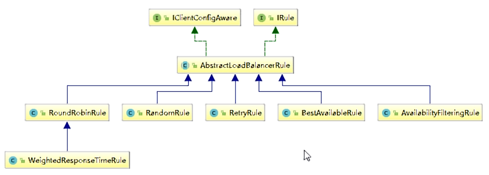

- com.netflix.loadbalancer.RoundRobinRule:轮询
- com.netflix.loadbalancer.RandomRule:随机
- com.netflix.loadbalancer.RetryRule: 先按照RoundRobinRule的策略获取服务，如果获取服务失败则在指定时间内会进行重试
- WeightedResponseTimeRule :对RoundRobinRule的扩展，响应速度越快的实例选择权重越大，越容易被选择
- BestAvailableRule :会先过滤掉由于多次访问故障而处于断路器跳闸状态的服务，然后选择一个并发量最小的服务
- AvailabilityFilteringRule : 先过滤掉故障实例，再选择并发较小的实例
- ZoneAvoidanceRule:  默认规则，复合判断server所在区域的性能和server的可用性选择服务器

### 8.3.2如何替换

- 修改cloud-consumer-order80

- 注意配置细节

  

- 新建package:com.atguigu.myrule

  

- 上面包下新建MySelfRule规则类

  ```java
  package com.xiyue.myrule;
  
  import com.netflix.loadbalancer.IRule;
  import com.netflix.loadbalancer.RandomRule;
  import org.springframework.context.annotation.Bean;
  import org.springframework.context.annotation.Configuration;
  
  @Configuration
  public class MySelfRule {
  
      @Bean
      public IRule myRule(){
          return new RandomRule();//定义为随机
      }
  }
  ```

- 主启动类添加@RibbonClient

  ```java
  package com.xiyue.cloud;
  
  import com.xiyue.myrule.MySelfRule;
  import org.springframework.boot.SpringApplication;
  import org.springframework.boot.autoconfigure.SpringBootApplication;
  import org.springframework.cloud.netflix.eureka.EnableEurekaClient;
  import org.springframework.cloud.netflix.ribbon.RibbonClient;
  
  @EnableEurekaClient
  @SpringBootApplication
  @RibbonClient(name = "CLOUD-PAYMENT-SERVICE",configuration = MySelfRule.class)
  public class OrderMain80 {
      public static void main(String[] args) {
          SpringApplication.run(OrderMain80.class,args);
      }
  }
  ```

  

- 测试:http://localhost/consumer/payment/get/31

## 8.4Ribbon负载均衡算法

- 原理

  

- RoundRobinRule源码

- 手写

  自己试着写一个本地负载均衡器试试

  -  7001/7002集群启动

  -   8001/8002微服务改造: controller

    ```java
    @GetMapping(value = "/payment/lb")
    public String getPaymentLB(){
        return serverPort;
    }
    ```

  -   80订单微服务改造

  ​    1.ApplicationContextBean去掉@LoadBalanced

  

  ​    2.LoadBalancer接口

  ```java
  package com.xiyue.cloud.lb;
  
  import org.springframework.cloud.client.ServiceInstance;
  
  import java.util.List;
  
  public interface LoadBalancer {
      //收集服务器总共有多少台能够提供服务的机器，并放到list里面
      ServiceInstance instances(List<ServiceInstance> serviceInstances);
  }
  ```

  ​    3.MyLB

  ```java
  package com.xiyue.cloud.lb;
  
  import org.springframework.cloud.client.ServiceInstance;
  import org.springframework.stereotype.Component;
  
  import java.util.List;
  import java.util.concurrent.atomic.AtomicInteger;
  
  @Component
  public class MyLB implements LoadBalancer {
      private AtomicInteger atomicInteger = new AtomicInteger(0);
      //坐标
      private final int getAndIncrement(){
          int current;
          int next;
          do {
              current = this.atomicInteger.get();
              next = current >= 2147483647 ? 0 : current + 1;
          }while (!this.atomicInteger.compareAndSet(current,next));  //第一个参数是期望值，第二个参数是修改值是
          System.out.println("*******第几次访问，次数next: "+next);
          return next;
      }
  
      @Override
      public ServiceInstance instances(List<ServiceInstance> serviceInstances) {  //得到机器的列表
          int index = getAndIncrement() % serviceInstances.size(); //得到服务器的下标位置
          return serviceInstances.get(index);
      }
  }
  ```

  ​    4.OrderController

  ```java
  package com.xiyue.cloud.controller;
  
  import com.xiyue.cloud.entities.CommonResult;
  import com.xiyue.cloud.entities.Payment;
  import com.xiyue.cloud.lb.LoadBalancer;
  import lombok.extern.slf4j.Slf4j;
  import org.springframework.cloud.client.ServiceInstance;
  import org.springframework.cloud.client.discovery.DiscoveryClient;
  import org.springframework.http.ResponseEntity;
  import org.springframework.web.bind.annotation.GetMapping;
  import org.springframework.web.bind.annotation.PathVariable;
  import org.springframework.web.bind.annotation.RestController;
  import org.springframework.web.client.RestTemplate;
  
  import javax.annotation.Resource;
  import java.net.URI;
  import java.util.List;
  
  @RestController
  @Slf4j
  public class OrderController {
  
      // public static final String PAYMENT_URL = "http://localhost:8001";
      public static final String PAYMENT_URL = "http://CLOUD-PAYMENT-SERVICE";
  
      @Resource
      private RestTemplate restTemplate;
  
      @Resource
      private LoadBalancer loadBalancer;
  
      @Resource
      private DiscoveryClient discoveryClient;
  
      @GetMapping("/consumer/payment/create")
      public CommonResult<Payment>   create( Payment payment){
          return restTemplate.postForObject(PAYMENT_URL+"/payment/create",payment,CommonResult.class);  //写操作
      }
  
      @GetMapping("/consumer/payment/get/{id}")
      public CommonResult<Payment> getPayment(@PathVariable("id") Long id){
          return restTemplate.getForObject(PAYMENT_URL+"/payment/get/"+id,CommonResult.class);
      }
  
      @GetMapping("/consumer/payment/getForEntity/{id}")
      public CommonResult<Payment> getPayment2(@PathVariable("id") Long id){
          ResponseEntity<CommonResult> entity = restTemplate.getForEntity(PAYMENT_URL+"/payment/get/"+id,CommonResult.class);
          if (entity.getStatusCode().is2xxSuccessful()){
              //  log.info(entity.getStatusCode()+"\t"+entity.getHeaders());
              return entity.getBody();
          }else {
              return new CommonResult<>(444,"操作失败");
          }
      }
  
      @GetMapping(value = "/consumer/payment/lb")
      public String getPaymentLB(){
          List<ServiceInstance> instances = discoveryClient.getInstances("CLOUD-PAYMENT-SERVICE");
          if (instances == null || instances.size() <= 0){
              return null;
          }
          ServiceInstance serviceInstance = loadBalancer.instances(instances);
          URI uri = serviceInstance.getUri();
          return restTemplate.getForObject(uri+"/payment/lb",String.class);
      }
  }
  ```

  ​    5.测试: http://localhost/consumer/payment/lb（8001与8002来回切换）

# 9.OpenFeign服务接口调用

## 9.1概述

- OpenFeign是什么

  

  

  Feign是一个声明式的web服务客户端，让编写web服务客户端变得非常容易，只需创建一个接口并在接口上添加注解即可
  GitHub: https://github.com/spring-cloud/spring-cloud-openfeign

- 能干嘛

  

- Feign和OpenFeign两者区别

  

## 9.2OpenFeign使用步骤

- 接口+注解:微服务调用接口+@FeignClient

- 新建cloud-consumer-feign-order80:Feign在消费端使用

  

- POM

  ```xml
  <?xml version="1.0" encoding="UTF-8"?>
  <project xmlns="http://maven.apache.org/POM/4.0.0"
           xmlns:xsi="http://www.w3.org/2001/XMLSchema-instance"
           xsi:schemaLocation="http://maven.apache.org/POM/4.0.0 http://maven.apache.org/xsd/maven-4.0.0.xsd">
      <parent>
          <artifactId>cloud2020</artifactId>
          <groupId>com.xiyue.cloud</groupId>
          <version>1.0-SNAPSHOT</version>
      </parent>
      <modelVersion>4.0.0</modelVersion>
  
      <artifactId>cloud-consumer-feign-order80</artifactId>
      <!--openfeign-->
      <dependencies>
          <dependency>
              <groupId>com.xiyue.cloud</groupId>
              <artifactId>cloud-api-commons</artifactId>
              <version>${project.version}</version>
          </dependency>
          <dependency>
              <groupId>org.springframework.cloud</groupId>
              <artifactId>spring-cloud-starter-openfeign</artifactId>
          </dependency>
          <dependency>
              <groupId>org.springframework.cloud</groupId>
              <artifactId>spring-cloud-starter-netflix-eureka-client</artifactId>
          </dependency>
          <dependency>
              <groupId>org.springframework.boot</groupId>
              <artifactId>spring-boot-starter-web</artifactId>
          </dependency>
  
          <dependency>
              <groupId>org.springframework.boot</groupId>
              <artifactId>spring-boot-starter-actuator</artifactId>
          </dependency>
  
          <dependency>
              <groupId>org.springframework.boot</groupId>
              <artifactId>spring-boot-devtools</artifactId>
              <scope>runtime</scope>
              <optional>true</optional>
          </dependency>
  
          <dependency>
              <groupId>org.projectlombok</groupId>
              <artifactId>lombok</artifactId>
              <optional>true</optional>
          </dependency>
          <dependency>
              <groupId>org.springframework.boot</groupId>
              <artifactId>spring-boot-starter-test</artifactId>
              <scope>test</scope>
          </dependency>
      </dependencies>
  </project>
  ```

- YML(application.yml)

  ```yml
  server:
    port: 80
  eureka:
    client:
      register-with-eureka: false
      service-url:
        defaultZone: http://eureka7001.com:7001/eureka, http://eureka7002.com:7002/eureka
  ```

- 主启动类( @EnableFeignClients)

  ```java
  package com.xiyue.cloud;
  
  import org.springframework.boot.SpringApplication;
  import org.springframework.boot.autoconfigure.SpringBootApplication;
  import org.springframework.cloud.openfeign.EnableFeignClients;
  
  @SpringBootApplication
  @EnableFeignClients
  public class OrderFegin80 {
  
      public static void main(String[] args) {
          SpringApplication.run(OrderFegin80.class,args);
      }
  }
  ```

- 业务类

  - 业务逻辑接口+@FeignClient配置调用provider服务

  - 新建PaymentFeignService接口并新增注解@FeignClient

    ```java
    package com.xiyue.cloud.service;
    
    import com.xiyue.cloud.entities.CommonResult;
    import org.springframework.cloud.openfeign.FeignClient;
    import org.springframework.stereotype.Component;
    import org.springframework.web.bind.annotation.GetMapping;
    import org.springframework.web.bind.annotation.PathVariable;
    
    @Component
    @FeignClient(value = "CLOUD-PAYMENT-SERVICE")
    public interface PaymentFeignService {
    
        @GetMapping(value = "/payment/get/{id}")
        public CommonResult getPaymentById(@PathVariable("id") Long id);
    }
    
    ```

  - 控制层Controller

    ```java
    package com.xiyue.cloud.controller;
    
    import com.xiyue.cloud.entities.CommonResult;
    import com.xiyue.cloud.entities.Payment;
    import com.xiyue.cloud.service.PaymentFeignService;
    import org.springframework.web.bind.annotation.GetMapping;
    import org.springframework.web.bind.annotation.PathVariable;
    import org.springframework.web.bind.annotation.RestController;
    
    import javax.annotation.Resource;
    
    @RestController
    public class OrderFeignController {
    
        @Resource
        private PaymentFeignService paymentFeignService;
    
        @GetMapping(value = "/consumer/payment/get/{id}")
        public CommonResult<Payment> getPaymentById(@PathVariable("id") Long id){
            return paymentFeignService.getPaymentById(id);
        }
    
    ```

- 测试

  

  - 先启动2个eureka集群7001/7002

  - 再启动2个微服务8001/8002

  - 启动OpenFeign启动

  - http://localhost/consumer/payment/get/31

  - Feign自带负载均衡配置项

- 小总结

  

## 9.3OpenFeign超时控制

- 超时设置，故意设置超时演示出错情况

  - 服务提供方8001故意写暂停程序

    ```java
    @GetMapping(value = "/payment/feign/timeout")
    public String paymentFeignTimeout(){
        try { TimeUnit.SECONDS.sleep(3); }catch (Exception e) {e.printStackTrace();}
        return serverPort;
    }
    ```

  - 服务消费方80添加超时方法PaymentFeignService

    ```java
    @GetMapping(value = "/consumer/payment/feign/timeout")
    public String paymentFeignTimeout(){
       return paymentFeignService.paymentFeignTimeout();
    }
    ```

  - 服务消费方80添加超时方法OrderFeignController

    ```java
    @GetMapping(value = "/consumer/payment/feign/timeout")
    public String paymentFeignTimeout(){
       return paymentFeignService.paymentFeignTimeout();
    }
    ```

  - 测试

    - http://localhost/consumer/payment/feign/timeout

    - 错误页面

      

- OpenFeign默认等待一秒钟，超过后报错

- 是什么

  

  - OpenFeign默认支持Ribbon

    

- YML文件里需要开启OpenFeign客户端超时控制

  ```yml
  ribbon:
    ReadTimeout:  5000
    ConnectTimeout: 5000
  ```

### 9.4OpenFeign日志打印功能

- 日志打印功能

- 是什么

  

- 日志级别

  

- 配置日志bean

  ```java
  package com.xiyue.cloud.config;
  
  import feign.Logger;
  import org.springframework.context.annotation.Bean;
  import org.springframework.context.annotation.Configuration;
  
  @Configuration
  public class FeignConfig {
  
      @Bean
      Logger.Level feignLoggerLevel(){
          return Logger.Level.FULL;
      }
  }
  ```

- YML文件里需要开启日志的Feign客户端

  ```yml
  logging:
    level:
      com.xiyue.cloud.service.PaymentFeignService: debug
  ```

- 后台日志查看

# 10.Hystrix断路器

## 10.1概述

- 分布式系统面临的问题

  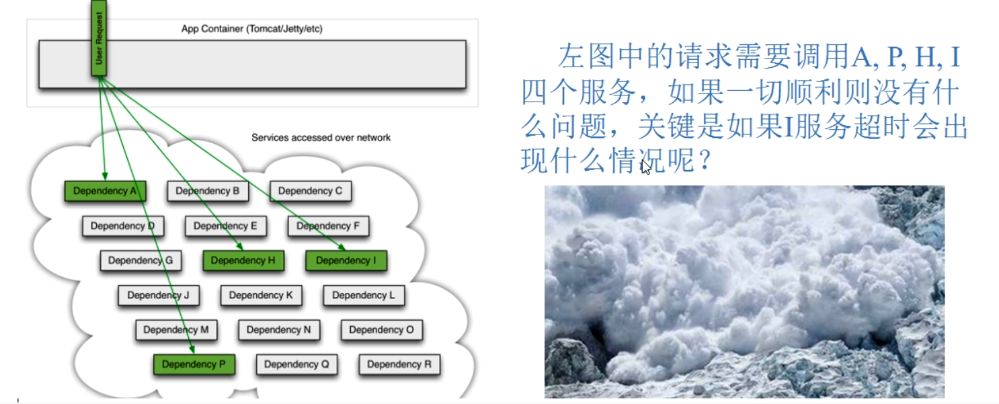

  

  

- 是什么

  

- 能干嘛

  - 服务降级

  - 服务熔断

  - 接近实时的监控

  - 。。。。。

- 官网资料:https://github.com/Netflix/Hystrix/wiki/How-To-Use

- Hystrix官宣，停更进维

  https://github.com/Netflix/Hystrix

  

  -   被动修复bugs

  -   不再接受合并请求

  -   不再发布新版本

## 10.2Hystrix重要概念

- 服务降级

  -   服务器忙，请稍候再试，不让客户端等待并立刻返回一个友好提示，fallback

  -   哪些情况会触发降级

    - ​    程序运行异常

    - ​    超时

    - ​    服务熔断触发服务降级

    - ​    线程池/信号量打满也会导致服务降级

- 服务熔断

  -   类比保险丝达到最大服务访问后，直接拒绝访问，拉闸限电，然后调用服务降级的方法并返回友好提示

  -   就是保险丝：服务的降级->进而熔断->恢复调用链路

- 服务限流:秒杀高并发等操作，严禁一窝蜂的过来拥挤，大家排队，一秒钟N个，有序进行

## 10.3hystrix案例

- 构建

  - 新建cloud-provider-hystrix-payment8001

  - POM

    ```xml
    <?xml version="1.0" encoding="UTF-8"?>
    <project xmlns="http://maven.apache.org/POM/4.0.0"
             xmlns:xsi="http://www.w3.org/2001/XMLSchema-instance"
             xsi:schemaLocation="http://maven.apache.org/POM/4.0.0 http://maven.apache.org/xsd/maven-4.0.0.xsd">
        <parent>
            <artifactId>cloud2020</artifactId>
            <groupId>com.xiyue.cloud</groupId>
            <version>1.0-SNAPSHOT</version>
        </parent>
        <modelVersion>4.0.0</modelVersion>
    
        <artifactId>cloud-provider-hystrix-payment8001</artifactId>
    
        <dependencies>
            <!--新增hystrix-->
            <dependency>
                <groupId>org.springframework.cloud</groupId>
                <artifactId>spring-cloud-starter-netflix-hystrix</artifactId>
            </dependency>
            <dependency>
                <groupId>org.springframework.cloud</groupId>
                <artifactId>spring-cloud-starter-netflix-eureka-client</artifactId>
            </dependency>
            <dependency>
                <groupId>com.xiyue.cloud</groupId>
                <artifactId>cloud-api-commons</artifactId>
                <version>${project.version}</version>
            </dependency>
            <dependency>
                <groupId>org.springframework.boot</groupId>
                <artifactId>spring-boot-starter-web</artifactId>
            </dependency>
            <dependency>
                <groupId>org.springframework.boot</groupId>
                <artifactId>spring-boot-starter-actuator</artifactId>
            </dependency>
            <dependency>
                <groupId>org.springframework.boot</groupId>
                <artifactId>spring-boot-devtools</artifactId>
                <scope>runtime</scope>
                <optional>true</optional>
            </dependency>
    
            <dependency>
                <groupId>org.projectlombok</groupId>
                <artifactId>lombok</artifactId>
                <optional>true</optional>
            </dependency>
            <dependency>
                <groupId>org.springframework.boot</groupId>
                <artifactId>spring-boot-starter-test</artifactId>
                <scope>test</scope>
            </dependency>
        </dependencies>
    
    </project>
    ```

  - YML(application.yml)

    ```yml
    server:
      port: 8001
    
    eureka:
      client:
        register-with-eureka: true    #表识不向注册中心注册自己
        fetch-registry: true   #表示自己就是注册中心，职责是维护服务实例，并不需要去检索服务
        service-url:
          # defaultZone: http://eureka7002.com:7002/eureka/    #设置与eureka server交互的地址查询服务和注册服务都需要依赖这个地址
          defaultZone: http://eureka7001.com:7001/eureka/
    #  server:
    #    enable-self-preservation: false
    spring:
      application:
        name: cloud-provider-hystrix-payment
      #    eviction-interval-timer-in-ms: 2000
    ```

  - 主启动

    ```java
    package com.xiyue.cloud;
    
    import org.springframework.boot.SpringApplication;
    import org.springframework.boot.autoconfigure.SpringBootApplication;
    import org.springframework.cloud.netflix.eureka.EnableEurekaClient;
    
    @SpringBootApplication
    @EnableEurekaClient
    public class PaymentHystrixMain8001 {
        public static void main(String[] args) {
            SpringApplication.run(PaymentHystrixMain8001.class,args);
        }
    }
    ```

  - 业务类

    - service

      ```java
      package com.xiyue.cloud.service;
      
      import org.springframework.stereotype.Service;
      
      import java.util.concurrent.TimeUnit;
      
      @Service
      public class PaymentService {
      
          //成功
          public String paymentInfo_OK(Integer id){
              return "线程池："+Thread.currentThread().getName()+"   paymentInfo_OK,id：  "+id+"\t"+"哈哈哈"  ;
          }
      
          //失败
          public String paymentInfo_TimeOut(Integer id){
              int timeNumber = 3;
              try { TimeUnit.SECONDS.sleep(timeNumber); }catch (Exception e) {e.printStackTrace();}
              return "线程池："+Thread.currentThread().getName()+"   paymentInfo_TimeOut,id：  "+id+"\t"+"呜呜呜"+" 耗时(秒)"+timeNumber;
          }
      
      }
      ```

    - controller

      ```java
      package com.xiyue.cloud.service;
      
      import org.springframework.stereotype.Service;
      
      import java.util.concurrent.TimeUnit;
      
      @Service
      public class PaymentService {
      
          //成功
          public String paymentInfo_OK(Integer id){
              return "线程池："+Thread.currentThread().getName()+"   paymentInfo_OK,id：  "+id+"\t"+"哈哈哈"  ;
          }
      
          //失败
          public String paymentInfo_TimeOut(Integer id){
              int timeNumber = 3;
              try { TimeUnit.SECONDS.sleep(timeNumber); }catch (Exception e) {e.printStackTrace();}
              return "线程池："+Thread.currentThread().getName()+"   paymentInfo_TimeOut,id：  "+id+"\t"+"呜呜呜"+" 耗时(秒)"+timeNumber;
          }
      
      }
      ```

  - 正常测试

    - 启动eureka7001

    - 启动cloud-provider-hystrix-payment8001

    - 访问
        访问:http://localhost:8001/payment/hystrix/ok/31
        每次调用耗费5秒钟:http://localhost:8001/payment/hystrix/timeout/31

    - 上述module均OK:以上述为根基平台，从正确->错误->降级熔断->恢复

- 高并发测试

  - 上述在非高并发情形下，还能勉强满足   but.....

  - Jmeter压测测试

    -   开启Jmeter，来20000个并发压死8001，20000个请求都去访问paymentInfo_TimeOut服务

      

    -   再来一个访问
          http://localhost:8001/payment/hystrix/ok/31
          http://localhost:8001/payment/hystrix/timeout/31

    -   看演示结果
      - 两个都在自己转圈圈
      - 为什么会被卡死(tomcat的默认的工作线程数被打满了，没有多余的线程来分解压力和处理。)

  - Jmeter压测结论
    上面还是服务提供者8001自己测试，假如此时外部的消费者80也来访问，那消费者只能干等，最终导致消费端80不满意，服务端8001直接被拖死

  - 看热闹不嫌弃事大，80新建加入:cloud-consumer-feign-hystrix-order80

    - 新建cloud-consumer-feign-hystrix-order80

    - POM

      ```xml
      <?xml version="1.0" encoding="UTF-8"?>
      <project xmlns="http://maven.apache.org/POM/4.0.0"
               xmlns:xsi="http://www.w3.org/2001/XMLSchema-instance"
               xsi:schemaLocation="http://maven.apache.org/POM/4.0.0 http://maven.apache.org/xsd/maven-4.0.0.xsd">
          <parent>
              <artifactId>cloud2020</artifactId>
              <groupId>com.xiyue.cloud</groupId>
              <version>1.0-SNAPSHOT</version>
          </parent>
          <modelVersion>4.0.0</modelVersion>
      
          <artifactId>cloud-consumer-feign-hystrix-order80</artifactId>
      
          <dependencies>
              <!--新增hystrix-->
              <dependency>
                  <groupId>org.springframework.cloud</groupId>
                  <artifactId>spring-cloud-starter-netflix-hystrix</artifactId>
              </dependency>
              <dependency>
                  <groupId>org.springframework.cloud</groupId>
                  <artifactId>spring-cloud-starter-openfeign</artifactId>
              </dependency>
              <dependency>
                  <groupId>org.springframework.cloud</groupId>
                  <artifactId>spring-cloud-starter-netflix-eureka-client</artifactId>
              </dependency>
              <dependency>
                  <groupId>com.xiyue.cloud</groupId>
                  <artifactId>cloud-api-commons</artifactId>
                  <version>${project.version}</version>
              </dependency>
              <dependency>
                  <groupId>org.springframework.boot</groupId>
                  <artifactId>spring-boot-starter-web</artifactId>
              </dependency>
      
              <dependency>
                  <groupId>org.springframework.boot</groupId>
                  <artifactId>spring-boot-starter-actuator</artifactId>
              </dependency>
      
              <dependency>
                  <groupId>org.springframework.boot</groupId>
                  <artifactId>spring-boot-devtools</artifactId>
                  <scope>runtime</scope>
                  <optional>true</optional>
              </dependency>
      
              <dependency>
                  <groupId>org.projectlombok</groupId>
                  <artifactId>lombok</artifactId>
                  <optional>true</optional>
              </dependency>
              <dependency>
                  <groupId>org.springframework.boot</groupId>
                  <artifactId>spring-boot-starter-test</artifactId>
                  <scope>test</scope>
              </dependency>
          </dependencies>
      </project>
      ```

    - YML(application.yml)

      ```yml
      server:
       port: 80
       
      eureka:
        client:
          register-with-eureka: true    #表识不向注册中心注册自己
          fetch-registry: true   #表示自己就是注册中心，职责是维护服务实例，并不需要去检索服务
          service-url:
            defaultZone: http://eureka7001.com:7001/eureka/
      
      spring:
        application:
          name: cloud-provider-hystrix-order
      ```

    - 主启动

      ```java
      package com.xiyue.cloud;
      
      import org.springframework.boot.SpringApplication;
      import org.springframework.boot.autoconfigure.SpringBootApplication;
      import org.springframework.cloud.openfeign.EnableFeignClients;
      
      @SpringBootApplication
      @EnableFeignClients
      public class OrderHystrixMain80 {
          public static void main(String[] args) {
              SpringApplication.run(OrderHystrixMain80.class,args);
          }
      }
      ```

    - 业务类

      -  PaymentHystrixService

        ```java
        package com.xiyue.cloud.service;
        
        import org.springframework.cloud.openfeign.FeignClient;
        import org.springframework.stereotype.Component;
        import org.springframework.web.bind.annotation.GetMapping;
        import org.springframework.web.bind.annotation.PathVariable;
        
        @Component
        @FeignClient(value = "CLOUD-PROVIDER-HYSTRIX-PAYMENT")
        public interface PaymentHystrixService {
            @GetMapping("/payment/hystrix/ok/{id}")
            public String paymentInfo_OK(@PathVariable("id") Integer id);
        
            @GetMapping("/payment/hystrix/timeout/{id}")
            public String paymentInfo_TimeOut(@PathVariable("id") Integer id);
        }
        ```

      -  OrderHystrixController

        ```java
        package com.xiyue.cloud.controller;
        
        import com.xiyue.cloud.service.PaymentHystrixService;
        import lombok.extern.slf4j.Slf4j;
        import org.springframework.beans.factory.annotation.Value;
        import org.springframework.web.bind.annotation.GetMapping;
        import org.springframework.web.bind.annotation.PathVariable;
        import org.springframework.web.bind.annotation.RestController;
        
        import javax.annotation.Resource;
        
        @RestController
        @Slf4j
        public class OrderHystrixController {
        
            @Resource
            private PaymentHystrixService paymentHystrixService;
        
            @Value("${server.port}")
            private String serverPort;
        
            @GetMapping("/consumer/payment/hystrix/ok/{id}")
            public String paymentInfo_OK(@PathVariable("id") Integer id){
                String result = paymentHystrixService.paymentInfo_OK(id);
                log.info("*******result:"+result);
                return result;
            }
            @GetMapping("/consumer/payment/hystrix/timeout/{id}")
            public String paymentInfo_TimeOut(@PathVariable("id") Integer id){
                String result = paymentHystrixService.paymentInfo_TimeOut(id);
                log.info("*******result:"+result);
                return result;
            }
        
        }
        ```

    - 正常测试
       http://localhost/consumer/payment/hystrix/ok/31

    - 高并发测试

      -  2W个线程压8001
      -   消费端80微服务再去访问正常的OK微服务8001地址
      -   http://localhost/consumer/payment/hystrix/timeout/31
      -   消费者80，呜呜呜
        - 要么转圈圈等待
        - 要么消费端报超时错误

- 故障现象和导致原因

  - 8001同一层次的其他接口服务被困死，因为tomcat线程里面的工作线程已经被挤占完毕
  - 80此时调用8001，客户端访问响应缓慢，转圈圈

- 上诉结论

  - 正因为有上述故障或不佳表现，才有我们的降级/容错/限流等技术诞生

- 如何解决？解决的要求

  - 超时导致服务器变慢（转圈）超时不再等待
  - 出错（宕机或程序运行出错）出错要有兜底
  - 解决
    -  对方服务（8001）超时了，调用者（80）不能一直卡死等待，必须有服务降级

    - 对方服务（8001）down机了，调用者（80）不能一直卡死等待，必须有服务降级

    - 对方服务（8001）OK，调用者（80）自己出故障或有自我要求（自己的等待时间小于服务提供者），自己处理降级

- 服务降级

  - 降低配置:@HystrixCommand

  - 8001先从自身找问题:设置自身调用超时时间的峰值，峰值内可以正常运行，超过了需要有兜底的方法处理，作服务降级fallback

  - 8001fallback

    - 业务类启用：@HystrixCommand报异常后如何处理

      -  一旦调用服务方法失败并抛出了错误信息后，会自动调用@HystrixCommand标注好的fallbackMethod调用类中的指定方法

      -   图示

        

    - 主启动类激活：添加新注解@EnableCircuitBreaker

  - 80fallback

    - 80订单微服务，也可以更好的保护自己，自己也依样画葫芦进行客户端降级保护

    - 题外话，切记:我们自己配置过的热部署方式对java代码的改动明显，但对@HystrixCommand内属性的修改建议重启微服务

    - YML

      ```yml
      feign:
        hystrix:
          enabled: true #如果处理自身的容错就开启。开启方式与生产端不一
      ```

    - 主启动 @EnableHystrix

    - 业务类

      ```java
      
      @GetMapping("/consumer/payment/hystrix/timeout/{id}")
      @HystrixCommand(fallbackMethod = "paymentTimeOutFallbackMethod",commandProperties = {
              @HystrixProperty(name = "execution.isolation.thread.timeoutInMilliseconds",value = "1500")  //3秒钟以内就是正常的业务逻辑
      })
      public String paymentInfo_TimeOut(@PathVariable("id") Integer id){
          String result = paymentHystrixService.paymentInfo_TimeOut(id);
          return result;
      }
      
      //兜底方法
      public String paymentTimeOutFallbackMethod(@PathVariable("id") Integer id){
          return "我是消费者80，对付支付系统繁忙请10秒钟后再试或者自己运行出错请检查自己,(┬＿┬)";
      }
      ```

  - 目前问题

    - 每个业务方法对应一个兜底的方法，代码膨胀
    - 统一和自定义的分开

  - 解决问题

    - 每个方法配置一个？？？膨胀

      - feign接口系列

      -  @DefaultProperties(defaultFallback = "")

        

         

        说明

        

      -  controller配置

        ```java
        package com.xiyue.cloud.controller;
        
        
        import com.netflix.hystrix.contrib.javanica.annotation.DefaultProperties;
        import com.netflix.hystrix.contrib.javanica.annotation.HystrixCommand;
        import com.xiyue.cloud.service.PaymentHystrixService;
        import lombok.extern.slf4j.Slf4j;
        import org.springframework.web.bind.annotation.GetMapping;
        import org.springframework.web.bind.annotation.PathVariable;
        import org.springframework.web.bind.annotation.RestController;
        
        import javax.annotation.Resource;
        
        @RestController
        @Slf4j
        @DefaultProperties(defaultFallback = "payment_Global_FallbackMethod")  //全局的
        public class OrderHystrixController {
        
            @Resource
            private PaymentHystrixService paymentHystrixService;
        
            @GetMapping("/consumer/payment/hystrix/ok/{id}")
            public String paymentInfo_OK(@PathVariable("id") Integer id){
                String result = paymentHystrixService.paymentInfo_OK(id);
                return result;
            }
        
        //    @GetMapping("/consumer/payment/hystrix/timeout/{id}")
        //    public String paymentInfo_TimeOut(@PathVariable("id") Integer id){
        //        String result = paymentHystrixService.paymentInfo_TimeOut(id);
        //        return result;
        //    }
        
            @GetMapping("/consumer/payment/hystrix/timeout/{id}")
        //    @HystrixCommand(fallbackMethod = "paymentTimeOutFallbackMethod",commandProperties = {
        //            @HystrixProperty(name = "execution.isolation.thread.timeoutInMilliseconds",value = "1500")  //1.5秒钟以内就是正常的业务逻辑
        //    })
            @HystrixCommand
            public String paymentInfo_TimeOut(@PathVariable("id") Integer id){
                int age = 10/0;
                String result = paymentHystrixService.paymentInfo_TimeOut(id);
                return result;
            }
        
            //兜底方法
            public String paymentTimeOutFallbackMethod(@PathVariable("id") Integer id){
                return "我是消费者80，对付支付系统繁忙请10秒钟后再试或者自己运行出错请检查自己,(┬＿┬)";
            }
        
            //下面是全局fallback方法
            public String payment_Global_FallbackMethod(){
                return "Global异常处理信息，请稍后再试,(┬＿┬)";
            }
        }
        ```

    - 和业务逻辑混一起？？？混乱

      - 服务降级，客户端去调用服务端，碰上服务端宕机或关闭

      - 本次案例服务降级处理是在客户端80实现完成的，与服务端8001没有关系，只需要为Feign客户端定义的接口添加一个服务降级处理的实现类即可实现解耦

      - 未来我们要面对的异常

        - 运行    
        - 超时
        - 宕机

      - 再看我们的业务类PaymentController

        

      - 修改cloud-consumer-feign-hystrix-order80

      - 根据cloud-consumer-feign-hystrix-order80已经有的PaymentHystrixService接口，重新新建一个类（PaymentFallbackService）实现该接口，统一为接口里面的方法进行异常处理

      - PaymentFallbackService类实现PaymentFeignClientService接口

        ```java
        package com.xiyue.cloud.service;
        
        import org.springframework.stereotype.Component;
        
        @Component
        public class PaymentFallbackService implements PaymentHystrixService {
            
            @Override
            public String paymentInfo_OK(Integer id) {
                return "-----PaymentFallbackService fall back-paymentInfo_OK , (┬＿┬)";
            }
        
            @Override
            public String paymentInfo_TimeOut(Integer id) {
                return "-----PaymentFallbackService fall back-paymentInfo_TimeOut , (┬＿┬)";
            }
        }
        ```
      
      - YML(application.yml)
      
        ```yml
        feign:
          hystrix:
            enabled: true #如果处理自身的容错就开启。开启方式与生产端不一样。
        ```
      
      - PaymentFeignClientService接口
      
        ```java
        package com.xiyue.cloud.service;
        
        import org.springframework.cloud.openfeign.FeignClient;
        import org.springframework.stereotype.Component;
        import org.springframework.web.bind.annotation.GetMapping;
        import org.springframework.web.bind.annotation.PathVariable;
        
        @Component
        @FeignClient(value = "CLOUD-PROVIDER-HYSTRIX-PAYMENT",fallback = PaymentFallbackService.class)
        public interface PaymentHystrixService {
            @GetMapping("/payment/hystrix/ok/{id}")
            public String paymentInfo_OK(@PathVariable("id") Integer id);
        
            @GetMapping("/payment/hystrix/timeout/{id}")
            public String paymentInfo_TimeOut(@PathVariable("id") Integer id);
        }
        ```
      
      -  测试
      
        - 单个eureka先启动7001    
        -  PaymentHystrixMain8001启动
        - 正常访问测试:http://localhost/consumer/payment/hystrix/ok/31
        - 故意关闭微服务8001
        - 客户端自己调用提升
                此时服务端provider已经down了，但是我们做了服务降级处理，让客户端在服务端不可用时也会获得提示信息而不会挂起耗死服务器

- 服务熔断

  - 断路器:一句话就是家里保险丝

  - 熔断是什么

    

    大神论文
      https://martinfowler.com/bliki/CircuitBreaker.html

  - 实操

    - 修改cloud-provider-hystrix-payment8001

    - PaymentService

      ```java
      //服务熔断
      @HystrixCommand(fallbackMethod = "paymentCircuitBreaker_fallback",commandProperties = {
              @HystrixProperty(name = "circuitBreaker.enabled",value = "true"),  //是否开启断路器
              @HystrixProperty(name = "circuitBreaker.requestVolumeThreshold",value = "10"),   //请求次数
              @HystrixProperty(name = "circuitBreaker.sleepWindowInMilliseconds",value = "10000"),  //时间范围
              @HystrixProperty(name = "circuitBreaker.errorThresholdPercentage",value = "60"), //失败率达到多少后跳闸
      })
      public String paymentCircuitBreaker(@PathVariable("id") Integer id){
          if (id < 0){
              throw new RuntimeException("*****id 不能负数");
          }
          String serialNumber = IdUtil.simpleUUID();
      
          return Thread.currentThread().getName()+"\t"+"调用成功,流水号："+serialNumber;
      }
      public String paymentCircuitBreaker_fallback(@PathVariable("id") Integer id){
          return "id 不能负数，请稍候再试,(┬＿┬)/~~     id: " +id;
      }
      ```

      - why配置这些参数

        

    - PaymentController

      ```java
      //===服务熔断
      @GetMapping("/payment/circuit/{id}")
      public String paymentCircuitBreaker(@PathVariable("id") Integer id){
          String result = paymentService.paymentCircuitBreaker(id);
          log.info("*******result:"+result);
          return result;
      }
      ```

    - 测试

      - 自测cloud-provider-hystrix-payment8001

      -  正确:http://localhost:8001/payment/circuit/31
      -   错误:http://localhost:8001/payment/circuit/-31
      -   一次正确一次错误trytry
      -   重点测试:多次错误,然后慢慢正确，发现刚开始不满足条件，就算是正确的访问地址也不能进行访问，需要慢慢的恢复链路

  - 原理（小总结）

    - 大神结论

      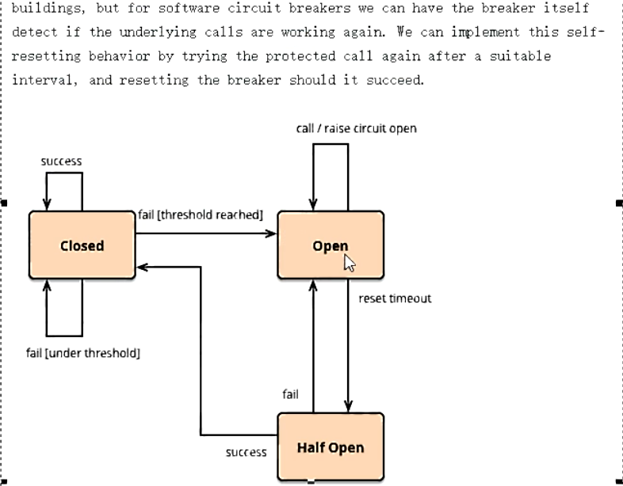

    - 熔断类型

      - 熔断打开
        请求不再进行调用当前服务，内部设置时钟一般为MTTR(平均故障处理时间)，当打开时长达到所设时钟则进入熔断状态
      - 熔断关闭
         熔断关闭不会对服务进行熔断
      - 熔断半开
         部分请求根据规则调用当前服务，如果请求成功且符合规则则认为当前服务恢复正常，关闭熔断

    - 官网断路器流程图

      - 官网步骤

        

      -   断路器在什么情况下开始起作用

        

      -  断路器开启或者关闭的条件

        - 当满足一定阀值的时候（默认10秒内超过20个请求次数）    
        - 当失败率达到一定的时候（默认10秒内超过50%请求失败）    
        - 到达以上阀值，断路器将会开启    
        - 当开启的时候，所有请求都不会进行转发

        -  一段时间之后（默认是5秒），这个时候断路器是半开状态，会让其中一个请求进行转发。如果成功，断路器会关闭，若失败，继续开启。重复4和5

      - 断路器打开之后

        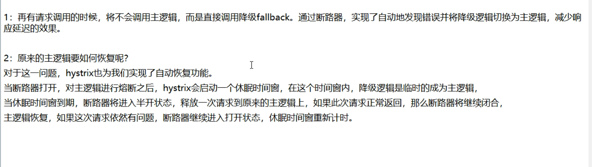

      - All配置

        

- 服务限流:后面高级篇讲解alibaba的Sentinel说明

## 10.4hystrix工作流程

- https://github.com/Netflix/Hystrix/wiki/How-it-Works

- hystrix工作流程

  - 官网图例

  - 步骤说明

    

## 10.5服务监控hystrixDashboard

## 10.1概述


## 10.2仪表盘9001

- 新建cloud-consumer-hystrix-dashboard9001

- POM

  ```xml
  <?xml version="1.0" encoding="UTF-8"?>
  <project xmlns="http://maven.apache.org/POM/4.0.0"
           xmlns:xsi="http://www.w3.org/2001/XMLSchema-instance"
           xsi:schemaLocation="http://maven.apache.org/POM/4.0.0 http://maven.apache.org/xsd/maven-4.0.0.xsd">
      <parent>
          <artifactId>cloud2020</artifactId>
          <groupId>com.xiyue.cloud</groupId>
          <version>1.0-SNAPSHOT</version>
      </parent>
      <modelVersion>4.0.0</modelVersion>
  
      <artifactId>cloud-consumer-hystrix-dashboard9001</artifactId>
      <dependencies>
          <!--新增hystrix dashboard-->
          <dependency>
              <groupId>org.springframework.cloud</groupId>
              <artifactId>spring-cloud-starter-netflix-hystrix-dashboard</artifactId>
          </dependency>
          <dependency>
              <groupId>org.springframework.boot</groupId>
              <artifactId>spring-boot-starter-actuator</artifactId>
          </dependency>
  
          <dependency>
              <groupId>org.springframework.boot</groupId>
              <artifactId>spring-boot-devtools</artifactId>
              <scope>runtime</scope>
              <optional>true</optional>
          </dependency>
  
          <dependency>
              <groupId>org.projectlombok</groupId>
              <artifactId>lombok</artifactId>
              <optional>true</optional>
          </dependency>
          <dependency>
              <groupId>org.springframework.boot</groupId>
              <artifactId>spring-boot-starter-test</artifactId>
              <scope>test</scope>
          </dependency>
      </dependencies>
  
  </project>
  ```

- YML（application.yml）

  ```yml
  server:
    port: 9001
  ```

- HystrixDashboardMain9001+新注解@EnableHystrixDashboard

  

- 所有Provider微服务提供类（8001/8002/8003）都需要监控依赖配置

- 启动cloud-consumer-hystrix-dashboard9001该微服务后续将监控微服务8001：http://localhost:9001/hystrix

## 10.3断路器演示

- 修改cloud-provider-hystrix-payment8001

  - 注意：新版本Hystrix需要在主启动类MainAppHystrix8001中指定监控路径    

    ```java
    @Bean
    public ServletRegistrationBean getServlet(){
        HystrixMetricsStreamServlet streamServlet = new HystrixMetricsStreamServlet();
        ServletRegistrationBean registrationBean = new ServletRegistrationBean(streamServlet);
        registrationBean.setLoadOnStartup(1);
        registrationBean.addUrlMappings("/hystrix.stream");
        registrationBean.setName("HystrixMetricsStreamServlet");
        return registrationBean;
    }
    ```

    

  - Unable to connect to Command Metric Stream

  - 404

- 监控测试    

  - 启动1个eureka或者3个eureka集群均可    

  - 观察监控窗

    - 9001监控8001 

      - 填写监控地址  
      - http://localhost:8001/hystrix.stream

    - 测试地址        

      - http://localhost:8001/payment/circuit/31

      - http://localhost:8001/payment/circuit/-31

      - 上述测试通过：ok        

      - 先访问正确地址，再访问错误地址，再正确地址，会发现图示断路器都是慢慢放开的

        - 监控结果，成功

                    

        - 监控结果，失败

          

    - 如何看 

      - 7色

      - 1圈

        

      - 1线

        

      -  整图说明

        

        

      -  整图说明2      

        

    - 搞懂一个才能看懂复杂的

      

# 11.zuul路由网关（没讲）

# 12.Gateway新一代网关

## 12.1概述简介

- 官网

  - 上一代zuul1.x： https://github.com/Netflix/zuul/wiki
  - 当前gateway：https://cloud.spring.io/spring-cloud-static/spring-cloud-gateway/2.2.1.RELEASE/reference/html/

- 是什么

  

  

  - 概述

    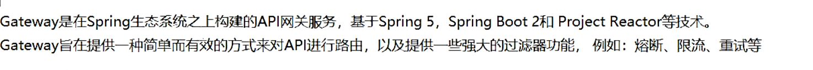

    

    

  - 一句话

    - Spring Cloud Gateway 使用的Webflux中的reactor-netty响应式编程组件，底层使用了Netty通讯框架

    - 源码架构

      

- 能干嘛

  - 反向代理
  - 鉴权
  - 流量控制
  - 熔断
  - 日志监控
  - 。。。。。。

- 微服务架构中网关在哪里

  

- 有了Zuul了怎么又出来了gateway

  - 我们为什么选择Gatway?

    - 1.neflix不太靠谱，zuul2.0一直跳票,迟迟不发布

      

    - 2.SpringCloud Gateway具有如下特性

      

    - 3.SpringCloud Gateway与Zuul的区别

      

  - Zuul1.x模型

    

    

  - GateWay模型

    WebFlux是什么？

    

    

    说明

    

## 12.2三大核心概念

- Route(路由):路由是构建网关的基本模块，它由ID，目标URI，一系列的断言和过滤器组成，如果断言为true则匹配该路由

- Predicate（断言）:参考的是java8的java.util.function.Predicate开发人员可以匹配HTTP请求中的所有内容（例如请求头或请求参数），如果请求与断言相匹配则进行路由

- Filter(过滤):指的是Spring框架中GatewayFilter的实例，使用过滤器，可以在请求被路由前或者之后对请求进行修改。

- 总体

  

## 12.3Gateway工作流程

- 官网总结

  

  

- 核心逻辑:路由转发+执行过滤器链

## 12.4入门配置（新建Module）

- cloud-gateway-gateway9527

- POM

  ```xml
  <?xml version="1.0" encoding="UTF-8"?>
  <project xmlns="http://maven.apache.org/POM/4.0.0"
           xmlns:xsi="http://www.w3.org/2001/XMLSchema-instance"
           xsi:schemaLocation="http://maven.apache.org/POM/4.0.0 http://maven.apache.org/xsd/maven-4.0.0.xsd">
      <parent>
          <artifactId>cloud2020</artifactId>
          <groupId>com.xiyue.cloud</groupId>
          <version>1.0-SNAPSHOT</version>
      </parent>
      <modelVersion>4.0.0</modelVersion>
  
      <artifactId>cloud-gateway-gateway9527</artifactId>
      <dependencies>
          <!--新增gateway-->
          <dependency>
              <groupId>org.springframework.cloud</groupId>
              <artifactId>spring-cloud-starter-gateway</artifactId>
          </dependency>
          <dependency>
              <groupId>com.xiyue.cloud</groupId>
              <artifactId>cloud-api-commons</artifactId>
              <version>1.0-SNAPSHOT</version>
          </dependency>
  
          <dependency>
              <groupId>org.springframework.cloud</groupId>
              <artifactId>spring-cloud-starter-netflix-hystrix</artifactId>
          </dependency>
          <dependency>
              <groupId>org.springframework.cloud</groupId>
              <artifactId>spring-cloud-starter-netflix-eureka-client</artifactId>
          </dependency>
  
          <dependency>
              <groupId>org.springframework.boot</groupId>
              <artifactId>spring-boot-devtools</artifactId>
              <scope>runtime</scope>
              <optional>true</optional>
          </dependency>
  
          <dependency>
              <groupId>org.projectlombok</groupId>
              <artifactId>lombok</artifactId>
              <optional>true</optional>
          </dependency>
          <dependency>
              <groupId>org.springframework.boot</groupId>
              <artifactId>spring-boot-starter-test</artifactId>
              <scope>test</scope>
          </dependency>
      </dependencies>
  </project>
  ```

- YML

  ```yml
  server:
    port: 9527
  spring:
    application:
      name: cloud-gateway
    cloud:
      gateway:
        routes:
          - id: payment_routh #路由的ID，没有固定规则但要求唯一，建议配合服务名
            uri: http://localhost:8001   #匹配后提供服务的路由地址
            predicates:
              - Path=/payment/get/**   #断言,路径相匹配的进行路由
  
          - id: payment_routh2
            uri: http://localhost:8001
            predicates:
              - Path=/payment/lb/**   #断言,路径相匹配的进行路由
  
  
  eureka:
    instance:
      hostname: cloud-gateway-service
    client:
      service-url:
        register-with-eureka: true
        fetch-registry: true
        defaultZone: http://eureka7001.com:7001/eurekaserver:
    port: 9527
  spring:
    application:
      name: cloud-gateway
    cloud:
      gateway:
        routes:
          - id: payment_routh #路由的ID，没有固定规则但要求唯一，建议配合服务名
            uri: http://localhost:8001   #匹配后提供服务的路由地址
            predicates:
              - Path=/payment/get/**   #断言,路径相匹配的进行路由
  
          - id: payment_routh2
            uri: http://localhost:8001
            predicates:
              - Path=/payment/lb/**   #断言,路径相匹配的进行路由
  eureka:
    instance:
      hostname: cloud-gateway-service
    client:
      service-url:
        register-with-eureka: true
        fetch-registry: true
        defaultZone: http://eureka7001.com:7001/eureka
  ```

- 业务类：  无

- 主启动类

  ```java
  package com.xiyue.cloud;
  
  import org.springframework.boot.SpringApplication;
  import org.springframework.boot.autoconfigure.SpringBootApplication;
  import org.springframework.cloud.netflix.eureka.EnableEurekaClient;
  
  @SpringBootApplication
  @EnableEurekaClient
  public class GateWayMain9527 {
      public static void main(String[] args) {
          SpringApplication.run( GateWayMain9527.class,args);
      }
  }
  ```

- 9527网关如何做路由映射那？？？

  - cloud-provider-payment8001看看controller的访问地址
    - get    
    - lb
  -  我们目前不想暴露8001端口，希望在8001外面套一层9527

- YML新增网关配置

  ```yml
  server:
    port: 9527
  spring:
    application:
      name: cloud-gateway
    cloud:
      gateway:
        routes:
      - id: payment_routh #路由的ID，没有固定规则但要求唯一，建议配合服务名
        uri: http://localhost:8001   #匹配后提供服务的路由地址
        predicates:
          - Path=/payment/get/**   #断言,路径相匹配的进行路由
      - id: payment_routh2
        uri: http://localhost:8001
        predicates:
          - Path=/payment/lb/**   #断言,路径相匹配的进行路由
  eureka:
    instance:
      hostname: cloud-gateway-service
    client:
      service-url:
        register-with-eureka: true
        fetch-registry: true
        defaultZone: http://eureka7001.com:7001/eureka
  ```

  

- 测试

  - 启动7001

  - 启动8001：cloud-provider-payment8001

  - 启动9527网关

  - 访问说明    

    

    - 添加网关前:http://localhost:8001/payment/get/31
    - 添加网关后:http://localhost:9527/payment/get/31

- YML配置说明:Gateway网关路由有两种配置方式

  - 在配置文件yml中配置：见前面步骤

  - 代码中注入RouteLocator的Bean

    - 官网案例     

       

    - 百度国内新闻网址，需要外网：http://news.baidu.com/guoji

      - 自己写一个

        - 百度新闻

        - 业务需求：通过9527网关访问到外网的百度新闻网址

          - 编码

            - cloud-gateway-gateway9527

            - 实现业务 

              config

              ```java
              package com.xiyue.cloud.config;
              
              import org.springframework.cloud.gateway.route.RouteLocator;
              import org.springframework.cloud.gateway.route.builder.RouteLocatorBuilder;
              import org.springframework.context.annotation.Bean;
              import org.springframework.context.annotation.Configuration;
              
              @Configuration
              public class GateWayConfig {
              
                  @Bean
                  public RouteLocator customRouteLocator(RouteLocatorBuilder routeLocatorBuilder) {
                      RouteLocatorBuilder.Builder routes = routeLocatorBuilder.routes();
                      routes.route("path_rote_atguigu", r -> r.path("/guonei").uri("http://news.baidu.com/guonei")).build();
                      return routes.build();
                  }
              }
              
              ```

              

## 12.5通过微服务名实现动态路由

- 默认情况下Gateway会根据注册中心的服务列表，以注册中心上微服务名为路径创建动态路由进行转发，从而实现动态路由的功能

- 启动：  一个eureka7001+两个服务提供者8001/8002

- POM

- YML

  ```yml
  server:
    port: 9527
  spring:
    application:
      name: cloud-gateway
    cloud:
      gateway:
        discovery:
          locator:
            enabled: true  #开启从注册中心动态创建路由的功能，利用微服务名进行路由
        routes:
          - id: payment_routh #路由的ID，没有固定规则但要求唯一，建议配合服务名
            #uri: http://localhost:8001   #匹配后提供服务的路由地址
            uri: lb://cloud-payment-service
            predicates:
              - Path=/payment/get/**   #断言,路径相匹配的进行路由
  
          - id: payment_routh2
            #uri: http://localhost:8001   #匹配后提供服务的路由地址
            uri: lb://cloud-payment-service
            predicates:
              - Path=/payment/lb/**   #断言,路径相匹配的进行路由
  eureka:
    instance:
      hostname: cloud-gateway-service
    client:
      service-url:
        register-with-eureka: true
        fetch-registry: true
        defaultZone: http://eureka7001.com:7001/eureka
  
  ```

  - 需要注意的是uri的协议为lb，表示启用Gateway的负载均衡功能。
  - lb://serviceName是spring cloud gateway在微服务中自动为我们创建的负载均衡uri

- 测试：http://localhost:9527/payment/lb
   8001/8002两个端口切换

## 12.6Predicate的使用

- 是什么

  启动我们的gatewat9527

  

- Route Predicate Factories这个是什么东东？

  

  

- 常用的Route Predicate

  

  - After Route Predicate

    

    ```java
       ZonedDateTime zonedDateTime = ZonedDateTime.now();
       System.out.println(zonedDateTime);
    ```

    

    YML

    ```yml
       - After=2020-03-08T10:59:34.102+08:00[Asia/Shanghai]
    ```

  - Before Route Predicate
      YML

    ```yml
    - After=2020-03-08T10:59:34.102+08:00[Asia/Shanghai]
    - Before=2020-03-08T10:59:34.102+08:00[Asia/Shanghai]
    ```

  - Between Route Predicate
      YML

    ```yml
    - Between=2020-03-08T10:59:34.102+08:00[Asia/Shanghai],2020-03-08T10:59:34.102+08:00[Asia/Shanghai]
    ```

  - Cookie Route Predicate

    

    - 不带cookies访问

    - 带上cookies访问加入

      curl返回中文乱码

      https://blog.csdn.net/leedee/article/details/8268563

    - YML

      ```yml
       Cookie=username,atguigu    #并且Cookie是username=zhangshuai才能访问
      ```

      

  - Header Route Predicate

    

    YML

    ```yml
    - Header=X-Request-Id, \d+   #请求头中要有X-Request-Id属性并且值为整数的正则表达式
    ```

    

    

  - Host Route Predicate
      YML

    ```yml
      - Host=**.atguigu.com	
    ```

  - Method Route Predicate
      YML

    ```yml
      - Method=GET
    ```

  - Path Route Predicate
      YML

  - Query Route Predicate
    YML

    ```yml
      - Query=username, \d+ #要有参数名称并且是正整数才能路由
    ```

  - 小总结

    -  All

      ```yml
      server:
        port: 9527
      spring:
        application:
          name: cloud-gateway
        cloud:
          gateway:
            discovery:
              locator:
                enabled: true  #开启从注册中心动态创建路由的功能，利用微服务名进行路由
            routes:
              - id: payment_routh #路由的ID，没有固定规则但要求唯一，建议配合服务名
                #uri: http://localhost:8001   #匹配后提供服务的路由地址
                uri: lb://cloud-payment-service
                predicates:
                  - Path=/payment/get/**   #断言,路径相匹配的进行路由
       
              - id: payment_routh2
                #uri: http://localhost:8001   #匹配后提供服务的路由地址
                uri: lb://cloud-payment-service
                predicates:
                  - Path=/payment/lb/**   #断言,路径相匹配的进行路由
                  #- After=2020-03-08T10:59:34.102+08:00[Asia/Shanghai]
                  #- Cookie=username,zhangshuai #并且Cookie是username=zhangshuai才能访问
                  #- Header=X-Request-Id, \d+ #请求头中要有X-Request-Id属性并且值为整数的正则表达式
                  #- Host=**.atguigu.com
                  #- Method=GET
                  #- Query=username, \d+ #要有参数名称并且是正整数才能路由
       
       
      eureka:
        instance:
          hostname: cloud-gateway-service
        client:
          service-url:
            register-with-eureka: true
            fetch-registry: true
            defaultZone: http://eureka7001.com:7001/eureka
       
      ```

      

    -  说白了，Predicate就是为了实现一组匹配规则，让请求过来找到对应的Route进行处理

## 12.7Filter的使用

- 是什么

  

- Spring Cloud Gateway的Filter 

  - 生命周期，Only Two

    - pre：在业务逻辑之前
    - post：在业务逻辑之后

  -   种类，Only Two

    - GatewayFilter(单一)

      

    - GlobalFilter(全局)

      

- 常用的GatewayFilter

  - AddRequestParameter

    YML

    

  -  省略

- 自定义过滤器

  - 自定义全局GlobalFilter

    - 两个主要接口介绍(impiemerts   GlobalFilter ，Ordered)

    - 能干嘛

      - 全局日志记录
      - 统一网关鉴权     
      -  。。。。。

    - 案例代码

      ```java
      package com.xiyue.cloud.filter;
      
      import lombok.extern.slf4j.Slf4j;
      import org.springframework.cloud.gateway.filter.GatewayFilterChain;
      import org.springframework.cloud.gateway.filter.GlobalFilter;
      import org.springframework.core.Ordered;
      import org.springframework.http.HttpStatus;
      import org.springframework.stereotype.Component;
      import org.springframework.util.StringUtils;
      import org.springframework.web.server.ServerWebExchange;
      import reactor.core.publisher.Mono;
      
      import java.util.Date;
      
      @Component
      @Slf4j
      public class MyLogGateWayFilter implements GlobalFilter,Ordered {
          @Override
          public Mono<Void> filter(ServerWebExchange exchange, GatewayFilterChain chain) {
      
              log.info("*********come in MyLogGateWayFilter: "+new Date());
              String uname = exchange.getRequest().getQueryParams().getFirst("username");
              if(StringUtils.isEmpty(username)){
                  log.info("*****用户名为Null 非法用户,(┬＿┬)");
                  exchange.getResponse().setStatusCode(HttpStatus.NOT_ACCEPTABLE);//给人家一个回应
                  return exchange.getResponse().setComplete();
              }
              return chain.filter(exchange);
          }
      
          @Override
          public int getOrder() {
              return 0;
          }
      }
      ```

      

    - 测试

      - 启动

        

      - 正确 http://localhost:9527/payment/lb?uname=z3

      -  错误

# 13.config分布式配置中心

## 13.1概述

- 分布式系统面临的配置问题

  

  

- 是什么

  

  

- 能干嘛

  - 集中管理配置文件
  - 不同环境不同配置，动态化的配置更新，分环境部署比如dev/test/prod/beta/release
  - 运行期间动态调整配置，不再需要在每个服务部署的机器上编写配置文件，服务会向配置中心统一拉取配置自己的信息
  - 当配置发生变动时，服务不需要重启即可感知到配置的变化并应用新的配置
  - 将配置信息以REST接口的形式暴露（post、curl访问刷新均可....）

- 与Github整合配置

  由于SpringCloud Config默认使用Git来存储配置文件（也有其它方式，比如支持svn和本地文件，但最推荐的还是Git，而且使用的是http/https访问的形式）

- 官网

  

  https://cloud.spring.io/spring-cloud-static/spring-cloud-config/2.2.1.RELEASE/reference/html/

## 13.2Config服务端配置与测试

- 用你自己的账号在Github上新建一个名为sprincloud-config的新Repository

- 由上一步获得刚新建的git地址(写你自己的仓库地址)

- 本地硬盘上新建git仓库并clone

  

  - 本地地址：D:\44\SpringCloud2020
  - git命令（ git clone  xxx）

- 此时在本地D盘符下D:\44\SpringCloud2020\springcloud-config

  

  - 表示多个环境的配置文件
  - 保存格式必须为UTF-8
  - 如果需要修改，此处模拟运维人员操作git和github
    - git add
    - git commit -m "init yml"
    - git push origin master

- 新建Module模块cloud-config-center-3344它既为Cloud的配置中心模块cloudConfig Center

- POM

  ```xml
  <?xml version="1.0" encoding="UTF-8"?>
  <project xmlns="http://maven.apache.org/POM/4.0.0"
           xmlns:xsi="http://www.w3.org/2001/XMLSchema-instance"
           xsi:schemaLocation="http://maven.apache.org/POM/4.0.0 http://maven.apache.org/xsd/maven-4.0.0.xsd">
      <parent>
          <artifactId>cloud2020</artifactId>
          <groupId>com.xiyue.cloud</groupId>
          <version>1.0-SNAPSHOT</version>
      </parent>
      <modelVersion>4.0.0</modelVersion>
  
      <artifactId>cloud-config-center-3344</artifactId>
  
      <dependencies>
          <dependency>
              <groupId>org.springframework.cloud</groupId>
              <artifactId>spring-cloud-config-server</artifactId>
          </dependency>
          <dependency>
              <groupId>org.springframework.cloud</groupId>
              <artifactId>spring-cloud-starter-netflix-eureka-client</artifactId>
          </dependency>
          <dependency>
              <groupId>com.xiyue.cloud</groupId>
              <artifactId>cloud-api-commons</artifactId>
              <version>${project.version}</version>
          </dependency>
          <dependency>
              <groupId>org.springframework.boot</groupId>
              <artifactId>spring-boot-starter-web</artifactId>
          </dependency>
  
          <dependency>
              <groupId>org.springframework.boot</groupId>
              <artifactId>spring-boot-starter-actuator</artifactId>
          </dependency>
  
          <dependency>
              <groupId>org.springframework.boot</groupId>
              <artifactId>spring-boot-devtools</artifactId>
              <scope>runtime</scope>
              <optional>true</optional>
          </dependency>
  
          <dependency>
              <groupId>org.projectlombok</groupId>
              <artifactId>lombok</artifactId>
              <optional>true</optional>
          </dependency>
          <dependency>
              <groupId>org.springframework.boot</groupId>
              <artifactId>spring-boot-starter-test</artifactId>
              <scope>test</scope>
          </dependency>
      </dependencies>
  
  </project>
  ```

- YML

  ```yml
  server:
    port: 3344
  
  spring:
    application:
      name: cloud-config-center
    cloud:
      config:
        server:
          git:
            uri: https://github.com/Tirklee/sprincloud-config.git
            search-paths:
              - sprincloud-config
        label: main
  eureka:
    client:
      service-url:
        defaultZone:  http://localhost:7001/eureka
  ```

- 主启动类（@EnableConfigServer）

  ```java
  package com.xiyue.cloud;
  
  import org.springframework.boot.SpringApplication;
  import org.springframework.boot.autoconfigure.SpringBootApplication;
  import org.springframework.cloud.config.server.EnableConfigServer;
  
  @SpringBootApplication
  @EnableConfigServer
  public class ConfigCenterMain3344 {
  
      public static void main(String[] args) {
          SpringApplication.run(ConfigCenterMain3344.class,args);
      }
  
  }
  ```

- windows下修改hosts文件，增加映射(127.0.0.1 config-3344.com)

- 测试通过Config微服务是否可以从Github上获取配置内容

  - 启动微服务3344

  - http://config-3344.com:3344/main/config-dev.yml

    

- 配置读取规则

  - 官网

    

  - /{label}/{application}-{profile}.yml（最推荐使用这种方式）

    - master分支

      http://config-3344.com:3344/main/config-dev.yml
      http://config-3344.com:3344/main/config-test.yml
      http://config-3344.com:3344/main/config-prod.yml

    - dev分支

      http://config-3344.com:3344/dev/config-dev.yml
      http://config-3344.com:3344/dev/config-test.yml
      http://config-3344.com:3344/dev/config-prod.yml

  - /{application}-{profile}.yml

    http://config-3344.com:3344/config-dev.yml
    http://config-3344.com:3344/config-test.yml
    http://config-3344.com:3344/config-prod.yml
    http://config-3344.com:3344/config-xxxx.yml(不存在的配置)

  - /{application}-{profile}[/{label}]

    http://config-3344.com:3344/config/dev/main
    http://config-3344.com:3344/config/test/main
    http://config-3344.com:3344/config/prod/main

  - 重要配置细节总结

    

- 成功实现了用SpringCloud Config 通过GitHub获取配置信息

## 13.3Config客户端配置与测试

- 新建cloud-config-client-3355

- POM

- bootstap.yml

  - 是什么

    

  - 内容

    ```yml
    server:
      port: 3355
    
    spring:
      application:
        name: config-client
      cloud:
        config:
          label: master
          name: config
          profile: dev
          uri: http://localhost:3344
    eureka:
      client:
        service-url:
          defaultZone: http://eureka7001.com:7001/eureka
    ```

    说明

    

- 修改config-dev.yml配置并提交到GitHub中，比如加个变量age或者版本号version

- 主启动（类ConfigClientMain3355）

  ```java
  package com.xiyue.cloud;
  
  import org.springframework.boot.SpringApplication;
  import org.springframework.boot.autoconfigure.SpringBootApplication;
  
  @SpringBootApplication
  @EnableEurekaClient
  public class ConfigClientMain3355 {
      public static void main(String[] args) {
          SpringApplication.run( ConfigClientMain3355.class,args);
      }
  }
  ```

- 业务类

  ```java
  package com.xiyue.cloud.controller;
  
  import org.springframework.beans.factory.annotation.Value;
  import org.springframework.web.bind.annotation.GetMapping;
  import org.springframework.web.bind.annotation.RestController;
  
  @RestController
  public class ConfigClientController {
  
      @Value("${config.info}")
      private String configInfo;
  
      @GetMapping("/configInfo")
      public String getConfigInfo(){
          return configInfo;
      }
  }
  ```

- 测试

  - 启动Config配置中心3344微服务并自测
      http://config-3344.com:3344/main/config-dev.yml
      http://config-3344.com:3344/main/config-test.yml
  - 启动3355作为Client准备访问
      http://localhost:3355/configInfo

- 成功实现了客户端3355访问SpringCloud Config3344通过GitHub获取配置信息

- 问题随时而来，分布式配置的动态刷新

  - Linux运维修改GitHub上的配置文件内容做调整
  - 刷新3344，发现ConfigServer配置中心立刻响应
  - 刷新3355，发现ConfigServer客户端没有任何响应
  - 3355没有变化除非自己重启或者重新加载
  - 难道每次运维修改配置文件，客户端都需要重启？？噩梦

## 13.4Config客户端之动态刷新

- 避免每次更新配置都要重启客户端微服务3355

- 动态刷新

  - 步骤

    - 修改3355模块

    - POM引入actuator监控

      ```xml
      <dependency>
          <groupId>org.springframework.boot</groupId>
          <artifactId>spring-boot-starter-actuator</artifactId>
      </dependency>
      ```

    - 修改YML，暴露监控端口

      ```yml
      server:
        port: 3355
      
      spring:
        application:
          name: config-client
        cloud:
          config:
            label: main
            name: config
            profile: dev
            uri: http://config-3344.com:3344
      eureka:
        client:
          service-url:
            defaultZone: http://eureka7001.com:7001/eureka
      
      
      management:
        endpoints:
          web:
            exposure:
              include: "*"
      ```

    - @RefreshScope业务类Controller修改

      ```java
      package com.xiyue.cloud.controller;
      
      import org.springframework.beans.factory.annotation.Value;
      import org.springframework.cloud.context.config.annotation.RefreshScope;
      import org.springframework.web.bind.annotation.GetMapping;
      import org.springframework.web.bind.annotation.RestController;
      
      @RestController
      @RefreshScope
      public class ConfigClientController {
      
          @Value("${config.info}")
          private String configInfo;
      
          @GetMapping("/configInfo")
          public String getConfigInfo(){
              return configInfo;
          }
      }
      ```

    - 此时修改github---> 3344 ---> 3355

      - http://localhost:3355/configInfo
      - 3355改变了没有？？？
        - 没有改变，(┬＿┬)

    - How

      - 需要运维人员发送Post请求刷新3355

        - 必须是Post请求

        - curl -X POST "http://localhost:3355/actuator/refresh"

    - 再次

      - http://localhost:3355/configInfo->OK
      - 成功实现了客户端3355刷新到最新配置内容->避免了服务的重启

- 想想还有什么问题？

  - 假如有多个微服务客户端3355/3366/3377。。。。
  - 每个微服务都要执行一次post请求，手动刷新？
  - 可否广播，一次通知，处处生效？
  - 我们想大范围的自动刷新，求方法

# 14.SpringCloud Bus 消息总线

## 14.1概述

- 上一讲解的加深和扩充，一言以蔽之

  - 分布式自动刷新配置功能
  - Spring Cloud Bus配合Spring Cloud Config使用可以实现配置的动态刷新

- 是什么

  

  Bus支持两种消息代理：RabbitMQ和Kafka

- 能干嘛

  

- 为何被称为总线

  

### 14.2RabbitMQ环境配置

- 安装Erlang，下载地址：

  - http://erlang.org/download/otp_win64_21.3.exe

  - 步骤

    

    

    

- 安装RabbitMQ，下载地址

  - https://dl.bintray.com/rabbitmq/all/rabbitmq-server/3.7.14/rabbitmq-server-3.7.14.exe

  - 步骤

    

- 进入RabbitMQ安装目录下的sbin目录
    如例我自己本机
    D:\scmq\rabbitmq_server-3.7.14\sbin

  

- 输入以下命令启动管理功能

  rabbitmq-plugins enable rabbitmq_management

  

  可视化插件

  

- 访问地址查看是否安装成功 http://localhost:15672/

- 输入账号密码并登录: guest guest

## 14.3SpringCloud Bus动态刷新全局广播

- 必须先具备良好的RabbitMQ环境先

- 演示广播效果，增加复杂度，再以3355为模板再制作一个3366

  - 新建cloud-config-client-3366

  - POM

    ```xml
    <?xml version="1.0" encoding="UTF-8"?>
    <project xmlns="http://maven.apache.org/POM/4.0.0"
             xmlns:xsi="http://www.w3.org/2001/XMLSchema-instance"
             xsi:schemaLocation="http://maven.apache.org/POM/4.0.0 http://maven.apache.org/xsd/maven-4.0.0.xsd">
        <parent>
            <artifactId>cloud2020</artifactId>
            <groupId>com.xiyue.cloud</groupId>
            <version>1.0-SNAPSHOT</version>
        </parent>
        <modelVersion>4.0.0</modelVersion>
    
        <artifactId>cloud-config-client-3366</artifactId>
    
        <dependencies>
    
            <dependency>
                <groupId>org.springframework.cloud</groupId>
                <artifactId>spring-cloud-starter-config</artifactId>
            </dependency>
            <dependency>
                <groupId>org.springframework.cloud</groupId>
                <artifactId>spring-cloud-starter-netflix-eureka-client</artifactId>
            </dependency>
            <dependency>
                <groupId>com.xiyue.cloud</groupId>
                <artifactId>cloud-api-commons</artifactId>
                <version>${project.version}</version>
            </dependency>
            <dependency>
                <groupId>org.springframework.boot</groupId>
                <artifactId>spring-boot-starter-web</artifactId>
            </dependency>
    
            <dependency>
                <groupId>org.springframework.boot</groupId>
                <artifactId>spring-boot-starter-actuator</artifactId>
            </dependency>
    
            <dependency>
                <groupId>org.springframework.boot</groupId>
                <artifactId>spring-boot-devtools</artifactId>
                <scope>runtime</scope>
                <optional>true</optional>
            </dependency>
    
            <dependency>
                <groupId>org.projectlombok</groupId>
                <artifactId>lombok</artifactId>
                <optional>true</optional>
            </dependency>
            <dependency>
                <groupId>org.springframework.boot</groupId>
                <artifactId>spring-boot-starter-test</artifactId>
                <scope>test</scope>
            </dependency>
        </dependencies>
    </project>
    ```

  - YML(bootstrap.yml)

    ```yml
    server:
      port: 3366
    
    spring:
      application:
        name: config-client
      cloud:
        config:
          label: main
          name: config
          profile: dev
          uri: http://config-3344.com:3344
    eureka:
      client:
        service-url:
          defaultZone: http://eureka7001.com:7001/eureka
    
    management:
      endpoints:
        web:
          exposure:
            include: "*"
    ```

    

  - 主启动

    ```java
    package com.xiyue.cloud;
    
    import org.springframework.boot.SpringApplication;
    import org.springframework.boot.autoconfigure.SpringBootApplication;
    import org.springframework.cloud.netflix.eureka.EnableEurekaClient;
    
    @SpringBootApplication
    @EnableEurekaClient
    public class ConfigClientMain3366 {
        public static void main(String[] args) {
            SpringApplication.run( ConfigClientMain3366.class,args);
        }
    }
    ```

  - controller

    ```java
    package com.xiyue.cloud.controller;
    
    import org.springframework.beans.factory.annotation.Value;
    import org.springframework.cloud.context.config.annotation.RefreshScope;
    import org.springframework.web.bind.annotation.GetMapping;
    import org.springframework.web.bind.annotation.RestController;
    
    @RestController
    @RefreshScope
    public class ConfigClientController {
    
        @Value("${server.port}")
        private String serverPort;
    
        @Value("${config.info}")
        private String configInfo;
    
    
        @GetMapping("/configInfo")
        public String getConfigInfo(){
            return "serverPort:"+serverPort+"\t\n\n configInfo: "+configInfo;
        }
    
    
    }
    ```

- 设计思想

  -  利用消息总线触发一个客户端/bus/refresh,而刷新所有客户端的配置

    

    

  -  利用消息总线触发一个服务端ConfigServer的/bus/refresh端点,而刷新所有客户端的配置（更加推荐）

    

  - 图二的架构显然更加合适，图一不适合的原因如下

    - 打破了微服务的职责单一性，因为微服务本身是业务模块，它本不应该承担配置刷新职责

    - 破坏了微服务各节点的对等性

    - 有一定的局限性。例如，微服务在迁移时，它的网络地址常常会发生变化，此时如果想要做到自动刷新，那就会增加更多的修改

- 给cloud-config-center-3344配置中心服务端添加消息总线支持

  - POM

    ```xml
    <dependency>
                <groupId>org.springframework.cloud</groupId>
                <artifactId>spring-cloud-starter-bus-amqp</artifactId>
    </dependency>
    ```

  - YML

    ```yml
    server:
      port: 3344
    
    spring:
      application:
        name: cloud-config-center
      cloud:
        config:
          server:
            git:
              uri: https://github.com/Tirklee/sprincloud-config.git
              search-paths:
                - sprincloud-config
          label: main
    eureka:
      client:
        service-url:
          defaultZone: http://eureka7001.com:7001/eureka
    
    rabbitmq:
      host: localhost
      port: 5672
      username: guest
      password: guest
    
    management:
      endpoints:
        web:
          exposure:
            include: 'bus-refresh'
    ```

- 给cloud-config-center-3355客户端添加消息总线支持

  - POM

    ```xml
    <dependency>
                <groupId>org.springframework.cloud</groupId>
                <artifactId>spring-cloud-starter-bus-amqp</artifactId>
    </dependency>
    ```

  - YML

    ```yml
    server:
      port: 3355
    
    spring:
      application:
        name: config-client
      cloud:
        config:
          label: main
          name: config
          profile: dev
          uri: http://config-3344.com:3344
    eureka:
      client:
        service-url:
          defaultZone: http://eureka7001.com:7001/eureka
    
    
    management:
      endpoints:
        web:
          exposure:
            include: "*"
    
    rabbitmq:
      host: localhost
      port: 5672
      username: guest
      password: guest
    ```

- 给cloud-config-center-3366客户端添加消息总线支持

  - POM

    ```xml
    <dependency>
                <groupId>org.springframework.cloud</groupId>
                <artifactId>spring-cloud-starter-bus-amqp</artifactId>
    </dependency>
    ```

  - YML

    ```yml
    server:
      port: 3366
    
    spring:
      application:
        name: config-client
      cloud:
        config:
          label: main
          name: config
          profile: dev
          uri: http://config-3344.com:3344
    eureka:
      client:
        service-url:
          defaultZone: http://eureka7001.com:7001/eureka
    
    management:
      endpoints:
        web:
          exposure:
            include: "*"
    
    rabbitmq:
      host: localhost
      port: 5672
      username: guest
      password: guest
    ```

    

- 测试

  - 运维工程师

    - 修改Github上配置文件增加版本号

    - 发送Post请求

      - 

      - curl -X POST "http://localhost:3344/actuator/bus-refresh"    
      - 一次发送，处处生效

  - 配置中心:http://config-3344.com/config-dev.yml

  - 客户端

    - http://localhost:3355/configInfo

    - http://localhost:3366/configInfo

    - 获取配置信息，发现都已经刷新了

- 一次修改，广播通知，处处生效

## 14.4SpringCloud Bus动态刷新定点通知

- 不想全部通知，只想定点通知

  - 只通知3355

  - 不通知3366

- 简单一句话

  - 指定具体某一个实例生效而不是全部

  - 公式：http://localhost:配置中心的端口号/actuator/bus-refresh/{destination}

  - /bus/refresh请求不再发送到具体的服务实例上，而是发给config server并通过destination参数类指定需要更新配置的服务或实例

- 案例

  - 我们这里以刷新运行在3355端口上的config-client为例

    - 只通知3355
    - 不通知3366

  - curl -X POST "http://localhost:3344/actuator/bus-refresh/config-client:3355"

    

- 通知总结All

  

# 15.SpringCloud Stream消息驱动

## 15.1消息驱动概述

- 是什么

  - 一句话

    

    - 屏蔽底层消息中间件的差异，降低切换版本，统一消息的编程模型

  - 官网

    - https://spring.io/projects/spring-cloud-stream#overview

      

      

    - https://cloud.spring.io/spring-cloud-static/spring-cloud-stream/3.0.1.RELEASE/reference/html/

    - Spring Cloud Stream中文指导手册

      - https://m.wang1314.com/doc/webapp/topic/20971999.html

- 设计思想

  - 标准MQ

      

    - 生产者/消费者之间靠消息媒介传递信息内容
      Message
    - 消息必须走特定的通道
      消息通道MessageChannel
    - 消息通道里的消息如何被消费呢，谁负责收发处理
      消息通道MessageChannel的子接口SubscribableChannel,由MessageHandler消息处理器订阅

  - 为什么用Cloud Stream

    

     

           

    - stream凭什么可以统一底层差异

      

      

    - Binder

      

      

      

      - INPUT对应于消费者
      - OUTPUT对应于生产者

  - Stream中的消息通信方式遵循了发布-订阅模式

    - Topic主题进行广播
      - 在RabbitMQ就是Exchange    
      - 在kafka中就是Topic

- Spring Cloud Stream标准流程套路

  

  

  - Binder:很方便的连接中间件，屏蔽差异
  - Channel:通道，是队列Queue的一种抽象，在消息通讯系统中就是实现存储和转发的媒介，通过对Channel对队列进行配置
  - Source和Sink:简单的可理解为参照对象是Spring Cloud Stream自身，从Stream发布消息就是输出，接受消息就是输入

- 编码API和常用注解

  

## 15.2案例说明

- RabbitMQ环境已经OK

- 工程中所建三个子模块

  cloud-stream-rabbitmq-provider8801,作为生产者进行发消息模块
  cloud-stream-rabbitmq-consumer8802,作为消息接收模块
  cloud-stream-rabbitmq-consumer8803,作为消息接收模块

## 15.3消息驱动之生产者

- 新建Module（cloud-stream-rabbitmq-provider8801）

- POM

  ```xml
  <?xml version="1.0" encoding="UTF-8"?>
  <project xmlns="http://maven.apache.org/POM/4.0.0"
           xmlns:xsi="http://www.w3.org/2001/XMLSchema-instance"
           xsi:schemaLocation="http://maven.apache.org/POM/4.0.0 http://maven.apache.org/xsd/maven-4.0.0.xsd">
      <parent>
          <artifactId>cloud2020</artifactId>
          <groupId>com.xiyue.cloud</groupId>
          <version>1.0-SNAPSHOT</version>
      </parent>
      <modelVersion>4.0.0</modelVersion>
  
      <artifactId>cloud-stream-rabbitmq-provider8801</artifactId>
      <dependencies>
  
  
          <dependency>
              <groupId>org.springframework.cloud</groupId>
              <artifactId>spring-cloud-starter-stream-rabbit</artifactId>
          </dependency>
  
          <!-- https://mvnrepository.com/artifact/org.springframework.cloud/spring-cloud-starter-eureka-server -->
          <dependency>
              <groupId>org.springframework.cloud</groupId>
              <artifactId>spring-cloud-starter-netflix-eureka-client</artifactId>
          </dependency>
  
          <dependency>
              <groupId>com.xiyue.cloud</groupId>
              <artifactId>cloud-api-commons</artifactId>
              <version>${project.version}</version>
          </dependency>
  
  
          <!-- https://mvnrepository.com/artifact/org.springframework.boot/spring-boot-starter-web -->
          <dependency>
              <groupId>org.springframework.boot</groupId>
              <artifactId>spring-boot-starter-web</artifactId>
          </dependency>
  
          <!-- https://mvnrepository.com/artifact/org.springframework.boot/spring-boot-starter-web -->
          <dependency>
              <groupId>org.springframework.boot</groupId>
              <artifactId>spring-boot-starter-actuator</artifactId>
          </dependency>
  
  
          <!-- https://mvnrepository.com/artifact/org.springframework.boot/spring-boot-devtools -->
          <dependency>
              <groupId>org.springframework.boot</groupId>
              <artifactId>spring-boot-devtools</artifactId>
              <scope>runtime</scope>
              <optional>true</optional>
          </dependency>
  
          <!-- https://mvnrepository.com/artifact/org.projectlombok/lombok -->
          <dependency>
              <groupId>org.projectlombok</groupId>
              <artifactId>lombok</artifactId>
              <optional>true</optional>
          </dependency>
  
          <!-- https://mvnrepository.com/artifact/org.springframework.boot/spring-boot-starter-test -->
          <dependency>
              <groupId>org.springframework.boot</groupId>
              <artifactId>spring-boot-starter-test</artifactId>
              <scope>test</scope>
          </dependency>
      </dependencies>
  </project>
  ```

- YML（application.yml）

  ```yml
  server:
    port: 8801
  
  spring:
    application:
      name: cloud-stream-provider
    cloud:
      stream:
        binders: # 在此处配置要绑定的rabbitmq的服务信息；
          defaultRabbit: # 表示定义的名称，用于于binding整合
            type: rabbit # 消息组件类型
            environment: # 设置rabbitmq的相关的环境配置
              spring:
                rabbitmq:
                  host: localhost
                  port: 5672
                  username: guest
                  password: guest
        bindings: # 服务的整合处理
          output: # 这个名字是一个通道的名称
            destination: studyExchange # 表示要使用的Exchange名称定义
            content-type: application/json # 设置消息类型，本次为json，文本则设置“text/plain”
            binder: defaultRabbit  # 设置要绑定的消息服务的具体设置
  
  eureka:
    client: # 客户端进行Eureka注册的配置
      service-url:
        defaultZone: http://localhost:7001/eureka
    instance:
      lease-renewal-interval-in-seconds: 2 # 设置心跳的时间间隔（默认是30秒）
      lease-expiration-duration-in-seconds: 5 # 如果现在超过了5秒的间隔（默认是90秒）
      instance-id: send-8801.com  # 在信息列表时显示主机名称
      prefer-ip-address: true     # 访问的路径变为IP地址
  ```

- 主启动类StreamMQMain8801

  ```java
  package com.xiyue.cloud;
  
  import org.springframework.boot.SpringApplication;
  import org.springframework.boot.autoconfigure.SpringBootApplication;
  
  @SpringBootApplication
  public class StreamMQMain8801 {
      public static void main(String[] args) {
          SpringApplication.run(StreamMQMain8801.class, args);
      }
  }
  ```

- 业务类

  - 发送消息接口

    ```java
    package com.xiyue.cloud.service;
    
    public interface IMessageProvider
    {
        public String send();
    }
    ```

  - 发送消息接口实现类

    ```java
    package com.xiyue.cloud.service.impl;
    
    import com.xiyue.cloud.service.IMessageProvider;
    import org.springframework.cloud.stream.annotation.EnableBinding;
    import org.springframework.cloud.stream.messaging.Source;
    import org.springframework.integration.support.MessageBuilder;
    import org.springframework.messaging.MessageChannel;
    
    import javax.annotation.Resource;
    import java.util.UUID;
    
    
    @EnableBinding(Source.class) //定义消息的推送管道
    public class MessageProviderImpl implements IMessageProvider
    {
        @Resource
        private MessageChannel output; // 消息发送管道
    
        @Override
        public String send()
        {
            String serial = UUID.randomUUID().toString();
            output.send(MessageBuilder.withPayload(serial).build());
            System.out.println("*****serial: "+serial);
            return null;
        }
    }
    ```

  - Controller

    ```java
    package com.xiyue.cloud.controller;
    
    import com.xiyue.cloud.service.IMessageProvider;
    import org.springframework.web.bind.annotation.GetMapping;
    import org.springframework.web.bind.annotation.RestController;
    
    import javax.annotation.Resource;
    
    
    @RestController
    public class SendMessageController
    {
        @Resource
        private IMessageProvider messageProvider;
    
        @GetMapping(value = "/sendMessage")
        public String sendMessage()
        {
            return messageProvider.send();
        }
    
    }
    ```

- 测试

  - 启动7001eureka
  - 启动rabbitmq
    - rabbitmq-plugins enable rabbitmq_management
    - http://localhost:15672/
  - 启动8801
  - 访问http://localhost:8801/sendMessage

## 15.4消息驱动之消费者

- 新建Module(cloud-stream-rabbitmq-consumer8802)

- POM

  ```xml
  <?xml version="1.0" encoding="UTF-8"?>
  <project xmlns="http://maven.apache.org/POM/4.0.0"
           xmlns:xsi="http://www.w3.org/2001/XMLSchema-instance"
           xsi:schemaLocation="http://maven.apache.org/POM/4.0.0 http://maven.apache.org/xsd/maven-4.0.0.xsd">
      <parent>
          <artifactId>cloud2020</artifactId>
          <groupId>com.xiyue.cloud</groupId>
          <version>1.0-SNAPSHOT</version>
      </parent>
      <modelVersion>4.0.0</modelVersion>
  
      <artifactId>cloud-stream-rabbitmq-consumer8802</artifactId>
      <dependencies>
  
  
          <dependency>
              <groupId>org.springframework.cloud</groupId>
              <artifactId>spring-cloud-starter-stream-rabbit</artifactId>
          </dependency>
  
          <!-- https://mvnrepository.com/artifact/org.springframework.cloud/spring-cloud-starter-eureka-server -->
          <dependency>
              <groupId>org.springframework.cloud</groupId>
              <artifactId>spring-cloud-starter-netflix-eureka-client</artifactId>
          </dependency>
  
          <dependency>
              <groupId>com.xiyue.cloud</groupId>
              <artifactId>cloud-api-commons</artifactId>
              <version>${project.version}</version>
          </dependency>
  
  
          <!-- https://mvnrepository.com/artifact/org.springframework.boot/spring-boot-starter-web -->
          <dependency>
              <groupId>org.springframework.boot</groupId>
              <artifactId>spring-boot-starter-web</artifactId>
          </dependency>
  
          <!-- https://mvnrepository.com/artifact/org.springframework.boot/spring-boot-starter-web -->
          <dependency>
              <groupId>org.springframework.boot</groupId>
              <artifactId>spring-boot-starter-actuator</artifactId>
          </dependency>
  
  
          <!-- https://mvnrepository.com/artifact/org.springframework.boot/spring-boot-devtools -->
          <dependency>
              <groupId>org.springframework.boot</groupId>
              <artifactId>spring-boot-devtools</artifactId>
              <scope>runtime</scope>
              <optional>true</optional>
          </dependency>
  
          <!-- https://mvnrepository.com/artifact/org.projectlombok/lombok -->
          <dependency>
              <groupId>org.projectlombok</groupId>
              <artifactId>lombok</artifactId>
              <optional>true</optional>
          </dependency>
  
          <!-- https://mvnrepository.com/artifact/org.springframework.boot/spring-boot-starter-test -->
          <dependency>
              <groupId>org.springframework.boot</groupId>
              <artifactId>spring-boot-starter-test</artifactId>
              <scope>test</scope>
          </dependency>
      </dependencies>
  </project>
  ```

- YML（application.yml）

  ```yml
  server:
    port: 8802
  
  spring:
    application:
      name: cloud-stream-consumer
    cloud:
      stream:
        binders: # 在此处配置要绑定的rabbitmq的服务信息；
          defaultRabbit: # 表示定义的名称，用于于binding整合
            type: rabbit # 消息组件类型
            environment: # 设置rabbitmq的相关的环境配置
              spring:
                rabbitmq:
                  host: localhost
                  port: 5672
                  username: guest
                  password: guest
        bindings: # 服务的整合处理
          input: # 这个名字是一个通道的名称
            destination: studyExchange # 表示要使用的Exchange名称定义
            content-type: application/json # 设置消息类型，本次为json，文本则设置“text/plain”
            binder: defaultRabbit  # 设置要绑定的消息服务的具体设置
  
  eureka:
    client: # 客户端进行Eureka注册的配置
      service-url:
        defaultZone: http://localhost:7001/eureka
    instance:
      lease-renewal-interval-in-seconds: 2 # 设置心跳的时间间隔（默认是30秒）
      lease-expiration-duration-in-seconds: 5 # 如果现在超过了5秒的间隔（默认是90秒）
      instance-id: receive-8802.com  # 在信息列表时显示主机名称
      prefer-ip-address: true     # 访问的路径变为IP地址
  ```

- 主启动类StreamMQMain8802

  ```java
  package com.xiyue.cloud;
  
  import org.springframework.boot.SpringApplication;
  import org.springframework.boot.autoconfigure.SpringBootApplication;
  
  @SpringBootApplication
  public class StreamMQMain8802 {
  
      public static void main(String[] args) {
          SpringApplication.run(StreamMQMain8802.class, args);
      }
  
  }
  ```

- 业务类

  ```java
  package com.xiyue.cloud.controller;
  
  
  import org.springframework.cloud.stream.annotation.StreamListener;
  import org.springframework.messaging.Message;
  import org.springframework.beans.factory.annotation.Value;
  import org.springframework.cloud.stream.annotation.EnableBinding;
  import org.springframework.cloud.stream.messaging.Sink;
  import org.springframework.stereotype.Component;
  
  @Component
  @EnableBinding(Sink.class)
  public class ReceiveMessageListenerController {
      @Value("${server.port}")
      private String serverPort;
  
      @StreamListener(Sink.INPUT)
      public void input(Message<String> message) {
          System.out.println("消费者1号，接受："+message.getPayload()+"\t port:"+serverPort);
      }
  }
  ```

- 测试8801发送8802接收消息http://localhost:8801/sendMessage

## 15.5分组消费与持久化

- 依照8802，clone出来一份运行8803

  - cloud-stream-rabbitmq-consumer8803

  - POM

    ```xml
    <?xml version="1.0" encoding="UTF-8"?>
    <project xmlns="http://maven.apache.org/POM/4.0.0"
             xmlns:xsi="http://www.w3.org/2001/XMLSchema-instance"
             xsi:schemaLocation="http://maven.apache.org/POM/4.0.0 http://maven.apache.org/xsd/maven-4.0.0.xsd">
        <parent>
            <artifactId>cloud2020</artifactId>
            <groupId>com.xiyue.cloud</groupId>
            <version>1.0-SNAPSHOT</version>
        </parent>
        <modelVersion>4.0.0</modelVersion>
    
        <artifactId>cloud-stream-rabbitmq-consumer8803</artifactId>
        <dependencies>
            <dependency>
                <groupId>org.springframework.boot</groupId>
                <artifactId>spring-boot-starter-web</artifactId>
            </dependency>
            <dependency>
                <groupId>org.springframework.cloud</groupId>
                <artifactId>spring-cloud-starter-netflix-eureka-client</artifactId>
            </dependency>
            <dependency>
                <groupId>org.springframework.cloud</groupId>
                <artifactId>spring-cloud-starter-stream-rabbit</artifactId>
            </dependency>
            <dependency>
                <groupId>org.springframework.boot</groupId>
                <artifactId>spring-boot-starter-actuator</artifactId>
            </dependency>
            <!--基础配置-->
            <dependency>
                <groupId>org.springframework.boot</groupId>
                <artifactId>spring-boot-devtools</artifactId>
                <scope>runtime</scope>
                <optional>true</optional>
            </dependency>
            <dependency>
                <groupId>org.projectlombok</groupId>
                <artifactId>lombok</artifactId>
                <optional>true</optional>
            </dependency>
            <dependency>
                <groupId>org.springframework.boot</groupId>
                <artifactId>spring-boot-starter-test</artifactId>
                <scope>test</scope>
            </dependency>
        </dependencies>
    </project>
    ```

  - YML（application.yml）

    ```yml
    server:
      port: 8803
    
    spring:
      application:
        name: cloud-stream-consumer
      cloud:
        stream:
          binders: # 在此处配置要绑定的rabbitmq的服务信息；
            defaultRabbit: # 表示定义的名称，用于于binding整合
              type: rabbit # 消息组件类型
              environment: # 设置rabbitmq的相关的环境配置
                spring:
                  rabbitmq:
                    host: localhost
                    port: 5672
                    username: guest
                    password: guest
          bindings: # 服务的整合处理
            input: # 这个名字是一个通道的名称
              destination: studyExchange # 表示要使用的Exchange名称定义
              content-type: application/json # 设置消息类型，本次为对象json，如果是文本则设置“text/plain”
              binder: defaultRabbit # 设置要绑定的消息服务的具体设置
              group: atguiguA
    
    eureka:
      client: # 客户端进行Eureka注册的配置
        service-url:
          defaultZone: http://localhost:7001/eureka
      instance:
        lease-renewal-interval-in-seconds: 2 # 设置心跳的时间间隔（默认是30秒）
        lease-expiration-duration-in-seconds: 5 # 如果现在超过了5秒的间隔（默认是90秒）
        instance-id: receive-8803.com  # 在信息列表时显示主机名称
        prefer-ip-address: true     # 访问的路径变为IP地址
    ```

  - 主启动类

    ```java
    package com.xiyue.cloud;
    
    import org.springframework.boot.SpringApplication;
    import org.springframework.boot.autoconfigure.SpringBootApplication;
    
    
    @SpringBootApplication
    public class StreamMQMain8803
    {
        public static void main(String[] args)
        {
            SpringApplication.run(StreamMQMain8803.class,args);
        }
    }
    ```

  - 业务类

    ```java
    package com.xiyue.cloud.controller;
    
    import org.springframework.beans.factory.annotation.Value;
    import org.springframework.cloud.stream.annotation.EnableBinding;
    import org.springframework.cloud.stream.annotation.StreamListener;
    import org.springframework.cloud.stream.messaging.Sink;
    import org.springframework.messaging.Message;
    import org.springframework.stereotype.Component;
    
    
    @Component
    @EnableBinding(Sink.class)
    public class ReceiveMessageListenerController
    {
        @Value("${server.port}")
        private String serverPort;
    
    
        @StreamListener(Sink.INPUT)
        public void input(Message<String> message)
        {
            System.out.println("消费者2号,----->接受到的消息: "+message.getPayload()+"\t  port: "+serverPort);
        }
    }
    ```

- 启动

  - RabbitMQ
  - 7001服务注册
  - 8801消息生产
  - 8802消息消费
  - 8803消息消费

- 运行后两个问题

  有重复消费问题
  消息持久化问题

- 消费:目前是8802/8803同时都收到了，存在重复消费问题

  - http://localhost:8801/sendMessage

  -  如何解决

    - 分组和持久化属性group(重要)

  - 生产实际案例

    

    

- 分组

  - 原理
    微服务应用放置于同一个group中，就能够保证消息只会被其中一个应用消费一次。不同的组是可以消费的，同一个组内会发生竞争关系，只有其中一个可以消费。

  - 8802/8803都变成不同组，group两个不同

    - group: atguiguA、atguiguB

    - 8802修改YML

      ```yml
      group:  atguiguA
      ```

    - 8803修改YML

      ```yml
      group:  atguiguB
      ```

    - 我们自己配置

      

    - 结论:还是重复消费

  - 8802/8803实现了轮询分组，每次只有一个消费者 8801模块的发的消息只能被8802或8803其中一个接收到，这样避免了重复消费

  - 8802/8803都变成相同组，group两个相同

    - group: atguiguA

    - 8802修改YML

      ```yml
      group:  atguiguA
      ```

    - 8803修改YML

      ```yml
      group:  atguiguA
      ```

    - 结论:同一个组的多个微服务实例，每次只会有一个拿到

- 持久化

  - 通过上述，解决了重复消费问题，再看看持久化

  - 停止8802/8803并去除掉8802的分组group:atguiguA

    8803的分组group:atguiguA没有去掉

  - 8801先发送4条信息到rabbitmq

  - 先启动8802，无分组属性配置，后台没有打出来消息

  - 先启动8803，有分组属性配置，后台打出来了MQ上的消息

# 16.SpringCloud Sleuth分布式请求链路追踪

## 16.1概述

- 为什么会出现这个技术？需要解决哪些问题？
  问题

  

  

- 是什么

  - https://github.com/spring-cloud/spring-cloud-sleuth
  - Spring Cloud Sleuth提供了一套完整的服务跟踪的解决方案
  - 在分布式系统中提供追踪解决方案并且兼容支持了zipkin

- 解决

  

## 16.2搭建链路监控步骤

- zipkin

  - 下载

    - SpringCloud从F版起已不需要自己构建Zipkin server了，只需要调用jar包即可
    - https://dl.bintray.com/openzipkin/maven/io/zipkin/java/zipkin-server/
    - zipkin-server-2.12.9.exec.jar

  - 运行jar    

    java -jar zipkin-server-2.12.9-exec.jar

    

  - 运行控制台

    - http://localhost:9411/zipkin/

    - 术语

      - 完整的调用链路    

        

      - 上图what

        

      - 名词解释
                  Trace:类似于树结构的Span集合，表示一条调用链路，存在唯一标识
                  span:表示调用链路来源，通俗的理解span就是一次请求信息

- 服务提供者

  - cloud-provider-payment8001

  - POM

    ```xml
    <!--包含了sleuth+zipkin-->
    <dependency>
        <groupId>org.springframework.cloud</groupId>
        <artifactId>spring-cloud-starter-zipkin</artifactId>
    </dependency>
    ```

  - YML

    ```yml
    server:
      port: 8001
    
    spring:
      application:
        name: cloud-payment-service
      zipkin:
        base-url: http://localhost:9411
      sleuth:
        sampler:
        probability: 1
      datasource:
        type: com.alibaba.druid.pool.DruidDataSource
        driver-class-name: org.gjt.mm.mysql.Driver
        url: jdbc:mysql://localhost:3306/db2019?useUnicode=true&characterEncoding=utf-8&useSSL=false
        username: root
        password: 123456
    
    mybatis:
      mapperLocations: classpath:mapper/*.xml
      type-aliases-package: com.xiyue.cloud.entities
    
    eureka:
      client:
        register-with-eureka: true
        fetchRegistry: true
        service-url:
          #defaultZone: http://localhost:7001/eureka #单机版
          defaultZone: http://eureka7001.com:7001/eureka,http://eureka7002.com:7002/eureka  #集群版
      instance:
        instance-id: payment8001
        prefer-ip-address: true
        lease-renewal-interval-in-seconds: 1
        lease-expiration-duration-in-seconds: 2
    ```

  - 业务类PaymentController

    ```java
    package com.xiyue.cloud.controller;
    
    import com.xiyue.cloud.entities.CommonResult;
    import com.xiyue.cloud.entities.Payment;
    import com.xiyue.cloud.service.PaymentService;
    import lombok.extern.slf4j.Slf4j;
    import org.springframework.beans.factory.annotation.Value;
    import org.springframework.cloud.client.ServiceInstance;
    import org.springframework.cloud.client.discovery.DiscoveryClient;
    import org.springframework.web.bind.annotation.*;
    
    import javax.annotation.Resource;
    import java.util.List;
    import java.util.concurrent.TimeUnit;
    
    @RestController
    @Slf4j
    public class PaymentController {
    
        @Resource
        private PaymentService paymentService;
        @Value("${server.port}")
        private String serverPort;
    
        @Resource
        private DiscoveryClient discoveryClient;
    
        @PostMapping(value = "/payment/create")
        public CommonResult create(@RequestBody Payment payment){
            int result = paymentService.create(payment);
            log.info("*****插入结果："+result);
            if (result>0){  //成功
                return new CommonResult(200,"插入数据库成功,serverPort"+serverPort,result);
            }else {
                return new CommonResult(444,"插入数据库失败",null);
            }
        }
    
        @GetMapping(value = "/payment/get/{id}")
        public CommonResult getPaymentById(@PathVariable("id") Long id){
            Payment payment = paymentService.getPaymentById(id);
            log.info("*****查询结果："+payment);
            if (payment!=null){  //说明有数据，能查询成功
                return new CommonResult(200,"查询成功,serverPort"+serverPort,payment);
            }else {
                return new CommonResult(444,"没有对应记录，查询ID："+id,null);
            }
        }
    
    
    
        @GetMapping(value = "/payment/discovery")
        public Object discovery(){
            List<String> services = discoveryClient.getServices();
            for (String element : services) {
                log.info("***** element:"+element);
            }
            List<ServiceInstance> instances = discoveryClient.getInstances("CLOUD-PAYMENT-SERVICE");
            for (ServiceInstance instance : instances) {
                log.info(instance.getServiceId()+"\t"+instance.getHost()+"\t"+instance.getPort()+"\t"+instance.getUri());
            }
            return this.discoveryClient;
        }
    
        @GetMapping(value = "/payment/lb")
        public String getPaymentLB(){
            return serverPort;
        }
    
        @GetMapping(value = "/payment/feign/timeout")
        public String paymentFeignTimeout(){
            try { TimeUnit.SECONDS.sleep(3); }catch (Exception e) {e.printStackTrace();}
            return serverPort;
        }
    
        @GetMapping("/payment/zipkin")
        public String paymentZipkin()
        {
            return "hi ,i'am paymentzipkin server fall back，welcome to atguigu，O(∩_∩)O哈哈~";
        }
    }
    ```

- 服务消费者（调用方）

  - cloud-consumer-order80

  - POM

    ```xml
    <!--包含了sleuth+zipkin-->
            <dependency>
                <groupId>org.springframework.cloud</groupId>
                <artifactId>spring-cloud-starter-zipkin</artifactId>
            </dependency>
    ```

  - YML

    ```yml
    server:
      port: 80
    
    spring:
      application:
        name: cloud-order-service
      zipkin:
        base-url: http://localhost:9411
      sleuth:
        sampler:
          probability: 1
    
    eureka:
      client:
        register-with-eureka: true
        fetchRegistry: true
        service-url:
          #defaultZone: http://localhost:7001/eureka
          defaultZone: http://eureka7001.com:7001/eureka,http://eureka7002.com:7002/eureka  #集群版
    ```

  - 业务类OrderController

    ```java
    package com.xiyue.cloud.controller;
    
    import com.xiyue.cloud.entities.CommonResult;
    import com.xiyue.cloud.entities.Payment;
    import com.xiyue.cloud.lb.LoadBalancer;
    import lombok.extern.slf4j.Slf4j;
    import org.springframework.cloud.client.ServiceInstance;
    import org.springframework.cloud.client.discovery.DiscoveryClient;
    import org.springframework.http.ResponseEntity;
    import org.springframework.web.bind.annotation.GetMapping;
    import org.springframework.web.bind.annotation.PathVariable;
    import org.springframework.web.bind.annotation.RestController;
    import org.springframework.web.client.RestTemplate;
    
    import javax.annotation.Resource;
    import java.net.URI;
    import java.util.List;
    
    @RestController
    @Slf4j
    public class OrderController {
    
        // public static final String PAYMENT_URL = "http://localhost:8001";
        public static final String PAYMENT_URL = "http://CLOUD-PAYMENT-SERVICE";
    
        @Resource
        private RestTemplate restTemplate;
    
        @Resource
        private LoadBalancer loadBalancer;
    
        @Resource
        private DiscoveryClient discoveryClient;
    
        @GetMapping("/consumer/payment/create")
        public CommonResult<Payment>   create( Payment payment){
            return restTemplate.postForObject(PAYMENT_URL+"/payment/create",payment,CommonResult.class);  //写操作
        }
    
        @GetMapping("/consumer/payment/get/{id}")
        public CommonResult<Payment> getPayment(@PathVariable("id") Long id){
            return restTemplate.getForObject(PAYMENT_URL+"/payment/get/"+id,CommonResult.class);
        }
    
        @GetMapping("/consumer/payment/getForEntity/{id}")
        public CommonResult<Payment> getPayment2(@PathVariable("id") Long id){
            ResponseEntity<CommonResult> entity = restTemplate.getForEntity(PAYMENT_URL+"/payment/get/"+id,CommonResult.class);
            if (entity.getStatusCode().is2xxSuccessful()){
                //  log.info(entity.getStatusCode()+"\t"+entity.getHeaders());
                return entity.getBody();
            }else {
                return new CommonResult<>(444,"操作失败");
            }
        }
    
        @GetMapping(value = "/consumer/payment/lb")
        public String getPaymentLB(){
            List<ServiceInstance> instances = discoveryClient.getInstances("CLOUD-PAYMENT-SERVICE");
            if (instances == null || instances.size() <= 0){
                return null;
            }
            ServiceInstance serviceInstance = loadBalancer.instances(instances);
            URI uri = serviceInstance.getUri();
            return restTemplate.getForObject(uri+"/payment/lb",String.class);
        }
    
        // ====================> zipkin+sleuth
        @GetMapping("/consumer/payment/zipkin")
        public String paymentZipkin()
        {
            String result = restTemplate.getForObject("http://localhost:8001"+"/payment/zipkin/", String.class);
            return result;
        }
    }
    ```

- 依次启动eureka7001/8001/80

  80调用8001几次测试下

- 打开浏览器访问:http:localhost:9411

  - 会出现以下界面

    

    查看

    

  - 查看依赖关系

  -  原理

    

# 17.SpringCloud Alibaba入门简介

- why会出现SpringCloud alibaba

  - Spring Cloud Netflix项目进入维护模式

    https://spring.io/blog/2018/12/12/spring-cloud-greenwich-rc1-available-now

    

    说明

    

    

  - SpringCloud NetFlix Projects Entering Maintenance Mode

    什么是维护模式

    

    进入维护模式意味着什么呢？

    

    

- SpringCloud alibaba带来了什么？

  - 是什么

    https://github.com/alibaba/spring-cloud-alibaba/blob/master/README-zh.md

    

  - 能干嘛

    

  - 去哪下
    https://github.com/alibaba/spring-cloud-alibaba/blob/master/README-zh.md

  - 怎么玩

    Sentinel：把流量作为切入点，从流量控制、熔断降级、系统负载保护等多个维度保护服务的稳定性。

    Nacos：一个更易于构建云原生应用的动态服务发现、配置管理和服务管理平台。

    RocketMQ：一款开源的分布式消息系统，基于高可用分布式集群技术，提供低延时的、高可靠的消息发布与订阅服务。

    Dubbo：Apache Dubbo™ 是一款高性能 Java RPC 框架。

    Seata：阿里巴巴开源产品，一个易于使用的高性能微服务分布式事务解决方案。

    Alibaba Cloud ACM：一款在分布式架构环境中对应用配置进行集中管理和推送的应用配置中心产品。

    Alibaba Cloud OSS: 阿里云对象存储服务（Object Storage Service，简称 OSS），是阿里云提供的海量、安全、低成本、高可靠的云存储服务。您可以在任何应用、任何时间、任何地点存储和访问任意类型的数据。

    Alibaba Cloud SchedulerX: 阿里中间件团队开发的一款分布式任务调度产品，提供秒级、精准、高可靠、高可用的定时（基于 Cron 表达式）任务调度服务。

    Alibaba Cloud SMS: 覆盖全球的短信服务，友好、高效、智能的互联化通讯能力，帮助企业迅速搭建客户触达通道。

- SpringCloud alibaba学习资料获取

  - 官网

    		

    - https://spring.io/projects/spring-cloud-alibaba#overview

  - 英文

    -   https://github.com/alibaba/spring-cloud-alibaba

    -   https://spring-cloud-alibaba-group.github.io/github-pages/greenwich/spring-cloud-alibaba.html

  - 中文

    - https://github.com/alibaba/spring-cloud-alibaba/blob/master/README-zh.md

# 18.SpringCloud Alibaba Nacos服务注册和配置中心

## 18.1Nacos简介

- 为什么叫Nacos

  前四个字母分别为Naming和Configuration的前两个字母，最后的s为Service

- 是什么

  - 一个更易于构建云原生应用的动态服务发现，配置管理和服务管理中心

  - Nacos：Dynamic Naming and Configuration Service

  - Nacos就是注册中心+配置中心的组合

    等价于： Nacos = Eureka+Config+Bus

- 能干嘛

  替代Eureka做服务注册中心
  替代Config做服务配置中心

- 去哪下

  - https://github.com/alibaba/Nacos
  - 官网文档
    - https://nacos.io/zh-cn/index.html
    - https://spring-cloud-alibaba-group.github.io/github-pages/greenwich/spring-cloud-alibaba.html#_spring_cloud_alibaba_nacos_discovery

- 各种注册中心比较

  

## 18.2安装并运行Nacos

- 本地Java8+Maven环境已经OK

- 先从官网下载Nacos

  https://github.com/alibaba/nacos/releases/tag/1.1.4

- 解压安装包，直接运行bin目录下的startup.cmd

- 命令运行成功后直接访问http://localhost:8848/nacos

  默认账号密码都是nacos

- 结果页面

  

## 18.3Nacos作为服务注册中心演示

- 官网文档

- 基于Nacos的服务提供者

  - 新建Module（cloudalibaba-provider-payment9001)

  - POM

    - 父POM

      ```xml
      <!--spring cloud alibaba 2.1.0.RELEASE-->
      <dependency>
        <groupId>com.alibaba.cloud</groupId>
        <artifactId>spring-cloud-alibaba-dependencies</artifactId>
        <version>2.1.0.RELEASE</version>
        <type>pom</type>
        <scope>import</scope>
      </dependency>
      ```

    - 本模块POM

      ```xml
      <?xml version="1.0" encoding="UTF-8"?>
      <project xmlns="http://maven.apache.org/POM/4.0.0"
               xmlns:xsi="http://www.w3.org/2001/XMLSchema-instance"
               xsi:schemaLocation="http://maven.apache.org/POM/4.0.0 http://maven.apache.org/xsd/maven-4.0.0.xsd">
          <parent>
              <artifactId>cloud2020</artifactId>
              <groupId>com.xiyue.cloud</groupId>
              <version>1.0-SNAPSHOT</version>
          </parent>
          <modelVersion>4.0.0</modelVersion>
      
          <artifactId>cloudalibaba-provider-payment9001</artifactId>
          <dependencies>
              <dependency>
                  <groupId>com.alibaba.cloud</groupId>
                  <artifactId>spring-cloud-starter-alibaba-nacos-discovery</artifactId>
              </dependency>
              <dependency>
                  <groupId>org.springframework.boot</groupId>
                  <artifactId>spring-boot-starter-web</artifactId>
              </dependency>
              <dependency>
                  <groupId>org.springframework.boot</groupId>
                  <artifactId>spring-boot-starter-actuator</artifactId>
              </dependency>
              <dependency>
                  <groupId>org.springframework.boot</groupId>
                  <artifactId>spring-boot-devtools</artifactId>
                  <scope>runtime</scope>
                  <optional>true</optional>
              </dependency>
              <dependency>
                  <groupId>org.projectlombok</groupId>
                  <artifactId>lombok</artifactId>
                  <optional>true</optional>
              </dependency>
              <dependency>
                  <groupId>org.springframework.boot</groupId>
                  <artifactId>spring-boot-starter-test</artifactId>
                  <scope>test</scope>
              </dependency>
              <dependency>
                  <groupId>com.alibaba</groupId>
                  <artifactId>fastjson</artifactId>
                  <version>1.2.62</version>
              </dependency>
          </dependencies>
      </project>
      ```

  - YML（application.yml）

    ```yml
    server:
      port: 9001
    
    spring:
      application:
        name: nacos-payment-provider
      cloud:
        nacos:
          discovery:
            server-addr: localhost:8848 #配置Nacos地址
    
    management:
      endpoints:
        web:
          exposure:
            include: '*'
    ```

  - 主启动

    ```java
    package com.xiyue.cloud;
    
    import org.springframework.boot.SpringApplication;
    import org.springframework.boot.autoconfigure.SpringBootApplication;
    import org.springframework.cloud.client.discovery.EnableDiscoveryClient;
    
    @EnableDiscoveryClient
    @SpringBootApplication
    public class PaymentMain9001 {
        public static void main(String[] args) {
            SpringApplication.run(PaymentMain9001.class,args);
        }
    }
    ```

  - 业务类

    ```java
    package com.xiyue.cloud.controller;
    
    import org.springframework.beans.factory.annotation.Value;
    import org.springframework.web.bind.annotation.GetMapping;
    import org.springframework.web.bind.annotation.PathVariable;
    import org.springframework.web.bind.annotation.RestController;
    
    
    @RestController
    public class PaymentController
    {
        @Value("${server.port}")
        private String serverPort;
    
        @GetMapping(value = "/payment/nacos/{id}")
        public String getPayment(@PathVariable("id") Integer id)
        {
            return "nacos registry, serverPort: "+ serverPort+"\t id"+id;
        }
    }
    ```

  - 测试

    - http://lcoalhost:9001/payment/nacos/1

    - nacos控制台

      

    - nacos服务注册中心+服务提供者9001都ok了

  - 为了下一章节演示nacos的负载均衡，参照9001新建9002

    - 新建cloudalibaba-provider-payment9002

    - 9002其他步骤你懂的

    - 或者取巧不想新建重复体力劳动，直接拷贝虚拟端口映射

      

      

- 基于Nacos的服务消费者

  - 新建Module(cloudalibaba-consumer-nacos-order83)

  - POM

    ```xml
    <?xml version="1.0" encoding="UTF-8"?>
    <project xmlns="http://maven.apache.org/POM/4.0.0"
             xmlns:xsi="http://www.w3.org/2001/XMLSchema-instance"
             xsi:schemaLocation="http://maven.apache.org/POM/4.0.0 http://maven.apache.org/xsd/maven-4.0.0.xsd">
        <parent>
            <artifactId>cloud2020</artifactId>
            <groupId>com.xiyue.cloud</groupId>
            <version>1.0-SNAPSHOT</version>
        </parent>
        <modelVersion>4.0.0</modelVersion>
    
        <artifactId>cloudalibaba-consumer-nacos-order83</artifactId>
        <dependencies>
            <!--SpringCloud ailibaba nacos -->
            <dependency>
                <groupId>com.alibaba.cloud</groupId>
                <artifactId>spring-cloud-starter-alibaba-nacos-discovery</artifactId>
            </dependency>
            <dependency>
                <groupId>com.atguigu.springcloud</groupId>
                <artifactId>cloud-api-commons</artifactId>
                <version>${project.version}</version>
            </dependency>
            <dependency>
                <groupId>org.springframework.boot</groupId>
                <artifactId>spring-boot-starter-web</artifactId>
            </dependency>
            <dependency>
                <groupId>org.springframework.boot</groupId>
                <artifactId>spring-boot-starter-actuator</artifactId>
            </dependency>
            <dependency>
                <groupId>org.springframework.boot</groupId>
                <artifactId>spring-boot-devtools</artifactId>
                <scope>runtime</scope>
                <optional>true</optional>
            </dependency>
            <dependency>
                <groupId>org.projectlombok</groupId>
                <artifactId>lombok</artifactId>
                <optional>true</optional>
            </dependency>
            <dependency>
                <groupId>org.springframework.boot</groupId>
                <artifactId>spring-boot-starter-test</artifactId>
                <scope>test</scope>
            </dependency>
        </dependencies>
    </project>
    ```

    为什么nacos支持负载均衡

    

  - YML(application.yml)

    ```yml
    server:
      port: 83
      
    spring:
      application:
        name: nacos-order-consumer
      cloud:
        nacos:
          discovery:
            server-addr: localhost:8848
    
    
    service-url:
      nacos-user-service: http://nacos-payment-provider
    ```

  - 主启动

    ```java
    package com.xiyue.cloud;
    
    import org.springframework.boot.SpringApplication;
    import org.springframework.boot.autoconfigure.SpringBootApplication;
    import org.springframework.cloud.client.discovery.EnableDiscoveryClient;
    
    
    @EnableDiscoveryClient
    @SpringBootApplication
    public class OrderNacosMain83
    {
        public static void main(String[] args)
        {
            SpringApplication.run(OrderNacosMain83.class,args);
        }
    }
    ```

  - 业务类

    - ApplicationContextBean

      ```java
      package com.xiyue.cloud.config;
      
      import org.springframework.cloud.client.loadbalancer.LoadBalanced;
      import org.springframework.context.annotation.Bean;
      import org.springframework.context.annotation.Configuration;
      import org.springframework.web.client.RestTemplate;
      
      
      @Configuration
      public class ApplicationContextConfig
      {
          @Bean
          @LoadBalanced
          public RestTemplate getRestTemplate()
          {
              return new RestTemplate();
          }
      }
      ```

    - OrderNacosController

      ```java
      package com.xiyue.cloud.controller;
      
      import lombok.extern.slf4j.Slf4j;
      import org.springframework.beans.factory.annotation.Value;
      import org.springframework.web.bind.annotation.GetMapping;
      import org.springframework.web.bind.annotation.PathVariable;
      import org.springframework.web.bind.annotation.RestController;
      import org.springframework.web.client.RestTemplate;
      
      import javax.annotation.Resource;
      
      
      @RestController
      @Slf4j
      public class OrderNacosController
      {
          @Resource
          private RestTemplate restTemplate;
      
          @Value("${service-url.nacos-user-service}")
          private String serverURL;
      
          @GetMapping(value = "/consumer/payment/nacos/{id}")
          public String paymentInfo(@PathVariable("id") Long id)
          {
              return restTemplate.getForObject(serverURL+"/payment/nacos/"+id,String.class);
          }
      
      }
      ```

  - 测试

    - nacos控制台

      

    - http://localhost:83/consumer/payment/nacos/13

      83访问9001/9002，轮询负载OK

- 服务注册中心对比

  - 各种注册中心对比

    - Nacos全景图所示

      

    - Nacos和CAP

      

      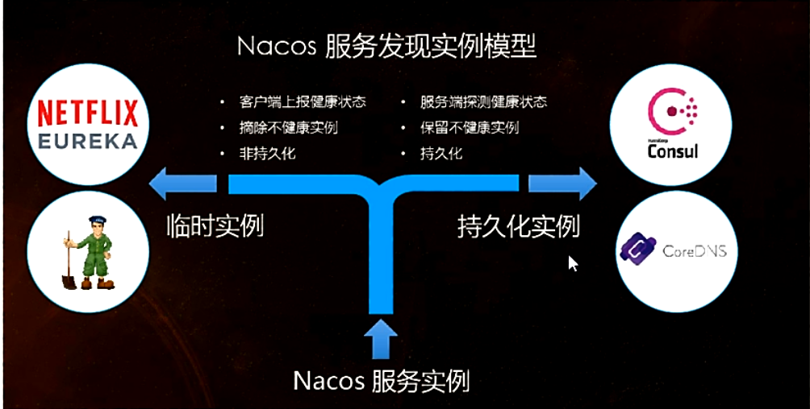

    - 切换

      Nacos支持AP和CP的切换

      

      curl -X PUT '$NACOS_SERVER:8848/nacos/v1/ns/operator/switches?entry=serverMode&value=CP'

## 18.4Nacos作为服务配置中心演示

- Nacos作为配置中心-基础配置

  - cloudalibaba-config-nacos-client3377

  - POM

    ```xml
    <?xml version="1.0" encoding="UTF-8"?>
    <project xmlns="http://maven.apache.org/POM/4.0.0"
             xmlns:xsi="http://www.w3.org/2001/XMLSchema-instance"
             xsi:schemaLocation="http://maven.apache.org/POM/4.0.0 http://maven.apache.org/xsd/maven-4.0.0.xsd">
        <parent>
            <artifactId>cloud2020</artifactId>
            <groupId>com.xiyue.cloud</groupId>
            <version>1.0-SNAPSHOT</version>
        </parent>
        <modelVersion>4.0.0</modelVersion>
    
        <artifactId>cloudalibaba-config-nacos-client3377</artifactId>
    
        <dependencies>
            <!--nacos-config-->
            <dependency>
                <groupId>com.alibaba.cloud</groupId>
                <artifactId>spring-cloud-starter-alibaba-nacos-config</artifactId>
            </dependency>
            <!--nacos-discovery-->
            <dependency>
                <groupId>com.alibaba.cloud</groupId>
                <artifactId>spring-cloud-starter-alibaba-nacos-discovery</artifactId>
            </dependency>
            <!--web + actuator-->
            <dependency>
                <groupId>org.springframework.boot</groupId>
                <artifactId>spring-boot-starter-web</artifactId>
            </dependency>
            <dependency>
                <groupId>org.springframework.boot</groupId>
                <artifactId>spring-boot-starter-actuator</artifactId>
            </dependency>
            <!--一般基础配置-->
            <dependency>
                <groupId>org.springframework.boot</groupId>
                <artifactId>spring-boot-devtools</artifactId>
                <scope>runtime</scope>
                <optional>true</optional>
            </dependency>
            <dependency>
                <groupId>org.projectlombok</groupId>
                <artifactId>lombok</artifactId>
                <optional>true</optional>
            </dependency>
            <dependency>
                <groupId>org.springframework.boot</groupId>
                <artifactId>spring-boot-starter-test</artifactId>
                <scope>test</scope>
            </dependency>
        </dependencies>
    </project>
    ```

  - YML

    - why配置两个

      

    - YML

      - bootstrap

        ```yml
        server:
          port: 3377
        
        spring:
          application:
            name: nacos-config-client
          cloud:
            nacos:
              discovery:
                server-addr: localhost:8848 #服务注册中心地址
              config:
                server-addr: localhost:8848 #配置中心地址
                file-extension: yaml #指定yaml格式的配置
        ```

      - application

        ```yml
        spring:
          profiles:
            active: dev
        ```

  - 主启动

    ```java
    package com.xiyue.cloud;
    
    import org.springframework.boot.SpringApplication;
    import org.springframework.boot.autoconfigure.SpringBootApplication;
    import org.springframework.cloud.client.discovery.EnableDiscoveryClient;
    
    
    @EnableDiscoveryClient
    @SpringBootApplication
    public class NacosConfigClientMain3377
    {
        public static void main(String[] args) {
            SpringApplication.run(NacosConfigClientMain3377.class, args);
        }
    }
    ```

  - 业务类

    ```java
    package com.xiyue.cloud.controller;
    
    import org.springframework.beans.factory.annotation.Value;
    import org.springframework.cloud.context.config.annotation.RefreshScope;
    import org.springframework.web.bind.annotation.GetMapping;
    import org.springframework.web.bind.annotation.RestController;
    
    
    @RestController
    @RefreshScope
    public class ConfigClientController
    {
        @Value("${config.info}")
        private String configInfo;
    
        @GetMapping("/config/info")
        public String getConfigInfo() {
            return configInfo;
        }
    }
    ```

    - ConfigClientController

    - @RefreshScope

      

  - 在Nacos中添加配置信息

    - Nacos中的匹配规则

      - 理论

        - Nacos中的dataid的组成格式与SpringBoot配置文件中的匹配规则

        - 官网

           https://nacos.io/zh-cn/docs/quick-start-spring-cloud.html

          

          

      - 实操

        - 配置新增

          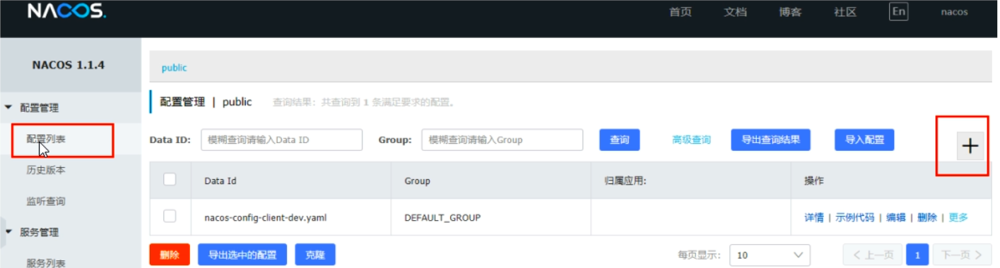

          nacos-config-client-dev

        - Nacos界面配置对应(注意文件格式一定为yaml不然会报错)

          ```yml
          config:
              info: "nacos config center,version = 1,from nacos config center, nacos-config-client-dev.yaml, version=1"
          ```

          

          - 设置DataId

            - 公式
              ${spring.application.name}-${spring.profile.active}.${spring.cloud.nacos.config.file-extension}

            - prefix默认为spring.application.name的值

            - spring.profile.active既为当前环境对应的profile,可以通过配置项spring.profile.active 来配置

            - file-exetension为配置内容的数据格式，可以通过配置项spring.cloud.nacos.config.file-extension配置

            - 小总结说明

              

        - 历史配置

  - 测试

    - 启动前需要在nacos客户端-配置管理-配置管理栏目下有没有对应的yaml配置文件
    - 运行cloud-config-nacos-client3377的主启动类
    - 调用接口查看配置信息  http://localhost:3377/config/info

  - 自带动态刷新：修改下Nacos中的yaml配置文件，再次调用查看配置的接口，就会发现配置已经刷新

- Nacos作为配置中心-分类配置

  - 问题（多环境多项目管理）

    

  - Nacos的图形化管理界面

    - 配置管理

      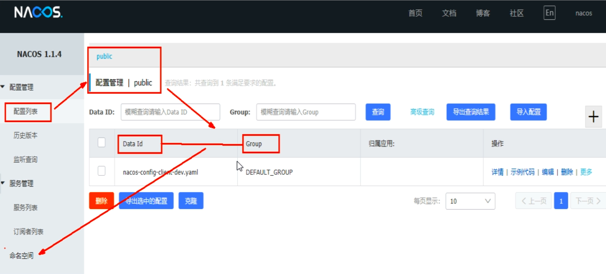

    - 命名空间

      

  - Namespace+Group+Data ID三者关系？为什么这么设计？

    

    

  - Case

    - DataID方案

      - 指定spring.profile.active和配置文件的DataID来使不同环境下读取不同的配置

      - 默认空间+默认分组+新建dev和test两个DataID

        - 新建dev配置DataID

          

        - 新建test配置DataID

          

      - 通过spring.profile.active属性就能进行多环境下配置文件的读取

        

      - 测试

        http://localhost:3377/config/info
        配置是什么就加载什么=》test

    - Group方案

      - 通过Group实现环境区分

        - 新建Group

          

      - 在nacos图形界面控制台上面新建配置文件DataID

        

      - bootstrap+application

        

        在config下增加一条group的配置即可。可配置为DEV_GROUP或TEST_GROUP

    - Namespace方案

      - 新建dev/test的Namespace

        

      - 回到服务管理-服务列表查看

        

      - 按照域名配置填写

        

      - YML

        - bootstrap

          ```yml
           namespace: dev #此处应该是namespace的唯一标识
          ```

        - application

## 18.5Nacos集群和持久化配置（重要）

- 官网说明

  - https://nacos.io/zh-cn/docs/cluster-mode-quick-start.html

  - 官网架构图（写的(┬＿┬)）

    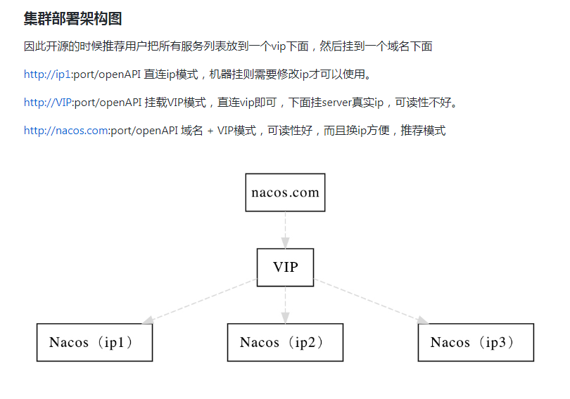

  - 上图官网翻译，真实情况

    

  - 说明

    

    ​	
    
    
    
    ​			
    
    				
    
    - 按照上述，我们需要mysql数据库
    
    - 官网说明
    
      - https://nacos.io/zh-cn/docs/deployment.html
    
      - 重点说明
    
        
    
        
  
- Nacos持久化配置解释

  - Nacos默认自带的是嵌入式数据库derby

    https://github.com/alibaba/nacos/blob/develop/config/pom.xml

  - derby到mysql切换配置步骤

    - nacos-server-1.1.4\nacos\conf目录下找到sql脚本

      - nacos-mysql.sql

      - 执行脚本

        ```sql
         
        CREATE DATABASE nacos_config;
        USE nacos_config;
         
        /*   数据库全名 = nacos_config   */
        /*   表名称 = config_info   */
        /******************************************/
        CREATE TABLE `config_info` (
          `id` bigint(20) NOT NULL AUTO_INCREMENT COMMENT 'id',
          `data_id` varchar(255) NOT NULL COMMENT    'data_id',
          `group_id` varchar(255) DEFAULT NULL,
          `content` longtext NOT NULL COMMENT 'content',
          `md5` varchar(32) DEFAULT NULL COMMENT 'md5',
          `gmt_create` datetime NOT NULL DEFAULT '2010-05-05 00:00:00' COMMENT '创建时间',
          `gmt_modified` datetime NOT NULL DEFAULT '2010-05-05 00:00:00' COMMENT '修改时间',
          `src_user` text COMMENT 'source user',
          `src_ip` varchar(20) DEFAULT NULL COMMENT 'source ip',
          `app_name` varchar(128) DEFAULT NULL,
          `tenant_id` varchar(128) DEFAULT '' COMMENT '租户字段',
          `c_desc` varchar(256) DEFAULT NULL,
          `c_use` varchar(64) DEFAULT NULL,
          `effect` varchar(64) DEFAULT NULL,
          `type` varchar(64) DEFAULT NULL,
          `c_schema` text,
          PRIMARY KEY (`id`),
          UNIQUE KEY `uk_configinfo_datagrouptenant` (`data_id`,`group_id`,`tenant_id`)
        ) ENGINE=InnoDB DEFAULT CHARSET=utf8 COLLATE=utf8_bin COMMENT='config_info';
         
        /******************************************/
        /*   数据库全名 = nacos_config   */
        /*   表名称 = config_info_aggr   */
        /******************************************/
        CREATE TABLE `config_info_aggr` (
          `id` bigint(20) NOT NULL AUTO_INCREMENT COMMENT 'id',
          `data_id` varchar(255) NOT NULL COMMENT 'data_id',
          `group_id` varchar(255) NOT NULL COMMENT 'group_id',
          `datum_id` varchar(255) NOT NULL COMMENT 'datum_id',
          `content` longtext NOT NULL COMMENT '内容',
          `gmt_modified` datetime NOT NULL COMMENT '修改时间',
          `app_name` varchar(128) DEFAULT NULL,
          `tenant_id` varchar(128) DEFAULT '' COMMENT '租户字段',
          PRIMARY KEY (`id`),
          UNIQUE KEY `uk_configinfoaggr_datagrouptenantdatum` (`data_id`,`group_id`,`tenant_id`,`datum_id`)
        ) ENGINE=InnoDB DEFAULT CHARSET=utf8 COLLATE=utf8_bin COMMENT='增加租户字段';
         
         
        /******************************************/
        /*   数据库全名 = nacos_config   */
        /*   表名称 = config_info_beta   */
        /******************************************/
        CREATE TABLE `config_info_beta` (
          `id` bigint(20) NOT NULL AUTO_INCREMENT COMMENT 'id',
          `data_id` varchar(255) NOT NULL COMMENT 'data_id',
          `group_id` varchar(128) NOT NULL COMMENT 'group_id',
          `app_name` varchar(128) DEFAULT NULL COMMENT 'app_name',
          `content` longtext NOT NULL COMMENT 'content',
          `beta_ips` varchar(1024) DEFAULT NULL COMMENT 'betaIps',
          `md5` varchar(32) DEFAULT NULL COMMENT 'md5',
          `gmt_create` datetime NOT NULL DEFAULT '2010-05-05 00:00:00' COMMENT '创建时间',
          `gmt_modified` datetime NOT NULL DEFAULT '2010-05-05 00:00:00' COMMENT '修改时间',
          `src_user` text COMMENT 'source user',
          `src_ip` varchar(20) DEFAULT NULL COMMENT 'source ip',
          `tenant_id` varchar(128) DEFAULT '' COMMENT '租户字段',
          PRIMARY KEY (`id`),
          UNIQUE KEY `uk_configinfobeta_datagrouptenant` (`data_id`,`group_id`,`tenant_id`)
        ) ENGINE=InnoDB DEFAULT CHARSET=utf8 COLLATE=utf8_bin COMMENT='config_info_beta';
         
        /******************************************/
        /*   数据库全名 = nacos_config   */
        /*   表名称 = config_info_tag   */
        /******************************************/
        CREATE TABLE `config_info_tag` (
          `id` bigint(20) NOT NULL AUTO_INCREMENT COMMENT 'id',
          `data_id` varchar(255) NOT NULL COMMENT 'data_id',
          `group_id` varchar(128) NOT NULL COMMENT 'group_id',
          `tenant_id` varchar(128) DEFAULT '' COMMENT 'tenant_id',
          `tag_id` varchar(128) NOT NULL COMMENT 'tag_id',
          `app_name` varchar(128) DEFAULT NULL COMMENT 'app_name',
          `content` longtext NOT NULL COMMENT 'content',
          `md5` varchar(32) DEFAULT NULL COMMENT 'md5',
          `gmt_create` datetime NOT NULL DEFAULT '2010-05-05 00:00:00' COMMENT '创建时间',
          `gmt_modified` datetime NOT NULL DEFAULT '2010-05-05 00:00:00' COMMENT '修改时间',
          `src_user` text COMMENT 'source user',
          `src_ip` varchar(20) DEFAULT NULL COMMENT 'source ip',
          PRIMARY KEY (`id`),
          UNIQUE KEY `uk_configinfotag_datagrouptenanttag` (`data_id`,`group_id`,`tenant_id`,`tag_id`)
        ) ENGINE=InnoDB DEFAULT CHARSET=utf8 COLLATE=utf8_bin COMMENT='config_info_tag';
         
        /******************************************/
        /*   数据库全名 = nacos_config   */
        /*   表名称 = config_tags_relation   */
        /******************************************/
        CREATE TABLE `config_tags_relation` (
          `id` bigint(20) NOT NULL COMMENT 'id',
          `tag_name` varchar(128) NOT NULL COMMENT 'tag_name',
          `tag_type` varchar(64) DEFAULT NULL COMMENT 'tag_type',
          `data_id` varchar(255) NOT NULL COMMENT 'data_id',
          `group_id` varchar(128) NOT NULL COMMENT 'group_id',
          `tenant_id` varchar(128) DEFAULT '' COMMENT 'tenant_id',
          `nid` bigint(20) NOT NULL AUTO_INCREMENT,
          PRIMARY KEY (`nid`),
          UNIQUE KEY `uk_configtagrelation_configidtag` (`id`,`tag_name`,`tag_type`),
          KEY `idx_tenant_id` (`tenant_id`)
        ) ENGINE=InnoDB DEFAULT CHARSET=utf8 COLLATE=utf8_bin COMMENT='config_tag_relation';
         
        /******************************************/
        /*   数据库全名 = nacos_config   */
        /*   表名称 = group_capacity   */
        /******************************************/
        CREATE TABLE `group_capacity` (
          `id` bigint(20) unsigned NOT NULL AUTO_INCREMENT COMMENT '主键ID',
          `group_id` varchar(128) NOT NULL DEFAULT '' COMMENT 'Group ID，空字符表示整个集群',
          `quota` int(10) unsigned NOT NULL DEFAULT '0' COMMENT '配额，0表示使用默认值',
          `usage` int(10) unsigned NOT NULL DEFAULT '0' COMMENT '使用量',
          `max_size` int(10) unsigned NOT NULL DEFAULT '0' COMMENT '单个配置大小上限，单位为字节，0表示使用默认值',
          `max_aggr_count` int(10) unsigned NOT NULL DEFAULT '0' COMMENT '聚合子配置最大个数，，0表示使用默认值',
          `max_aggr_size` int(10) unsigned NOT NULL DEFAULT '0' COMMENT '单个聚合数据的子配置大小上限，单位为字节，0表示使用默认值',
          `max_history_count` int(10) unsigned NOT NULL DEFAULT '0' COMMENT '最大变更历史数量',
          `gmt_create` datetime NOT NULL DEFAULT '2010-05-05 00:00:00' COMMENT '创建时间',
          `gmt_modified` datetime NOT NULL DEFAULT '2010-05-05 00:00:00' COMMENT '修改时间',
          PRIMARY KEY (`id`),
          UNIQUE KEY `uk_group_id` (`group_id`)
        ) ENGINE=InnoDB DEFAULT CHARSET=utf8 COLLATE=utf8_bin COMMENT='集群、各Group容量信息表';
         
        /******************************************/
        /*   数据库全名 = nacos_config   */
        /*   表名称 = his_config_info   */
        /******************************************/
        CREATE TABLE `his_config_info` (
          `id` bigint(64) unsigned NOT NULL,
          `nid` bigint(20) unsigned NOT NULL AUTO_INCREMENT,
          `data_id` varchar(255) NOT NULL,
          `group_id` varchar(128) NOT NULL,
          `app_name` varchar(128) DEFAULT NULL COMMENT 'app_name',
          `content` longtext NOT NULL,
          `md5` varchar(32) DEFAULT NULL,
          `gmt_create` datetime NOT NULL DEFAULT '2010-05-05 00:00:00',
          `gmt_modified` datetime NOT NULL DEFAULT '2010-05-05 00:00:00',
          `src_user` text,
          `src_ip` varchar(20) DEFAULT NULL,
          `op_type` char(10) DEFAULT NULL,
          `tenant_id` varchar(128) DEFAULT '' COMMENT '租户字段',
          PRIMARY KEY (`nid`),
          KEY `idx_gmt_create` (`gmt_create`),
          KEY `idx_gmt_modified` (`gmt_modified`),
          KEY `idx_did` (`data_id`)
        ) ENGINE=InnoDB DEFAULT CHARSET=utf8 COLLATE=utf8_bin COMMENT='多租户改造';
         
         
        /******************************************/
        /*   数据库全名 = nacos_config   */
        /*   表名称 = tenant_capacity   */
        /******************************************/
        CREATE TABLE `tenant_capacity` (
          `id` bigint(20) unsigned NOT NULL AUTO_INCREMENT COMMENT '主键ID',
          `tenant_id` varchar(128) NOT NULL DEFAULT '' COMMENT 'Tenant ID',
          `quota` int(10) unsigned NOT NULL DEFAULT '0' COMMENT '配额，0表示使用默认值',
          `usage` int(10) unsigned NOT NULL DEFAULT '0' COMMENT '使用量',
          `max_size` int(10) unsigned NOT NULL DEFAULT '0' COMMENT '单个配置大小上限，单位为字节，0表示使用默认值',
          `max_aggr_count` int(10) unsigned NOT NULL DEFAULT '0' COMMENT '聚合子配置最大个数',
          `max_aggr_size` int(10) unsigned NOT NULL DEFAULT '0' COMMENT '单个聚合数据的子配置大小上限，单位为字节，0表示使用默认值',
          `max_history_count` int(10) unsigned NOT NULL DEFAULT '0' COMMENT '最大变更历史数量',
          `gmt_create` datetime NOT NULL DEFAULT '2010-05-05 00:00:00' COMMENT '创建时间',
          `gmt_modified` datetime NOT NULL DEFAULT '2010-05-05 00:00:00' COMMENT '修改时间',
          PRIMARY KEY (`id`),
          UNIQUE KEY `uk_tenant_id` (`tenant_id`)
        ) ENGINE=InnoDB DEFAULT CHARSET=utf8 COLLATE=utf8_bin COMMENT='租户容量信息表';
         
         
        CREATE TABLE `tenant_info` (
          `id` bigint(20) NOT NULL AUTO_INCREMENT COMMENT 'id',
          `kp` varchar(128) NOT NULL COMMENT 'kp',
          `tenant_id` varchar(128) default '' COMMENT 'tenant_id',
          `tenant_name` varchar(128) default '' COMMENT 'tenant_name',
          `tenant_desc` varchar(256) DEFAULT NULL COMMENT 'tenant_desc',
          `create_source` varchar(32) DEFAULT NULL COMMENT 'create_source',
          `gmt_create` bigint(20) NOT NULL COMMENT '创建时间',
          `gmt_modified` bigint(20) NOT NULL COMMENT '修改时间',
          PRIMARY KEY (`id`),
          UNIQUE KEY `uk_tenant_info_kptenantid` (`kp`,`tenant_id`),
          KEY `idx_tenant_id` (`tenant_id`)
        ) ENGINE=InnoDB DEFAULT CHARSET=utf8 COLLATE=utf8_bin COMMENT='tenant_info';
         
        CREATE TABLE users (
            username varchar(50) NOT NULL PRIMARY KEY,
            password varchar(500) NOT NULL,
            enabled boolean NOT NULL
        );
         
        CREATE TABLE roles (
            username varchar(50) NOT NULL,
            role varchar(50) NOT NULL
        );
         
        INSERT INTO users (username, password, enabled) VALUES ('nacos', '$2a$10$EuWPZHzz32dJN7jexM34MOeYirDdFAZm2kuWj7VEOJhhZkDrxfvUu', TRUE);
         
        INSERT INTO roles (username, role) VALUES ('nacos', 'ROLE_ADMIN')
        ```

    - nacos-server-1.1.4\nacos\conf目录下找到application.properties

      ```properties
      spring.datasource.platform=mysql
       
      db.num=1
      db.url.0=jdbc:mysql://11.162.196.16:3306/nacos_devtest?characterEncoding=utf8&connectTimeout=1000&socketTimeout=3000&autoReconnect=true
      db.user=nacos_devtest
      db.password=youdontknow
       
      ##################################################
       
      spring.datasource.platform=mysql
       
      db.num=1
      db.url.0=jdbc:mysql://localhost:3306/nacos_config?characterEncoding=utf8&connectTimeout=1000&socketTimeout=3000&autoReconnect=true
      db.user=root
      db.password=123456
      ```

  - 启动nacos，可以看到是个全新的空记录界面，以前是记录进derby

- Linux版Nacos+MySQL生产环境配置

  - 预计需要，1个nginx+3个nacos注册中心+1个mysql

  - Nacos下载linux版本

    

    - https://github.com/alibaba/nacos/releases/tag/1.1.4
    - nacos-server-1.1.4.tar.gz
    - 解压后安装

  - 集群配置步骤（重点）

    - 1.Linux服务器上mysql数据库配置

      - SQL脚本在哪里

        

      - sql语句源文件

        nacos-mysql.sql

      - 自己Linux机器上的Mysql数据库黏贴

        执行后结果

        

    - 2.application.properties配置

      - 位置

        

      - 内容

        ```properties
        spring.datasource.platform=mysql
         
        db.num=1
        db.url.0=jdbc:mysql://1.7.0.1:3306/nacos_config?characterEncoding=utf8&connectTimeout=1000&socketTimeout=3000&autoReconnect=true
        db.user=root
        db.password=HF_mysql_654321
        ```

        

        ```mysql
        mysql  授权远程访问
        GRANT ALL PRIVILEGES ON *.* TO 'root'@'%' IDENTIFIED BY '123456' WITH GRANT OPTION;
        flush privileges;
        ```

    - 3.Linux服务器上nacos的集群配置cluster.conf

      - 梳理出3台nacos机器的不同服务端口号

      - 复制出cluster.conf

        

      - 内容

        

        - 这个IP不能写127.0.0.1,必须是Linux命令hostname -i能够识别的IP

          

    - 4.编辑Nacos的启动脚本startup.sh，使它能够接受不同的启动端

      - /mynacos/nacos/bin目录下有startup.sh

      - 在什么地方，修改什么，怎么修改

      - 思考

        

      - 修改内容

        

        

        

      - 执行方式

        

    - 5.Nginx的配置，由它作为负载均衡器

      - 修改nginx的配置文件

        

      - nginx.conf

        ```nginx
        upstream cluster{ 
            server 127.0.0.1:3333;
            server 127.0.0.1:4444;
            server 127.0.0.1:5555;
        }
        
        server{
            listen 1111;
            server_name localhost;
            location /{
                 proxy_pass http://cluster;
            }
        ....省略  
        
        ```

        

        

      - 按照指定启动

        

    - 6.截止到此处，1个Nginx+3个nacos注册中心+1个mysql

      - 测试通过nginx访问nacos

        https://写你自己虚拟机的ip:1111/nacos/#/login

      - 新建一个配置测试

        

      - linux服务器的mysql插入一条记录

        

  - 测试

    - 微服务cloudalibaba-provider-payment9002启动注册进nacos集群

      - yml (server-addr:  写你自己的虚拟机ip:1111)

      - 结果

        

  - 高可用小总结

    

# 19.SpringCloud Alibaba Sentinel实现熔断与限流

## 19.1Sentinel

- 官网

  - https://github.com/alibaba/Sentinel
  - 中文:https://github.com/alibaba/Sentinel/wiki/%E4%BB%8B%E7%BB%8D

- 是什么

  

  一句话解释，之前我们讲解过的Hystrix

- 去哪下

  https://github.com/alibaba/Sentinel/releases

  

- 能干嘛

  

- 怎么玩

  - https://spring-cloud-alibaba-group.github.io/github-pages/greenwich/spring-cloud-alibaba.html#_spring_cloud_alibaba_sentinel
  - 服务使用中的各种问题
    - 服务雪崩
    - 服务降级
    - 服务熔断
    - 服务限流

## 19.2安装Sentinel控制台

- sentinel组件由2部分组成

  

  - 后台
  - 前台8080

- 安装步骤

  - 下载
    - https://github.com/alibaba/Sentinel/releases
    - 下载到本地sentinel-dashboard-1.7.0.jar
  - 运行命令
    - 前提
      - java8环境OK
      - 8080端口不能被占用
    - 命令(java -jar sentinel-dashboard-1.7.0.jar )
  - 访问sentinel管理界面
    - http://localhost:8080
    - 登录账号密码均为sentinel

## 19.3初始化演示工程

- 启动Nacos8848成功http://localhost:8848/nacos/#/login

- Module

  - cloudalibaba-sentinel-service8401

  - POM

    ```xml
    <?xml version="1.0" encoding="UTF-8"?>
    <project xmlns="http://maven.apache.org/POM/4.0.0"
             xmlns:xsi="http://www.w3.org/2001/XMLSchema-instance"
             xsi:schemaLocation="http://maven.apache.org/POM/4.0.0 http://maven.apache.org/xsd/maven-4.0.0.xsd">
        <parent>
            <artifactId>cloud2020</artifactId>
            <groupId>com.xiyue.cloud</groupId>
            <version>1.0-SNAPSHOT</version>
        </parent>
        <modelVersion>4.0.0</modelVersion>
    
        <artifactId>cloudalibaba-sentinel-service8401</artifactId>
        <dependencies>
            <dependency>
                <groupId>com.xiyue.cloud</groupId>
                <artifactId>cloud-api-commons</artifactId>
                <version>${project.version}</version>
            </dependency>
    
            <dependency>
                <groupId>com.alibaba.cloud</groupId>
                <artifactId>spring-cloud-starter-alibaba-nacos-discovery</artifactId>
            </dependency>
    
            <dependency>
                <groupId>com.alibaba.csp</groupId>
                <artifactId>sentinel-datasource-nacos</artifactId>
            </dependency>
    
            <dependency>
                <groupId>com.alibaba.cloud</groupId>
                <artifactId>spring-cloud-starter-alibaba-sentinel</artifactId>
            </dependency>
    
            <dependency>
                <groupId>org.springframework.cloud</groupId>
                <artifactId>spring-cloud-starter-openfeign</artifactId>
            </dependency>
    
            <dependency>
                <groupId>org.springframework.boot</groupId>
                <artifactId>spring-boot-starter-web</artifactId>
            </dependency>
            <dependency>
                <groupId>org.springframework.boot</groupId>
                <artifactId>spring-boot-starter-actuator</artifactId>
            </dependency>
    
            <dependency>
                <groupId>org.springframework.boot</groupId>
                <artifactId>spring-boot-devtools</artifactId>
                <scope>runtime</scope>
                <optional>true</optional>
            </dependency>
            <dependency>
                <groupId>cn.hutool</groupId>
                <artifactId>hutool-all</artifactId>
                <version>4.6.3</version>
            </dependency>
            <dependency>
                <groupId>org.projectlombok</groupId>
                <artifactId>lombok</artifactId>
                <optional>true</optional>
            </dependency>
            <dependency>
                <groupId>org.springframework.boot</groupId>
                <artifactId>spring-boot-starter-test</artifactId>
                <scope>test</scope>
            </dependency>
    
        </dependencies>
    
    </project>
    ```

  - YML（application.yml）

    ```yml
    server:
      port: 8401
    
    spring:
      application:
        name: cloudalibaba-sentinel-service
      cloud:
        nacos:
          discovery:
            server-addr: localhost:8848
        sentinel:
          transport:
            dashboard: localhost:8080
            port: 8719  #默认8719，假如被占用了会自动从8719开始依次+1扫描。直至找到未被占用的端口
    
    management:
      endpoints:
        web:
          exposure:
            include: '*'
    ```

  - 主启动

    ```java
    package com.xiyue.cloud;
    
    import org.springframework.boot.SpringApplication;
    import org.springframework.boot.autoconfigure.SpringBootApplication;
    import org.springframework.cloud.client.discovery.EnableDiscoveryClient;
    
    
    @EnableDiscoveryClient
    @SpringBootApplication
    public class MainApp8401
    {
        public static void main(String[] args) {
            SpringApplication.run(MainApp8401.class, args);
        }
    }
    ```

  - 业务类FlowLimitController

    ```java
    package com.xiyue.cloud.controller;
    
    import org.springframework.web.bind.annotation.GetMapping;
    import org.springframework.web.bind.annotation.RestController;
    
    @RestController
    public class FlowLimitController
    {
        @GetMapping("/testA")
        public String testA() {
            return "------testA";
        }
    
        @GetMapping("/testB")
        public String testB() {
    
            return "------testB";
        }
    }
    ```

- 启动Sentinel8080（java -jar sentinel-dashboard-1.7.0）

- 启动微服务8401

- 启动8401微服务后查看sentienl控制台

  - 空空如也，啥都没有

  - Sentinel采用的懒加载说明

    - 执行一次访问即可

      - http://localhost:8401/testA
      - http://localhost:8401/testB

    - 效果

      

  - 结论

    sentinel8080正在监控微服务8401

## 19.4流控规则

- 基本介绍

  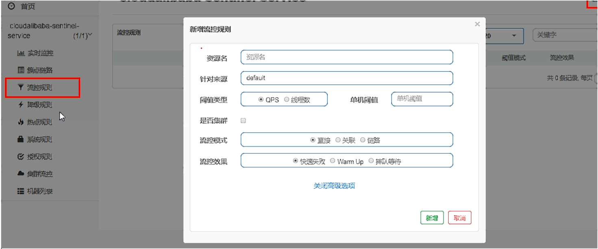

  - 进一步解释说明

    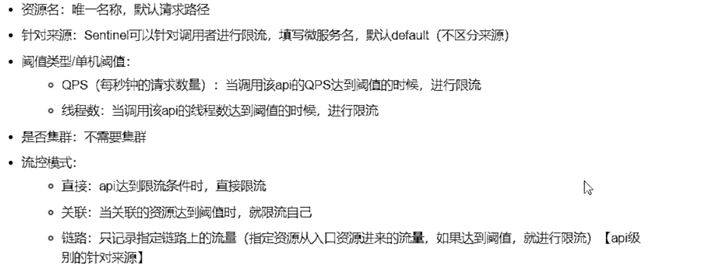

    

    

- 流控模式

  - 直接（默认）

    - 直接->快速失败(系统默认)

    - 配置及说明

      

    - 测试

      - 快速点击访问http://localhost:8401/testA

      - 结果(Blocked by Sentinel (flow limiting))

      - 思考？？？

        直接调用默认报错信息，技术方面OK but，是否应该有我们自己的后续处理？
          类似有一个fallback的兜底方法？

  - 关联

    - 是什么？

      - 当关联的资源达到阈值时，就限流自己
      - 当与A关联的资源B达到阈值后，就限流自己
      - B惹事，A挂了

    - 配置A

      

    - postman模拟并发密集访问testB

      

      - 访问testB成功

        

      - postman里新建多线程集合组

        

      - 将访问地址添加进新线程组

        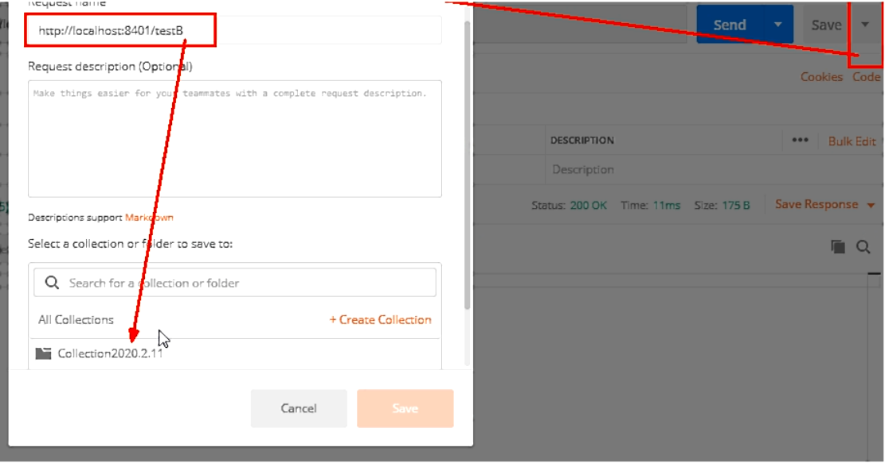

      - Run

        大批量线程高并发访问B，导致A失效了

    - 运行后发现testA挂了

      - 点击访问http://localhost:8401/testA
      - 结果：Blocked by Sentinel (flow limiting)

  - 链路

    多个请求调用了同一个微服务

- 流控效果

  - 直接->快速失败（默认的流控处理）

    - 直接失败，抛出异常（Blocked by Sentinel (flow limiting)）
    - 源码(com.alibaba.csp.sentinel.slots.block.flow.controller.DefaultController)

  - 预热

    - 说明（公式：阈值除以coldFactor（默认值为3），经过预热时长后才会达到阈值）

    - 官网

      

      - 默认coldFactor为3，即请求QPS从threshold/3开始，经预热时长逐渐升至设定的QPS阈值。
      - 限流 冷启动：https://github.com/alibaba/Sentinel/wiki/%E9%99%90%E6%B5%81---%E5%86%B7%E5%90%AF%E5%8A%A8

    - 源码

      com.alibaba.csp.sentinel.slots.block.flow.controller.WarmUpController

      

    - Warmup配置

      

    - 多次点击http://localhost:8401/testB

      刚开始不行，后续慢慢OK

    - 应用场景

      

  - 排队等待

    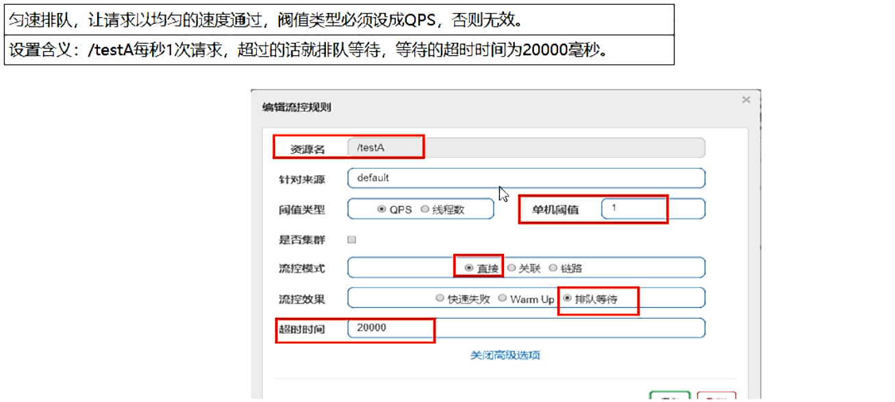

    - 匀速排队，阈值必须设置为QPS

    - 官网

      

      

    - 源码

      com.alibaba.csp.sentinel.slots.block.flow.controller.RateLimiterController

    - 测试

      

## 19.5降级规则

- 官网

- 基本介绍

  

  

  - 进一步说明

    

  - Sentinel的断路器是没有半开状态的

    - 半开的状态系统自动去检测是否请求有异常，没有异常就关闭断路器恢复使用，有异常则继续打开断路器不可用。具体可以参考Hystrix

    - 复习Hystrix

      

      

- 降级策略实战

  - RT

    - 是什么

      

      

    - 测试

      - 代码

        ```java
        	@GetMapping("/testD")
            public String testD()
            {
                try { TimeUnit.SECONDS.sleep(1); } catch (InterruptedException e) { e.printStackTrace(); }
                log.info("testD 测试RT");
        
                return "------testD";
            }
        ```

      - 配置

        

      - jmeter压测

      - 结论

        

        

  - 异常比例

    - 是什么

      

      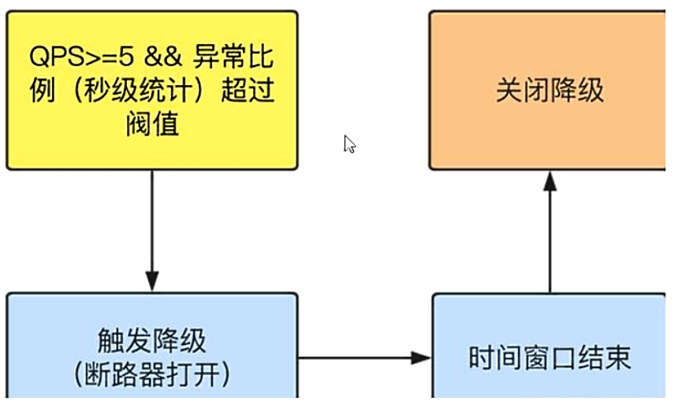

    - 测试

      - 代码

        ```java
        	@GetMapping("/testD")
            public String testD()
            {
        
                log.info("testD 测试RT");
                int age = 10/0;
                return "------testD";
            }
        ```

      - 配置

        

      - jmeter

        

      - 结论

        

  - 异常数

    - 是什么

      

      

    - 异常数是按照分钟统计的

    - 测试

      - 代码

        ```java
        @GetMapping("/testE")
        public String testE()
        {
            log.info("testE 测试异常数");
            int age = 10/0;
            return "------testE 测试异常数";
        }
        ```

      - 配置

        http://localhost:8401/testE

        

      - jmeter

## 19.6热点key限流

- 基本介绍 是什么

  

- 官网：https://github.com/alibaba/Sentinel/wiki/热点参数限流

- 承上启下复习start

  

  @SentinelResource

- 代码

  ```java
  @GetMapping("/testHotKey")
  @SentinelResource(value = "testHotKey",blockHandler = "deal_testHotKey")
  public String testHotKey(@RequestParam(value = "p1",required = false) String p1,
                           @RequestParam(value = "p2",required = false) String p2) {
      //int age = 10/0;
      return "------testHotKey";
  }
   
  //兜底方法
  public String deal_testHotKey (String p1, String p2, BlockException exception){
      return "------deal_testHotKey,o(╥﹏╥)o";  
  }
  ```

  com.alibaba.csp.sentinel.slots.block.BlockException

- 配置 配置

  

  - 1
    - @SentinelResource(value = "testHotKey")
    - 异常打到了前台用户界面看不到，不友好
  - 2
    - @SentinelResource(value = "testHotKey",blockHandler = "deal_testHotKey")
    - 方法testHostKey里面第一个参数只要QPS超过每秒1次，马上降级处理
    - 用了我们自己定义的

- 测试

  - error:http://localhost:8401/testHotKey?p1=abc
  - error:http://localhost:8401/testHotKey?p1=abc&p2=33
  - right:http://localhost:8401/testHotKey?p2=abc

- 参数例外项

  - 上述案例演示了第一个参数p1,当QPS超过1秒1次点击后马上被限流

  - 特殊情况

    - 普通:超过1秒钟一个后，达到阈值1后马上被限流
    - 我们期望p1参数当它是某个特殊值时，它的限流值和平时不一样
    - 特例:假如当p1的值等于5时，它的阈值可以达到200

  - 配置

    

    

  - 测试

    - http://localhost:8401/testHotKey?p1=5
    - http://localhost:8401/testHotKey?p1=3
    - 当p1等于5的时候，阈值变为200
    - 当p1不等于5的时候，阈值就是平常的1

  - 前提条件

    热点参数的注意点，参数必须是基本类型或者String

- 其他

  手贱添加异常看看....
    后面讲

  

## 19.7系统规则

- 是什么:https://github.com/alibaba/Sentinel/wiki/%E7%B3%BB%E7%BB%9F%E8%87%AA%E9%80%82%E5%BA%94%E9%99%90%E6%B5%81

  Sentinel 系统自适应限流从整体维度对应用入口流量进行控制，结合应用的 Load、CPU 使用率、总体平均 RT、入口 QPS 和并发线程数等几个维度的监控指标，通过自适应的流控策略，让系统的入口流量和系统的负载达到一个平衡，让系统尽可能跑在最大吞吐量的同时保证系统整体的稳定性。

  ## 背景

  在开始之前，我们先了解一下系统保护的目的：

  - 保证系统不被拖垮
  - 在系统稳定的前提下，保持系统的吞吐量

  长期以来，系统保护的思路是根据硬指标，即系统的负载 (load1) 来做系统过载保护。当系统负载高于某个阈值，就禁止或者减少流量的进入；当 load 开始好转，则恢复流量的进入。这个思路给我们带来了不可避免的两个问题：

  - load 是一个“结果”，如果根据 load 的情况来调节流量的通过率，那么就始终有延迟性。也就意味着通过率的任何调整，都会过一段时间才能看到效果。当前通过率是使 load 恶化的一个动作，那么也至少要过 1 秒之后才能观测到；同理，如果当前通过率调整是让 load 好转的一个动作，也需要 1 秒之后才能继续调整，这样就浪费了系统的处理能力。所以我们看到的曲线，总是会有抖动。
  - 恢复慢。想象一下这样的一个场景（真实），出现了这样一个问题，下游应用不可靠，导致应用 RT 很高，从而 load 到了一个很高的点。过了一段时间之后下游应用恢复了，应用 RT 也相应减少。这个时候，其实应该大幅度增大流量的通过率；但是由于这个时候 load 仍然很高，通过率的恢复仍然不高。

  [TCP BBR](https://en.wikipedia.org/wiki/TCP_congestion_control#TCP_BBR) 的思想给了我们一个很大的启发。我们应该根据系统能够处理的请求，和允许进来的请求，来做平衡，而不是根据一个间接的指标（系统 load）来做限流。最终我们追求的目标是 **在系统不被拖垮的情况下，提高系统的吞吐率，而不是 load 一定要到低于某个阈值**。如果我们还是按照固有的思维，超过特定的 load 就禁止流量进入，系统 load 恢复就放开流量，这样做的结果是无论我们怎么调参数，调比例，都是按照果来调节因，都无法取得良好的效果。

  Sentinel 在系统自适应保护的做法是，用 load1 作为启动自适应保护的因子，而允许通过的流量由处理请求的能力，即请求的响应时间以及当前系统正在处理的请求速率来决定。

  ## 系统规则

  系统保护规则是从应用级别的入口流量进行控制，从单台机器的 load、CPU 使用率、平均 RT、入口 QPS 和并发线程数等几个维度监控应用指标，让系统尽可能跑在最大吞吐量的同时保证系统整体的稳定性。

  系统保护规则是应用整体维度的，而不是资源维度的，并且**仅对入口流量生效**。入口流量指的是进入应用的流量（`EntryType.IN`），比如 Web 服务或 Dubbo 服务端接收的请求，都属于入口流量。

  系统规则支持以下的模式：

  - **Load 自适应**（仅对 Linux/Unix-like 机器生效）：系统的 load1 作为启发指标，进行自适应系统保护。当系统 load1 超过设定的启发值，且系统当前的并发线程数超过估算的系统容量时才会触发系统保护（BBR 阶段）。系统容量由系统的 `maxQps * minRt` 估算得出。设定参考值一般是 `CPU cores * 2.5`。
  - **CPU usage**（1.5.0+ 版本）：当系统 CPU 使用率超过阈值即触发系统保护（取值范围 0.0-1.0），比较灵敏。
  - **平均 RT**：当单台机器上所有入口流量的平均 RT 达到阈值即触发系统保护，单位是毫秒。
  - **并发线程数**：当单台机器上所有入口流量的并发线程数达到阈值即触发系统保护。
  - **入口 QPS**：当单台机器上所有入口流量的 QPS 达到阈值即触发系统保护。

  ## 原理

  先用经典图来镇楼:

  

  我们把系统处理请求的过程想象为一个水管，到来的请求是往这个水管灌水，当系统处理顺畅的时候，请求不需要排队，直接从水管中穿过，这个请求的RT是最短的；反之，当请求堆积的时候，那么处理请求的时间则会变为：排队时间 + 最短处理时间。

  - 推论一: 如果我们能够保证水管里的水量，能够让水顺畅的流动，则不会增加排队的请求；也就是说，这个时候的系统负载不会进一步恶化。

  我们用 T 来表示(水管内部的水量)，用RT来表示请求的处理时间，用P来表示进来的请求数，那么一个请求从进入水管道到从水管出来，这个水管会存在 `P * RT`　个请求。换一句话来说，当 `T ≈ QPS * Avg(RT)` 的时候，我们可以认为系统的处理能力和允许进入的请求个数达到了平衡，系统的负载不会进一步恶化。

  接下来的问题是，水管的水位是可以达到了一个平衡点，但是这个平衡点只能保证水管的水位不再继续增高，但是还面临一个问题，就是在达到平衡点之前，这个水管里已经堆积了多少水。如果之前水管的水已经在一个量级了，那么这个时候系统允许通过的水量可能只能缓慢通过，RT会大，之前堆积在水管里的水会滞留；反之，如果之前的水管水位偏低，那么又会浪费了系统的处理能力。

  - 推论二:　当保持入口的流量是水管出来的流量的最大的值的时候，可以最大利用水管的处理能力。

  然而，和 TCP BBR 的不一样的地方在于，还需要用一个系统负载的值（load1）来激发这套机制启动。

  > 注：这种系统自适应算法对于低 load 的请求，它的效果是一个“兜底”的角色。**对于不是应用本身造成的 load 高的情况（如其它进程导致的不稳定的情况），效果不明显。**

  ## 示例

  我们提供了系统自适应限流的示例：[SystemGuardDemo](https://github.com/alibaba/Sentinel/blob/master/sentinel-demo/sentinel-demo-basic/src/main/java/com/alibaba/csp/sentinel/demo/system/SystemGuardDemo.java)。

- 各项配置参数说明

  

- 配置全局QPS

## 19.8@SentinelResource

- 按资源名称限流+后续处理

  - 启动Nacos成功

  - 启动Sentinel成功

  - Module

    - cloudalibaba-sentinel-service8401

    - POM

      ```xml
       <dependency>
       	<groupId>com.xiyue.cloud</groupId>
       	<artifactId>cloud-api-commons</artifactId>
       	<version>${project.version}</version>
       </dependency>
      ```

    - YML（application.yml）

      ```yml
      server:
        port: 8401
      
      spring:
        application:
          name: cloudalibaba-sentinel-service
        cloud:
          nacos:
            discovery:
              server-addr: localhost:8848
          sentinel:
            transport:
              dashboard: localhost:8080
              port: 8719  #默认8719，假如被占用了会自动从8719开始依次+1扫描。直至找到未被占用的端口
      
      management:
        endpoints:
          web:
            exposure:
              include: '*'
      ```

    - 业务类RateLimitController

      ```java
      package com.xiyue.cloud.controller;
      
      import com.alibaba.csp.sentinel.annotation.SentinelResource;
      import com.alibaba.csp.sentinel.slots.block.BlockException;
      
      import com.xiyue.cloud.entities.*;
      import org.springframework.web.bind.annotation.GetMapping;
      import org.springframework.web.bind.annotation.RestController;
      
      
      @RestController
      public class RateLimitController {
          @GetMapping("/byResource")
          @SentinelResource(value = "byResource", blockHandler = "handleException")
          public CommonResult byResource() {
              return new CommonResult(200, "按资源名称限流测试OK", new Payment(2020L, "serial001"));
          }
      
          public CommonResult handleException(BlockException exception) {
              return new CommonResult(444, exception.getClass().getCanonicalName() + "\t 服务不可用");
          }
      }
      ```

    - 主启动

      ```java
      package com.xiyue.cloud;
      
      import org.springframework.boot.SpringApplication;
      import org.springframework.boot.autoconfigure.SpringBootApplication;
      import org.springframework.cloud.client.discovery.EnableDiscoveryClient;
      
      
      @EnableDiscoveryClient
      @SpringBootApplication
      public class MainApp8401
      {
          public static void main(String[] args) {
              SpringApplication.run(MainApp8401.class, args);
          }
      }
      ```

  - 配置流控规则

    - 配置步骤

      

    - 图形配置和代码关系

    - 表示1秒钟内查询次数大于1，就跑到我们自定义的处流，限流

  - 测试

    - 1秒钟点击1下，OK

    - 超过上述问题，疯狂点击，返回了自己定义的限流处理信息，限流发送

      

  - 额外问题

    - 此时关闭微服务8401看看
    - Sentinel控制台，流控规则消失了？？？？=>  临时/持久？

- 按照Url地址限流+后续处理

  - 通过访问的URL来限流，会返回Sentinel自带默认的限流处理信息

  - 业务类RateLimitController

    ```java
    @GetMapping("/rateLimit/byUrl")
    @SentinelResource(value = "byUrl")
    public CommonResult byUrl()
    {
        return new CommonResult(200,"按url限流测试OK",new Payment(2020L,"serial002"));
    }
    ```

  - 访问一次

  - Sentinel控制台配置

    

  - 测试

    - 疯狂点击http://localhost:8401/rateLimit/byUrl

    - 结果

      

- 上面兜底方法面临的问题

  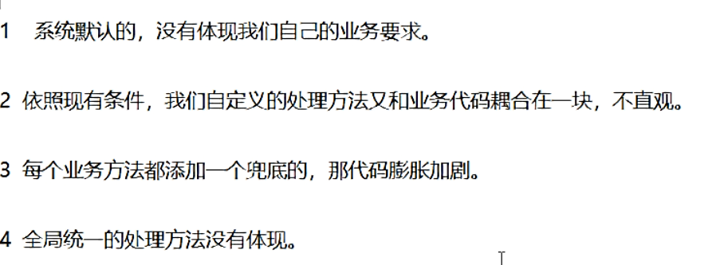

- 客户自定义限流处理逻辑

  - 创建customerBlockHandler类用于自定义限流处理逻辑

  - 自定义限流处理类（CustomerBlockHandler）

    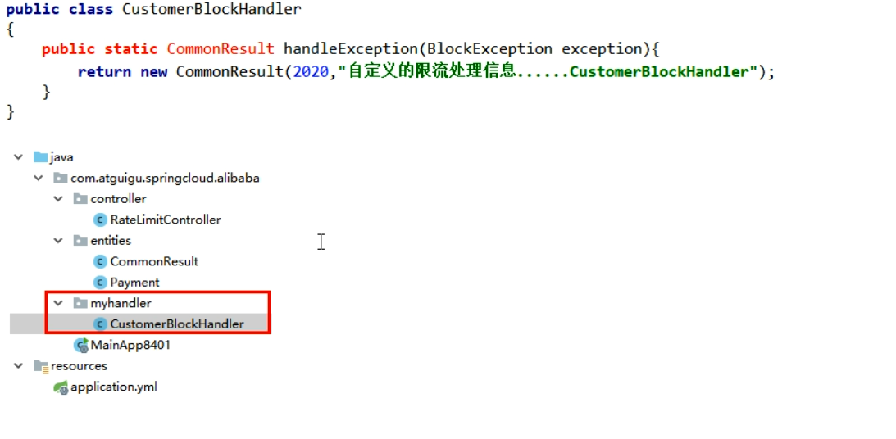

    ```java
    package com.xiyue.cloud.myhandle;
    
    
    import com.alibaba.csp.sentinel.slots.block.BlockException;
    import com.xiyue.cloud.entities.CommonResult;
    
    public class CustomerBlockHandler {
    
        public static CommonResult handleException(BlockException exception) {
            return new CommonResult(2020, "自定义限流处理信息....CustomerBlockHandler");
    
        }
    }
    ```

  - RateLimitController

    ```java
    @GetMapping("/rateLimit/customerBlockHandler")
    @SentinelResource(value = "customerBlockHandler",
        blockHandlerClass = CustomerBlockHandler.class,
        blockHandler = "handlerException2")
    public CommonResult customerBlockHandler()
    {
        return new CommonResult(200,"按客戶自定义",new Payment(2020L,"serial003"));
    }
    ```

  - 启动微服务后先调用一次http://localhost:8401/rateLimit/customerBlockHandler

  - Sentinel控制台配置

  - 测试后我们自定义的出来了

  - 进一步说明

    

- 更多注解属性说明

  

  

  - 多说一句

    

  - Sentinel主要有三个核心API

    - SphU定义资源
    - Tracer定义统计
    - ContextUtil定义了上下文

## 19.9服务熔断功能

- sentinel整合ribbon+openFeign+fallback

- Ribbon系列

  - 启动nacos和sentinel

  - 提供者9003/9004

    - 新建cloudalibaba-provider-payment9003/9004

    - POM

      9003

      ```xml
      <?xml version="1.0" encoding="UTF-8"?>
      <project xmlns="http://maven.apache.org/POM/4.0.0"
               xmlns:xsi="http://www.w3.org/2001/XMLSchema-instance"
               xsi:schemaLocation="http://maven.apache.org/POM/4.0.0 http://maven.apache.org/xsd/maven-4.0.0.xsd">
          <parent>
              <artifactId>cloud2020</artifactId>
              <groupId>com.xiyue.cloud</groupId>
              <version>1.0-SNAPSHOT</version>
          </parent>
          <modelVersion>4.0.0</modelVersion>
      
          <artifactId>cloudalibaba-provider-payment9003</artifactId>
      
          <dependencies>
              <!--SpringCloud ailibaba nacos -->
              <dependency>
                  <groupId>com.alibaba.cloud</groupId>
                  <artifactId>spring-cloud-starter-alibaba-nacos-discovery</artifactId>
              </dependency>
              <dependency><!-- 引入自己定义的api通用包，可以使用Payment支付Entity -->
                  <groupId>com.xiyue.cloud</groupId>
                  <artifactId>cloud-api-commons</artifactId>
                  <version>${project.version}</version>
              </dependency>
              <!-- SpringBoot整合Web组件 -->
              <dependency>
                  <groupId>org.springframework.boot</groupId>
                  <artifactId>spring-boot-starter-web</artifactId>
              </dependency>
              <dependency>
                  <groupId>org.springframework.boot</groupId>
                  <artifactId>spring-boot-starter-actuator</artifactId>
              </dependency>
              <!--日常通用jar包配置-->
              <dependency>
                  <groupId>org.springframework.boot</groupId>
                  <artifactId>spring-boot-devtools</artifactId>
                  <scope>runtime</scope>
                  <optional>true</optional>
              </dependency>
              <dependency>
                  <groupId>org.projectlombok</groupId>
                  <artifactId>lombok</artifactId>
                  <optional>true</optional>
              </dependency>
              <dependency>
                  <groupId>org.springframework.boot</groupId>
                  <artifactId>spring-boot-starter-test</artifactId>
                  <scope>test</scope>
              </dependency>
          </dependencies>
      </project>
      ```

      9004

      ```xml
      <?xml version="1.0" encoding="UTF-8"?>
      <project xmlns="http://maven.apache.org/POM/4.0.0"
               xmlns:xsi="http://www.w3.org/2001/XMLSchema-instance"
               xsi:schemaLocation="http://maven.apache.org/POM/4.0.0 http://maven.apache.org/xsd/maven-4.0.0.xsd">
          <parent>
              <artifactId>cloud2020</artifactId>
              <groupId>com.xiyue.cloud</groupId>
              <version>1.0-SNAPSHOT</version>
          </parent>
          <modelVersion>4.0.0</modelVersion>
      
          <artifactId>cloudalibaba-provider-payment9004</artifactId>
          <dependencies>
              <!--SpringCloud ailibaba nacos -->
              <dependency>
                  <groupId>com.alibaba.cloud</groupId>
                  <artifactId>spring-cloud-starter-alibaba-nacos-discovery</artifactId>
              </dependency>
              <dependency><!-- 引入自己定义的api通用包，可以使用Payment支付Entity -->
                  <groupId>com.xiyue.cloud</groupId>
                  <artifactId>cloud-api-commons</artifactId>
                  <version>${project.version}</version>
              </dependency>
              <!-- SpringBoot整合Web组件 -->
              <dependency>
                  <groupId>org.springframework.boot</groupId>
                  <artifactId>spring-boot-starter-web</artifactId>
              </dependency>
              <dependency>
                  <groupId>org.springframework.boot</groupId>
                  <artifactId>spring-boot-starter-actuator</artifactId>
              </dependency>
              <!--日常通用jar包配置-->
              <dependency>
                  <groupId>org.springframework.boot</groupId>
                  <artifactId>spring-boot-devtools</artifactId>
                  <scope>runtime</scope>
                  <optional>true</optional>
              </dependency>
              <dependency>
                  <groupId>org.projectlombok</groupId>
                  <artifactId>lombok</artifactId>
                  <optional>true</optional>
              </dependency>
              <dependency>
                  <groupId>org.springframework.boot</groupId>
                  <artifactId>spring-boot-starter-test</artifactId>
                  <scope>test</scope>
              </dependency>
          </dependencies>
      </project>
      ```

    - YML（application.yml）记得修改不同的端口号

      9003

      ```yml
      server:
        port: 9003
      
      spring:
        application:
          name: nacos-payment-provider
        cloud:
          nacos:
            discovery:
              server-addr: localhost:8848 #配置Nacos地址
      
      management:
        endpoints:
          web:
            exposure:
              include: '*'
      ```

      9004

      ```yml
      server:
        port: 9004
      
      spring:
        application:
          name: nacos-payment-provider
        cloud:
          nacos:
            discovery:
              server-addr: localhost:8848 #配置Nacos地址
      
      management:
        endpoints:
          web:
            exposure:
              include: '*'
      ```

      

    - 主启动

      9003

      ```java
      package com.xiyue.cloud;
      
      import org.springframework.boot.SpringApplication;
      import org.springframework.boot.autoconfigure.SpringBootApplication;
      import org.springframework.cloud.client.discovery.EnableDiscoveryClient;
      
      
      @SpringBootApplication
      @EnableDiscoveryClient
      public class PaymentMain9003
      {
          public static void main(String[] args) {
              SpringApplication.run(PaymentMain9003.class, args);
          }
      }
      ```

      9004

      ```java
      package com.xiyue.cloud;
      
      import org.springframework.boot.SpringApplication;
      import org.springframework.boot.autoconfigure.SpringBootApplication;
      import org.springframework.cloud.client.discovery.EnableDiscoveryClient;
      
      
      @SpringBootApplication
      @EnableDiscoveryClient
      public class PaymentMain9004
      {
          public static void main(String[] args) {
              SpringApplication.run(PaymentMain9004.class, args);
          }
      }
      
      ```

    - 业务类

      9003与9004业务代码一样

      ```java
      package com.xiyue.cloud.controller;
      
      import com.xiyue.cloud.entities.CommonResult;
      import com.xiyue.cloud.entities.Payment;
      import org.springframework.beans.factory.annotation.Value;
      import org.springframework.web.bind.annotation.GetMapping;
      import org.springframework.web.bind.annotation.PathVariable;
      import org.springframework.web.bind.annotation.RestController;
      
      import java.util.HashMap;
      
      
      @RestController
      public class PaymentController
      {
          @Value("${server.port}")
          private String serverPort;
      
          public static HashMap<Long, Payment> hashMap = new HashMap<>();
          static{
              hashMap.put(1L,new Payment(1L,"28a8c1e3bc2742d8848569891fb42181"));
              hashMap.put(2L,new Payment(2L,"bba8c1e3bc2742d8848569891ac32182"));
              hashMap.put(3L,new Payment(3L,"6ua8c1e3bc2742d8848569891xt92183"));
          }
      
          @GetMapping(value = "/paymentSQL/{id}")
          public CommonResult<Payment> paymentSQL(@PathVariable("id") Long id){
              Payment payment = hashMap.get(id);
              CommonResult<Payment> result = new CommonResult(200,"from mysql,serverPort:  "+serverPort,payment);
              return result;
          }
      
      
      
      }
      
      
      package com.xiyue.cloud.controller;
      
      import com.xiyue.cloud.entities.CommonResult;
      import com.xiyue.cloud.entities.Payment;
      import org.springframework.beans.factory.annotation.Value;
      import org.springframework.web.bind.annotation.GetMapping;
      import org.springframework.web.bind.annotation.PathVariable;
      import org.springframework.web.bind.annotation.RestController;
      
      import java.util.HashMap;
      
      
      @RestController
      public class PaymentController
      {
          @Value("${server.port}")
          private String serverPort;
      
          public static HashMap<Long, Payment> hashMap = new HashMap<>();
          static{
              hashMap.put(1L,new Payment(1L,"28a8c1e3bc2742d8848569891fb42181"));
              hashMap.put(2L,new Payment(2L,"bba8c1e3bc2742d8848569891ac32182"));
              hashMap.put(3L,new Payment(3L,"6ua8c1e3bc2742d8848569891xt92183"));
          }
      
          @GetMapping(value = "/paymentSQL/{id}")
          public CommonResult<Payment> paymentSQL(@PathVariable("id") Long id){
              Payment payment = hashMap.get(id);
              CommonResult<Payment> result = new CommonResult(200,"from mysql,serverPort:  "+serverPort,payment);
              return result;
          }
      }
      ```

    - 测试地址http://localhost:9003/paymentSQL/1

  - 消费者84

    - 新建cloudalibaba-consumer-nacos-order84

    - POM

      ```xml
      <?xml version="1.0" encoding="UTF-8"?>
      <project xmlns="http://maven.apache.org/POM/4.0.0"
               xmlns:xsi="http://www.w3.org/2001/XMLSchema-instance"
               xsi:schemaLocation="http://maven.apache.org/POM/4.0.0 http://maven.apache.org/xsd/maven-4.0.0.xsd">
          <parent>
              <artifactId>cloud2020</artifactId>
              <groupId>com.xiyue.cloud</groupId>
              <version>1.0-SNAPSHOT</version>
          </parent>
          <modelVersion>4.0.0</modelVersion>
      
          <artifactId>cloudalibaba-consumer-nacos-order84</artifactId>
          <dependencies>
              <dependency>
                  <groupId>org.springframework.cloud</groupId>
                  <artifactId>spring-cloud-starter-openfeign</artifactId>
              </dependency>
              <dependency>
                  <groupId>com.alibaba.cloud</groupId>
                  <artifactId>spring-cloud-starter-alibaba-nacos-discovery</artifactId>
              </dependency>
              <dependency>
                  <groupId>com.alibaba.cloud</groupId>
                  <artifactId>spring-cloud-starter-alibaba-sentinel</artifactId>
              </dependency>
              <dependency>
                  <groupId>com.xiyue.cloud</groupId>
                  <artifactId>cloud-api-commons</artifactId>
                  <version>${project.version}</version>
              </dependency>
              <dependency>
                  <groupId>org.springframework.boot</groupId>
                  <artifactId>spring-boot-starter-web</artifactId>
              </dependency>
              <dependency>
                  <groupId>org.springframework.boot</groupId>
                  <artifactId>spring-boot-starter-actuator</artifactId>
              </dependency>
              <dependency>
                  <groupId>org.springframework.boot</groupId>
                  <artifactId>spring-boot-devtools</artifactId>
                  <scope>runtime</scope>
                  <optional>true</optional>
              </dependency>
              <dependency>
                  <groupId>org.projectlombok</groupId>
                  <artifactId>lombok</artifactId>
                  <optional>true</optional>
              </dependency>
              <dependency>
                  <groupId>org.springframework.boot</groupId>
                  <artifactId>spring-boot-starter-test</artifactId>
                  <scope>test</scope>
              </dependency>
          </dependencies>
      </project>
      ```

    - YML(application.yml)

      ```yml
      server:
        port: 84
      
      
      spring:
        application:
          name: nacos-order-consumer
        cloud:
          nacos:
            discovery:
              server-addr: localhost:8848
          sentinel:
            transport:
              dashboard: localhost:8080
              port: 8719
      
      service-url:
        nacos-user-service: http://nacos-payment-provider
      ```

    - 主启动

      ```java
      package com.xiyue.cloud;
      
      import org.springframework.boot.SpringApplication;
      import org.springframework.boot.autoconfigure.SpringBootApplication;
      import org.springframework.cloud.client.discovery.EnableDiscoveryClient;
      import org.springframework.cloud.openfeign.EnableFeignClients;
      
      
      @EnableDiscoveryClient
      @SpringBootApplication
      @EnableFeignClients
      public class OrderNacosMain84
      {
          public static void main(String[] args) {
              SpringApplication.run(OrderNacosMain84.class, args);
          }
      }
      ```

    - 业务类

      ApplicationContextConfig

      ```java
      package com.xiyue.cloud.config;
      
      import org.springframework.cloud.client.loadbalancer.LoadBalanced;
      import org.springframework.context.annotation.Bean;
      import org.springframework.context.annotation.Configuration;
      import org.springframework.web.client.RestTemplate;
      
      
      @Configuration
      public class ApplicationContextConfig
      {
          @Bean
          @LoadBalanced
          public RestTemplate getRestTemplate()
          {
              return new RestTemplate();
          }
      }
      ```

      CircleBreakerController的全部源码

      ```java
      package com.xiyue.cloud.controller;
      
      import com.alibaba.csp.sentinel.annotation.SentinelResource;
      import com.alibaba.csp.sentinel.slots.block.BlockException;
      import com.xiyue.cloud.entities.CommonResult;
      import com.xiyue.cloud.entities.Payment;
      import lombok.extern.slf4j.Slf4j;
      import org.springframework.web.bind.annotation.PathVariable;
      import org.springframework.web.bind.annotation.RequestMapping;
      import org.springframework.web.bind.annotation.RestController;
      import org.springframework.web.client.RestTemplate;
      
      import javax.annotation.Resource;
      
      
      @RestController
      @Slf4j
      public class CircleBreakerController {
      
          public static final String SERVICE_URL = "http://nacos-payment-provider";
      
          @Resource
          private RestTemplate restTemplate;
      
      
      
          @RequestMapping("/consumer/fallback/{id}")
          //@SentinelResource(value = "fallback") //没有配置
          //@SentinelResource(value = "fallback",fallback = "handlerFallback") //fallback只负责业务异常
          //@SentinelResource(value = "fallback",blockHandler = "blockHandler") //blockHandler只负责sentinel控制台配置违规
          @SentinelResource(value = "fallback",fallback = "handlerFallback",blockHandler = "blockHandler",
                  exceptionsToIgnore = {IllegalArgumentException.class})
          public CommonResult<Payment> fallback(@PathVariable Long id) {
              CommonResult<Payment> result = restTemplate.getForObject(SERVICE_URL + "/paymentSQL/"+id, CommonResult.class,id);
      
              if (id == 4) {
                  throw new IllegalArgumentException ("IllegalArgumentException,非法参数异常....");
              }else if (result.getData() == null) {
                  throw new NullPointerException ("NullPointerException,该ID没有对应记录,空指针异常");
              }
      
              return result;
          }
      
          //fallback
          public CommonResult handlerFallback(@PathVariable  Long id,Throwable e) {
              Payment payment = new Payment(id,"null");
              return new CommonResult<>(444,"兜底异常handlerFallback,exception内容  "+e.getMessage(),payment);
          }
      
          //blockHandler
          public CommonResult blockHandler(@PathVariable  Long id,BlockException blockException) {
              Payment payment = new Payment(id,"null");
              return new CommonResult<>(445,"blockHandler-sentinel限流,无此流水: blockException  "+blockException.getMessage(),payment);
          }
      }
      ```

      - 修改后请重启微服务

        - 热部署对java代码级生效及时
        - 对@SentinelResource注解内属性，有时效果不好

      - 目的

        - fallback管运行异常
        - blockHandler管配置违规

      - 测试地址http://localhost:84/consumer/fallback/1

      - 没有任何配置

        ```java
        @RestController
        @Slf4j
        public class CircleBreakerController
        {
            public static final String SERVICE_URL = "http://nacos-payment-provider";
        
            @Resource
            private RestTemplate restTemplate;
        
            @RequestMapping("/consumer/fallback/{id}")
            @SentinelResource(value = "fallback")
        
            public CommonResult<Payment> fallback(@PathVariable Long id)
            {
                CommonResult<Payment> result = restTemplate.getForObject(SERVICE_URL + "/paymentSQL/"+id,CommonResult.class,id);
        
                if (id == 4) {
                    throw new IllegalArgumentException ("IllegalArgumentException,非法参数异常....");
                }else if (result.getData() == null) {
                    throw new NullPointerException ("NullPointerException,该ID没有对应记录,空指针异常");
                }
        
                return result;
            }
        ```

        给客户error页面，不友好

      - 只配置fallback

        编码（那个业务类下面的CircleBreakerController的全部源码）

      - 只配置blockHandler

        编码（那个业务类下面的CircleBreakerController的全部源码）

      - fallback和blockHandler都配置

        结果：

        

      - 忽略属性...

        编码（那个业务类下面的CircleBreakerController的全部源码）
          图说

        

- Feign系列

  - 修改84模块

  - POM

    ```xml
     <dependency>
    	 <groupId>org.springframework.cloud</groupId>
     	 <artifactId>spring-cloud-starter-openfeign</artifactId>
     </dependency>
    ```

  - YML(application.yml)

    ```yml
    server:
      port: 84
    
    
    spring:
      application:
        name: nacos-order-consumer
      cloud:
        nacos:
          discovery:
            server-addr: localhost:8848
        sentinel:
          transport:
            dashboard: localhost:8080
            port: 8719
    
    service-url:
      nacos-user-service: http://nacos-payment-provider
    
    #对Feign的支持
    feign:
      sentinel:
        enabled: true
    ```

  - 业务类

    - 带@FeignClient注解的业务接口

      ```java
      package com.xiyue.cloud.service;
      
      import com.xiyue.cloud.entities.CommonResult;
      import com.xiyue.cloud.entities.Payment;
      import com.xiyue.cloud.service.impl.PaymentFallbackService;
      import org.springframework.cloud.openfeign.FeignClient;
      import org.springframework.web.bind.annotation.GetMapping;
      import org.springframework.web.bind.annotation.PathVariable;
      
      
      @FeignClient(value = "nacos-payment-provider",fallback = PaymentFallbackService.class)
      public interface PaymentService
      {
          @GetMapping(value = "/paymentSQL/{id}")
          public CommonResult<Payment> paymentSQL(@PathVariable("id") Long id);
      }
      ```

    - fallback = PaymentFallbackService.class

    - PaymentFallbackService实现类

      ```java
      package com.xiyue.cloud.service.impl;
      
      import com.xiyue.cloud.entities.CommonResult;
      import com.xiyue.cloud.entities.Payment;
      import com.xiyue.cloud.service.PaymentService;
      import org.springframework.stereotype.Component;
      
      
      @Component
      public class PaymentFallbackService implements PaymentService
      {
          @Override
          public CommonResult<Payment> paymentSQL(Long id)
          {
              return new CommonResult<>(44444,"服务降级返回,---PaymentFallbackService",new Payment(id,"errorSerial"));
          }
      }
      ```

    - Controller

      ```java
      // OpenFeign
      @Resource
      private PaymentService paymentService;
      
      @GetMapping(value = "/consumer/paymentSQL/{id}")
      public CommonResult<Payment> paymentSQL(@PathVariable("id") Long id) {
          return paymentService.paymentSQL(id);
      }
      ```

  - 主启动(添加@EnableFeignClients启动Feign的功能)

    ```java
    package com.xiyue.cloud;
    
    import org.springframework.boot.SpringApplication;
    import org.springframework.boot.autoconfigure.SpringBootApplication;
    import org.springframework.cloud.client.discovery.EnableDiscoveryClient;
    import org.springframework.cloud.openfeign.EnableFeignClients;
    
    
    @EnableDiscoveryClient
    @SpringBootApplication
    @EnableFeignClients
    public class OrderNacosMain84
    {
        public static void main(String[] args) {
            SpringApplication.run(OrderNacosMain84.class, args);
        }
    }
    ```

  - http://localhost:84/consumer/openfeign/1

  - http://localhost:84/consumer/paymentSQL/1

  - 测试84调用9003，此时故意关闭9003微服务提供者，看84消费侧自动降级，不会被耗死

- 熔断框架比较

  

  

## 19.10规则持久化

- 是什么?一旦我们重启应用，Sentinel规则将消失，生产环境需要将配置规则进行持久化

- 怎么玩?将限流配置规则持久化进Nacos保存，只要刷新8401某个rest地址，sentinel控制台的流控规则就能看到，只要Nacos里面的配置不删除，针对8401上Sentinel上的流控规则持续有效

- 步骤

  - 修改cloudalibaba-sentinel-service8401

  - POM

    ```java
    <dependency>
        <groupId>com.alibaba.csp</groupId>
        <artifactId>sentinel-datasource-nacos</artifactId>
    </dependency>
    ```

  - YML（application.yml）

    ```yml
    server:
      port: 8401
    
    spring:
      application:
        name: cloudalibaba-sentinel-service
      cloud:
        nacos:
          discovery:
            server-addr: localhost:8848 #Nacos服务注册中心地址
        sentinel:
          transport:
            dashboard: localhost:8080 #配置Sentinel dashboard地址
            port: 8719
          datasource:
            ds1:
              nacos:
                server-addr: localhost:8848
                dataId: cloudalibaba-sentinel-service
                groupId: DEFAULT_GROUP
                data-type: json
                rule-type: flow
    
    management:
      endpoints:
        web:
          exposure:
            include: '*'
    
    feign:
      sentinel:
        enabled: true # 激活Sentinel对Feign的支持
    ```

    - 添加Nacos数据源配置

    ```yml
    spring:
       cloud:
        sentinel:
        datasource:
         ds1:
          nacos:
            server-addr:localhost:8848
            dataid:${spring.application.name}
            groupid:DEFAULT_GROUP
            data-type:json
                rule-type:flow
    ```

  - 添加Nacos业务规则配置

    

    

    内容解析

    ```json
    [
        {
             "resource": "/retaLimit/byUrl",
             "limitApp": "default",
             "grade":   1,
             "count":   1,
             "strategy": 0,
             "controlBehavior": 0,
             "clusterMode": false    
        }
    ]
    ```

    

  - 启动8401后刷新sentinel发现业务规则有了

    

  - 快速访问测试接口

    - http://localhost:8401/rateLimit/byUrl

    - 默认

      

  - 停止8401再看sentinel

    

  - 重新启动8401再看sentinel

    - 扎一看还是没有，稍等一会儿
    - 多次调用http://localhost:8401/rateLimit/byUrl
    - 重新配置出现了，持久化验证通过

# 20.SpringCloud Alibaba Seata处理分布式事务

