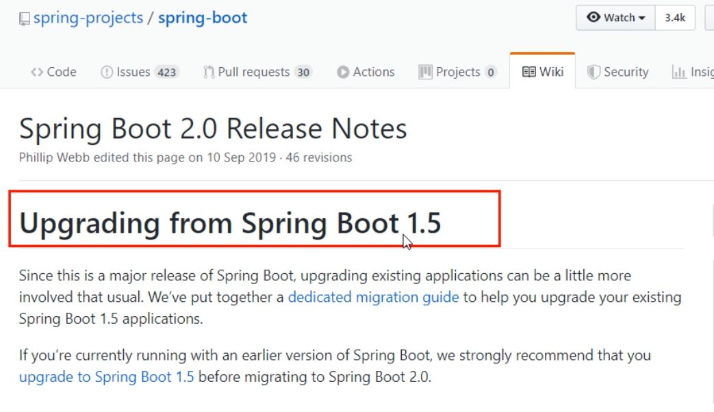
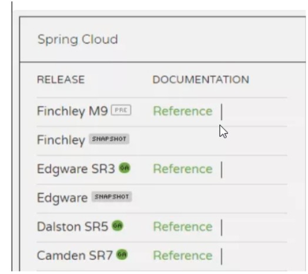
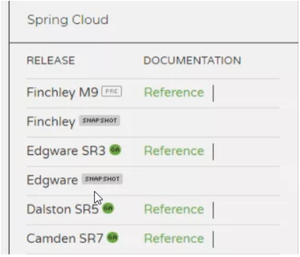
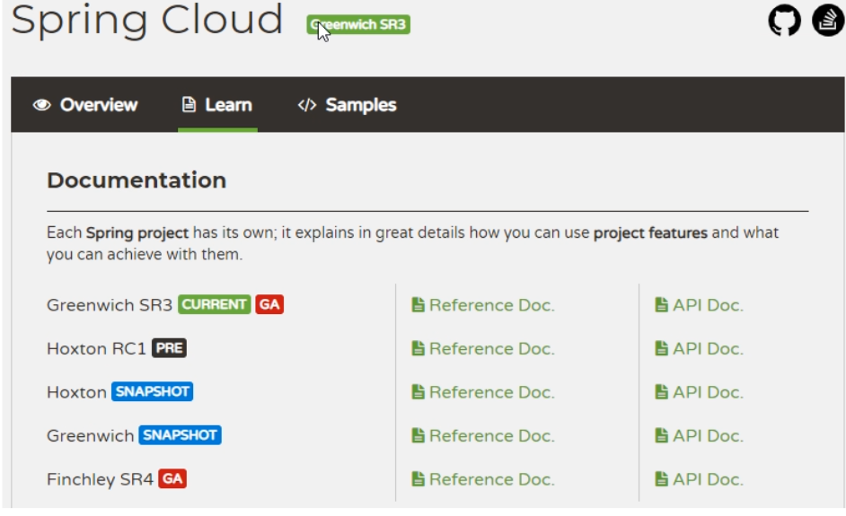
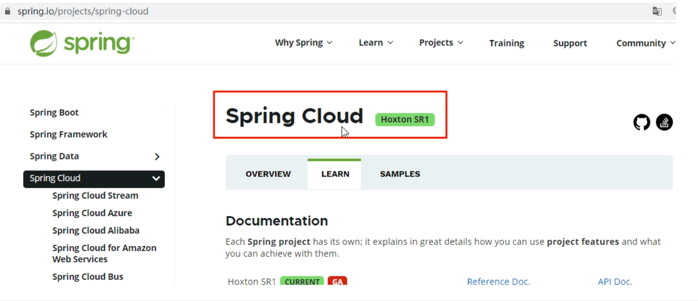
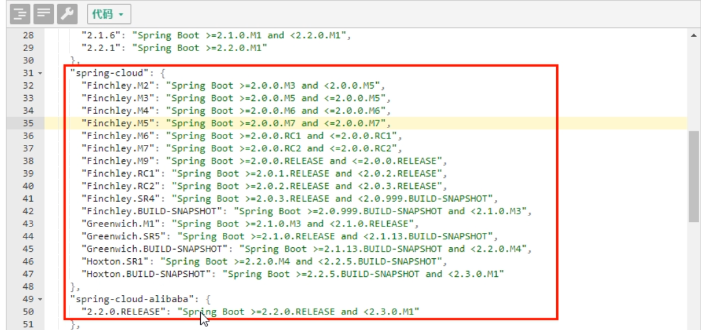
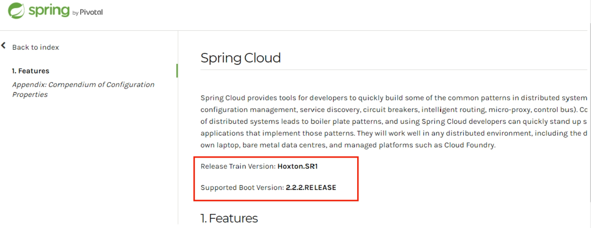

# 1.微服务架构零基础理论入门（小白必看）

## 1.1零基础小白，2020.1春节期间预习过第一季的，理解微服务概念的可以不看

## 1.2理论介绍见<<微服务架构2020.pptx>>

## 1.3回顾2018年第一季SpringCloud版本

别再用了

# 2.从2.2.x和H版开始说起

## 2.1本次的SpringCloud第二季分为上半场和下半场

**上篇**：SpringBoot2.X版和SpringCloud H版
**下篇**：SpringCloud Alibaba
**大纲**

## 2.2Springboot版本选择

git源码地址：
  https://github.com/spring-projects/spring-boot/releases/
SpringBoot2.0新特性：
  https://github.com/spring-projects/spring-boot/wiki/Spring-Boot-2.0-Release-Notes

通过上面官网发现，Boot官方强烈建议你升级到2.X以上版本

**官网看Boot版本** 
   springboot(截至2019.10.26)

  springboot(截至2020.2.15)

## 2.3SpringCloud版本选择

git源码地址
  https://github.com/spring-projects/spring-cloud/wiki

官网：
  https://spring.io/projects/spring-cloud

### 官网看Cloud版本 

  **Cloud命名规则**

**SpringCloud的多版本**

###   **springcloud(截至2019.10.26)**

###   **springboot(截至2020.2.15)**

## 2.4SpringCloud和Springboot之间的依赖关系如何看

https://spring.io/projects/spring-cloud#overview

依赖

更详细的版本对应查看方法

https://start.spring.io/actuator/info

结果

查看json串返回结果

## 2.5SpringCloud第二季定稿版（截止2020.2.15）

**cloud**:Hoxton.SR1
**boot**：2.2.2.RELEASE
**cloud Alibaba**:2.1.0.RELEASE
**java**:JAVA8
**maven**:3.5及以上
**mysql**:5.7及以上
**不许捣蛋，上述全部版本必须和阳哥一致**
**题外话**

- **boot版已经到2.2.4为最新，为什么选2.2.2？**
    **只用boot，直接用最新**

**同时用boot和cloud，需要照顾cloud，由cloud决定boot版本 结果**

**SpringCloud和SpringBoot版本对应关系**

-  **2.X版本常用的组件pom**

  

